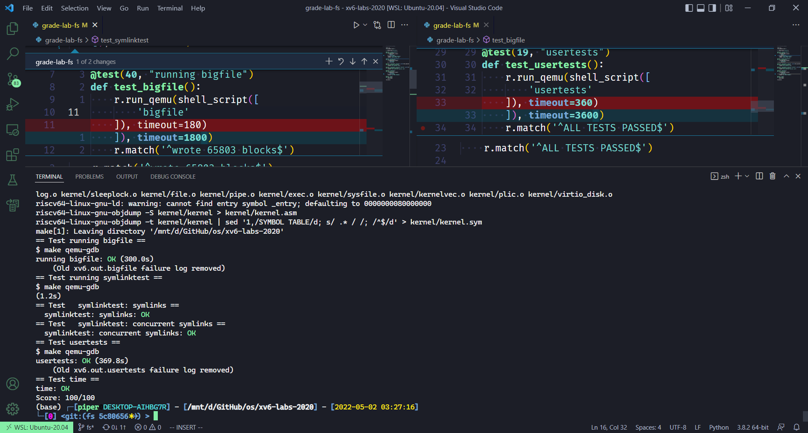

# Lab: file system

本节作业：
- https://github.com/PiperLiu/xv6-labs-2020/tree/fs

目录：

<!-- @import "[TOC]" {cmd="toc" depthFrom=2 depthTo=2 orderedList=false} -->

<!-- code_chunk_output -->


<!-- /code_chunk_output -->

细分目录：

<!-- @import "[TOC]" {cmd="toc" depthFrom=2 depthTo=6 orderedList=false} -->

<!-- code_chunk_output -->

- [Large files 将 inode 的 block 改为二级映射](#large-files-将-inode-的-block-改为二级映射)
- [Symbolic links 实现软链接 soft link 系统调用](#symbolic-links-实现软链接-soft-link-系统调用)

<!-- /code_chunk_output -->

### Large files 将 inode 的 block 改为二级映射

In this assignment you'll increase the maximum size of an xv6 file. Currently xv6 files are limited to 268 blocks, or `268*BSIZE` bytes (BSIZE is 1024 in xv6). This limit comes from the fact that an xv6 inode contains 12 "direct" block numbers and one "singly-indirect" block number, which refers to a block that holds up to 256 more block numbers, for a total of 12+256=268 blocks.

The bigfile command creates the longest file it can, and reports that size:

```bash
$ bigfile
..
wrote 268 blocks
bigfile: file is too small
$
```

The test fails because bigfile expects to be able to create a file with 65803 blocks, but unmodified xv6 limits files to 268 blocks.

You'll change the xv6 file system code to support a "doubly-indirect" block in each inode, containing 256 addresses of singly-indirect blocks, each of which can contain up to 256 addresses of data blocks. The result will be that a file will be able to consist of up to 65803 blocks, or `256*256+256+11` blocks (11 instead of 12, because we will sacrifice one of the direct block numbers for the double-indirect block).

Preliminaries

The mkfs program creates the xv6 file system disk image and determines how many total blocks the file system has; this size is controlled by FSSIZE in kernel/param.h. You'll see that FSSIZE in the repository for this lab is set to 200,000 blocks. You should see the following output from mkfs/mkfs in the make output:

```
nmeta 70 (boot, super, log blocks 30 inode blocks 13, bitmap blocks 25) blocks 199930 total 200000
```

This line describes the file system that mkfs/mkfs built: it has 70 meta-data blocks (blocks used to describe the file system) and 199,930 data blocks, totaling 200,000 blocks.

If at any point during the lab you find yourself having to rebuild the file system from scratch, you can run make clean which forces make to rebuild fs.img.

What to Look At

The format of an on-disk inode is defined by struct dinode in `fs.h`. You're particularly interested in `NDIRECT`, `NINDIRECT`, MAXFILE, and the addrs[] element of struct dinode. Look at Figure 8.3 in the xv6 text for a diagram of the standard xv6 inode.

The code that finds a file's data on disk is in `bmap()` in `fs.c`. Have a look at it and make sure you understand what it's doing. `bmap()` is called both when reading and writing a file. When writing, `bmap()` allocates new blocks as needed to hold file content, as well as allocating an indirect block if needed to hold block addresses.

`bmap()` deals with two kinds of block numbers. The `bn` argument is a "logical block number" -- a block number within the file, relative to the start of the file. The block numbers in `ip->addrs[]`, and the argument to `bread()`, are disk block numbers. You can view `bmap()` as mapping a file's logical block numbers into disk block numbers.

Your Job

Modify `bmap()` so that it implements a doubly-indirect block, in addition to direct blocks and a singly-indirect block. You'll have to have only 11 direct blocks, rather than 12, to make room for your new doubly-indirect block; you're not allowed to change the size of an on-disk inode. The first 11 elements of `ip->addrs[]` should be direct blocks; the 12th should be a singly-indirect block (just like the current one); the 13th should be your new doubly-indirect block. You are done with this exercise when `bigfile` writes 65803 blocks and `usertests` runs successfully:

```bash
$ bigfile
..................................................................................................................................................................................................................................................................................................................................................................................................................................................................................................................................................................................................................................................................................
wrote 65803 blocks
done; ok
$ usertests
...
ALL TESTS PASSED
$ 
```

`bigfile` will take at least a minute and a half to run.

Hints:
- Make sure you understand `bmap()`. Write out a diagram of the relationships between `ip->addrs[]`, the indirect block, the doubly-indirect block and the singly-indirect blocks it points to, and data blocks. Make sure you understand why adding a doubly-indirect block increases the maximum file size by `256*256` blocks (really -1, since you have to decrease the number of direct blocks by one).
- Think about how you'll index the doubly-indirect block, and the indirect blocks it points to, with the logical block number.
- If you change the definition of `NDIRECT`, you'll probably have to change the declaration of `addrs[]` in struct inode in `file.h`. Make sure that struct inode and struct dinode have the same number of elements in their `addrs[]` arrays.
- If you change the definition of `NDIRECT`, make sure to create a new `fs.img`, since mkfs uses `NDIRECT` to build the file system.
- If your file system gets into a bad state, perhaps by crashing, delete `fs.img` (do this from Unix, not xv6). `make` will build a new clean file system image for you.
- Don't forget to `brelse()` each block that you `bread()`.
- You should allocate indirect blocks and doubly-indirect blocks only as needed, like the original `bmap()`.
- Make sure `itrunc` frees all blocks of a file, including double-indirect blocks.

核心是修改一下 `bmap` 函数让 block number 到 block 的映射范围更广一些（新增了二级映射）。这里教授的作业还挺有心的：让我们把 direct block 的位减少一个用于和剩下的 256 个一起做二级映射，难度增加了一些。

fs.c 的 bmap 原有逻辑是这样的：

```c
// 给我哪个文件，以及文件的第几块 block ，我来返回给你实际的 block 在哪
// Inode content
//
// The content (data) associated with each inode is stored
// in blocks on the disk. The first NDIRECT block numbers
// are listed in ip->addrs[].  The next NINDIRECT blocks are
// listed in block ip->addrs[NDIRECT].

// Return the disk block address of the nth block in inode ip.
// If there is no such block, bmap allocates one.
static uint
bmap(struct inode *ip, uint bn)
{
  uint addr, *a;
  struct buf *bp;

  // 如果是 direct block 我直接返回地址
  if(bn < NDIRECT){
    if((addr = ip->addrs[bn]) == 0)
      ip->addrs[bn] = addr = balloc(ip->dev);
    return addr;
  }
  bn -= NDIRECT;

  // 如果是 indirect block 我先通过 ip->addrs 把最后一位找出来
  // ip-addrs 对应的最后一位对应一个 block
  // 这个 block 可以对应 256 个 block ，然后在上面取就行了
  if(bn < NINDIRECT){
    // Load indirect block, allocating if necessary.
    if((addr = ip->addrs[NDIRECT]) == 0)
      ip->addrs[NDIRECT] = addr = balloc(ip->dev);
    bp = bread(ip->dev, addr);
    a = (uint*)bp->data;
    if((addr = a[bn]) == 0){
      a[bn] = addr = balloc(ip->dev);
      log_write(bp);
    }
    brelse(bp);
    return addr;
  }

  panic("bmap: out of range");
}
```

首先修改一些宏如下。

kernel/fs.h

```c
/** 修改为一些常量
#define NDIRECT 12
#define NINDIRECT (BSIZE / sizeof(uint))
#define MAXFILE (NDIRECT + NINDIRECT)
*/
#define NDIRECT 11
// 倒数第二位映射的 256 个
#define NINDIRECT (BSIZE / sizeof(uint))
// 倒数第一位映射的二级 256 * 256 个
#define NINDIRECT2 (BSIZE / sizeof(uint) * BSIZE / sizeof(uint))
#define MAXFILE (NDIRECT + NINDIRECT + NINDIRECT2)

// On-disk inode structure
struct dinode {
  short type;           // File type
  short major;          // Major device number (T_DEVICE only)
  short minor;          // Minor device number (T_DEVICE only)
  short nlink;          // Number of links to inode in file system
  uint size;            // Size of file (bytes)
  /** 把 addrs 更改为 NDIRECT + 2 因为 dinode 原有长度不能变
   * 此外， addrs 的倒数第二位用来找到一个 block 做 256 个映射
   * addrs 的倒数第一位用用来映射一个 block ，这个 block 上的每一个地址再映射一个 block 作为映射表
  uint addrs[NDIRECT+1];   // Data block addresses
  */
  uint addrs[NDIRECT + 2];
};
```

kernel/file.h

```c
// in-memory copy of an inode
struct inode {
  uint dev;           // Device number
  uint inum;          // Inode number
  int ref;            // Reference count
  struct sleeplock lock; // protects everything below here
  int valid;          // inode has been read from disk?

  short type;         // copy of disk inode
  short major;
  short minor;
  short nlink;
  uint size;
  uint addrs[NDIRECT+2];
};
```

最后是修改 bmap 以及删除文件的逻辑 itrunc ：

```c
// Inode content
//
// The content (data) associated with each inode is stored
// in blocks on the disk. The first NDIRECT block numbers
// are listed in ip->addrs[].  The next NINDIRECT blocks are
// listed in block ip->addrs[NDIRECT].

// Return the disk block address of the nth block in inode ip.
// If there is no such block, bmap allocates one.
static uint
bmap(struct inode *ip, uint bn)
{
  uint addr, *a;
  struct buf *bp;

  // 如果是 direct block 我直接返回地址
  if(bn < NDIRECT){
    if((addr = ip->addrs[bn]) == 0)
      ip->addrs[bn] = addr = balloc(ip->dev);
    return addr;
  }
  bn -= NDIRECT;

  if(bn < NINDIRECT){
    // Load indirect block, allocating if necessary.
    if((addr = ip->addrs[NDIRECT]) == 0)
      ip->addrs[NDIRECT] = addr = balloc(ip->dev);
    bp = bread(ip->dev, addr);
    a = (uint*)bp->data;
    if((addr = a[bn]) == 0){
      a[bn] = addr = balloc(ip->dev);
      log_write(bp);
    }
    brelse(bp);
    return addr;
  }
  // 下面新增二级映射的逻辑
  bn -= NINDIRECT;

  if (bn < NINDIRECT2) {
    // 一级 block
    if ((addr = ip->addrs[NDIRECT + 1]) == 0)  // 如果还未分配 block
      ip->addrs[NDIRECT + 1] = addr = balloc(ip->dev);
    bp = bread(ip->dev, addr);
    a = (uint*)bp->data;
    if ((addr = a[bn / NINDIRECT]) == 0) {  // 这个条目映射还未分配 block
      a[bn / NINDIRECT] = addr = balloc(ip->dev);
      // 改变了 bp 映射表上的值，就要 log_write
      // 否则 panic: log_write outside of trans
      log_write(bp);
    }
    brelse(bp);
    // 二级 block
    bp = bread(ip->dev, addr);
    a = (uint*)bp->data;
    if ((addr = a[bn % NINDIRECT]) == 0) {
      a[bn % NINDIRECT] = addr = balloc(ip->dev);
      log_write(bp);
    }
    brelse(bp);
    return addr;
  }

  panic("bmap: out of range");
}

// Truncate inode (discard contents).
// Caller must hold ip->lock.
void
itrunc(struct inode *ip)
{
  int i, j, j2;
  struct buf *bp, *bp2;  // 新增 bp2 保存二级页表
  uint *a, *a2;

  for(i = 0; i < NDIRECT; i++){
    if(ip->addrs[i]){
      bfree(ip->dev, ip->addrs[i]);
      ip->addrs[i] = 0;
    }
  }

  if(ip->addrs[NDIRECT]){
    bp = bread(ip->dev, ip->addrs[NDIRECT]);
    a = (uint*)bp->data;
    for(j = 0; j < NINDIRECT; j++){
      if(a[j])
        bfree(ip->dev, a[j]);
    }
    brelse(bp);
    bfree(ip->dev, ip->addrs[NDIRECT]);
    ip->addrs[NDIRECT] = 0;
  }

  // 如果二级 block 也有映射
  if (ip->addrs[NDIRECT + 1]) {
    bp = bread(ip->dev, ip->addrs[NDIRECT + 1]);
    a = (uint*)bp->data;
    for (j = 0; j < NINDIRECT; j++) {
      if (a[j]) {  // 如果这个地址也对应一个 block
        bp2 = bread(ip->dev, a[j]);
        a2 = (uint*)bp2->data;
        for (j2 = 0; j2 < NINDIRECT; j2++) {  // 清空这个 block 各条目对应的 block
          if (a2[j2])
            bfree(ip->dev, a2[j2]);
        }
        brelse(bp2);
        bfree(ip->dev, a[j]);
        a[j] = 0;
      }
    }
    brelse(bp);
    bfree(ip->dev, ip->addrs[NDIRECT + 1]);
    ip->addrs[NDIRECT + 1] = 0;
  }

  ip->size = 0;
  iupdate(ip);
}
```

### Symbolic links 实现软链接 soft link 系统调用

In this exercise you will add symbolic links to xv6. Symbolic links (or soft links) refer to a linked file by pathname; when a symbolic link is opened, the kernel follows the link to the referred file. **Symbolic links resembles hard links, but hard links are restricted to pointing to file on the same disk, while symbolic links can cross disk devices.** Although xv6 doesn't support multiple devices, implementing this system call is a good exercise to understand how pathname lookup works.

Your job

You will implement the `symlink(char *target, char *path)` system call, which creates a new symbolic link at path that refers to file named by target. For further information, see the man page symlink. To test, add symlinktest to the Makefile and run it. Your solution is complete when the tests produce the following output (including usertests succeeding).

```c
$ symlinktest
Start: test symlinks
test symlinks: ok
Start: test concurrent symlinks
test concurrent symlinks: ok
$ usertests
...
ALL TESTS PASSED
$ 
```

Hints:
- First, create a new system call number for symlink, add an entry to user/usys.pl, user/user.h, and implement an empty sys_symlink in kernel/sysfile.c.
- Add a new file type (T_SYMLINK) to kernel/stat.h to represent a symbolic link.
- Add a new flag to kernel/fcntl.h, (O_NOFOLLOW), that can be used with the open system call. Note that flags passed to open are combined using a bitwise OR operator, so your new flag should not overlap with any existing flags. This will let you compile user/symlinktest.c once you add it to the Makefile.
- Implement the `symlink(target, path)` system call to create a new symbolic link at path that refers to target. Note that target does not need to exist for the system call to succeed. You will need to choose somewhere to store the target path of a symbolic link, for example, in the inode's data blocks. symlink should return an integer representing success (0) or failure (-1) similar to link and unlink.
- Modify the open system call to handle the case where the path refers to a symbolic link. If the file does not exist, open must fail. When a process specifies O_NOFOLLOW in the flags to open, open should open the symlink (and not follow the symbolic link).
- If the linked file is also a symbolic link, you must recursively follow it until a non-link file is reached. If the links form a cycle, you must return an error code. You may approximate this by returning an error code if the depth of links reaches some threshold (e.g., 10).
- Other system calls (e.g., link and unlink) must not follow symbolic links; these system calls operate on the symbolic link itself.
- You do not have to handle symbolic links to directories for this lab.

最开始，我们要把老师写的测试程序放进来。

Makefile

```makefile
UPROGS=\
	...
	$U/_symlinktest\
	# 将 symlinktest 加入 makefile
```

首先我们要设计一个系统调用，自然就是在用户态提供调用接口。

user/usys.pl

```perl
entry("symlink");
```

user/user.h

```c
// 给用户提供接口
int symlink(const char*, const char*);
```

内核态映射如下。

kernel/syscall.h

```c
#define SYS_symlink 22
```

kernel/syscall.c

```c
// 添加 sys_symlink
extern uint64 sys_symlink(void);

static uint64 (*syscalls[])(void) = {
...
// 添加系统调用 trap 到内核态函数的映射
[SYS_symlink] sys_symlink,
};
```

系统调用搞定了，我们来写一些宏，正如题目中要求的。

kernel/fcntl.h

```c
// 新增是否禁止读取软链接标志位
#define O_NOFOLLOW 0x004
```

kernel/stat.h

```c
// 新增软链接 inode type 类型
#define T_SYMLINK 4
```

接下来实现 symlink 系统调用。

kernel/sysfile.c

```c
// 这里没有修改 link
// 但是记录一下这个系统调用怎么写的

// Create the path new as a link to the same inode as old.
uint64
sys_link(void)
{
  char name[DIRSIZ], new[MAXPATH], old[MAXPATH];
  struct inode *dp, *ip;

  if(argstr(0, old, MAXPATH) < 0 || argstr(1, new, MAXPATH) < 0)
    return -1;

  begin_op();
  if((ip = namei(old)) == 0){
    end_op();
    return -1;
  }

  ilock(ip);
  if(ip->type == T_DIR){
    iunlockput(ip);
    end_op();
    return -1;
  }

  ip->nlink++;
  iupdate(ip);
  iunlock(ip);

  if((dp = nameiparent(new, name)) == 0)
    goto bad;
  ilock(dp);
  if(dp->dev != ip->dev || dirlink(dp, name, ip->inum) < 0){
    iunlockput(dp);
    goto bad;
  }
  iunlockput(dp);
  iput(ip);

  end_op();

  return 0;

bad:
  ilock(ip);
  ip->nlink--;
  iupdate(ip);
  iunlockput(ip);
  end_op();
  return -1;
}

uint64
sys_unlink(void)
{
  struct inode *ip, *dp;
  struct dirent de;
  char name[DIRSIZ], path[MAXPATH];
  uint off;

  if(argstr(0, path, MAXPATH) < 0)
    return -1;

  begin_op();
  if((dp = nameiparent(path, name)) == 0){
    end_op();
    return -1;
  }

  ilock(dp);

  // Cannot unlink "." or "..".
  if(namecmp(name, ".") == 0 || namecmp(name, "..") == 0)
    goto bad;

  if((ip = dirlookup(dp, name, &off)) == 0)
    goto bad;
  ilock(ip);

  if(ip->nlink < 1)
    panic("unlink: nlink < 1");
  if(ip->type == T_DIR && !isdirempty(ip)){
    iunlockput(ip);
    goto bad;
  }

  memset(&de, 0, sizeof(de));
  if(writei(dp, 0, (uint64)&de, off, sizeof(de)) != sizeof(de))
    panic("unlink: writei");
  if(ip->type == T_DIR){
    dp->nlink--;
    iupdate(dp);
  }
  iunlockput(dp);

  ip->nlink--;
  iupdate(ip);
  iunlockput(ip);

  end_op();

  return 0;

bad:
  iunlockput(dp);
  end_op();
  return -1;
}

...

// 软链接系统调用，要创建在 create 后面
// 创建一个 inode ， type 为特殊的软链接
uint64
sys_symlink(void)
{
  char new[MAXPATH], old[MAXPATH];
  struct inode *ip;

  // 从寄存器读取用户传入的参数
  if (argstr(0, old, MAXPATH) < 0 || argstr(1, new, MAXPATH) < 0)
    return -1;

  // called at the start of each FS system call. （日志相关）
  begin_op();
  // 新建一个 inode
  // create 后两个参数是主设备号、次设备号，用于万物皆文件
  if ((ip = create(new, T_SYMLINK, 0, 0)) == 0) {
    end_op();
    return -1;
  }
  // 把 old 文件名作为内容写进文件 ip
  if (writei(ip, 0, (uint64) old, 0, MAXPATH) < MAXPATH) {
    iunlockput(ip);
    end_op();
    return -1;
  }

  iunlockput(ip);
  end_op();
  return 0;
}
```

最后，是给 open 增加一个读软链接的逻辑。

```c
uint64
sys_open(void)
{
  char path[MAXPATH];
  int fd, omode;
  struct file *f;
  struct inode *ip;
  int n;

  if((n = argstr(0, path, MAXPATH)) < 0 || argint(1, &omode) < 0)
    return -1;

  begin_op();

  if(omode & O_CREATE){
    ip = create(path, T_FILE, 0, 0);
    if(ip == 0){
      end_op();
      return -1;
    }
  } else {
    if((ip = namei(path)) == 0){
      end_op();
      return -1;
    }
    ilock(ip);
    if(ip->type == T_DIR && omode != O_RDONLY){
      iunlockput(ip);
      end_op();
      return -1;
    }
  }

  if(ip->type == T_DEVICE && (ip->major < 0 || ip->major >= NDEV)){
    iunlockput(ip);
    end_op();
    return -1;
  }

  // 插入一段逻辑，如果 ip 是 T_SYMLINK 则找到真正的 ip
  // 如果设置了标志位 O_NOFOLLOW 的话，则用户不允许找到真正的文件，而是直接返回软链接的 inode
  if (ip->type == T_SYMLINK && !(omode & O_NOFOLLOW)) {
    // 开始寻找真正的 inode ，为了防止死循环，这里最多找 10 次
    for (int i = 0; i < 10; ++ i) {
      if (readi(ip, 0, (uint64)path, 0, MAXPATH) != MAXPATH) {
        iunlockput(ip);
        end_op();
        return -1;
      }
      iunlockput(ip);
      ip = namei(path);
      if (ip == 0) {
        end_op();
        return -1;
      }
      ilock(ip);
      if (ip->type != T_SYMLINK)
        break;
    }
    if (ip->type == T_SYMLINK) {  // 死循环
      iunlockput(ip);
      end_op();
      return -1;
    }
  }

  // file 和 inode 是分开管理的
  if((f = filealloc()) == 0 || (fd = fdalloc(f)) < 0){
    if(f)
      fileclose(f);
    iunlockput(ip);
    end_op();
    return -1;
  }

  if(ip->type == T_DEVICE){
    f->type = FD_DEVICE;
    f->major = ip->major;
  } else {
    f->type = FD_INODE;
    f->off = 0;
  }
  f->ip = ip;
  f->readable = !(omode & O_WRONLY);
  f->writable = (omode & O_WRONLY) || (omode & O_RDWR);

  if((omode & O_TRUNC) && ip->type == T_FILE){
    itrunc(ip);
  }

  iunlock(ip);
  end_op();

  return fd;
}
```

好了，最后测试时候还有个小问题，就是我的电脑比较慢，会显示 timeout ，因此需要把 python 的评测脚本时间调的宽裕一点才能得满分。


