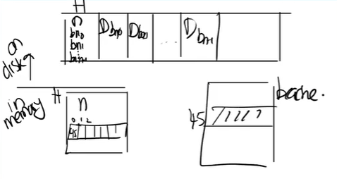

# LEC 15 (fk): Crash recovery

笔记大量参考了[肖宏辉](https://www.zhihu.com/people/xiao-hong-hui-15)大佬的翻译。

目录：

<!-- @import "[TOC]" {cmd="toc" depthFrom=2 depthTo=2 orderedList=false} -->

<!-- code_chunk_output -->

- [File System Crash 概述](#file-system-crash-概述)
- [File System Crash 示例](#file-system-crash-示例)
- [File System Logging](#file-system-logging)
- [从代码看 logging 机制](#从代码看-logging-机制)
- [File System Challenges](#file-system-challenges)

<!-- /code_chunk_output -->

细分目录：

<!-- @import "[TOC]" {cmd="toc" depthFrom=2 depthTo=6 orderedList=false} -->

<!-- code_chunk_output -->

- [File System Crash 概述](#file-system-crash-概述)
- [File System Crash 示例](#file-system-crash-示例)
  - [如果没有 logging 会有什么后果](#如果没有-logging-会有什么后果)
- [File System Logging](#file-system-logging)
  - [一些 log 基本操作（log_write 和 commit 等）](#一些-log-基本操作log_write-和-commit-等)
  - [更复杂的情况（在 log 相关操作时 crash ）](#更复杂的情况在-log-相关操作时-crash)
  - [xv6 中简单的 logging 方案（header block 结构等）](#xv6-中简单的-logging-方案header-block-结构等)
- [从代码看 logging 机制](#从代码看-logging-机制)
  - [log_write 函数与 transaction 事务](#log_write-函数与-transaction-事务)
  - [end_op 函数（如何 commit ）](#end_op-函数如何-commit)
  - [File System Recovering](#file-system-recovering)
  - [Log 写磁盘流程](#log-写磁盘流程)
- [File System Challenges](#file-system-challenges)
  - [cache eviction （用 bpin 保证 write ahead rule ）](#cache-eviction-用-bpin-保证-write-ahead-rule)
  - [文件系统操作必须适配 log 的大小](#文件系统操作必须适配-log-的大小)
  - [并发文件系统调用](#并发文件系统调用)

<!-- /code_chunk_output -->

## File System Crash 概述

今天的课程是有关文件系统中的Crash safety。这里的Crash safety并不是一个通用的解决方案，而是只关注一个特定的问题的解决方案，也就是crash或者电力故障可能会导致在磁盘上的文件系统处于不一致或者不正确状态的问题。当我说不正确的状态时，是指例如一个data block属于两个文件，或者一个inode被分配给了两个不同的文件。

这个问题可能出现的场景可能是这样，当你在运行make指令时，make与文件系统会有频繁的交互，并读写文件，但是在make执行的过程中断电了，可能是你的笔记本电脑没电了，也可能就是停电了，之后电力恢复之后，你重启电脑并运行ls指令，你会期望你的文件系统仍然在一个好的可用的状态。

**这里我们关心的crash或者故障包括了：在文件系统操作过程中的电力故障；在文件系统操作过程中的内核panic。包括XV6在内的大部分内核都会panic，panic可能是由内核bug引起，它会突然导致你的系统故障，但是你肯定期望能够在重启之后还能使用文件系统。**

你可能会反问，怎么就不能使用文件系统了？文件系统不是存储在一个持久化的存储设备上吗？如果电力故障了，存储设备不会受影响，当电脑恢复运行时，存储设备上的block应该还保存着呀。我们将会看到很多文件系统的操作都包含了多个步骤，如果我们在多个步骤的错误位置crash或者电力故障了，存储在磁盘上的文件系统可能会是一种不一致的状态，之后可能会发生一些坏的事情。而这类问题就是我们今天主要关注的问题。这区别于另一类问题，比如说因为电力故障导致你的磁盘着火了，那么什么数据都没有了，这是一个完全不同的问题，并且有着不同的解决方法，这种情况下需要先备份你的文件系统，然后再重新安装文件系统等等。这个问题我们今天不会关心，今天我们关心的是包含了多个步骤的文件系统操作过程中发生的故障。

我们今天会研究对于这类特定问题的解决方法，也就是logging。这是一个最初来自于数据库世界的很流行的解决方案，现在很多文件系统都在使用logging。之所以它很流行，是因为它是一个很好用的方法。我们将会看到XV6中的logging实现。当然XV6的实现非常简单，几乎是最简单的实现logging的方法，因为我们只是为了演示关键的思想。但是即使是这么基本的logging实现，也包含了一些微妙的问题，我们将会讨论这些问题，这也是为什么文件系统的logging值得学习的原因。我们将会看到，由于XV6实现的较为简单，XV6中的logging存在一个缺点，它的性能并不咋样，尽管logging系统原则上来说可以获得好的性能。所以在下节课我们将通过学习Linux的ext3文件系统所使用的logging系统，来看一下如何实现一个高性能logging系统。

另外，这是我们最后一节有关XV6的课程。这节课之后，我们将切换到阅读论文。因为这节课讲完了之后，我们就覆盖了操作系统的基本概念，我们可以通过阅读论文看一些更高级的操作系统思想。

接下来让我们看一下这节课关注的场景。类似于创建文件，写文件这样的文件系统操作，都包含了多个步骤的写磁盘操作。我们上节课看过了如何创建一个文件，这里多个步骤的顺序是（注，实际步骤会更多，上节课讲过详细的）：
- 分配inode，或者在磁盘上将inode标记为已分配
- 之后更新包含了新文件的目录的data block

如果在这两个步骤之间，操作系统crash了。这时可能会使得文件系统的属性被破坏。这里的属性是指，每一个磁盘block要么是空闲的，要么是只分配给了一个文件。即使故障出现在磁盘操作的过程中，我们期望这个属性仍然能够保持。如果这个属性被破坏了，那么重启系统之后程序可能会运行出错，比如：
- 操作系统可能又立刻crash了，因为文件系统中的一些数据结构现在可能处于一种文件系统无法处理的状态。
- 或者，更可能的是操作系统没有crash，但是数据丢失了或者读写了错误的数据。

我们将会看一些例子来更好的理解出错的场景，但是基本上来说这就是我们需要担心的一些风险。我不知道你们有没有人在日常使用计算机时经历过这些问题，比如说在电力故障之后，你重启电脑或者手机，然后电脑手机就不能用了，这里的一个原因就是文件系统并没有恢复过来。

## File System Crash 示例

为了更清晰的理解这里的风险，让我们看一些基于XV6的例子，并看一下哪里可能出错。我们在上节课介绍了XV6有一个非常简单的文件系统和磁盘数据的排布方式。

在super block之后就是log block，我们今天主要介绍的就是log block。log block之后是inode block，每个block可能包含了多个inode。之后是bitmap block，它记录了哪个data block是空闲的。最后是data block，这里包含了文件系统的实际数据。

### 如果没有 logging 会有什么后果

在上节课中，我们看了一下在创建文件时，操作系统与磁盘block的交互过程如下。

```bash
echo "hi" > x
write: 33  allocate inode for x
write: 33  init inode x
write: 46  record x in / directory's data block
write: 32  update root inode
write: 33  update inode x
```

从上面可以看出，创建一个文件涉及到了多个操作：
- 首先是分配inode，因为首先写的是block 33
- 之后inode被初始化，然后又写了一次block 33
- 之后是写block 46，是将文件x的inode编号写入到x所在目录的inode的data block中
- 之后是更新root inode，因为文件x创建在根目录，所以需要更新根目录的inode的size字段，以包含这里新创建的文件x
- 最后再次更新了文件x的inode

现在我们想知道，哪里可能出错。假设我们在 `write: 46  record x in / directory's data block` 这个位置出现了电力故障或者内核崩溃。

在出现电力故障之后，因为内存数据保存在RAM中，所有的内存数据都丢失了。所有的进程数据，所有的文件描述符，内存中所有的缓存都没有了，因为内存数据不是持久化的。我们唯一剩下的就是磁盘上的数据，因为磁盘的介质是持久化的，所以只有磁盘上的数据能够在电力故障之后存活。基于这些事实，如果我们在上面的位置出现故障，并且 **没有额外的机制，没有logging，会有多糟糕呢？我们这里会有什么风险？**

在这个位置，我们先写了block 33表明inode已被使用，之后出现了电力故障，然后计算机又重启了。这时，我们丢失了刚刚分配给文件x的inode。 **这个inode虽然被标记为已被分配，但是它并没有放到任何目录中，所以也就没有出现在任何目录中，因此我们也就没办法删除这个inode。所以在这个位置发生电力故障会导致我们丢失inode。**

你或许会认为，我们应该改一改代码，将写block的顺序调整一下，这样就不会丢失inode了。所以我们可以先写block 46来更新目录内容，之后再写block 32来更新目录的size字段，最后再将block 33中的inode标记为已被分配。

这里的效果是一样的，只是顺序略有不同。并且这样我们应该可以避免丢失inode的问题。那么问题来了，这里可以工作吗？我们应该问问自己，如果在 `block 33中的inode标记为已被分配` 前的位置发生了电力故障会怎样？

在这个位置，目录被更新了，但是还没有在磁盘上分配inode。电力故障之后机器重启，文件系统会是一个什么状态？或者说，如果我们读取根目录下的文件x，会发生什么，因为现在在根目录的data block已经有了文件x的记录？

**是的，我们会读取一个未被分配的inode，因为inode在crash之前还未被标记成被分配。更糟糕的是，如果inode之后被分配给一个不同的文件，这样会导致有两个应该完全不同的文件共享了同一个inode。如果这两个文件分别属于用户1和用户2，那么用户1就可以读到用户2的文件了。** 所以上面的解决方案也不好。

所以调整写磁盘的顺序并不能彻底解决我们的问题，我们只是从一个问题换到了一个新的问题。

让我们再看一个例子，这个例子中会向文件x写入“`hi`”。

```bash
--- write "hi" to file x
write: 45   set alloc bit in bitmap block
write: 595  write h to allocated data block
write: 595  write i to allocated data block
write: 33   (size update, bn0)
```

一旦成功的创建了文件x，之后会调用write系统调用，我们在上节课看到了write系统调用也执行了多个写磁盘的操作。

- 首先会从bitmap block，也就是block 45中，分配data block，通过从bitmap中分配一个bit，来表明一个data block已被分配。
- 上一步分配的data block是block 595，这里将字符“h”写入到block 595。
- 将字符“i”写入到block 595。
- 最后更新文件夹x的inode来更新size字段。

这里我们也可以问自己一个问题，我们在`write: 45`后的位置crash了会怎样？

这里我们从bitmap block中分配了一个data block，但是又还没有更新到文件x的inode中。当我们重启之后，磁盘处于一个特殊的状态，这里的风险是什么？是的，我们这里丢失了data block，因为这个data block被分配了，但是却没有出现在任何文件中，因为它还没有被记录在任何inode中。

这里的问题并不在于操作的顺序，而在于我们这里有多个写磁盘的操作，这些操作必须作为一个原子操作出现在磁盘上。

## File System Logging

我们这节课要讨论的针对文件系统crash之后的问题的解决方案，其实就是logging。这是来自于数据库的一种解决方案。它有一些好的属性：
- 首先，它可以确保文件系统的系统调用是原子性的。比如你调用create/write系统调用，这些系统调用的效果是要么完全出现，要么完全不出现，这样就避免了一个系统调用只有部分写磁盘操作出现在磁盘上。
- 其次，它支持快速恢复（Fast Recovery）。在重启之后，我们不需要做大量的工作来修复文件系统，只需要非常小的工作量。这里的快速是相比另一个解决方案来说，在另一个解决方案中，你可能需要读取文件系统的所有block，读取inode，bitmap block，并检查文件系统是否还在一个正确的状态，再来修复。而logging可以有快速恢复的属性。
- 最后，原则上来说，它可以非常的高效，尽管我们在XV6中看到的实现不是很高效。

我们会在下节课看一下，如何构建一个logging系统，并同时具有原子性的系统调用，快速恢复和高性能，而今天，我们只会关注前两点。

logging的基本思想还是很直观的。首先，你将磁盘分割成两个部分，其中一个部分是log，另一个部分是文件系统，文件系统可能会比log大得多。

### 一些 log 基本操作（log_write 和 commit 等）

`log write`，即当需要更新文件系统时，我们并不是更新文件系统本身。假设我们在内存中缓存了bitmap block，也就是block 45。当需要更新bitmap时，我们并不是直接写block 45，而是将数据写入到log中，并记录这个更新应该写入到block 45。对于所有的写 block都会有相同的操作，例如更新inode，也会记录一条写block 33的log。

所以基本上， **任何一次写操作都是先写入到log，我们并不是直接写入到block所在的位置，而总是先将写操作写入到log中。**

`commit op` 之后在某个时间，当文件系统的操作结束了，比如说我们前一节看到的4-5个写block操作都结束，并且都存在于log中，我们会commit文件系统的操作。这意味着我们需要在log的某个位置记录属于同一个文件系统的操作的个数，例如5。

`install log` 当我们在log中存储了所有写block的内容时，如果我们要真正执行这些操作，只需要将block从log分区移到文件系统分区。我们知道第一个操作该写入到block 45，我们会直接将数据从log写到block 45，第二个操作该写入到block 33，我们会将它写入到block 33，依次类推。

`clean log` 一旦完成了，就可以清除log。清除log实际上就是将属于同一个文件系统的操作的个数设置为0。

以上就是log的基本工作方式。为什么这样的工作方式是好的呢？假设我们crash并重启了。 **在重启的时候，文件系统会查看log的commit记录值，如果是0的话，那么什么也不做。如果大于0的话，我们就知道log中存储的block需要被写入到文件系统中，很明显我们在crash的时候并不一定完成了install log，我们可能是在commit之后，clean log之前crash的。所** 以这个时候我们需要做的就是reinstall（注，也就是将log中的block再次写入到文件系统），再clean log。

### 更复杂的情况（在 log 相关操作时 crash ）

这里的方法之所以能起作用，是因为可以确保当发生crash（并重启之后），我们要么将写操作所有相关的block都在文件系统中更新了，要么没有更新任何一个block，我们永远也不会只写了一部分block。为什么可以确保呢？我们考虑crash的几种可能情况。
- 在第1步（`log write`）和第2步（`commit op`）之间crash会发生什么？在重启的时候什么也不会做，就像系统调用从没有发生过一样，也像crash是在文件系统调用之前发生的一样。这完全可以，并且也是可接受的。
- 在第2步（`commit op`）和第3步（`install`）之间crash会发生什么？在这个时间点，所有的log block都落盘了，因为有commit记录，所以完整的文件系统操作必然已经完成了。我们可以将log block写入到文件系统中相应的位置，这样也不会破坏文件系统。所以这种情况就像系统调用正好在crash之前就完成了。
- 在第3步（`install`）过程中和第4步（`clean log`）之前这段时间crash会发生什么？在下次重启的时候，我们会redo log，我们或许会再次将log block中的数据再次拷贝到文件系统。 **这样也是没问题的，因为log中的数据是固定的，我们就算重复写了文件系统，每次写入的数据也是不变的。重复写入并没有任何坏处，因为我们写入的数据可能本来就在文件系统中，所以多次install log完全没问题。** 当然在这个时间点，我们不能执行任何文件系统的系统调用。我们应该在重启文件系统之前，在重启或者恢复的过程中完成这里的恢复操作。 **换句话说，install log是幂等操作（注，idempotence，表示执行多次和执行一次效果一样），你可以执行任意多次，最后的效果都是一样的。**

- 学生提问：因为这里的接口只有read/write，但是如果我们做append操作，就不再安全了，对吧？
- Frans教授：某种程度来说，append是文件系统层面的操作，在这个层面，我们可以使用上面介绍的logging机制确保其原子性（注，append也可以拆解成底层的read/write）。
- 学生提问：当正在commit log的时候crash了会发生什么？比如说你想执行多个写操作，但是只commit了一半。
- Frans教授：在上面的第2步，执行commit操作时，你只会在记录了所有的write操作之后，才会执行commit操作。所以在执行commit时，所有的write操作必然都在log中。 **而commit操作本身也有个有趣的问题，它究竟会发生什么？如我在前面指出的，commit操作本身只会写一个block。文件系统通常可以这么假设，单个block或者单个sector的write是原子操作。这里的意思是，如果你执行写操作，要么整个sector都会被写入，要么sector完全不会被修改。所以sector本身永远也不会被部分写入，并且commit的目标sector总是包含了有效的数据。而commit操作本身只是写log的header，如果它成功了只是在commit header中写入log的长度，例如5，这样我们就知道log的长度为5。** 这时crash并重启，我们就知道需要重新install 5个block的log。如果commit header没能成功写入磁盘，那这里的数值会是0。我们会认为这一次事务并没有发生过。这里本质上是write ahead rule，它表示logging系统在所有的写操作都记录在log中之前，不能install log。

### xv6 中简单的 logging 方案（header block 结构等）

Logging的实现方式有很多，我这里展示的指示一种非常简单的方案，这个方案中clean log和install log都被推迟了。接下来我会运行这种非常简单的实现方式，之后在下节课我们会看到更加复杂的logging协议。 **不过所有的这些协议都遵循了write ahead rule，也就是说在写入commit记录之前，你需要确保所有的写操作都在log中。** 在这个范围内，还有大量设计上的灵活性可以用来设计特定的logging协议。

在XV6中，我们会看到数据有两种状态，是在磁盘上还是在内存中。内存中的数据会在crash或者电力故障之后丢失。



XV6的log结构如往常一样也是极其的简单。我们在最开始有一个header block，也就是我们的commit record，里面包含了：
- 数字n代表有效的log block的数量
- 每个log block的实际对应的block编号

之后就是log的数据，也就是每个block的数据，依次为bn0对应的block的数据，bn1对应的block的数据以此类推。这就是log中的内容，并且log也不包含其他内容。

当文件系统在运行时，在内存中也有header block的一份拷贝，拷贝中也包含了n和block编号的数组。这里的block编号数组就是log数据对应的实际block编号，并且相应的block也会缓存在block cache中。与前一节课对应，log中第一个block编号是45，那么在block cache的某个位置，也会有block 45的cache。

以上就是内存中的文件系统和磁盘上的文件系统的结构。

## 从代码看 logging 机制

### log_write 函数与 transaction 事务

接下来让我们看一些代码来帮助我们理解这里是怎么工作的。前面我提过事务（transaction），也就是我们不应该在所有的写操作完成之前写入commit record。这意味着文件系统操作必须表明事务的开始和结束。在XV6中，以创建文件的sys_open为例（在sysfile.c文件中）每个文件系统操作，都有begin_op和end_op分别表示事物的开始和结束。

```c
uint64
sys_open(void)
{
  char path[MAXPATH];
  int fd, omode;
  struct file *f;
  struct inode *ip;
  int n;

  if((n = argstr(0, path, MAXPATH)) < 0 || argint(1, &omode) < 0)
    return -1;

  begin_op();

  if(omode & O_CREATE){
    ip = create(path, T_FILE, 0, 0);
    if(ip == 0){
      end_op();
      return -1;
    }
  }
  ...
}
```

**begin_op表明想要开始一个事务，在最后有end_op表示事务的结束。并且事务中的所有写block操作具备原子性，这意味着这些写block操作要么全写入，要么全不写入。** XV6中的文件系统调用都有这样的结构，最开始是begin_op，之后是实现系统调用的代码，最后是end_op。 **在end_op中会实现commit操作。**

在begin_op和end_op之间，磁盘上或者内存中的数据结构会更新。但是在end_op之前，并不会有实际的改变（注，也就是不会写入到实际的block中）。在end_op时，我们会将数据写入到log中，之后再写入commit record或者log header。这里有趣的是，当文件系统调用执行写磁盘时会发生什么？

让我们看一下fs.c中的ialloc。

```c
// Allocate an inode on device dev.
// Mark it as allocated by  giving it type type.
// Returns an unlocked but allocated and referenced inode.
struct inode*
ialloc(uint dev, short type)
{
  int inum;
  struct buf *bp;
  struct dinode *dip;

  for(inum = 1; inum < sb.ninodes; inum++){
    bp = bread(dev, IBLOCK(inum, sb));
    dip = (struct dinode*)bp->data + inum%IPB;
    if(dip->type == 0){  // a free inode
      memset(dip, 0, sizeof(*dip));
      dip->type = type;
      log_write(bp);   // mark it allocated on the disk
      brelse(bp);
      return iget(dev, inum);
    }
    brelse(bp);
  }
  panic("ialloc: no inodes");
}
```

在这个函数中，并没有直接调用bwrite，这里实际调用的是log_write函数。log_write是由文件系统的logging实现的方法。任何一个文件系统调用的begin_op和end_op之间的写操作总是会走到log_write。log_write函数位于log.c文件。

```c
// Caller has modified b->data and is done with the buffer.
// Record the block number and pin in the cache by increasing refcnt.
// commit()/write_log() will do the disk write.
//
// log_write() replaces bwrite(); a typical use is:
//   bp = bread(...)
//   modify bp->data[]
//   log_write(bp)
//   brelse(bp)
void
log_write(struct buf *b)
{
  int i;

  acquire(&log.lock);
  if (log.lh.n >= LOGSIZE || log.lh.n >= log.size - 1)
    panic("too big a transaction");
  if (log.outstanding < 1)
    panic("log_write outside of trans");

  for (i = 0; i < log.lh.n; i++) {
    if (log.lh.block[i] == b->blockno)   // log absorption
      break;
  }
  log.lh.block[i] = b->blockno;
  if (i == log.lh.n) {  // Add new block to log?
    bpin(b);
    log.lh.n++;
  }
  release(&log.lock);
}
```

log_write还是很简单直观的，我们已经向block cache中的某个block写入了数据。比如写block 45，我们已经更新了block cache中的block 45。接下来我们需要在内存中记录，在稍后的commit中，要将block 45写入到磁盘的log中。

这里的代码先获取log header的锁，之后再更新log header。首先代码会查看block 45是否已经被log记录了。如果是的话，其实不用做任何事情，因为block 45已经会被写入了。这种忽略的行为称为log absorbtion。如果block 45不在需要写入到磁盘中的block列表中，接下来会对n加1，并将block 45记录在列表的最后。之后，这里会通过调用bpin函数将block 45固定在block cache中，我们稍后会介绍为什么要这么做。

以上就是log_write的全部工作了。任何文件系统调用，如果需要更新block或者说更新block cache中的block，都会将block编号加在这个内存数据中（注，也就是log header在内存中的cache），除非编号已经存在。

- 学生提问：这是不是意味着，bwrite不能直接使用？
- Frans教授：是的，可以这么认为， **文件系统中的所有bwrite都需要被log_write替换。**

### end_op 函数（如何 commit ）

接下来我们看看位于log.c中的end_op函数中会发生什么？

```c
// called at the end of each FS system call.
// commits if this was the last outstanding operation.
void
end_op(void)
{
  int do_commit = 0;

  acquire(&log.lock);
  log.outstanding -= 1;
  if(log.committing)
    panic("log.committing");
  if(log.outstanding == 0){
    do_commit = 1;
    log.committing = 1;
  } else {
    // begin_op() may be waiting for log space,
    // and decrementing log.outstanding has decreased
    // the amount of reserved space.
    wakeup(&log);
  }
  release(&log.lock);

  if(do_commit){
    // call commit w/o holding locks, since not allowed
    // to sleep with locks.
    commit();
    acquire(&log.lock);
    log.committing = 0;
    wakeup(&log);
    release(&log.lock);
  }
}
```

可以看到，即使是这么简单的一个文件系统也有一些微秒的复杂之处，代码的最开始就是一些复杂情况的处理。我直接跳到正常且简单情况的代码。在简单情况下，没有其他的文件系统操作正在处理中。这部分代码非常简单直观，首先调用了commit函数。让我们看一下commit函数的实现。

```c
static void
commit()
{
  if (log.lh.n > 0) {
    write_log();     // Write modified blocks from cache to log
    write_head();    // Write header to disk -- the real commit
    install_trans(0); // Now install writes to home locations
    log.lh.n = 0;
    write_head();    // Erase the transaction from the log
  }
}
```

commit中有两个操作：
- 首先是write_log。这基本上就是将所有存在于内存中的log header中的block编号对应的block，从block cache写入到磁盘上的log区域中（注，也就是将变化先从内存拷贝到log中）。
- write_head会将内存中的log header写入到磁盘中。

我们看一下write_log的实现。

```c
// Copy modified blocks from cache to log.
static void
write_log(void)
{
  int tail;

  for (tail = 0; tail < log.lh.n; tail++) {
    struct buf *to = bread(log.dev, log.start+tail+1); // log block
    struct buf *from = bread(log.dev, log.lh.block[tail]); // cache block
    memmove(to->data, from->data, BSIZE);
    bwrite(to);  // write the log
    brelse(from);
    brelse(to);
  }
}
```

函数中依次遍历log中记录的block，并写入到log中。它首先读出log block，将cache中的block拷贝到log block，最后再将log block写回到磁盘中。这样可以确保需要写入的block都记录在log中。但是在这个位置，我们还没有commit，现在我们只是将block存放在了log中。如果我们在这个位置也就是在write_head之前crash了，那么最终的表现就像是transaction从来没有发生过。

接下来看一下write_head函数，我之前将write_head称为`commit point`。

```c
// Write in-memory log header to disk.
// This is the true point at which the
// current transaction commits.
static void
write_head(void)
{
  struct buf *buf = bread(log.dev, log.start);
  struct logheader *hb = (struct logheader *) (buf->data);
  int i;
  hb->n = log.lh.n;
  for (i = 0; i < log.lh.n; i++) {
    hb->block[i] = log.lh.block[i];
  }
  bwrite(buf);
  brelse(buf);
}
```

函数也比较直观，首先读取log的header block。将n拷贝到block中，将所有的block编号拷贝到header的列表中。最后再将header block写回到磁盘。函数中的倒数第2行，bwrite是实际的commit point吗？如果crash发生在这个bwrite之前，会发生什么？

这时虽然我们写了log的header block，但是数据并没有落盘。所以crash并重启恢复时，并不会发生任何事情。那crash发生在bwrite之后会发生什么呢？

这时header会写入到磁盘中，当重启恢复相应的文件系统操作会被恢复。在恢复过程的某个时间点，恢复程序可以读到log header并发现比如说有5个log还没有install，恢复程序可以将这5个log拷贝到实际的位置。 **所以这里的bwrite就是实际的commit point。** 在commit point之前，transaction并没有发生，在commit point之后，只要恢复程序正确运行，transaction必然可以完成。

回到commit函数，在commit point之后，就会实际应用transaction。这里很直观，就是读取log block再查看header这个block属于文件系统中的哪个block，最后再将log block写入到文件系统相应的位置。让我们看一下install_trans函数。

```c
// Copy committed blocks from log to their home location
static void
install_trans(int recovering)
{
  int tail;

  for (tail = 0; tail < log.lh.n; tail++) {
    struct buf *lbuf = bread(log.dev, log.start+tail+1); // read log block
    struct buf *dbuf = bread(log.dev, log.lh.block[tail]); // read dst
    memmove(dbuf->data, lbuf->data, BSIZE);  // copy block to dst
    bwrite(dbuf);  // write dst to disk
    if(recovering == 0)
      bunpin(dbuf);
    brelse(lbuf);
    brelse(dbuf);
  }
}
```

在commit函数中，install结束之后，会将log header中的n设置为0，再将log header写回到磁盘中。将n设置为0的效果就是清除log。

- 学生提问：install_trans函数在写block的时候，先写的缓存。可不可以优化一下直接写磁盘而不写缓存让代码运行的更快一些？
- Frans教授：这里的接口是不太好。你可能会想问反正都要写入新数据，为什么要先读出目标block来。这里的代码肯定还有很多优化空间，但是为了看起来简单我们并没有这么做。

### File System Recovering

接下来我们看一下发生在XV6的启动过程中的文件系统的恢复流程。当系统crash并重启了，在XV6启动过程中做的一件事情就是调用initlog函数。

```c
void
initlog(int dev, struct superblock *sb)
{
  if (sizeof(struct logheader) >= BSIZE)
    panic("initlog: too big logheader");

  initlock(&log.lock, "log");
  log.start = sb->logstart;
  log.size = sb->nlog;
  log.dev = dev;
  recover_from_log();
}
```

initlog基本上就是调用recover_from_log函数。

```c
static void
recover_from_log(void)
{
  read_head();
  install_trans(1); // if committed, copy from log to disk
  log.lh.n = 0;
  write_head(); // clear the log
}
```

recover_from_log先调用read_head函数从磁盘中读取header，之后调用install_trans函数。这个函数之前在commit函数中也调用过，它就是读取log header中的n，然后根据n将所有的log block拷贝到文件系统的block中。recover_from_log在最后也会跟之前一样清除log。

这就是恢复的全部流程。如果我们在install_trans函数中又crash了，也不会有问题，因为之后再重启时，XV6会再次调用initlog函数，再调用recover_from_log来重新install log。如果我们在commit之前crash了多次，在最终成功commit时，log可能会install多次。

- 学生提问：如果一个进程向磁盘写了一些数据，但是在commit之前进程出现了故障，假设故障之后进程退出了，这样会有问题吗？
- Frans教授：简单回答是没问题，因此磁盘不会被更新，所以效果就像文件系统操作没有发生过一样。并且进程并不能在故障后恢复，唯一能在故障之后还能保持的是保存在磁盘中的状态。（注，应该是没有理解问题。进程通过write系统调用成功写入的数据，就算在成功落盘之前进程异常退出了，内核还是会写入到磁盘中，前提是内核还在运行。）

### Log 写磁盘流程

我已经在bwrite函数中加了一个print语句。bwrite函数是block cache中实际写磁盘的函数，所以我们将会看到实际写磁盘的记录。在上节课我将print语句放在了log_write中，log_write只能代表文件系统操作的记录，并不能代表实际写磁盘的记录。我们这里会像上节课一样执行`echo "hi" > x`，并看一下实际的写磁盘过程。

很明显这里的记录要比只在log_write中记录要长的多。之前的log_write只有11条记录，但是可以看到实际上背后有很多个磁盘写操作，让我们来分别看一下这里的写磁盘操作：
- 首先是前3行的bwrite 3，4，5。因为block 3是第一个log data block，所以前3行是在log中记录了3个写操作。这3个写操作都保存在log中，并且会写入到磁盘中的log部分。
- 第4行的bwrite 2。因为block 2是log的起始位置，也就是log header，所以这条是commit记录。
- 第5，6，7行的bwrite 33，46，32。这里实际就是将前3行的log data写入到实际的文件系统的block位置，这里实际是install log。
- 第8行的bwrite 2，是清除log（注，也就是将log header中的n设置为0）。到此为止，完成了实际上的写block 33，46，32这一系列的操作。第一部分是log write，第二部分是install log，每一部分后面还跟着一个更新commit记录（注，也就是commit log和clean log）。

- 学生提问：可以从这里的记录找到一次文件操作的begin_op和end_op位置吗？
- Frans教授：大概可以知道。我们实际上不知道begin_op的位置，但是所有的文件系统操作都从begin_op开始。更新commit记录必然在end_op中，所以我们可以找到文件系统操作的end_op位置，之后就是begin_op（注，其实这里所有的操作都在end_op中，只需要区分每一次end_op的调用就可以找到begin_op）。

所以以上就是XV6中文件系统的logging介绍，即使是这么一个简单的logging系统也有一定的复杂度。这里立刻可以想到的一个问题是，通过观察这些记录，这是一个很有效的实现吗？很明显不是的，因为数据被写了两次。如果我写一个大文件，我需要在磁盘中将这个大文件写两次。所以这必然不是一个高性能的实现，为了实现Crash safety我们将原本的性能降低了一倍。当你们去读ext3论文时，你们应该时刻思考如何避免这里的性能降低一倍的问题。

## File System Challenges

前面说到XV6的文件系统有一定的复杂性，接下来我将介绍一下三个复杂的地方或者也可以认为是三个挑战。

### cache eviction （用 bpin 保证 write ahead rule ）

第一个是cache eviction。假设transaction还在进行中，我们刚刚更新了block 45，正要更新下一个block，而整个buffer cache都满了并且决定撤回block 45。在buffer cache中撤回block 45意味着我们需要将其写入到磁盘的block 45位置，这里会不会有问题？如果我们这么做了的话，会破坏什么规则吗？是的，如果将block 45写入到磁盘之后发生了crash，就会破坏transaction的原子性。这里也破坏了前面说过的write ahead rule， **write ahead rule的含义是，你需要先将所有的block写入到log中，之后才能实际的更新文件系统block。所以buffer cache不能撤回任何还位于log的block。**

前面在介绍log_write函数时， **其中调用了一个叫做bpin的函数，这个函数的作用就如它的名字一样，将block固定在buffer cache中。** 它是通过给block cache增加引用计数来避免cache撤回对应的block。在之前我们看过，如果引用计数不为0，那么buffer cache是不会撤回block cache的。相应的在将来的某个时间，所有的数据都写入到了log中，我们可以在cache中unpin block（注，在install_trans函数中会有unpin，因为这时block已经写入到了log中）。所以这是第一个复杂的地方，我们需要pin/unpin buffer cache中的block。

### 文件系统操作必须适配 log 的大小

在XV6中，总共有30个log block。当然我们可以提升log的尺寸，在真实的文件系统中会有大得多的log空间。但是无所谓啦，不管log多大，文件系统操作必须能放在log空间中。如果一个文件系统操作尝试写入超过30个block，那么意味着部分内容需要直接写到文件系统区域，而这是不被允许的，因为这违背了write ahead rule。所以所有的文件系统操作都必须适配log的大小。

为什么XV6的log大小是30？因为30比任何一个文件系统操作涉及的写操作数都大，Robert和我看了一下所有的文件系统操作，发现都远小于30，所以就将XV6的log大小设为30。我们目前看过的一些文件系统操作，例如创建一个文件只包含了写5个block。实际上大部分文件系统操作只会写几个block。你们可以想到什么样的文件系统操作会写很多很多个block吗？是的，写一个大文件。**如果我们调用write系统调用并传入1M字节的数据，这对应了写1000个block，这看起来会有很严重的问题，因为这破坏了我们刚刚说的“文件系统操作必须适配log的大小”这条规则。**

让我们看一下file.c文件中的filewrite函数。

```c
// Write to file f.
// addr is a user virtual address.
int
filewrite(struct file *f, uint64 addr, int n)
{
  int r, ret = 0;

  if(f->writable == 0)
    return -1;

  if(f->type == FD_PIPE){
    ret = pipewrite(f->pipe, addr, n);
  } else if(f->type == FD_DEVICE){
    if(f->major < 0 || f->major >= NDEV || !devsw[f->major].write)
      return -1;
    ret = devsw[f->major].write(1, addr, n);
  } else if(f->type == FD_INODE){
    // write a few blocks at a time to avoid exceeding
    // the maximum log transaction size, including
    // i-node, indirect block, allocation blocks,
    // and 2 blocks of slop for non-aligned writes.
    // this really belongs lower down, since writei()
    // might be writing a device like the console.
    int max = ((MAXOPBLOCKS-1-1-2) / 2) * BSIZE;
    int i = 0;
    while(i < n){
      int n1 = n - i;
      if(n1 > max)
        n1 = max;

      begin_op();
      ilock(f->ip);
      if ((r = writei(f->ip, 1, addr + i, f->off, n1)) > 0)
        f->off += r;
      iunlock(f->ip);
      end_op();

      if(r != n1){
        // error from writei
        break;
      }
      i += r;
    }
    ret = (i == n ? n : -1);
  } else {
    panic("filewrite");
  }

  return ret;
}
```

从这段代码可以看出，如果写入的block数超过了30，那么一个写操作会被分割成多个小一些的写操作。这里整个写操作不是原子的，但是这还好啦，因为write系统调用的语义并不要求所有1000个block都是原子的写入，它只要求我们不要损坏文件系统。所以XV6会将一个大的写操作分割成多个小的写操作，每一个小的写操作通过独立的transaction写入。这样文件系统本身不会陷入不正确的状态中。

这里还需要注意，因为block在落盘之前需要在cache中pin住，所以buffer cache的尺寸也要大于log的尺寸。

### 并发文件系统调用

最后一个要讨论的挑战是并发文件系统调用。让我先来解释一下这里会有什么问题，再看对应的解决方案。假设我们有一段log，和两个并发的执行的transaction，其中transaction t0在log的前半段记录，transaction t1在log的后半段记录。可能我们用完了log空间，但是任何一个transaction都还没完成。

现在我们能提交任何一个transaction吗？我们不能，因为这样的话我们就提交了一个部分完成的transaction，这违背了write ahead rule，log本身也没有起到应该的作用。所以必须要保证多个并发transaction加在一起也适配log的大小。 **所以当我们还没有完成一个文件系统操作时，我们必须在确保可能写入的总的log数小于log区域的大小的前提下，才允许另一个文件系统操作开始。**

XV6通过限制并发文件系统操作的个数来实现这一点。在begin_op中，我们会检查当前有多少个文件系统操作正在进行。如果有太多正在进行的文件系统操作，我们会通过sleep停止当前文件系统操作的运行，并等待所有其他所有的文件系统操作都执行完并commit之后再唤醒。这里的其他所有文件系统操作都会一起commit。有的时候这被称为group commit，因为这里将多个操作像一个大的transaction一样提交了，这里的多个操作要么全部发生了，要么全部没有发生。

- 学生提问：group commit有必要吗？不能当一个文件系统操作结束的时候就commit掉，然后再commit其他的操作吗？
- Frans教授：如果这样的话你需要非常非常小心。因为有一点我没有说得很清楚，我们需要保证write系统调用的顺序。如果一个read看到了一个write，再执行了一次write，那么第二个write必须要发生在第一个write之后。在log中的顺序，本身就反映了write系统调用的顺序， **你不能改变log中write系统调用的执行顺序，因为这可能会导致对用户程序可见的奇怪的行为。所以必须以transaction发生的顺序commit它们，而一次性提交所有的操作总是比较安全的，这可以保证文件系统处于一个好的状态。**

最后我们再回到最开始，看一下begin_op。

```c
// called at the start of each FS system call.
void
begin_op(void)
{
  acquire(&log.lock);
  while(1){
    if(log.committing){
      sleep(&log, &log.lock);
    } else if(log.lh.n + (log.outstanding+1)*MAXOPBLOCKS > LOGSIZE){
      // this op might exhaust log space; wait for commit.
      sleep(&log, &log.lock);
    } else {
      log.outstanding += 1;
      release(&log.lock);
      break;
    }
  }
}
```

首先，如果log正在commit过程中，那么就等到log提交完成，因为我们不能在install log的过程中写log；其次，如果当前操作是允许并发的操作个数的后一个，那么当前操作可能会超过log区域的大小，我们也需要sleep并等待所有之前的操作结束；最后，如果当前操作可以继续执行，需要将log的outstanding字段加1，最后再退出函数并执行文件系统操作。

再次看一下end_op函数。

```c
// called at the end of each FS system call.
// commits if this was the last outstanding operation.
void
end_op(void)
{
  int do_commit = 0;

  acquire(&log.lock);
  log.outstanding -= 1;
  if(log.committing)
    panic("log.committing");
  if(log.outstanding == 0){
    do_commit = 1;
    log.committing = 1;
  } else {
    // begin_op() may be waiting for log space,
    // and decrementing log.outstanding has decreased
    // the amount of reserved space.
    wakeup(&log);
  }
  release(&log.lock);

  if(do_commit){
    // call commit w/o holding locks, since not allowed
    // to sleep with locks.
    commit();
    acquire(&log.lock);
    log.committing = 0;
    wakeup(&log);
    release(&log.lock);
  }
}
```

在最开始首先会对log的outstanding字段减1，因为一个transaction正在结束；其次检查commiting状态，当前不可能在commiting状态，所以如果是的话会触发panic；如果当前操作是整个并发操作的最后一个的话（`log.understanding == 0`），接下来立刻就会执行commit；如果当前操作不是整个并发操作的最后一个的话，我们需要唤醒在begin_op中sleep的操作，让它们检查是不是能运行。

（注，这里的understanding有点迷，它表示的是当前正在并发执行的文件系统操作的个数，MAXOPBLOCKS定义了一个操作最大可能涉及的block数量。在begin_op中，只要log空间还足够，就可以一直增加并发执行的文件系统操作。所以XV6是通过设定了MAXOPBLOCKS，再间接的限定支持的并发文件系统操作的个数）

所以，即使是XV6中这样一个简单的文件系统，也有一些复杂性和挑战。

最后让我总结一下：这节课讨论的是使用logging来解决crash safety或者说多个步骤的文件系统操作的安全性。这种方式对于安全性来说没有问题，但是性能不咋地。

- 学生提问：前面说到cache size至少要跟log size一样大，如果它们一样大的话，并且log pin了30个block，其他操作就不能再进行了，因为buffer中没有额外的空间了。
- Frans教授：如果buffer cache中没有空间了，XV6会直接panic。这并不理想，实际上有点恐怖。所以我们在挑选buffer cache size的时候希望用一个不太可能导致这里问题的数字。这里为什么不能直接返回错误，而是要panic？因为很多文件系统操作都是多个步骤的操作，假设我们执行了两个write操作，但是第三个write操作找不到可用的cache空间，那么第三个操作无法完成，我们不能就直接返回错误，因为我们可能已经更新了一个目录的某个部分，为了保证文件系统的正确性，我们需要撤回之前的更新。所以如果log pin了30个block，并且buffer cache没有额外的空间了，会直接panic。当然这种情况不太会发生，只有一些极端情况才会发生。
