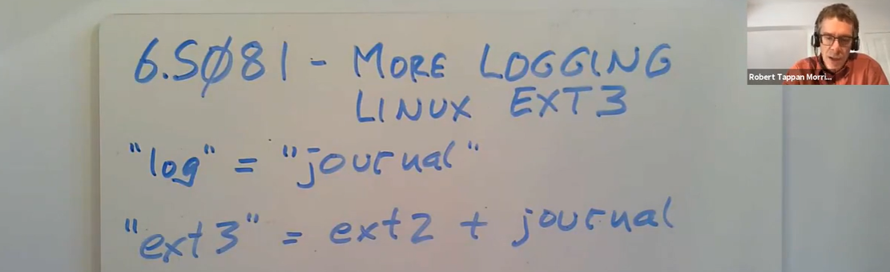
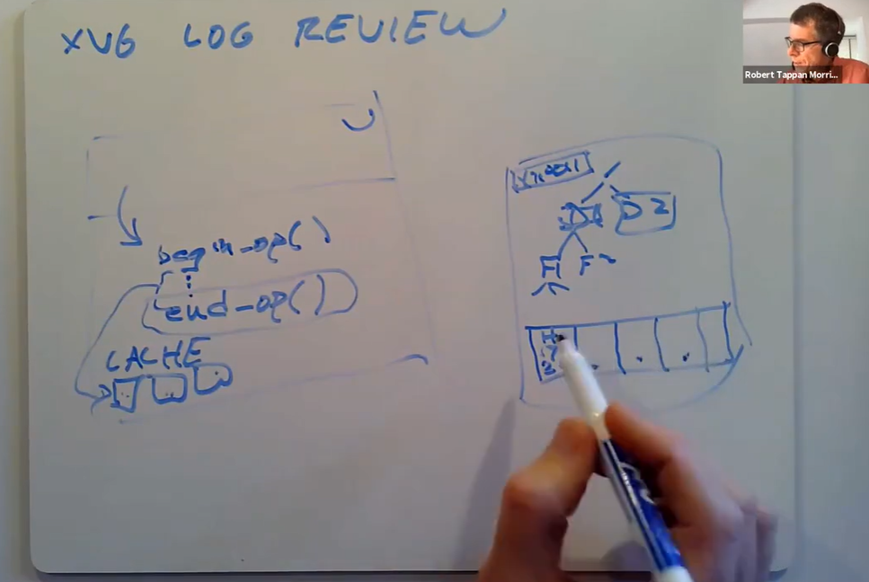
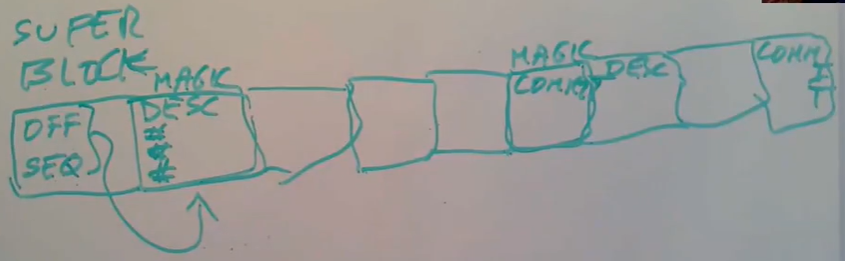
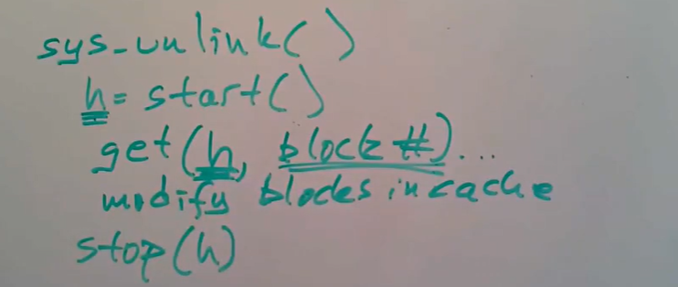
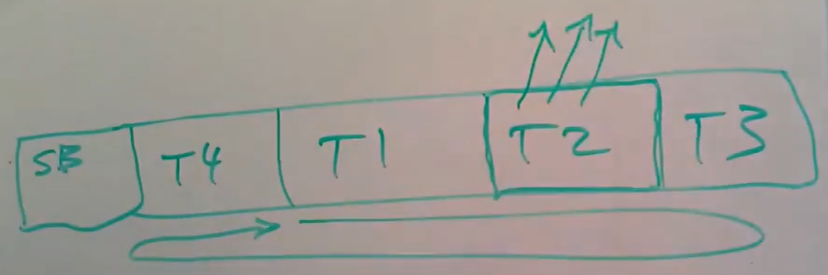
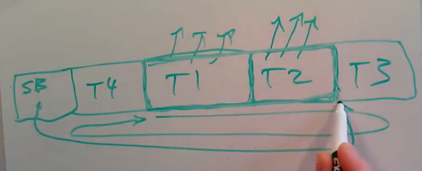
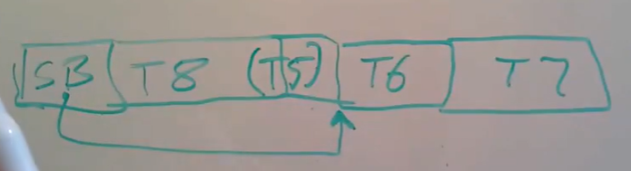
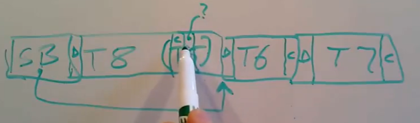
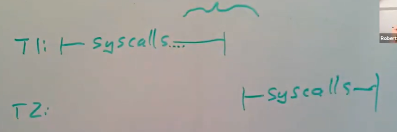
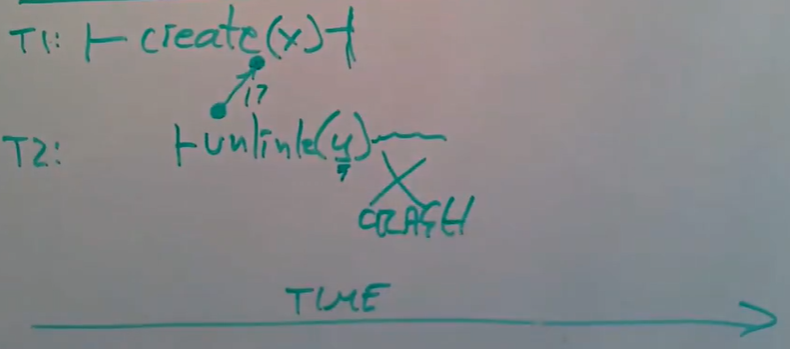

# LEC 16 (rtm): File system performance and fast crash recovery

笔记大量参考了[肖宏辉](https://www.zhihu.com/people/xiao-hong-hui-15)大佬的翻译。

目录：

<!-- @import "[TOC]" {cmd="toc" depthFrom=2 depthTo=2 orderedList=false} -->

<!-- code_chunk_output -->

- [Logging 概述](#logging-概述)
- [ext3 file system log](#ext3-file-system-log)
- [ext3 总结](#ext3-总结)

<!-- /code_chunk_output -->

细分目录：

<!-- @import "[TOC]" {cmd="toc" depthFrom=2 depthTo=6 orderedList=false} -->

<!-- code_chunk_output -->

- [Logging 概述](#logging-概述)
  - [XV6 File System Logging 回顾](#xv6-file-system-logging-回顾)
    - [write ahead rule 和 freeing rule](#write-ahead-rule-和-freeing-rule)
  - [XV6 的 logging 有什么问题？](#xv6-的-logging-有什么问题)
- [ext3 file system log](#ext3-file-system-log)
  - [ext3 file system log format](#ext3-file-system-log-format)
  - [ext3 如何提升性能](#ext3-如何提升性能)
    - [异步的系统调用 asynchronous （fsync/flush）](#异步的系统调用-asynchronous-fsyncflush)
    - [批量执行 batching](#批量执行-batching)
    - [并发 concurrency](#并发-concurrency)
  - [ext3 文件系统调用格式](#ext3-文件系统调用格式)
  - [ext3 transaction commit 步骤](#ext3-transaction-commit-步骤)
  - [ext3 file system 恢复过程](#ext3-file-system-恢复过程)
  - [为什么新transaction需要等前一个transaction中系统调用执行完成](#为什么新transaction需要等前一个transaction中系统调用执行完成)
- [ext3 总结](#ext3-总结)

<!-- /code_chunk_output -->

## Logging 概述

这节课讲的是Linux中的广泛使用的ext3文件系统所使用的logging系统，同时我们也会讨论在高性能文件系统中添加log需要面对的一些问题。首先我会花几分钟来回顾一下，为什么我们要学习logging。

- 之所以我们认为logging很重要，是因为这是一个巨大的成功和重要的思想，几乎可以认为logging是一种魔法，它可以用在任何一个已知的存储系统的故障恢复流程中，它在很多地方都与你想存储的任何数据相关。所以你们可以在大量的存储场景中看到log，比如说数据库，文件系统，甚至一些需要在crash之后恢复的定制化的系统中。
- 你们也可以发现log作为从故障中恢复的机制，在分布式系统中也有大量的应用。因为log是一种可以用来表示所有在crash之前发生事情的数据结构，如果能够理解log，那么就可以更容易的从crash中恢复过来。
- 除此之外，当你尝试构建高性能logging系统时，log本身也有大量有意思的地方。

这里有一个术语， **当我们谈到log时，与今天阅读的论文所用到的journal是同一件事情，它们是同义词。** 除此之外，今天的论文是有关向ext2增加journal，并得到ext3文件系统（注，所以可以认为ext3文件系统就是ext2加上了logging系统）。

### XV6 File System Logging 回顾

首先来回顾一下XV6的logging系统。我们有一个磁盘用来存储XV6的文件系统，你可以认为磁盘分为了两个部分：
- 首先是文件系统目录的树结构，以root目录为根节点，往下可能有其他的目录，我们可以认为目录结构就是一个树状的数据结构。假设root目录下有两个子目录D1和D2，D1目录下有两个文件F1和F2，每个文件又包含了一些block。除此之外，还有一些其他并非是树状结构的数据，比如bitmap表明了每一个data block是空闲的还是已经被分配了。inode，目录内容，bitmap block，我们将会称之为metadata block（注，Frans和Robert在这里可能有些概念不统一，对于Frans来说，目录内容应该也属于文件内容，目录是一种特殊的文件；而对于Robert来说，目录内容是metadata），另一类就是持有了文件内容的block，或者叫data block。
- 除了文件系统之外，XV6在磁盘最开始的位置还有一段log。XV6的log相对来说比较简单，它有header block，之后是一些包含了有变更的文件系统block，这里可以是metadata block也可以是data block。header block会记录之后的每一个log block应该属于文件系统中哪个block，假设第一个log block属于block 17，第二个属于block 29。

在计算机上，我们会有一些用户程序调用write/create系统调用来修改文件系统。在内核中存在block cache，最初write请求会被发到block cache。block cache就是磁盘中block在内存中的拷贝，所以最初对于文件block或者inode的更新走到了block cache。

在write系统调用的最后，这些更新都被拷贝到了log中，之后我们会更新header block的计数来表明当前的transaction已经结束了。在文件系统的代码中，任何修改了文件系统的系统调用函数中，某个位置会有begin_op，表明马上就要进行一系列对于文件系统的更新了，不过在完成所有的更新之前，不要执行任何一个更新。在begin_op之后是一系列的read/write操作。最后是end_op，用来告诉文件系统现在已经完成了所有write操作。所以在begin_op和end_op之间，所有的write block操作只会走到block cache中。当系统调用走到了end_op函数，文件系统会将修改过的block cache拷贝到log中。

在拷贝完成之后，文件系统会将修改过的block数量，通过一个磁盘写操作写入到log的header block，这次写入被称为commit point。在commit point之前，如果发生了crash，在重启时，整个transaction的所有写磁盘操作最后都不会应用。在commit point之后，即使立即发生了crash，重启时恢复软件会发现在log header中记录的修改过的block数量不为0，接下来就会将log header中记录的所有block，从log区域写入到文件系统区域。

这里实际上使得系统调用中位于begin_op和end_op之间的所有写操作在面对crash时具备原子性。也就是说，要么文件系统在crash之前更新了log的header block，这样所有的写操作都能生效；要么crash发生在文件系统更新log的header block之前，这样没有一个写操作能生效。

在crash并重启时，必须有一些恢复软件能读取log的header block，并判断里面是否记录了未被应用的block编号，如果有的话，需要写（也有可能是重写）log block到文件系统中对应的位置；如果没有的话，恢复软件什么也不用做。

#### write ahead rule 和 freeing rule

**这里有几个超级重要的点，不仅针对XV6，对于大部分logging系统都适用：**
- **包括XV6在内的所有logging系统，都需要遵守write ahead rule。这里的意思是，任何时候如果一堆写操作需要具备原子性，系统需要先将所有的写操作记录在log中，之后才能将这些写操作应用到文件系统的实际位置。** 也就是说，我们需要预先在log中定义好所有需要具备原子性的更新，之后才能应用这些更新。write ahead rule是logging能实现故障恢复的基础。write ahead rule使得一系列的更新在面对crash时具备了原子性。
- 另一点是， **XV6对于不同的系统调用复用的是同一段log空间，但是直到log中所有的写操作被更新到文件系统之前，我们都不能释放或者重用log。我将这个规则称为freeing rule，它表明我们不能覆盖或者重用log空间，直到保存了transaction所有更新的这段log，都已经反应在了文件系统中。**

所以在XV6中，end_op做了大量的工作，首先是将所有的block记录在log中，之后是更新log header。在没有crash的正常情况，文件系统需要再次将所有的block写入到磁盘的文件系统中。磁盘中的文件系统更新完成之后，XV6文件系统还需要删除header block记录的变更了的block数量，以表明transaction已经完成了，之后就可以重用log空间。

在向log写入任何新内容之前，删除header block中记录的block数量也很重要。因为你不会想要在header block中记录的还是前一个transaction的信息，而log中记录的又是一个新的transaction的数据。可以假设新的transaction对应的是与之前不同的block编号的数据，这样的话，在crash重启时，log中的数据会被写入到之前记录的旧的block编号位置。所以我们必须要先清除header block。

freeing rule的意思就是，在从log中删除一个transaction之前，我们必须将所有log中的所有block都写到文件系统中。

这些规则使得，就算一个文件系统更新可能会复杂且包含多个写操作，但是每次更新都是原子的，在crash并重启之后，要么所有的写操作都生效，要么没有写操作能生效。

### XV6 的 logging 有什么问题？

要介绍Linux的logging方案，就需要了解XV6的logging有什么问题？为什么Linux不使用与XV6完全一样的logging方案？这里的回答简单来说就是XV6的logging太慢了。

XV6中的任何一个例如create/write的系统调用，需要在整个transaction完成之后才能返回。所以在创建文件的系统调用返回到用户空间之前，它需要完成所有end_op包含的内容，这包括了：
- 将所有更新了的 block 写入到 log
- 更新 header block
- 将 log 中的所有 block 写回到文件系统分区中
- 清除 header block

之后才能从系统调用中返回。在任何一个文件系统调用的commit过程中，不仅是占据了大量的时间，而且其他系统调用也不能对文件系统有任何的更新。 **所以这里的系统调用实际上是一次一个的发生，而每个系统调用需要许多个写磁盘的操作。这里每个系统调用需要等待它包含的所有写磁盘结束，对应的技术术语被称为synchronize。** XV6的系统调用对于写磁盘操作来说是同步的（synchronized），所以它非常非常的慢。在使用机械硬盘时，它出奇的慢，因为每个写磁盘都需要花费10毫秒，而每个系统调用又包含了多个写磁盘操作。所以XV6每秒只能完成几个更改文件系统的系统调用。如果我们在SSD上运行XV6会快一些，但是离真正的高效还差得远。

另一件需要注意的更具体的事情是，在XV6的logging方案中，每个block都被写了两次。第一次写入到了log，第二次才写入到实际的位置。虽然这么做有它的原因，但是ext3可以一定程度上修复这个问题。

## ext3 file system log

### ext3 file system log format

ext3文件系统就是基于今天要阅读的论文，再加上几年的开发得到的，并且ext3也曾经广泛的应用过。ext3是针对之前一种的文件系统（ext2）logging方案的修改，所以ext3就是在几乎不改变之前的ext2文件系统的前提下，在其上增加一层logging系统。所以某种程度来说，logging是一个容易升级的模块。

ext3的数据结构与XV6是类似的。在内存中，存在block cache，这是一种`write-back cache`（注，区别于`write-through cache`，指的是cache稍后才会同步到真正的后端）。block cache中缓存了一些block，其中的一些是干净的数据，因为它们与磁盘上的数据是一致的；其他一些是脏数据，因为从磁盘读出来之后被修改过；有一些被固定在cache中，基于前面介绍的write-ahead rule和freeing rule，不被允许写回到磁盘中。

除此之外，ext3还维护了一些transaction信息。它可以维护多个在不同阶段的transaction的信息。每个transaction的信息包含有：
- 一个序列号
- 一系列该transaction修改的block编号。这些block编号指向的是在cache中的block，因为任何修改最初都是在cache中完成
- 以及一系列的handle，handle对应了系统调用，并且这些系统调用是transaction的一部分，会读写cache中的block

在磁盘上，与XV6一样：
- 会有一个文件系统树，包含了inode，目录，文件等等
- 会有bitmap block来表明每个data block是被分配的还是空闲的
- 在磁盘的一个指定区域，会保存log

目前为止，这与XV6非常相似。 **主要的区别在于ext3可以同时跟踪多个在不同执行阶段的transaction。**

接下来我们详细看一下ext3的log中有什么，这与XV6中的log有点不一样。在log的最开始，是super block。这是log的super block，而不是文件系统的super block。log的super block包含了log中第一个有效的transaction的起始位置和序列号。起始位置就是磁盘上log分区的block编号，序列号就是前面提到的每个transaction都有的序列号。log是磁盘上一段固定大小的连续的block。log中，除了super block以外的block存储了transaction。每个transaction在log中包含了：
- 一个descriptor block，其中包含了log数据对应的实际block编号，这与XV6中的header block很像
- 之后是针对每一个block编号的更新数据
- 最后当一个transaction完成并commit了，会有一个commit block

因为log中可能有多个transaction，commit block之后可能会跟着下一个transaction的descriptor block，data block和commit block。所以log可能会很长并包含多个transaction。我们可以认为super block中的起始位置和序列号属于最早的，排名最靠前的，并且是有效的transaction。

这里有一些细节对于后面的内容很重要。在crash之后的恢复过程会扫描log，为了将descriptor block和commit block与data block区分开，descriptor block和commit block会以一个32bit的魔法数字作为起始。这个魔法数字不太可能出现在数据中，并且可以帮助恢复软件区分不同的block。

- 学生提问：有没有可能使用一个descriptor block管理两个transaction？是不是只能一个transaction结束了才能开始下一个transaction？
- Robert教授：Log中会有多个transaction，但是的确一个时间只有一个正在进行的transaction。上面的图片没能很好的说明这一点，当前正在进行的transaction对应的是正在执行写操作的系统调用。所以当前正在进行的transaction只存在于内存中，对应的系统调用只会更新cache中的block，也就是内存中的文件系统block。当ext3决定结束当前正在进行的transaction，它会做两件事情：首先开始一个新的transaction，这将会是下一个transaction；其次将刚刚完成的transaction写入到磁盘中，这可能要花一点时间。所以完整的故事是，磁盘上的log分区有一系列旧的transaction，这些transaction已经commit了，除此之外，还有一个位于内存的正在进行的transaction。在磁盘上的transaction，只能以log记录的形式存在，并且还没有写到对应的文件系统block中。logging系统在后台会从最早的transaction开始，将transaction中的data block写入到对应的文件系统中。当整个transaction的data block都写完了，之后logging系统才能释放并重用log中的空间。所以log其实是个循环的数据结构，如果用到了log的最后，logging系统会从log的最开始位置重新使用。

记住这里的log的结构，它对于后面的内容也很重要。

### ext3 如何提升性能

ext3通过3种方式提升了性能：
- 首先，它提供了异步的（asynchronous）系统调用，也就是说系统调用在写入到磁盘之前就返回了，系统调用只会更新缓存在内存中的block，并不用等待写磁盘操作。不过它可能会等待读磁盘。
- 第二，它提供了批量执行（batching）的能力，可以将多个系统调用打包成一个transaction。
- 最后，它提供了并发（concurrency）。

这些基本上就是ext3有的，而XV6没有的特性。接下来我将一一介绍这里的特性。

- 学生提问：有关batching，XV6不是也支持多个系统调用同时执行start_op和end_op，然后再一起commit吗？
- Robert教授：是的，XV6具备有限能力的batching。

#### 异步的系统调用 asynchronous （fsync/flush）

首先是异步的系统调用。这表示系统调用修改完位于缓存中的block之后就返回，并不会触发写磁盘。所以这里明显的优势就是系统调用能够快速的返回。同时它也使得I/O可以并行的运行，也就是说应用程序可以调用一些文件系统的系统调用，但是应用程序可以很快从系统调用中返回并继续运算，与此同时文件系统在后台会并行的完成之前的系统调用所要求的写磁盘操作。这被称为I/O concurrency，如果没有异步系统调用，很难获得I/O concurrency，或者说很难同时进行磁盘操作和应用程序运算，因为同步系统调用中，应用程序总是要等待磁盘操作结束才能从系统调用中返回。

另一个异步系统调用带来的好处是，它使得大量的批量执行变得容易。

异步系统调用的缺点是系统调用的返回并不能表示系统调用应该完成的工作实际完成了。举个例子，如果你创建了一个文件并写了一些数据然后关闭文件并在console向用户输出done，最后你把电脑的电给断了。尽管所有的系统调用都完成了，程序也输出了done，但是在你重启之后，你的数据并不一定存在。这意味着，在异步系统调用的世界里，如果应用程序关心可能发生的crash，那么应用程序代码应该更加的小心。这在XV6并不是什么大事，因为如果XV6中的write返回了，那么数据就在磁盘上，crash之后也还在。 **而ext3中，如果write返回了，你完全不能确定crash之后数据还在不在。所以一些应用程序的代码应该仔细编写，例如对于数据库，对于文本编辑器，我如果写了一个文件，我不想在我写文件过程断电然后再重启之后看到的是垃圾文件或者不完整的文件，我想看到的要么是旧的文件，要么是新的文件。**

所以文件系统对于这类应用程序也提供了一些工具以确保在crash之后可以有预期的结果。 **这里的工具是一个系统调用，叫做`fsync`，所有的UNIX都有这个系统调用。这个系统调用接收一个文件描述符作为参数，它会告诉文件系统去完成所有的与该文件相关的写磁盘操作，在所有的数据都确认写入到磁盘之后，fsync才会返回。所以如果你查看数据库，文本编辑器或者一些非常关心文件数据的应用程序的源代码，你将会看到精心放置的对于fsync的调用。fsync可以帮助解决异步系统调用的问题。对于大部分程序，例如编译器，如果crash了编译器的输出丢失了其实没什么，所以许多程序并不会调用fsync，并且乐于获得异步系统调用带来的高性能。**

- 学生提问：这是不是有时也被称为flush，因为我之前经常听到这个单词？
- Robert教授：是的，一个合理的解释fsync的工作的方式是，它flush了所有文件相关的写磁盘操作到了磁盘中，之后再返回，所以flush也是针对这个场景的一个合理的单词。

#### 批量执行 batching

以上就是异步系统调用，下一个ext3使用的技术是批量执行（batching）。在任何时候，ext3只会有一个open transaction。ext3中的一个transaction可以包含多个不同的系统调用。所以ext3是这么工作的：它首先会宣告要开始一个新的transaction，接下来的几秒所有的系统调用都是这个大的transaction的一部分。我认为默认情况下，ext3每5秒钟都会创建一个新的transaction，所以每个transaction都会包含5秒钟内的系统调用，这些系统调用都打包在一个transaction中。在5秒钟结束的时候，ext3会commit这个包含了可能有数百个更新的大transaction。

为什么这是个好的方案呢？
- 首先它在多个系统调用之间分摊了transaction带来的固有的损耗。 **固有的损耗包括写transaction的descriptor block和commit block；在一个机械硬盘中需要查找log的位置并等待磁碟旋转，这些都是成本很高的操作，现在只需要对一批系统调用执行一次，而不用对每个系统调用执行一次这些操作，所以batching可以降低这些损耗带来的影响。**
- 另外，它可以更容易触发write absorption。经常会有这样的情况，你有一堆系统调用最终在反复更新相同的一组磁盘block。举个例子，如果我创建了一些文件，我需要分配一些inode，inode或许都很小只有64个字节，一个block包含了很多个inode，所以同时创建一堆文件只会影响几个block的数据。类似的，如果我向一个文件写一堆数据，我需要申请大量的data block，我需要修改表示block空闲状态的bitmap block中的很多个bit位，如果我分配到的是相邻的data block，它们对应的bit会在同一个bitmap block中，所以我可能只是修改一个block的很多个bit位。所以一堆系统调用可能会反复更新一组相同的磁盘block。通过batching，多次更新同一组block会先快速的在内存的block cache中完成，之后在transaction结束时，一次性的写入磁盘的log中。这被称为write absorption，相比一个类似于XV6的同步文件系统，它可以极大的减少写磁盘的总时间。
- 最后就是disk scheduling。假设我们要向磁盘写1000个block，不论是在机械硬盘还是SSD（机械硬盘效果会更好），一次性的向磁盘的连续位置写入1000个block，要比分1000次每次写一个不同位置的磁盘block快得多。我们写log就是向磁盘的连续位置写block。通过向磁盘提交大批量的写操作，可以更加的高效。这里我们不仅通过向log中连续位置写入大量block来获得更高的效率，甚至当我们向文件系统分区写入包含在一个大的transaction中的多个更新时，如果我们能将大量的写请求同时发送到驱动，即使它们位于磁盘的不同位置，我们也使得磁盘可以调度这些写请求，并以特定的顺序执行这些写请求，这也很有效。在一个机械硬盘上，如果一次发送大量需要更新block的写请求，驱动可以对这些写请求根据轨道号排序。甚至在一个固态硬盘中，通过一次发送给硬盘大量的更新操作也可以稍微提升性能。所以，只有发送给驱动大量的写操作，才有可能获得disk scheduling。这是batching带来的另一个好处。

#### 并发 concurrency

ext3使用的最后一个技术就是concurrency，相比XV6这里包含了两种concurrency。
- 首先ext3允许多个系统调用同时执行，所以我们可以有并行执行的多个不同的系统调用。在ext3决定关闭并commit当前的transaction之前，系统调用不必等待其他的系统调用完成，它可以直接修改作为transaction一部分的block。许多个系统调用都可以并行的执行，并向当前transaction增加block，这在一个多核计算机上尤其重要，因为我们不会想要其他的CPU核在等待锁。在XV6中，如果当前的transaction还没有完成，新的系统调用不能继续执行。而在ext3中，大多数时候多个系统调用都可以更改当前正在进行的transaction。
- 另一种ext3提供的并发是，可以有多个不同状态的transaction同时存在。所以尽管只有一个open transaction可以接收系统调用，但是其他之前的transaction可以并行的写磁盘。这里可以并行存在的不同transaction状态包括了：
  - 首先是一个open transaction
  - 若干个正在commit到log的transaction，我们并不需要等待这些transaction结束。当之前的transaction还没有commit并还在写log的过程中，新的系统调用仍然可以在当前的open transaction中进行。
  - 若干个正在从cache中向文件系统block写数据的transaction
  - 若干个正在被释放的transaction，这个并不占用太多的工作

通常来说会有位于不同阶段的多个transaction，新的系统调用不必等待旧的transaction提交到log或者写入到文件系统。对比之下，XV6中新的系统调用就需要等待前一个transaction完全完成。

- 学生提问：如果一个block cache正在被更新，而这个block又正在被写入到磁盘的过程中，会怎样呢？
- Robert教授：这的确会是一个问题，这里有个潜在的困难点，因为transaction写入到log中的内容只能包含由该transaction中的系统调用所做的更新，而不能包含在该transaction之后的系统调用的更新。因为如果这么做了的话，那么可能log中会只包含系统调用的部分更新，而我们需要确保transaction包含系统调用的所有更新。所以我们不能承担transaction包含任何在该transaction之后的更新的风险。
- ext3是这样解决这个问题的，当它决定结束当前的open transaction时，它会在内存中拷贝所有相关的block，之后transaction的commit是基于这些block的拷贝进行的。所以transaction会有属于自己的block的拷贝。为了保证这里的效率，操作系统会使用copy-on-write来避免不必要的拷贝，这样只有当对应的block在后面的transaction中被更新了，它在内存中才会实际被拷贝。

concurrency之所以能帮助提升性能，是因为它可以帮助我们并行的运行系统调用，我们可以得到多核的并行能力。如果我们可以在运行应用程序和系统调用的同时，来写磁盘，我们可以得到I/O concurrency，也就是同时运行CPU和磁盘I/O。这些都能帮助我们更有效，更精细的使用硬件资源。

### ext3 文件系统调用格式

在Linux的文件系统中，我们需要每个系统调用都表明一些列写操作的开始和结束。实际上在任何transaction系统中，都需要明确的表示开始和结束，这样之间的所有内容都是原子的。所以系统调用中会调用start函数。ext3需要知道当前正在进行的系统调用个数，所以每个系统调用在调用了start函数之后，会得到一个handle，它某种程度上唯一识别了当前系统调用。当前系统调用的所有写操作都是通过这个handle来识别跟踪的（注，handle是ext3 transaction中的一部分数据）。

之后系统调用需要读写block，它可以通过get获取block在buffer中的缓存，同时告诉handle这个block需要被读或者被写。如果你需要更改多个block，类似的操作可能会执行多次。之后是修改位于缓存中的block。

当这个系统调用结束时，它会调用stop函数，并将handle作为参数传入。

除非transaction中所有已经开始的系统调用都完成了，transaction是不能commit的。因为可能有多个transaction，文件系统需要有种方式能够记住系统调用属于哪个transaction，这样当系统调用结束时，文件系统就知道这是哪个transaction正在等待的系统调用，所以handle需要作为参数传递给stop函数。

因为每个transaction都有一堆block与之关联，修改这些block就是transaction的一部分内容，所以我们将handle作为参数传递给get函数是为了告诉logging系统，这个block是handle对应的transaction的一部分。

stop函数并不会导致transaction的commit，它只是告诉logging系统，当前的transaction少了一个正在进行的系统调用。transaction只能在所有已经开始了的系统调用都执行了stop之后才能commit。所以transaction需要记住所有已经开始了的handle，这样才能在系统调用结束的时候做好记录。

### ext3 transaction commit 步骤

基于上面的系统调用的结构，接下来我将介绍commit transaction完整的步骤。每隔5秒，文件系统都会commit当前的open transaction，下面是commit transaction涉及到的步骤：
1. 首先需要阻止新的系统调用。当我们正在commit一个transaction时，我们不会想要有新增的系统调用，我们只会想要包含已经开始了的系统调用，所以我们需要阻止新的系统调用。这实际上会损害性能，因为在这段时间内系统调用需要等待并且不能执行。
2. 第二，需要等待包含在transaction中的已经开始了的系统调用们结束。所以我们需要等待transaction中未完成的系统调用完成，这样transaction能够反映所有的写操作。
3. 一旦transaction中的所有系统调用都完成了，也就是完成了更新cache中的数据，那么就可以开始一个新的transaction，并且让在第一步中等待的系统调用继续执行。所以现在需要为后续的系统调用开始一个新的transaction。
4. 还记得ext3中的log包含了descriptor，data和commit block吗？现在我们知道了transaction中包含的所有的系统调用所修改的block，因为系统调用在调用get函数时都将handle作为参数传入，表明了block对应哪个transaction。接下来我们可以更新descriptor block，其中包含了所有在transaction中被修改了的block编号。
5. 我们还需要将被修改了的block，从缓存中写入到磁盘的log中。之前有同学问过，新的transaction可能会修改相同的block，所以在这个阶段，我们写入到磁盘log中的是transaction结束时，对于相关block cache的拷贝。所以这一阶段是将实际的block写入到log中。
6. 接下来，我们需要等待前两步中的写log结束。
7. 之后我们可以写入commit block。
8. 接下来我们需要等待写commit block结束。结束之后，从技术上来说，当前transaction已经到达了commit point，也就是说transaction中的写操作可以保证在面对crash并重启时还是可见的。如果crash发生在写commit block之前，那么transaction中的写操作在crash并重启时会丢失。
9. 接下来我们可以将transaction包含的block写入到文件系统中的实际位置。
10. 在第9步中的所有写操作完成之后，我们才能重用transaction对应的那部分log空间。

在一个非常繁忙的系统中，log的头指针一直追着尾指针在跑（注，也就是说一直没有新的log空间）。在当前最早的transaction的所有步骤都完成之前，或许不能开始commit一个新的transaction，因为我们需要重复利用最早的transaction对应的log空间。不过人们通常会将log设置的足够大，让这种情况就不太可能发生。

- 学生提问：你刚刚说没有进程会等待这些步骤完成，那么这些步骤是在哪里完成的呢？
- Robert教授：这些是在后台的内核线程完成的。
- 学生提问：我有个有关重用log空间的问题，假设我们使用了一段特定的log空间，并且这段log空间占据了是刚刚释放出来的所有log空间，但是还不够，那么文件系统会等待另一部分的log空间释放出来吗，还是会做点别的？
- Robert教授：是的，会等待。让我画张图来确保我回答的是正确的问题。我们可以认为log是磁盘中的一段线性空间，假设现存的transaction中最早的是T7，之后是T8，T9，我们想要将T10放在T9之后的空闲区域。

- 我们或许要等待T7将所有的block写入到文件系统对应的位置，这样我们才能释放T7对应的空间。这意味着T10中的步骤需要暂停以等待T7释放出来。这是你的问题吗？
- 同一个学生：是的，所以可能是这样，我先写入T10的block到现有的log空闲区域，但是如果最后log足够大并且我们用光了空闲区域，我们就需要等待T7的空间被释放出来，是吗？
- Robert教授：是的，如果需要写入的数据足够多，并且log迅速的用光了。我们甚至都不能在释放log空间之前开始新的系统调用。如果你们关注细节的话，这里会有一些潜在的死锁。首先系统调用需要预声明需要多少个block，这样logging系统才知道对于该transaction需要多少log空间，因为我们不会在没有足够空间来commit transaction时，开始一个新的transaction（注，难道不能将不能写入到磁盘log中的transaction先缓存在内存中吗？虽然这样可能会导致堆积）。
- 学生提问：如果新的transaction需要的空间走到了T8，那么现在就需要等待T7，T8结束，这是怎么工作的呢？
- Robert教授：图中的T7，T8，T9其中的系统调用都完成了，并且都已经在commit到log中了。在上面的图中，我们会直接开始T10，新的系统调用会写入到transaction T10，最终当T10需要commit到log中，并且它大到需用用到T8的空间时，它需要等待T7，T8结束。文件系统会记录每个transaction的大小，这样文件系统就知道要等待多少个之前的transaction结束。所以这里还有不少的记录工作，这样文件系统才能理解所有旧的transaction的状态。

有关如何重用log空间，这里有个小细节。在log的最开始有一个super block，所以在任何时候log都是由一个super block和一些transaction组成。假设T4是最新的transaction，之前是T1，T2，T3。

我们是否能重用一段log空间，取决于相应的transaction，例如T2，是否已经commit并且写入到文件系统的实际位置中，这样在crash并重启时就不需要重新执行这段transaction了。同时也取决于T2之前的的所有transaction是否已经被释放了。所有的这些条件都满足时，我们就可以释放并重用T2对应的log空间。

### ext3 file system 恢复过程

为了简化重启时恢复软件的工作，当决定释放某段log空间时，文件系统会更新super block中的指针将其指向当前最早的transaction的起始位置。

之后如果crash并重启，恢复软件会读取super block，并找到log的起始位置。所以如果crash了，内存中的所有数据都会消失，例如文件系统中记录的哪些block被写入到了磁盘中这些信息都会丢失，所以可以假设这时内存中没有可用的数据，唯一可用的数据存在于磁盘中。当然我们这里的讨论都是基于磁盘还是完好的，所以你可以认为只是一次电力故障，系统突然停止了运行过程，在电力恢复时，断电那一瞬间磁盘中的数据还存在。我们并没有考虑磁盘被损坏或者被摧毁的情况。

crash或许会打断任何在进行中的transaction，或许transaction正在commit，或许transaction正在向文件系统写block。让我重新画一个例子，我们在log中有一个super block，之后是transaction T6，T7，T8，在T8之后是一个已近被释放了log空间的T5，假设T8已经用了T5的一部分空间。并且现在super block指向的是T6的起始位置，因为T6是最早的transaction。

现在crash并重启，恢复软件读取super block就可以知道log的起始位置，之后恢复软件会在log中一直扫描并尝试找到log的结束位置，现在我们需要有一种方式确定log的结束位置。我们知道每个transaction包含了一个descriptor block，里面记录了该transaction中包含了多少个data block，假设descriptor block记录了17个block，那么恢复软件会扫描17个data block，最后是commit block。这样可以一直扫描到T8。

在扫描T8时有两种可能，一种可能是T8完成了commit，并且包含了commit block。这时恢复软件并不知道T8就是最后一个transaction，所以它会接着看T8的commit block的下一个block，来看看这是不是一个有效的descriptor block。我们知道这不是一个descriptor block，而是一个包含在T5内的随机block。现在的问题是恢复软件如何可靠地区分出来呢？是的，每个descriptor和commit block都以某个魔法数字作为起始，这是一个32bit的数字。所以如果扫描完了T8，下一个block以魔法数字作为起始，那么恢复软件就会认为这是一个descriptor block。（注，也有可能T5正好完美的跟在T8后面，也就是说T8的commit block之后就是T5的descriptor block，同时T5的commit block也存在，所以这里必然还需要一些其他的机制，估计是用到了transaction的序列号）

但是，现在我们看到的block可能是包含了任意数据的data block，所以它可能是文件中的一个data block并且也是以魔法数字作为起始。所以这里的最后一个细节是，logging系统需要能区分一个以魔法数字作为起始的descriptor block和一个以魔法数字作为起始的data block。你可以想到各种方法来实现这种区分，ext3是这样做的， **当它向log写一个block时，如果这个block既不是descriptor block也不是commit block，但是又以魔法数字作为起始，文件系统会以0替换前32bit，并在transaction的descriptor block中为该data block设置一个bit。这个bit表示，对应的data block本来是以魔法数字作为起始，但是现在我们将其替换成了0。而恢复软件会检查这个bit位，在将block写回到文件系统之前，会用魔法数字替换0。**

因此，在log中，除了descriptor和commit block，不会有其他的block以这32bit的魔法数字作为起始。所以我们不会有模棱两可的判断，如果一个commit block之后的block以魔法数字作为起始，那么它必然是一个descriptor block。所以恢复软件会从super block指向的位置开始一直扫描，直到：
- 某个commit block之后的一个block并不是descriptor block
- 或者某个commit block之后是descriptor block，但是根据descriptor block找到的并不是一个commit block

这时，恢复软件会停止扫描，并认为最后一个有效的commit block是log的结束位置。或许在最后一个commit block之后会跟一个并没有commit完成的transaction（注，上面的第二种情况），但是恢复软件会忽略未完成的transaction，因为这个transaction并没有包含所有的写操作，所以它并不能原子性的恢复。之后恢复软件会回到log的最开始位置，并将每个log block写入到文件系统的实际位置，直到走到最后一个有效的commit block。之后才是启动剩下的操作系统，并且运行普通的程序。在恢复完成之前，是不能运行任何程序的，因为这个时候文件系统并不是有效的。

- 学生提问：XV6相比这里的log机制，缺少了什么呢？
- Robert教授：XV6主要缺失的是在log中包含多个transaction的能力，在XV6的log中最多只会有一个transaction，所以在XV6中缺少了并发的能力。比如说当我在执行transaction T7的系统调用时，ext3可以同时向磁盘提交T6，而这在XV6中这是不可能的，因为log只保存了一个transaction。所以我们必须先完成一个transaction的所有工作，之后才能开始下一个transaction。所以XV6是简单且正确的，但是缺少了并发的能力。
学生提问：但是在XV6我还是可以有多个transaction，只是说不能异步的执行它们，对吗？
- Robert教授：这里其实有点模糊，XV6实际上允许在一个transaction中包含多个系统调用，所以XV6有一些并发和batching的能力，但是当XV6决定要commit一个transaction时，在完全完成这个transaction之前，是不能执行任何新的系统调用的。因为直到前一个transaction完全完成，并没有log空间来存放新的系统调用。所以XV6要么是在运行一些系统调用，要么是在commit transaction，但是它不能同时干这两件事情，而ext3可以同时干这两件事情。

### 为什么新transaction需要等前一个transaction中系统调用执行完成

以上就是ext3中相对来说直观的部分。实际上还有一些棘手的细节我想讨论一下。之前我提到过，ext3中存在一个open transaction，但是当ext3决定要关闭该transaction时，它需要等待该transaction中的所有系统调用都结束，之后才能开始新的transaction。假设我们现在有transaction T1，其中包含了多个系统调用。

如果我们想要关闭T1，我们需要停止接收新的系统调用，因为我们想要等待现有的系统调用结束，这样才能commit transaction。所以直到这些系统调用都结束了，在ext3中不能允许开始任何新的系统调用。所以只有在T1中的系统调用完成之后，才能开始在接下来的transaction T2中接收系统调用。在这之间有一段时间，新的系统调用是被拦截的，这降低了性能，因为我们本来应该执行系统调用的但是又不被允许。

这里的问题是，直到T1中所有的系统调用都结束之前，ext3为什么不让T2中的系统调用开始执行呢？让我们来看一下没有这个限制条件可能会带来的错误的场景。我们假设T1只包含了一个系统调用，这是一个create系统调用用来创建文件x。在create系统调用结束之前，文件系统决定开始一个新的transaction T2用来接收create之后的所有系统调用。我们假设T2在T1结束之前就开始了，T2对另一个文件y调用了unlink系统调用。unlink会释放与y关联的inode。

假设在下面的时间点T2将inode标记为空闲的，create会为x分配inode，或许它在之后的一个时间点分配了inode。

因为create在unlink释放inode之后分配的inode，它可能会重用同一个inode，所以x可能会获得y的inode，假设是inode 17。目前为止没有问题，因为unlink本来就是释放inode。当T1中的create结束之后，我们会关闭T1，在最后我们会将T1的所有更新都写入到磁盘的log中。之后unlink还要花点时间才能结束，但是在它结束之前计算机crash了。

在重启并运行恢复软件时，可以发现T1已经commit了，而T2没有。所以恢复软件会完全忽略T2，这意味着T2中的unlink就跟没有发生过一样，恢复软件不会执行T2中的unlink，也就不会删除文件y。所以crash并重启之后y文件仍然存在，并还在使用inode 17。然而T1又完成了，x文件使用的也是inode 17，所以现在我们错误的有了两个文件都使用了相同的inode，这意味着它们共享了文件内容，向一个文件写数据会神奇的出现在另一个文件中。这完全是错误的，因为我们本来想的是删除y，并为x分配一个空闲的inode，而不是一个已经在使用中的inode。这里可以这么想，T2中的unlink修改了一个block，最终这个修改过的block被前一个transaction所使用。T2中修改的信息，被T1所使用了，这意味着我们丢失了T2的原子性。因为T2的目标是unlink的效果要么是全发生，要么是完全不发生。但是刚刚的例子中，因为T1使用了T2中释放的inode，这意味着T2中部分修改已经生效了，但是其他的修改随着crash又丢失了。

或许你可以想到一些修复这里问题的方法，或许T1可以发现inode是由后一个transaction释放的而不去使用它。而ext3采用了一个非常简单的方法，在前一个transaction中所有系统调用都结束之前，它不允许任何新的系统调用执行。所以transaction T1也就不可能看到之后的transaction包含的更新。因为直到T1 commit了，整个unlink都不被允许执行。

- 学生提问：当你关闭一个open transaction时，具体会发生什么呢？会对当前的缓存做一个快照吗？
- Robert教授：会的，当我们关闭一个transaction，文件系统会拷贝被transaction中的系统调用所修改的所有block，之后transaction才会commit这些block。后面的transaction会在真正的block cache上运行。当将block都commit到log之后，对于block cache的拷贝就可以丢弃了。

以上是众多ext3需要处理的小细节之一，因为为了支持并发，ext3需要处理各种各样的特殊细节，但是我们没有时间讨论所有的细节。

## ext3 总结

最后我希望同学们记住的有关logging和ext3的是：
- log是为了保证多个步骤的写磁盘操作具备原子性。在发生crash时，要么这些写操作都发生，要么都不发生。这是logging的主要作用。
- logging的正确性由write ahead rule来保证。你们将会在故障恢复相关的业务中经常看到write ahead rule或者write ahead log（WAL）。write ahead rule的意思是，你必须在做任何实际修改之前，将所有的更新commit到log中。在稍后的恢复过程中完全依赖write ahead rule。对于文件系统来说，logging的意义在于简单的快速恢复。log中可能包含了数百个block，你可以在一秒中之内重新执行这数百个block，不管你的文件系统有多大，之后又能正常使用了。
- 最后有关ext3的一个细节点是，它使用了批量执行和并发来获得可观的性能提升，不过同时也带来了可观的复杂性的提升。

- 学生提问：你刚刚说有一个文件系统线程会做这里所有的工作，那么只能有一个这样的线程，否则的话就会有不同步的问题了，对吗？
- Robert教授：或许真的只有一个线程，我其实不知道有多少个线程，但是1是个不错的数字，因为logging的正确性取决于旧的transaction要在新的transaction之前提交。但是逻辑上来说又没有必要只有一个线程，你可以想象不同的transaction使用不同的线程来提交（注，只要锁加的合适多个线程应该也是没问题的）。
- 学生提问：当你在讨论crash的时候，你有一个图是T8正在使用之前释放的T5的空间，如果T8在crash的时候还没有commit，并且T5的commit block正好在T8的descriptor block所指定的位置，这样会不会不正确的表明T8已经被commit了（注，这时T8有一个假的commit block）？
- Robert教授：让我尝试画出这里的场景。首先我们有一个古老的transaction T5，因为log的循环特性，在顺序上T8位于T5之前。因为T5已经被释放了，T8正在蚕食T5的log空间。假设T8没有完成commit，但是如果完成commit的话，T8的commit block会写到T5的commit block位置。
- T8并没有能写入commit block，T8前面所有的block都写入了，但是最后跟的是T5的commit block。这里的答案是，descriptor block和commit block都有transaction的序列号，所以T8的descriptor block里面的序列号是8，但是T5的commit block里面的序列号是5，所以两者不能匹配。
- 学生提问：我们可以在transaction T8开始的时候就知道它的大小吗？
- Robert教授：这是个复杂的问题。当T8作为活跃的transaction开始时，系统调用会写入数据，这时文件系统并不知道T8有多大。当文件系统开始commit T8时，是知道T8有多大的，因为文件系统只会在T8中所有的系统调用都结束之后才commit它，而在那个时间点，文件系统知道所有的写操作，所以就知道T8究竟有多大。除此之外，descriptor block里面包含了所有block的实际编号，所以当写入transaction的第一个block，也就是descriptor block时，logging系统知道T8会包含多少个block。
学生提问：为什么不在descriptor block里面记录commit信息。虽然这样可能不太好，因为要回到之前的一个位置去更新之前的一个block。
- Robert教授：所以这里的提议是，与其要一个专门的commit block，可以让descriptor block来实现commit block的功能。XV6与这个提议非常像，我认为可以这么做，至少在ext3中这么做了不会牺牲性能。你需要像XV6一样来组织这里的结构，也就是需要在descriptor block包含某个数据表明这是一个已经提交过的transaction。
- 这样做的话，可以节省一个commit block的空间，但是不能节省整个时间。Linux文件系统的后续版本实现了你的提议，ext4做了以下工作来更有效的写commit block。ext4会同时写入所有的data block和commit block，它并不是等待所有的data block写完了之后才写的commit block。但是这里有个问题，磁盘可以无序的执行写操作，所以磁盘可能会先写commit block之后再写data block。如果中间有了crash，那么我们有了commit block，但是却没有全部的data block。ext4通过在commit block中增加校验和来避免这种问题。所以commit block写入之后发生了crash，如果data block没有全写入那么校验和不能得出正确的结果，恢复软件可以据此判断出错了。ext4可以通过这种方式在机械硬盘上写入一批block而避免磁碟旋转，进而提升磁盘性能。
- 学生提问：log中的data block是怎么写入到文件系统中的？
- Robert教授：这个问题有多个答案。对于data block，ext3有三种模式，但是我只记得两个，`journaled data`和`ordered data`（注，第三种是`writeback`）。当你在配置ext3文件系统时，你需要告诉Linux你想要哪种模式。如果你想要的是journaled data，文件内容就是写入到log中，如果你向一个文件写数据，这会导致inode更新，log中会包含文件数据和更新了的inode，也就是说任何更新了的block都会记录在log中。这种方法非常慢，因为数据需要先写在log中，再写到文件系统中。所以journaled data很直观，但是很慢。
- ordered data是最流行的模式，它不会将文件数据写入到log中，只会将metadata block，例如inode，目录block，写入到log中，文件的内容会直接写到文件系统的实际位置中。所以这种模式要快得多，因为你不用将文件内容写两次。但是它也会导致更多的复杂性，因为你不能随时写入文件内容。假设你执行一个写操作导致一个新的block被分配给一个文件，并将包含了新分配block编号的inode写入到log中并commit，在实际写入文件内容至刚刚分配的data block之前发生crash。在稍后的恢复流程中，你将会看到包含了新分配的block编号的inode，但是对应data block里面的内容却属于之前使用了这个data block的旧的文件。如果你运行的是一个类似Athena的多用户系统，那么可能就是一个用户拥有一个文件，其中的内容又属于另一个用户已经删除的文件，如果我们不是非常小心的处理写入数据和inode的顺序就会有这样的问题。
- ext3的ordered data通过先写入文件内容到磁盘中，再commit修改了的inode来解决这里的问题。如果你是个应用程序，你写了一个文件并导致一个新的文件系统data block被分配出来， **文件系统会将新的文件内容写到新分配的data block中，之后才会commit transaction，进而导致inode更新并包含新分配的data block编号。**如果在写文件数据和更新inode之间发生了crash，你也看不到其他人的旧的数据，因为这时就算有了更新了的data block，但是也没关系，因为现在不仅inode没有更新，连bitmap block也没更新，相应的data block还处于空闲状态，并且可以分配给其他的程序，你并不会因此丢失block。这里的效果就是我们写了一个data block但是最终并没有被任何文件所使用。
