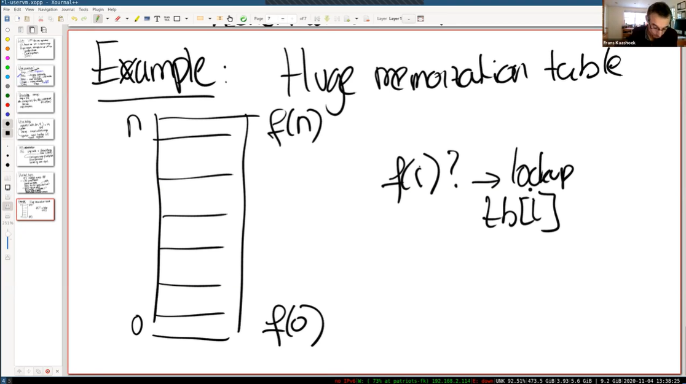
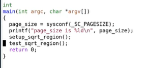
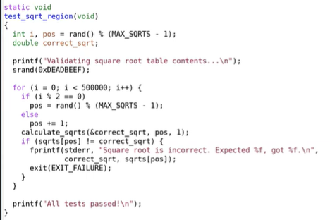
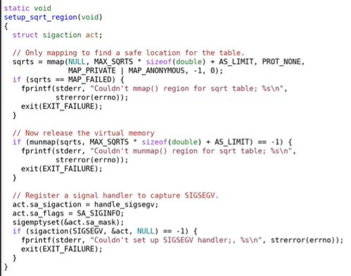
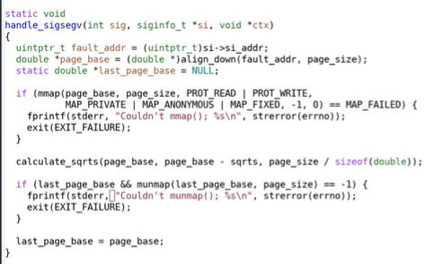
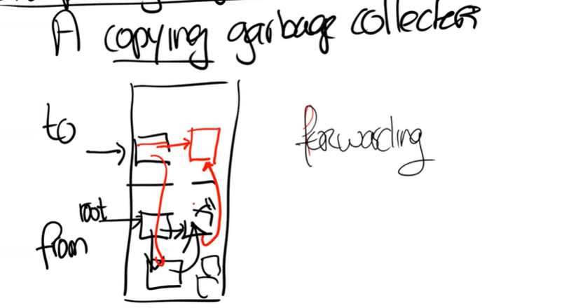
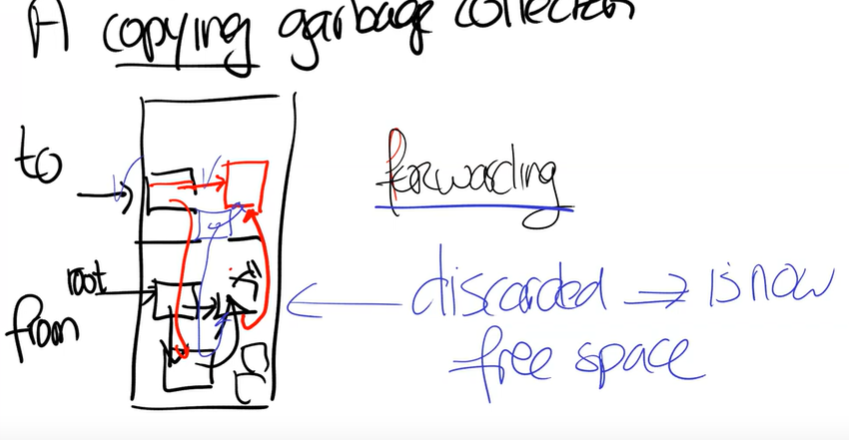
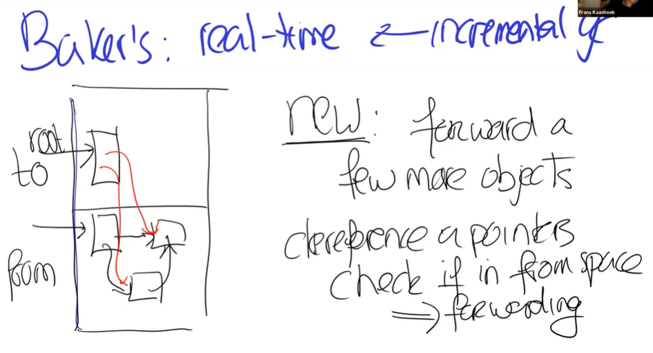
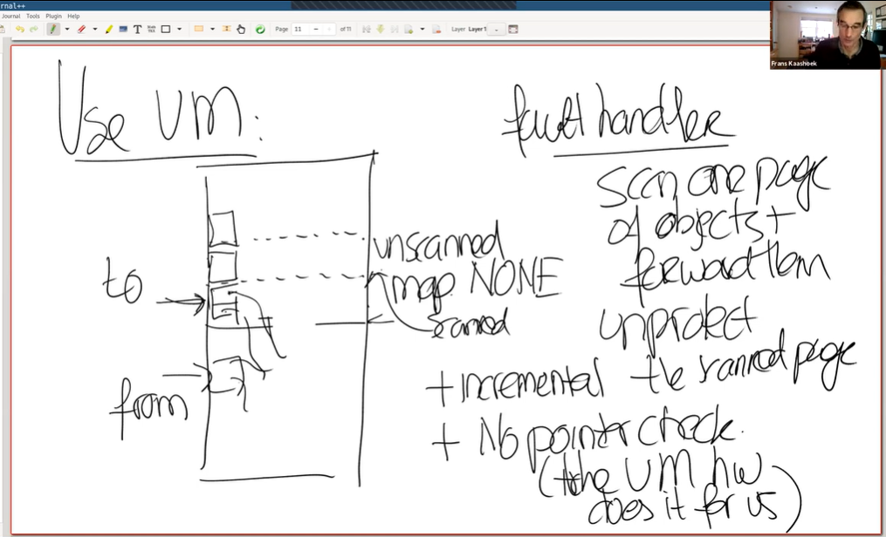
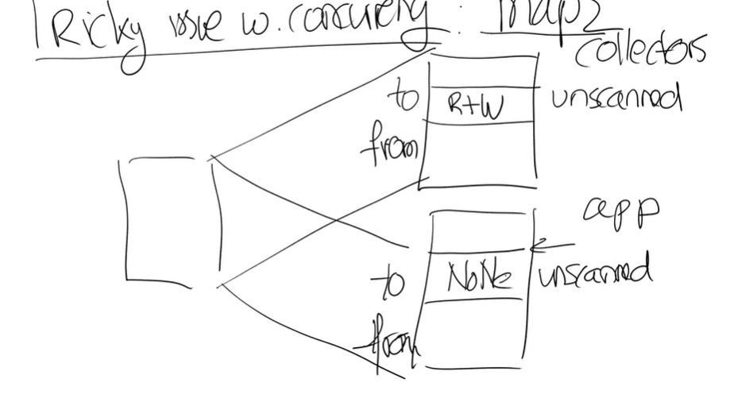

# LEC 17 (fk): Virtual memory for applications

笔记大量参考了[肖宏辉](https://www.zhihu.com/people/xiao-hong-hui-15)大佬的翻译。

目录：

<!-- @import "[TOC]" {cmd="toc" depthFrom=2 depthTo=2 orderedList=false} -->

<!-- code_chunk_output -->

- [应用程序使用虚拟内存所需要的特性](#应用程序使用虚拟内存所需要的特性)
- [支持应用程序使用虚拟内存的系统调用](#支持应用程序使用虚拟内存的系统调用)
- [虚拟内存系统实现](#虚拟内存系统实现)
- [Baker's Real-Time Copying Garbage Collector 垃圾回收机制](#bakers-real-time-copying-garbage-collector-垃圾回收机制)
- [总结：应该使用虚拟内存吗？](#总结应该使用虚拟内存吗)

<!-- /code_chunk_output -->

细分目录：

<!-- @import "[TOC]" {cmd="toc" depthFrom=2 depthTo=6 orderedList=false} -->

<!-- code_chunk_output -->

- [应用程序使用虚拟内存所需要的特性](#应用程序使用虚拟内存所需要的特性)
- [支持应用程序使用虚拟内存的系统调用](#支持应用程序使用虚拟内存的系统调用)
  - [mmap](#mmap)
  - [mprotect](#mprotect)
  - [munmap](#munmap)
  - [sigaction](#sigaction)
- [虚拟内存系统实现](#虚拟内存系统实现)
  - [概述： VMA 和 User Level Trap](#概述-vma-和-user-level-trap)
  - [实例：构建一个大的缓存表（结合系统调用）](#实例构建一个大的缓存表结合系统调用)
- [Baker's Real-Time Copying Garbage Collector 垃圾回收机制](#bakers-real-time-copying-garbage-collector-垃圾回收机制)
  - [copying GC](#copying-gc)
  - [GC 如何使用虚拟内存特性](#gc-如何使用虚拟内存特性)
  - [代码：使用虚拟内存特性的GC](#代码使用虚拟内存特性的gc)
- [总结：应该使用虚拟内存吗？](#总结应该使用虚拟内存吗)

<!-- /code_chunk_output -->

## 应用程序使用虚拟内存所需要的特性

今天的话题是用户应用程序使用的虚拟内存，它主要是受[这篇1991年的论文](../lec/l-uservm.pdf)的启发。

首先，你们已经知道了，操作系统内核以非常灵活的方式使用了虚拟内存Page Table。你们已经通过Lazy Allocation Lab，Copy on Write Lab，以及XV6中的各种内存实现了解到了这一点。而今天论文中的核心观点是， **用户应用程序也应该从灵活的虚拟内存中获得收益，也就是说用户应用程序也可以使用虚拟内存。用户应用程序本身就是运行在虚拟内存之上，我们这里说的虚拟内存是指：User Mode或者应用程序想要使用与内核相同的机制，来产生Page Fault并响应Page Fault（注，内核中几乎所有的虚拟内存技巧都基于Page Fault）。也就是说User Mode需要能够修改PTE的Protection位（注，Protection位是PTE中表明对当前Page的保护，很久之前提过的的Writeable和Readable位）或者Privileged level。今天的论文，通过查看6-7种不同的应用程序，来说明用户应用程序使用虚拟内存的必要性。** 这些应用程序包括了：
- Garbage Collector
- Data Compression Application
- Shared Virtual Memory

你可以发现这都是一些非常不同的应用程序，并且它们都依赖虚拟内存的一些特性来正常工作。所以第一个问题是，上面的应用程序需要的特性是什么？所以我们先来讨论一下需要的特性是什么？
- 首先，你需要trap来使得发生在内核中的Page Fault可以传播到用户空间，然后在用户空间的handler可以处理相应的Page Fault，之后再以正常的方式返回到内核并恢复指令的执行。这个特性是必须的，否则的话，你不能基于Page Fault做任何事情。
- 第二个特性是Prot1，它会降低了一个内存Page的accessability。accessability的意思是指内存Page的读写权限。内存Page的accessability有不同的降低方式，例如，将一个可以读写的Page变成只读的，或者将一个只读的Page变成完全没有权限。
- 除了对于每个内存Page的Prot1，还有管理多个Page的ProtN。ProtN基本上等效于调用N次Prot1，那为什么还需要有ProtN？因为单次ProtN的损耗比Prot1大不了多少，使用ProtN可以将成本分摊到N个Page，使得操作单个Page的性能损耗更少。在使用Prot1时，你需要修改PTE的bit位，并且在Prot1的结束时，需要清除TLB，而清除TLB比较费时。如果能对所有需要修改的内存Page集中清理一次TLB，就可以将成本分摊。所以ProtN等效于修改PTE的bit位N次，再加上清除一次TLB。如果执行了N次Prot1，那就是N次修改PTE的bit位，再加上清除N次TLB，所以ProtN可以减少清除TLB的次数，进而提升性能。
- 下一个特性是Unprot，它增加了内存Page的accessability，例如将本来只读的Page变成可读可写的。
- 除此之外，还需要能够查看内存Page是否是Dirty。
- 以及map2。map2使得一个应用程序可以将一个特定的内存地址空间映射两次，并且这两次映射拥有不同的accessability（注，也就是一段物理内存对应两份虚拟内存，并且两份虚拟内存有不同的accessability）。

XV6在用户程序中支持以上任意的特性吗？除了有类似于trap及其相关的alarm hander之外，XV6不支持任何一个以上的特性。XV6只有一个最小化的Unix接口，并不支持以上任何虚拟内存特性。尽管在XV6的内核中包含了所有的可用的虚拟内存的机制，但是并没有以系统调用的形式将它们暴露给用户空间。论文的观点是，任何一个好的操作系统都应该以系统调用的形式提供以上特性，以供应用程序使用。

所以自然的，这就引出了另一个问题，当今的Unix系统的功能范围是什么？以上特性属于Unix的范畴吗？ **如果你查看现在的Unix系统，例如Linux，你会发现，或许并不与论文中描述的完全一样，但是这些特性都存在。** 在论文那个年代（1991年），某些操作系统只包含了部分以上特性，但是如今这些特性都已经在现代的Unix系统中广泛支持了。接下来我们看一下如何实现这些特性。

## 支持应用程序使用虚拟内存的系统调用

### mmap

```c
addr = mmap(null, len, R/W, map_private, fd, offset)
```

第一个或许也是最重要的一个，是一个叫做mmap的系统调用。它接收某个对象，并将其映射到调用者的地址空间中。举个例子，如果你想映射一个文件，那么你需要将文件描述符传递给mmap系统调用。mmap系统调用有许多令人眼花缭乱的参数（注，mmap的具体说明可以参考`man page`）：
- 第一个参数是一个你想映射到的特定地址，如果传入null表示不指定特定地址，这样的话内核会选择一个地址来完成映射，并从系统调用返回。
- 第二个参数是想要映射的地址段长度len。
- 第三个参数是Protection bit，例如读写R|W。
- 第四个参数我们会跳过不做讨论，它的值可以是MAP_PRIVATE。它指定了如果你更新了传入的对象，会发生什么。（注，第四个参数是flags，MAP_PRIVATE是其中一个值，在mmap文件的场景下，MAP_PRIVATE表明更新文件不会写入磁盘，只会更新在内存中的拷贝，详见[man page](https://man7.org/linux/man-pages/man2/mmap.2.html)）。
- 第五个参数是传入的对象，在上面的例子中就是文件描述符。
- 第六个参数是offset。

通过上面的系统调用，可以将文件描述符指向的文件内容，从起始位置加上offset的地方开始，映射到特定的内存地址（如果指定了的话），并且连续映射len长度。这使得你可以实现Memory Mapped File， **你可以将文件的内容带到内存地址空间，进而只需要方便的通过普通的指针操作，而不用调用read/write系统调用，就可以从磁盘读写文件内容。** 这是一个方便的接口，可以用来操纵存储在文件中的数据结构。实际上，你们将会在下个lab实现基于文件的mmap，下个lab结合了XV6的文件系统和虚拟内存，进而实现mmap。

mmap还可以用作他途。 **除了可以映射文件之外，还可以用来映射匿名的内存（Anonymous Memory）。** 这是 sbrk 的替代方案，你可以向内核申请物理内存，然后映射到特定的虚拟内存地址。

mmap是实现应用程序虚拟内存的核心系统调用之一，我们稍后会将它与之前提到的特性关联起来。

除此之外，还需要有一些系统调用来支持论文中讨论到的特性。

### mprotect

mprotect系统调用（注，详见[man page](https://man7.org/linux/man-pages/man2/mprotect.2.html)）。当你将某个对象映射到了虚拟内存地址空间，你可以修改对应虚拟内存的权限，这样你就可以以特定的权限保护对象的一部分，或者整个对象。

```c
mprotect(addr, len, R) -> lds
```

举个例子，通过上图对于mprotect的调用将权限设置成只读（R），这时，对于addr到addr+len这段地址，load指令还能执行，但是store指令将会变成Page Fault。类似的，如果你想要将一段地址空间变成完成不可访问的，那么可以在mprotect中的权限参数传入None，那么任何对于addr到addr+len这段地址的访问，都会生成Page Fault。

### munmap

对应mmap还有一个系统调用munmap，它使得你可以移除一个地址或者一段内存地址的映射关系。如果你好奇这里是怎么工作的，你应该查看这些系统调用的[man page](https://man7.org/linux/man-pages/man2/munmap.2.html)。

### sigaction

其 man page ： https://man7.org/linux/man-pages/man2/rt_sigaction.2.html

最后一个系统调用是sigaction，它本质上是用来处理signal。它使得应用程序可以设置好一旦特定的signal发生了，就调用特定的函数。可以给它传入函数f作为特定signal的handler。在Page Fault的场景下，生成的signal是segfault。你或许之前在用户代码中看过了segfault，通常来说当发生segfault时，应用程序会停止运行并crash。但是如果应用程序为segfault signal设置了handler，发生segfault时，应用程序不会停止，相应的handler会被内核调用，然后应用程序可以在handler中响应segfault。

当内核发现Page Fault时，或许会通过修复Page Table来使得应用程序还能继续执行。与内核响应Page Fault的方式类似，在这里的handler中或许会调用mprotect来修改内存的权限来避免segfault，这样应用程序的指令就可以恢复运行。

当内核发现Page Fault时，或许会通过修复Page Table来使得应用程序还能继续执行。与内核响应Page Fault的方式类似，在这里的handler中或许会调用mprotect来修改内存的权限来避免segfault，这样应用程序的指令就可以恢复运行。

与sigaction类似的有sigalarm（注，sigalarm不是一个标准的Unix接口，应该是这门课程相关课程中需要学生自己实现的一个系统调用），在sigalarm中可以设置每隔一段时间就调用的handler。sigaction也可以实现这个功能，只是它更加的通用，因为它可以响应不同类型的signal。

- 学生提问：看起来mprotect暗示了你可以为单独的地址添加不同的权限，然而在XV6中，我们只能为整个Page设置相同的权限，这里是有区别吗？
- Frans教授：不，这里并没有区别，它们都在Page粒度工作。如果你好奇的话，有一个单独的系统调用可以查看Page的大小。

如果你回想前面提到过的虚拟内存特性，我们可以将它们对应到这一节描述的Unix接口中来。
- trap对应的是sigaction系统调用
- Prot1，ProtN和Unprot可以使用mprotect系统调用来实现。mprotect足够的灵活，你可以用它来修改一个Page的权限，也可以用它来修改多个Page的权限。当修改多个Page的权限时，可以获得只清除一次TLB的好处。
- 查看Page的Dirty位要稍微复杂点，并没有一个直接的系统调用实现这个特性，不过你可以使用一些技巧完成它，我稍后会介绍它。
- map2也没有一个系统调用能直接对应它，通过多次调用mmap，你可以实现map2特性。

或许并不完全受这篇论文所驱动，但是内核开发人员已经在操作系统中为现在的应用程序提供了这些特性。接下来，我将在框架层面简单介绍一下这些特性是如何实现的，之后再看看应用程序是如何使用这些特性。

## 虚拟内存系统实现

### 概述： VMA 和 User Level Trap

有关实现，有两个方面较为有趣。

第一个是虚拟内存系统为了支持这里的特性，具体会发生什么？这里我们只会讨论最重要的部分，并且它也与即将开始的mmap lab有一点相关，因为在mmap lab中你们将要做类似的事情。 **在现代的Unix系统中，地址空间是由硬件Page Table来体现的，在Page Table中包含了地址翻译。但是通常来说，地址空间还包含了一些操作系统的数据结构，这些数据结构与任何硬件设计都无关，它们被称为Virtual Memory Areas（VMAs）。VMA会记录一些有关连续虚拟内存地址段的信息。在一个地址空间中，可能包含了多个section，每一个section都由一个连续的地址段构成，对于每个section，都有一个VMA对象。连续地址段中的所有Page都有相同的权限，并且都对应同一个对象VMA（例如一个进程的代码是一个section，数据是另一个section，它们对应不同的VMA，VMA还可以表示属于进程的映射关系，例如下面提到的Memory Mapped File）。**

举个例子，如果进程有一个Memory Mapped File，那么对于这段地址，会有一个VMA与之对应，VMA中会包含文件的权限，以及文件本身的信息，例如文件描述符，文件的offset等。在接下来的mmap lab中，你们将会实现一个非常简单版本的VMA，并用它来实现针对文件的mmap系统调用。你可以在VMA中记录mmap系统调用参数中的文件描述符和offset。

第二个部分我们了解的就不多了，它或许值得仔细看一下，也就是User level trap是如何实现的？我们假设一个PTE被标记成invalid或者只读，而你想要向它写入数据。这时，CPU会跳转到kernel中的固定程序地址，也就是XV6中的trampoline代码。kernel会保存应用程序的状态，在XV6中是保存到trapframe。之后再向虚拟内存系统查询，现在该做什么呢？虚拟内存系统或许会做点什么，例如在lazy lab和copy-on-write lab中，trap handler会查看Page Table数据结构。而在我们的例子中会查看VMA，并查看需要做什么。

举个例子，如果是segfault，并且应用程序设置了一个handler来处理它，那么
- segfault事件会被传播到用户空间
- 并且通过一个到用户空间的upcall在用户空间运行handler
- 在handler中或许会调用mprotect来修改PTE的权限
- 之后handler返回到内核代码
- 最后，内核再恢复之前被中断的进程

当内核恢复了中断的进程时，如果handler修复了用户程序的地址空间，那么程序指令可以继续正确的运行，如果哪里出错了，那么会通过trap再次回到内核，因为硬件还是不能翻译特定的虚拟内存地址。

- 学生提问： **当我们允许用户针对Page Fault来运行handler代码时，这不会引入安全漏洞吗？**
- Frans教授：这是个很好的问题。会有安全问题吗？你们怎么想的？这会破坏User/kernel或者不同进程之间的隔离性吗？或者从另一个角度来说，你的问题是sigalarm会破坏隔离性吗？
- **当我们执行upcall的时候，upcall会走到设置了handler的用户空间进程中，所以handler与设置了它的应用程序运行在相同的context，相同的Page Table中。所以handler唯一能做的事情就是影响那个应用程序，并不能影响其他的应用程序，因为它不能访问其他应用程序的Page Table，或者切换到其他应用程序的Page Table。所以这里还好。**
- 当然，如果handler没有返回，或者做了一些坏事，最终内核还是会杀掉进程。所以唯一可能出错的地方就是进程伤害了自己，但是它不能伤害任何其他进程。

### 实例：构建一个大的缓存表（结合系统调用）

代码在 [lec/sqrt.c](../lec/sqrt.c) 。

首先我想讨论的是一个非常简单的应用，它甚至都没有在论文中提到，但它却是展示这节课的内容非常酷的一个方法。这个应用里是构建一个大的缓存表，什么是缓存表？它是用来记录一些运算结果的表单。举个例子，你可以这么想，下面是我们的表单，它从0开始到n。表单记录的是一些费时的函数运算的结果，函数的参数就是0到n之间的数字。



如果这个表单在最开始的时候就预计算好了，那么当你想知道f(i)的结果是什么时，你需要做的就是查看表单的i槽位，并获取f(i)的值。这样你可以将一个费时的函数运算转变成快速的表单查找，所以这里一个酷的技巧就是预先将费时的运算结果保存下来。如果相同的计算需要运行很多很多次，那么预计算或许是一个聪明的方案。

**这里的挑战是，表单可能会很大，或许会大过物理内存，这里可以使用论文提到的虚拟内存特性来解决这个挑战。**

首先，你需要分配一个大的虚拟地址段，但是并不分配任何物理内存到这个虚拟地址段。这里只是从地址空间获取了很大一段地址，并说我将要使用地址空间的这部分来保存表单。

但是现在表单中并没有内容，表单只是一段内存地址。如果你现在查找表单的i槽位，会导致Page Fault。所以这里的计划是，在发生Page Fault时，先针对对应的虚拟内存地址分配物理内存Page，之后计算f(i)，并将结果存储于`tb[i]`，也就是表单的第i个槽位，最后再恢复程序的运行。

这种方式的优势是，如果你需要再次计算f(i)，你不需要在进行任何费时的计算，只需要进行表单查找。即使接下来你要查找表单的`i+1`槽位，因为一个内存Page可能可以包含多个表单项，这时也不用通过Page Fault来分配物理内存Page。

**不过如果你一直这么做的话，因为表单足够大，你最终还是会消耗掉所有的物理内存。所以Page Fault Handler需要在消耗完所有的内存时，回收一些已经使用过的物理内存Page。当然，你需要修改已经被回收了的物理内存对应的PTE的权限，这样在将来使用对应地址段时，就可以获得Page Fault。所以你需要使用Prot1或者ProtN来减少这些Page的accessbility。**

- 学生提问：在分配物理内存Page时，我们需要让操作系统映射到地址空间的特定地址，否则的话可能会映射到任意地址，是吧？
- Frans教授：操作系统会告知是哪个地址，并且这里可能是任意的地址。

为了更具体的描述这里的应用，我这里有个小的实现，我们可以看一看这里是如何使用现有的Unix特性。



在main函数中，首先调用setup_sqrt_region函数，它会从地址空间分配地址段，但是又不实际分配物理Page。之后调用test_sqrt_region。



在test_sqrt_region中，会以随机数来遍历表单，并通过实际运算对应的平方根值，来检查表单中相应位置值是不是保存了正确的平方根值。在test_sqrt_region运行的过程中，会产生Page Fault，因为现在还并没有分配任何物理内存Page。

应用程序该如何收到Page Fault呢？



在setup_sqrt_region函数中有一段代码，通过将handle_sigsegv函数注册到了SIGSEGV事件。这样当segfault或者Page Fault发生时，内核会调用handle_sigsegv函数。



handle_sigsegv函数与你们之前看过很多很多次的trap代码非常相似。
- 它首先会获取触发Page Fault的地址
- 之后调用mmap对这个虚拟内存地址分配一个物理内存Page（注，这里是mmap映射匿名内存）。这里的虚拟内存地址就是我们想要在表单中用来保存数据的地址
- 然后我们为这个Page中所有的表单项都计算对应的平方根值，之后就完事了

这个应用程序有点极端，它在运行的时候只会使用一个物理内存Page，所以不论上一次使用的Page是什么，在handle_sigsegv的最后都会通过munmap释放它。所以我们有一个巨大的表单，但是它只对应一个物理内存Page。

接下来我将运行一下这个应用程序。test_sqrt_region会随机查看表单的内容，所以可以假设这会触发很多Page Fault，但是可以看出表单中的所有内容都能通过检查。

所以，尽管这里有一个巨大的表单用来保存平方根，但是实际在物理内存中只有一个内存Page。这是一个简单的例子，它展示了用户应用程序使用之前提到的虚拟内存特性之后可以做的一些酷的事情。

- 学生提问：能再讲一下为什么一个物理内存Page就可以工作吗？我觉得这像是lazy allocation，但是区别又是什么呢？
- Frans教授：当我们刚刚完成设置时，我们一个内存Page都没有，setup_sqrt_region分配了一个地址段，但是又立即通过munmap将与这个地址段关联的内存释放了。所以在启动的最开始对于表单并没有一个物理内存Page与之关联。
之后，当我们得到了一个Page Fault，这意味着整个表单对应的地址中至少有一个Page没有被映射，虽然实际上我们一个Page都没有映射。现在我们得到了一个Page Fault，我们只需要映射一个Page，在这个Page中，我们会存入`i`，`i+1`等的平方根（注，因为一个 Page 4096 字节，一个 double 8 个字节，所以一个 Page 可以保存 512 个表单项）。
因为这是第一个Page Fault，之前并没有映射了内存Page，所以不需要做任何事情。
- 之后，程序继续运行并且查找了表单中的更多项，如果查找一个没有位于已分配Page上的表单项时，会得到另一个Page Fault。这时，在handle_sigsegv会分配第二个内存Page，并为这个Page计算平方根的值。之后会munmap记录在last_page_base中的内存。
- 当然，在实际中我们永远也不会这么做，在实际中至少会保留一些内存Page，这里只是以一种极端的方式展示，你可以只通过内存中的一个Page来表示一个巨大的表单。所以在handle_sigsegv中，会释放上一次映射的内存Page。
之后程序继续运行，所以在任何一个时间，只有一个物理内存Page被使用了。很明显，你们在实际中不会这么做，这里更多的是展示前面提到特性的能力。

## Baker's Real-Time Copying Garbage Collector 垃圾回收机制

接下来我会讨论另一个例子，也就是Garbage Collector（注，后面将Garbage Collector和Garbage Collection都简称为GC），并且我也收到了很多有关Garbage Collector的问题。

GC是指编程语言替程序员完成内存释放，这样程序员就不用像在C语言中一样调用free来释放内存。对于拥有GC的编程语言，程序员只需要调用类似malloc的函数来申请内存，但是又不需要担心释放内存的过程。GC会决定内存是否还在使用，如果内存并没有被使用，那么GC会释放内存。GC是一个很好的特性，有哪些编程语言带有GC呢？Java，Python，Golang，几乎除了C和Rust，其他所有的编程语言都带有GC。

### copying GC

你可以想象，GC有很大的设计空间。这节课讨论的论文并没有说什么样的GC是最好的，它只是展示了GC可以利用用户空间虚拟内存特性。论文中讨论了一种特定的GC，这是一种copying GC。

**什么是copying GC？**



假设你有一段内存作为heap，应用程序从其中申请内存。你将这段内存分为两个空间，其中一个是from空间，另一个是to空间。当程序刚刚启动的时候，所有的内存都是空闲的，应用程序会从from空间申请内存。假设我们申请了一个类似树的数据结构。树的根节点中包含了一个指针指向另一个对象，这个对象和根节点又都包含了一个指针指向第三个对象，这里构成了一个循环。

或许应用程序在内存中还有其他对象，但是没有别的指针指向这些对象，所以所有仍然在使用的对象都可以从根节点访问到。在某个时间，或许因为之前申请了大量的内存，已经没有内存空间给新对象了，也就是说整个from空间都被使用了。

Copying GC的基本思想是将仍然在使用的对象拷贝到to空间去，具体的流程是从根节点开始拷贝。每一个应用程序都会在一系列的寄存器或者位于stack上的变量中保存所有对象的根节点指针，通常来说会存在多个根节点，但是为了说明的简单，我们假设只有一个根节点。拷贝的流程会从根节点开始向下跟踪，所以最开始将根节点拷贝到了to空间，但是现在根节点中的指针还是指向着之前的对象。

在之后的过程中，我们需要记住这个对象已经被拷贝过了。所以，我们还会存储一些额外的信息来记住相应的对象已经保存在了to空间，这里会在from空间保留一个forwarding指针。这里将对象从from空间拷贝到to空间的过程称为forward。

接下来还剩下一个对象，我们将这个对象从from空间拷贝到to空间，这个对象还包含一个指针指向第二个对象。

但是通过查看指针可以看到这个对象已经被拷贝了，并且我们已经知道了这个对象被拷贝到的地址（注，也就是之前在from空间留下的forwarding指针）。所以我们可以直接更新第三个对象的指针到正确的地址。



现在与根节点相关的对象都从from空间移到了to空间，并且所有的指针都被正确的更新了，所以现在我们就完成了GC，from空间的所有对象都可以被丢弃，并且from空间现在变成了空闲区域。

以上就是copying GC的基本思路。论文中讨论的是一种更为复杂的GC算法，它被称为Baker算法，这是一种很老的算法。它的一个优势是它是实时的，这意味着它是一种incremental GC（注，incremental GC是指GC并不是一次做完，而是分批分步骤完成）。在Baker算法中，我们还是有from和to两个空间。假设其中还是包含了上面介绍的几个对象。



**这里的基本思想是，GC的过程没有必要停止程序的运行并将所有的对象都从from空间拷贝到to空间，然后再恢复程序的运行。GC开始之后，唯一必要的事情，就是将根节点拷贝到to空间。** 所以现在根节点被拷贝了，但是根节点内的指针还是指向位于from空间的对象。根节点只是被拷贝了并没有被扫描，其中的指针还没有被更新。

如果应用程序调用了new来申请内存，那就再扫描几个对象，并将这些对象从from空间forward到to空间。这很好，因为现在我们将拷贝heap中还在使用的所有对象的过程，拆分成了渐进的步骤。每一次调用new都使得整个拷贝过程向前进一步。

当然应用程序也会使用这里对象所指向的指针。举个例子，现在当根节点需要读出其指向的一个对象时，这个对象仍然在from空间。这是危险的，因为我们不应该跟踪from空间的指针（注，换言之GC时的指针跟踪都应该只在同一个空间中完成）。所以每次获取一个指针指向的对象时（dereference），你需要检查对象是否在在from空间，如果是的话，将其从from空间forward到to空间。所以应用程序允许使用指针，但是编译器需要对每个指针的访问都包上一层检查，这样我们就可以保证在to空间的任何指针指向的是位于to空间的对象。我们需要确保这一点，因为在最后当GC完成了所有对象的跟踪之后，我们会清空from部分并重用这部分内存。

论文对于这里的方案提出了两个问题：
- 第一个是每次dereference都需要有以上的额外步骤，每次dereference不再是对于内存地址的单个load或者store指令，而是多个load或者store指令，这增加了应用程序的开销。
- 第二个问题是并不能容易并行运行GC。如果程序运行在多核CPU的机器上，并且你拥有大量的空闲CPU，我们本来可以将GC运行在后台来遍历对象的图关系，并渐进的拷贝对象。但是如果应用程序也在操作对象，那么这里可能会有抢占。应用程序或许在运行dereference检查并拷贝一个对象，而同时GC也在拷贝这个对象。如果我们不够小心的话，我们可能会将对象拷贝两遍，并且最后指针指向的不是正确的位置。所以这里存在GC和应用程序race condition的可能。

### GC 如何使用虚拟内存特性

**论文中介绍，如果拥有了前面提到的虚拟内存特性，你可以使用虚拟内存来减少指针检查的损耗，并且以几乎零成本的代价来并行运行GC。这里的基本思想是将heap内存中from和to空间，再做一次划分，每一个部分包含scanned，unscanned两个区域。在程序启动，或者刚刚完成了from和to空间的切换时，整个空间都是unscanned，因为其中还没有任何对象。**



之后的过程与前面描述的相同，在开始GC时，我们将根节点对象拷贝到to空间，但是根节点中的指针还是指向了位于from空间的对象。现在unscanned区域包括了所有的对象（注，现在只有根节点），我们会将unscanned区域的权限设置为None。这意味着，当开始GC之后，应用程序第一次使用根节点，它会得到Page Fault，因为这部分内存的权限为None。

在Page Fault Handler中，GC需要扫描位于内存Page中所有的对象，然后将这些对象所指向的其他对象从from空间forward到to空间。所以，在GC最开始的时候，我们将根节点拷贝过来了；之后在Page Fault Handler中通过扫描，将根节点指向的对象也都拷贝过来了。在我们的例子中根节点指向的只有两个对象，这两个对象会被拷贝到unscanned区域中，而根节点会被标记成scanned。在我们扫描完一个内存Page中的对象时，我们可以通过Unprot恢复对应内存Page的权限。

之后，应用程序就可以访问特定的对象，因为我们将对象中的指针转换成了可以安全暴露给应用程序的指针（注，因为这些指针现在指向了位于to空间的对象），所以应用程序可以访问这些指针。当然这些指针对应的对象中还没有被扫描。如果dereference这些指针，我们会再次得到Page Fault，之后我们会继续扫描。

这种方案的好处是，它仍然是递增的GC，因为每次只需要做一小部分GC的工作。 **除此之外，它还有额外的优势：现在不需要对指针做额外的检查了（注，也就是不需要查看指针是不是指向from空间，如果是的话，将其forward到to空间）。或者说指针检查还在，只是现在通过虚拟内存相关的硬件来完成了。**

- 学生提问：刚刚说到在Handler里面会扫描一个Page中的所有对象，但是对象怎么跟内存Page对应起来呢？
- Frans教授：在最开始的时候，to空间是没有任何对象的。当需要forward的时候，我刚刚描述的是拷贝一个对象，但是实际上拷贝的是一个内存Page中的N个对象，这样它们可以填满整个Page。所以现在我们在to空间中，有N个对象位于一个Page中，并且它们都没有被扫描。之后某个时间，Page Fault Handler会被调用，GC会遍历这个内存Page上的N个对象，并检查它们的指针。对于这些指针，GC会将对应的对象拷贝到to空间的unscanned区域中。之后，当应用程序使用了这些未被扫描的对象，它会再次得到Page Fault，进而再扫描这些对象，以此类推。
- 学生提问：在完成了GC之后，会切换from和to空间吗？
- Frans教授：最开始我们使用的是from空间，当用完了的时候，你会将对象拷贝到to空间，一旦完成了扫描，from空间也被完全清空了，你可以切换两个空间的名字。现在会使用to空间来完成内存分配。直到它也满了，你会再次切换。

论文中提到使用虚拟内存的另一个好处是，它简化了GC的并发。 **GC现在可以遍历未被扫描的内存Page，并且一次扫描一个Page，同时可以确保应用程序不能访问这个内存Page，因为对于应用程序来说，未被扫描的内存Page权限为None。** 虚拟内存硬件引入了这种显式的同步机制，或者说对于抢占的保护。

**现在只有GC可以访问未被扫描的内存Page，而应用程序不能访问。所以这里提供了自动的并发，应用程序可以运行并完成它的工作，GC也可以完成自己的工作，它们不会互相得罪，因为一旦应用程序访问了一个未被扫描的Page，它就会得到一个Page Fault。而GC也永远不会访问扫描过的Page，所以也永远不会干扰到应用程序。所以这里以近乎零成本获取到了并发性。**

但是实际上有个麻烦的问题。回到我们之前那张图，我们在heap中有from空间，to空间。在to空间中又分为了unscanned和scanned区域，对于应用程序来说，unscanned区域中的Page权限为None。

这就引出了另一个问题，GC怎么能访问这个区域的内存Page？因为对于应用程序来说，这些Page是inaccessible。



这里的技巧是使用map2。这里我们会将同一个物理内存映射两次，第一次是我们之前介绍的方式，也就是为应用程序进行映射，第二次专门为GC映射。在GC的视角中，我们仍然有from和to空间。在to空间的unscanned区域中，Page具有读写权限。

所以GC可以遍历这些内存Page，读取内容并forward必要的对象。这里使用了map2将物理内存映射到应用程序地址空间中两次的能力，其中每次映射都有不同的权限，这样这里的场景才能工作。

- 学生提问：GC和应用程序是不是有不同的Page Table？
- Frans教授：不，它们拥有相同的Page Table。它们只是将物理内存映射到了地址空间的两个位置，也就是Page Table的两个位置。在一个位置，PTE被标记成invalid，在另一个位置，PTE被标记成可读写的。

### 代码：使用虚拟内存特性的GC

代码在 [lec/baker.c](../lec/baker.c)

为了更清晰的说明上一节的内容，我这里有个针对论文中方法的简单实现，我可以肯定它包含了一些bug，因为我并没有认真的测试它。

首先，应用程序使用的API包括了new和readptr。

```c
//
// API to collector
//

struct elem *readptr(struct elem **ptr);
struct elem *new();
```

readptr会检查指针是否位于from空间，如果是的话，那么它指向的对象需要被拷贝。当然，当我们使用虚拟内存时，这里的readptr成本会比较低，它会直接返回参数。在这个简单的例子中，我有一个循环链表，并且有两个根节点，其中一个指向链表的头节点，另一个指向链表的尾节点。

应用程序线程的工作是循环1000次，每次创建list，再检查list。

```c
void *
app_thread(void *x) {
  for (int i = 0; i < 1000; i++) {
    make_clist();
    check_clist(LISTSZ);
  }
}
```

所以它会产生大量的垃圾，因为每次make_clist完成之后，再次make_clist，上一个list就成为垃圾了。所以GC必然会有一些工作要做。

make_clist的代码有点丑，主要是因为每个指针都需要被readptr检查包围。通常这里的检查代码是由编译器生成的。但是我这里并没有一个针对带GC的编程语言的编译器，所以我只能模仿一个编译器可能生成的内容。

```c
// Make a circular list
void
make_clist(void) {
  struct elem *e;

  root_head = new();
  readptr(&root_head)->val = 0;
  readptr(&root_head)->next = readptr(&root_head);
  root_last = readptr(&root_head);

  for (int i = 1; i < LISTSZ; i++) {
    e = new();
    readptr(&e)->next = readptr(&root_head);
    readptr(&e)->val = i;
    root_head = readptr(&e);
    readptr(&root_last)->next = readptr(&root_head);
    check_clist(i+1);
  }
}
```

make_clist会构建一个LISTSZ大小的链表，分配新的元素，并将新元素加到链表的起始位置，之后更新链表尾指针指向链表新的起始位置，这样就能构成一个循环链表。

这里更有趣的部分是，GC部分怎么实现。首先让我们看看如果没有虚拟内存会怎样。我们只需要查看两个API：new和readptr。

```c
struct elem *
new(void) {
  struct elem *n;
  
  pthread_mutex_lock(&lock);
  if (collecting && scanned < to_free_start) {
    scan(scanned);
    if (scanned >= to_free_start) {
      end_collecting();
    }
  }
  if (to_free_start + sizeof(struct obj) >= to + SPACESZ) {
    flip();
  }
  n = (struct elem *) alloc();
  pthread_mutex_unlock(&lock);
  
  return n;
}
```

以上就是new的实现，先不考虑这里的mutex，因为这是为基于虚拟内存的实现提供的。先假设我们不需要扫描，也不需要collect。接下来会检查是否有足够的空间，如果有足够的空间，我们就将指针地址增加一些，以分配内存空间给新的对象，最后返回。

如果没有足够的空间，我们需要调用flip，也就是运行GC。

```c
void
flip() {
  char *tmp = to;

  printf("flip spaces\n");

  assert(!collecting);
  to = from;
  to_free_start = from;
  from = tmp;

  collecting = 1;
  scanned = to;

#ifdef VM
  if (mprotect(to, SPACESZ, PROT_NONE) < 0) {
    fprintf(stderr, "Couldn't unmap to space; %s\n", strerror(errno));
    exit(EXIT_FAILURE);
  }
#endif

  // move root_head and root_last to to-space
  root_head = (struct elem *) forward((struct obj *)root_head);
  root_last = (struct elem *) forward((struct obj *)root_last);

  pthread_cond_broadcast(&cond);
}
```

flip首先会切换from和to指针，之后将这个应用程序的两个根节点从from空间forward到to空间。接下来我们看一下forward函数。

```c
// Forward pointer to to-space. If pointer is in from-space, make a
// copy of the object in to-space and return pointer to copy. If
// object was already copied (there may several pointers to the same
// object), return the pointer to the to-space object.  If pointer is
// already in to-space, just return the pointer.
struct obj *
forward(struct obj *o) {
  struct obj *n = o;
  if (in_from(o)) {
    if (o->newaddr == 0) {   // not copied yet?
      n = copy(o);
      printf("forward: copy %p (%d) to %p\n", o, o->e.val, n);
    } else {
      n = o->newaddr;
      printf("forward: already copied %p (%d) to %p\n", o, o->e.val, n);
    }
  }
  return n;
}
```

这个函数会forward指针o指向的对象，首先检查指针o是不是在from空间，如果是的话，并且之前没有被拷贝过，那么就将它拷贝到to空间。如果之前拷贝过，那么就可以用to空间的指针代替对象指针，并将其返回。

```c
// Without VM: check if pointer should be forwarded.  With VM, do
// nothing; the segfault handler will fix things up and when it
// returns the pointer will be pointing to object in to-space.
struct elem *
__attribute__ ((noinline))
readptr(struct elem **p) {
#ifndef VM
  struct obj *o = forward((struct obj *) (*p));
  *p = (struct elem *) o;
#endif
  return *p;
}
```

对于readptr，如果我们没有使用虚拟内存。会对指针p做forward操作，forward操作的意思是如果对象在from空间，那么就将其拷贝到to空间，所以这里会有耗时的检查。

接下来我们看一下这里如何使用虚拟内存。

```c
//
// Initialization
//

static void
setup_spaces(void)
{
  struct sigaction act;
  int shm;

  // make a shm obj for to-space and from-space
  if ((shm = shm_open("baker", O_CREAT|O_RDWR|O_TRUNC, S_IRWXU)) < 0) {
    fprintf(stderr, "Couldn't shm_open: %s\n", strerror(errno));
    exit(EXIT_FAILURE);
  }

  if (shm_unlink("baker") != 0) {
    fprintf(stderr, "shm_unlink failed: %s\n", strerror(errno));
    exit(EXIT_FAILURE);
  }
  
  if (ftruncate(shm, TOFROM) != 0) {
    fprintf(stderr, "ftruncate failed: %s\n", strerror(errno));
    exit(EXIT_FAILURE);
  }

  // map it once for mutator
  mutator = mmap(NULL, TOFROM, PROT_READ|PROT_WRITE, MAP_SHARED, shm, 0);
  if (mutator == MAP_FAILED) {
    fprintf(stderr, "Couldn't mmap() from space; %s\n", strerror(errno));
    exit(EXIT_FAILURE);
  }

  // map it once for collector
  collector = mmap(NULL, TOFROM, PROT_READ|PROT_WRITE, MAP_SHARED, shm, 0);
  if (collector == MAP_FAILED) {
    fprintf(stderr, "Couldn't mmap() from space; %s\n", strerror(errno));
    exit(EXIT_FAILURE);
  }

  from = mutator;
  to = mutator + SPACESZ;
  to_free_start = to;

  // Register a signal handler to capture SIGSEGV.
  act.sa_sigaction = handle_sigsegv;
  act.sa_flags = SA_SIGINFO;
  sigemptyset(&act.sa_mask);
  if (sigaction(SIGSEGV, &act, NULL) == -1) {
    fprintf(stderr, "Couldn't set up SIGSEGV handler: %s\n", strerror(errno));
    exit(EXIT_FAILURE);
  }
}
```

首先是设置内存，通过[shm_open](https://man7.org/linux/man-pages/man3/shm_open.3.html)创建一个Share-memory object，shm_open是一个Linux/Uinx系统调用。Share-memory object表现的像是一个文件，但是它并不是一个文件，它位于内存，并没有磁盘文件与之对应，如果你愿意的话，可以认为它是一个位于内存的文件系统。

之后我们裁剪这个Shared-memory object到from和to空间的大小。

之后我们通过mmap先将其映射一次，以供mutator也就是实际的应用程序使用。然后再映射一次，以供GC使用。这里shm_open，ftruncate，和两次mmap，等效于map2。

回过去看之前的代码。

```c
// Without VM: check if pointer should be forwarded.  With VM, do
// nothing; the segfault handler will fix things up and when it
// returns the pointer will be pointing to object in to-space.
struct elem *
__attribute__ ((noinline))
readptr(struct elem **p) {
#ifndef VM
  struct obj *o = forward((struct obj *) (*p));
  *p = (struct elem *) o;
#endif
  return *p;
}
```

使用了虚拟内存之后，readptr将不做任何事情，直接将参数返回。当然，如果我们使用这里的指针，并且指针对应的对象位于unscanned区域，我们会得到Page Fault。

```c
// Rounds v down to an alignment a
#define align_down(v, a) ((v) & ~((typeof(v))(a) - 1))

static void
handle_sigsegv(int sig, siginfo_t *si, void *ctx)
{
  uintptr_t fault_addr = (uintptr_t)si->si_addr;
  double *page_base = (double *)align_down(fault_addr, PGSIZE);

  printf("fault at adddr %p (page %p)\n", fault_addr, page_base);

  pthread_mutex_lock(&lock);
  scan(page_base);
  pthread_mutex_unlock(&lock);
  
  if (mprotect(page_base, PGSIZE, PROT_READ|PROT_WRITE) < 0) {
    fprintf(stderr, "Couldn't mprotect to-space page; %s\n", strerror(errno));
    exit(EXIT_FAILURE);
  }
}
```

在Page Fault hanlder中，GC会运行scan函数。但是scan函数是以GC对应的PTE来运行的，所以它能工作。而同时，应用程序或者mutator不能访问这些Page，如果访问了的话，这会产生Page Fault。一旦scan执行完成，handler中会将Page设置成对应用程序可访问的（注，也就是调用mprotect）。

```c
void
flip() {
  char *tmp = to;

  printf("flip spaces\n");

  assert(!collecting);
  to = from;
  to_free_start = from;
  from = tmp;

  collecting = 1;
  scanned = to;

#ifdef VM
  if (mprotect(to, SPACESZ, PROT_NONE) < 0) {
    fprintf(stderr, "Couldn't unmap to space; %s\n", strerror(errno));
    exit(EXIT_FAILURE);
  }
#endif

  // move root_head and root_last to to-space
  root_head = (struct elem *) forward((struct obj *)root_head);
  root_last = (struct elem *) forward((struct obj *)root_last);

  pthread_cond_broadcast(&cond);
}
```

在flip函数中，完成from和to空间的切换时，如果使用了虚拟内存，我们会通过mprotect将整个to空间对应用程序标记成不可访问的。之后GC将root_head和root_last移到to空间中，这样应用程序就不能访问这两个对象，任何时候应用程序需要访问这两个对象，都会导致一个Page Fault。在Page Fault handler中，GC可以将其他对象从from空间拷贝到to空间，然后再Unprot对应的Page。

在Page Fault handler中，先scan内存Page，再将内存Page标记成对应用程序可访问的这个顺序是至关重要的。因为如果你先将内存Page标记成应用程序可访问的，然后再扫描它，如果有多个应用程序线程，那么应用程序可能会查看到unscanned区域的对象。当然我们要禁止这一点（注，因为为了避免抢占，unscanned区域只能GC访问），所以这里的代码是先扫描，再增加内存的访问权限，这样应用程序就可以安全的访问这些内存Page。

## 总结：应该使用虚拟内存吗？

我总结一下这节课的内容。有一个问题，你应该在这里使用虚拟内存吗？或者说这里的这些技巧值得吗？ **许多的GC并没有使用虚拟内存，而是通过编译器生成的代码来完成GC，并且还有各种其他的技巧来减少性能损耗。所以GC的大部分场景都可以通过一些额外的指令来完成。** 这对于一个编译器，程序运行时，或者编程语言来说，并不是一个太糟糕的选择，因为编译器就可以完成这些操作。但是如果没有程序运行时或者编译器，那么这个过程就会很痛苦。所以 **对于一些完全没有编译器参与的应用程序，例如checkpointing，shared-virtual memory，它们的确需要这里提到的虚拟内存特性。实际中，足够多的应用程序开发人员发现了这些特性的价值，所以今天的操作系统都支持了这些虚拟内存特性。**

很多人问了这个问题，从91年（论文发表的年份）至今，虚拟内存系统发生了什么改变？其中一个改变是，大部分的Unix系统都支持了这些虚拟内存特性了，并且从91年至今有许多变化。或许很难想象，但是在虚拟内存系统中有持续的开发，所以如果你查看Linux的git log，你可以发现在内核的各个方面都有持续的开发，其中包括了对虚拟内存系统的持续开发。在过去有一些重大的改变，比如说：
- 现在的Page Table是5级的，这样可以处理非常大的地址
- 可以通过地址空间标识符来处理TLB flush
- 大概一年前，一种叫做KPTI（kernel page table isolation）的功能被引入，它是针对Meltdown attack的功能

虚拟内存系统绝对不是一个静态的系统，几乎Linux内核的所有方向都不是静态的。几乎每两个月在内核的不同方向都会有大量的更新。所以每个子系统时不时的就会被重写。

- 学生提问：VMA中的连续地址是什么意思？
- Frans教授：这里是指连续的虚拟内存地址，比如说一个VMA表示1000-2000这段地址。如果你有另一段地址，2100-2200，那么它会有属于自己的VMA。所以每个VMA覆盖了一段连续的地址，中间不会有中断。你们将会在mmap lab中看到这样的设计是更加的合理的。你们可以认为对于每个mmap系统调用，如果地址没有重叠的话，都会有一个VMA。
- 学生提问：GC什么时候会停止，什么时候又会再开始？我认为GC可以一直运行，如果它是并发的。
- Frans教授：是的，基于虚拟内存的解决方案一个酷的地方在于，GC可以一直运行。它可以在没有unscanned对象时停止。
- 学生提问：但是你需要遍历所有在from空间的对象，你怎么知道已经遍历了所有的对象呢？
- Frans教授：你会从根节点开始扫描整个对象的图，然后拷贝到to空间。在某个时间点，你不再添加新的对象了，因为所有的对象已经被拷贝过了。当你不再添加新的对象，你的unscanned区域就不再增长，如果它不再增长，那么你就遍历了所有的对象（注，可以想象一个普通的DFS或者BFS过程）。
