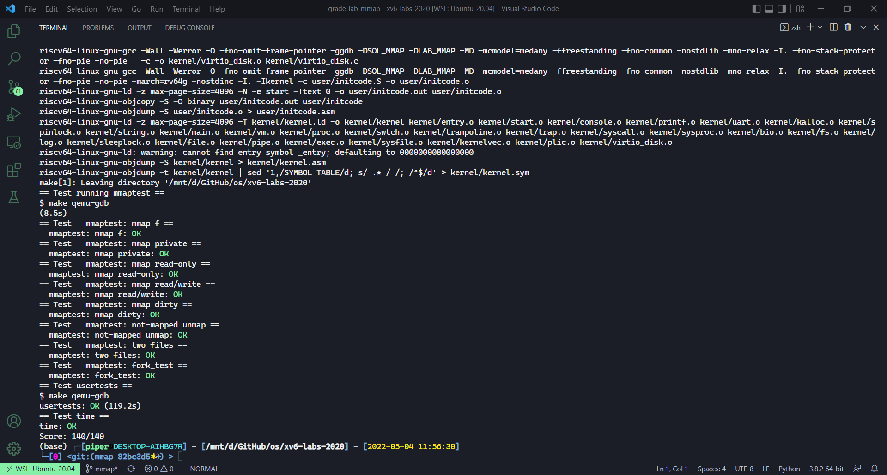

# Lab: mmap

本节作业：
- https://github.com/PiperLiu/xv6-labs-2020/tree/mmap

目录：

<!-- @import "[TOC]" {cmd="toc" depthFrom=2 depthTo=2 orderedList=false} -->

<!-- code_chunk_output -->


<!-- /code_chunk_output -->

细分目录：

<!-- @import "[TOC]" {cmd="toc" depthFrom=2 depthTo=6 orderedList=false} -->

<!-- code_chunk_output -->

- [写一个 mmap 和 munmap 系统调用](#写一个-mmap-和-munmap-系统调用)

<!-- /code_chunk_output -->

### 写一个 mmap 和 munmap 系统调用

The mmap and munmap system calls allow UNIX programs to exert detailed control over their address spaces. They can be used to share memory among processes, to map files into process address spaces, and as part of user-level page fault schemes such as the garbage-collection algorithms discussed in lecture. In this lab you'll add mmap and munmap to xv6, focusing on memory-mapped files.

The manual page (run man 2 mmap) shows this declaration for mmap:

```c
void *mmap(void *addr, size_t length, int prot, int flags,
           int fd, off_t offset);
```

mmap can be called in many ways, but this lab requires only a subset of its features relevant to memory-mapping a file. You can assume that addr will always be zero, meaning that the kernel should decide the virtual address at which to map the file. mmap returns that address, or 0xffffffffffffffff if it fails. length is the number of bytes to map; it might not be the same as the file's length. prot indicates whether the memory should be mapped readable, writeable, and/or executable; you can assume that prot is PROT_READ or PROT_WRITE or both. flags will be either MAP_SHARED, meaning that modifications to the mapped memory should be written back to the file, or MAP_PRIVATE, meaning that they should not. You don't have to implement any other bits in flags. fd is the open file descriptor of the file to map. You can assume offset is zero (it's the starting point in the file at which to map).

It's OK if processes that map the same MAP_SHARED file do not share physical pages.

`munmap(addr, length)` should remove mmap mappings in the indicated address range. If the process has modified the memory and has it mapped MAP_SHARED, the modifications should first be written to the file. An munmap call might cover only a portion of an mmap-ed region, but you can assume that it will either unmap at the start, or at the end, or the whole region (but not punch a hole in the middle of a region).

You should implement enough mmap and munmap functionality to make the mmaptest test program work. If mmaptest doesn't use a mmap feature, you don't need to implement that feature.

When you're done, you should see this output:

```bash
$ mmaptest
mmap_test starting
test mmap f
test mmap f: OK
test mmap private
test mmap private: OK
test mmap read-only
test mmap read-only: OK
test mmap read/write
test mmap read/write: OK
test mmap dirty
test mmap dirty: OK
test not-mapped unmap
test not-mapped unmap: OK
test mmap two files
test mmap two files: OK
mmap_test: ALL OK
fork_test starting
fork_test OK
mmaptest: all tests succeeded
$ usertests
usertests starting
...
ALL TESTS PASSED
$ 
```

Here are some hints:
- Start by adding _mmaptest to UPROGS, and mmap and munmap system calls, in order to get user/mmaptest.c to compile. For now, just return errors from mmap and munmap. We defined PROT_READ etc for you in kernel/fcntl.h. Run mmaptest, which will fail at the first mmap call.
- Fill in the page table lazily, in response to page faults. That is, mmap should not allocate physical memory or read the file. Instead, do that in page fault handling code in (or called by) usertrap, as in the lazy page allocation lab. The reason to be lazy is to ensure that mmap of a large file is fast, and that mmap of a file larger than physical memory is possible.
- Keep track of what mmap has mapped for each process. Define a structure corresponding to the VMA (virtual memory area) described in Lecture 15, recording the address, length, permissions, file, etc. for a virtual memory range created by mmap. Since the xv6 kernel doesn't have a memory allocator in the kernel, it's OK to declare a fixed-size array of VMAs and allocate from that array as needed. A size of 16 should be sufficient.
- Implement mmap: find an unused region in the process's address space in which to map the file, and add a VMA to the process's table of mapped regions. The VMA should contain a pointer to a struct file for the file being mapped; mmap should increase the file's reference count so that the structure doesn't disappear when the file is closed (hint: see filedup). Run mmaptest: the first mmap should succeed, but the first access to the mmap-ed memory will cause a page fault and kill mmaptest.
- Add code to cause a page-fault in a mmap-ed region to allocate a page of physical memory, read 4096 bytes of the relevant file into that page, and map it into the user address space. Read the file with readi, which takes an offset argument at which to read in the file (but you will have to lock/unlock the inode passed to readi). Don't forget to set the permissions correctly on the page. Run mmaptest; it should get to the first munmap.
- Implement munmap: find the VMA for the address range and unmap the specified pages (hint: use uvmunmap). If munmap removes all pages of a previous mmap, it should decrement the reference count of the corresponding struct file. If an unmapped page has been modified and the file is mapped MAP_SHARED, write the page back to the file. Look at filewrite for inspiration.
- Ideally your implementation would only write back MAP_SHARED pages that the program actually modified. The dirty bit (D) in the RISC-V PTE indicates whether a page has been written. However, mmaptest does not check that non-dirty pages are not written back; thus you can get away with writing pages back without looking at D bits.
- Modify exit to unmap the process's mapped regions as if munmap had been called. Run mmaptest; mmap_test should pass, but probably not fork_test.
- Modify fork to ensure that the child has the same mapped regions as the parent. Don't forget to increment the reference count for a VMA's struct file. In the page fault handler of the child, it is OK to allocate a new physical page instead of sharing a page with the parent. The latter would be cooler, but it would require more implementation work. Run mmaptest; it should pass both mmap_test and fork_test.

Run usertests to make sure everything still works.

这里主要参考了 [duguosheng](https://github.com/duguosheng/xv6-labs-2020/commit/2d951f0c95c5aa9db165bc7f749a0ebaca220c6f#diff-3e06d244cbfbd7a5db4cc7dabc8a9b07e38ef4a345687c6bce70ef4f40268a38R80) 同学的代码，实际上和 hints 都是一一对应的。

最开始，我们把 mmaptest 加入编译。

Makefile

```makefile
UPROGS=\
	...
	$U/_mmaptest\
	# 加入 mmaptest 用户命令
```

首先把系统调用的皮做了。

kernel/syscall.h

```c
#define SYS_mmap   22
#define SYS_munmap 23
```

kernel/syscall.c

```c
...
extern uint64 sys_mmap(void);
extern uint64 sys_munmap(void);

static uint64 (*syscalls[])(void) = {
...
[SYS_mmap]    sys_mmap,
[SYS_munmap]  sys_munmap,
};
```

user/user.h

```c
void* mmap(void*, int, int, int, int, int);
int munmap(void*, int);
```

user/usys.pl

```c
entry("mmap");
entry("munmap");
```

好了，开始设计系统调用。

首先是，我们需要给每个进程加入 vma 数组。

这里我们先设计最大 vma 元素数量。

kernel/fcntl.h

```c
// 每个进程最多有 16 个 VMA
#define NVMA 16
```

kernel/proc.h

```c
#include "fcntl.h"

...

// vma: virtual memory area
struct vma {
  int used;           // 是否被使用
  uint64 addr;        // 起始地址
  uint64 len;         // 长度
  int prot;           // 权限
  int flags;          // 标志位
  struct file *file;  // 对应的文件
  int offset;         // 文件偏移量
};

// Per-process state
struct proc {
  ...
  // 给 proc 加入 vma
  struct vma vma[NVMA];
};
```

为什么这里我要写上我 include 了什么？因为这个 include 把 c 非模块编译的弱点展现出来了，在之后的 vm.c 中你会发现，不像我一样新增一些看似无关的 include 头文件将会导致编译无法通过。

好了，现在是复制进程时需要复制 vma 以及退出时需要清理 vma 的代码。

kernel/proc.c

```c
// Create a new process, copying the parent.
// Sets up child kernel stack to return as if from fork() system call.
int
fork(void)
{
  ...
  // 将父进程 VMA 复制到子进程
  for (i = 0; i < NVMA; ++ i) {
    if (p->vma[i].used) {
      memmove(&np->vma[i], &p->vma[i], sizeof(p->vma[i]));
      filedup(p->vma[i].file);
    }
  }
  ...
  return pid;
}

// Exit the current process.  Does not return.
// An exited process remains in the zombie state
// until its parent calls wait().
void
exit(int status)
{
  ...
  // 将 vma 中已映射区域清空
  for (int i = 0; i < NVMA; ++ i) {
    if (p->vma[i].used) {
      if (p->vma[i].flags == MAP_SHARED && (p->vma[i].prot & PROT_WRITE) != 0)
        filewrite(p->vma[i].file, p->vma[i].addr, p->vma[i].len);
      fileclose(p->vma[i].file);
      uvmunmap(p->pagetable, p->vma[i].addr, p->vma[i].len / PGSIZE, 1);
      p->vma[i].used = 0;
    }
  }

  begin_op();
  ...
}
```

好了，进程相关的内容处理完了，这个 vma 已经融入到进程中了。接下来写系统调用。

kernel/sysfile.c

```c
#define ERRNUMBER 0xffffffffffffffff;

uint64
sys_mmap(void) {
  uint64 addr;
  int len, prot, flags, fd, offset;
  struct file *file;

  // 获取系统调用参数
  if (argaddr(0, &addr) < 0 || argint(1, &len) < 0 || argint(2, &prot) < 0
      || argint(3, &flags) < 0 || argfd(4, &fd, &file) < 0 || argint(5, &offset) < 0)
    return ERRNUMBER;
  
  // TODO: 老师只要求了做 addr == 0 ，因此这里特判一下
  if (addr != 0) return ERRNUMBER;
  // TODO: 老师只要求了做 offset == 0
  if (offset != 0) return ERRNUMBER;
  
  // len 不可以小于 0
  if (len <= 0) return ERRNUMBER;

  // 文件本身不可写，则不可以 MAP_SHARED
  if (file->writable == 0 && (prot & PROT_WRITE) != 0 && flags == MAP_SHARED)
    return ERRNUMBER;
  
  struct proc *p = myproc();
  // 所需的虚拟地址空间过大
  if (p->sz + len > MAXVA) return ERRNUMBER;

  // 给本进程添加一个 VMA
  for (int i = 0; i < NVMA; ++ i) {
    if (p->vma[i].used == 0) {
      p->vma[i].used = 1;
      // 直接将 addr 分配到 p->sz 后
      p->vma[i].addr = p->sz;
      p->vma[i].len = len;
      p->vma[i].prot = prot;
      p->vma[i].flags = flags;
      // 增加文件引用计数
      p->vma[i].file = filedup(file);
      p->vma[i].offset = offset;
      // 最后，对进程的虚拟空间扩容
      p->sz += len;
      return p->vma[i].addr;
    }
  }

  // 没找到空闲的 VMA
  return ERRNUMBER;
}

uint64
sys_munmap(void) {
  uint64 addr;
  int len, i;

  // 获取系统调用参数
  if (argaddr(0, &addr) < 0 || argint(1, &len) < 0)
    return -1;

  struct proc *p = myproc();
  // 找到符合要求的 addr
  // An munmap call might cover only a portion of an mmap-ed region,
  // but you can assume that it will either unmap at the start,
  // or at the end, or the whole region
  // (but not punch a hole in the middle of a region).
  for (i = 0; i < NVMA; ++ i) {
    if (p->vma[i].used && p->vma[i].len >= len) {
      if (p->vma[i].addr == addr) {
        p->vma[i].addr += len;  // 从 addr 开始减容 len
        p->vma[i].len -= len;
        break;  // 完成了任务，跳出
      }
      if (addr + len == p->vma[i].addr + p->vma[i].len) {
        p->vma[i].len -= len;  // 把末尾的 len 切掉
        break;  // 完成了任务，跳出
      }
    }
  }

  if (i == NVMA) return -1;

  // 若 MAP_SHARED ，将 munmap 的页面写回文件
  if (p->vma[i].flags == MAP_SHARED && (p->vma[i].prot & PROT_WRITE) != 0)
    filewrite(p->vma[i].file, addr, len);

  // 取消 [addr, addr+len] 的映射
  uvmunmap(p->pagetable, addr, len / PGSIZE, 1);

  // 若 len 为 0 ，则此 vma 无效
  if (p->vma[i].len == 0) {
    fileclose(p->vma[i].file);
    p->vma[i].used = 0;
  }

  return 0;
}
```

最后是 trap 时的逻辑：在遇到 page fault 时，我们根据 vma 为缺页分配相应文件的内容到内存。

kernel/trap.c

```c
//
// handle an interrupt, exception, or system call from user space.
// called from trampoline.S
//
void
usertrap(void)
{
  ...
  } else if (r_scause() == 13 || r_scause() == 15) {
    // 缺页是由 mmap 产生的
    // mmap 的起始地址 addr 一定是从 0 开始的，因此这里直接判断地址是否小于 p->sz
    if (PGROUNDUP(p->trapframe->sp) - 1 < r_stval() && r_stval() < p->sz) {
      if (pagefaulthandler(r_stval(), r_scause()) != 0) p->killed = 1;
    } else {
      p->killed = 1;
    }
  } else {
    ...
  usertrapret();
}
```

最后就是具体处理 page fault 的逻辑了。为了让 trap.c 能调用 vm.c 的 pagefaulthandler 。

kernel/defs.h

```c
// vm.c
...
int             pagefaulthandler(int, int);
```

kernel/vm.c

```c
// 注意新增以下头文件
// 否则编译器不认识 struct proc 和 struct file
// 而 proc.h 中没有引入头文件 spinlock.h
// 所以还得把 spinlock.h 写在前面
// sleeplock.h 于 file.h 同理
#include "fcntl.h"
#include "spinlock.h"
#include "proc.h"
#include "sleeplock.h"
#include "file.h"

...
// Remove npages of mappings starting from va. va must be
// page-aligned. The mappings must exist.
// Optionally free the physical memory.
void
uvmunmap(pagetable_t pagetable, uint64 va, uint64 npages, int do_free)
{
  uint64 a;
  pte_t *pte;

  if((va % PGSIZE) != 0)
    panic("uvmunmap: not aligned");

  for(a = va; a < va + npages*PGSIZE; a += PGSIZE){
    if((pte = walk(pagetable, a, 0)) == 0)
      panic("uvmunmap: walk");
    if((*pte & PTE_V) == 0)
      // panic("uvmunmap: not mapped");
      continue;  // 考虑到 lazy allocation
    if(PTE_FLAGS(*pte) == PTE_V)
      panic("uvmunmap: not a leaf");
    if(do_free){
      uint64 pa = PTE2PA(*pte);
      kfree((void*)pa);
    }
    *pte = 0;
  }
}

// Given a parent process's page table, copy
// its memory into a child's page table.
// Copies both the page table and the
// physical memory.
// returns 0 on success, -1 on failure.
// frees any allocated pages on failure.
int
uvmcopy(pagetable_t old, pagetable_t new, uint64 sz)
{
  pte_t *pte;
  uint64 pa, i;
  uint flags;
  char *mem;

  for(i = 0; i < sz; i += PGSIZE){
    if((pte = walk(old, i, 0)) == 0)
      panic("uvmcopy: pte should exist");
    if((*pte & PTE_V) == 0)
      // panic("uvmcopy: page not present");
      continue;
    pa = PTE2PA(*pte);
    flags = PTE_FLAGS(*pte);
    if((mem = kalloc()) == 0)
      goto err;
    memmove(mem, (char*)pa, PGSIZE);
    if(mappages(new, i, PGSIZE, (uint64)mem, flags) != 0){
      kfree(mem);
      goto err;
    }
  }
  return 0;

 err:
  uvmunmap(new, 0, i / PGSIZE, 1);
  return -1;
}

int
pagefaulthandler(int va, int cause) {
  int i, flags, offset;
  char *pa;
  struct proc* p = myproc();

  // 寻找 VMA
  for (i = 0; i < NVMA; ++ i)
    if (p->vma[i].used && p->vma[i].addr <= va && va <= p->vma[i].addr + p->vma[i].len - 1)
      break;
  if (i == NVMA)
    return -1;

  // 现在要分配新页，因此需要建立 flags
  flags = PTE_U;
  if (p->vma[i].prot & PROT_READ) flags |= PTE_R;
  if (p->vma[i].prot & PROT_WRITE) flags |= PTE_W;
  if (p->vma[i].prot & PROT_EXEC) flags |= PTE_X;

  // 如果是读导致的 page fault
  if (cause == 13 && p->vma[i].file->readable == 0) return -1;
  // 如果是写导致的 page fault
  if (cause == 15 && p->vma[i].file->writable == 0) return -1;

  if ((pa = kalloc()) == 0)
    return -1;
  memset(pa, 0, PGSIZE);

  // 把 inode 锁住
  ilock(p->vma[i].file->ip);
  // 文件的 offset
  // 我们的题目中假设 mmap 的 addr 和 offset 总是 0
  // 因此计算文件的 offset 只需要用 va - p->vma[i].addr 计算比基准偏移了多少
  offset = p->vma[i].offset + PGROUNDDOWN(va - p->vma[i].addr);
  // 从文件上把 offset 后的一页读取到内存里
  if (readi(p->vma[i].file->ip, 0, (uint64)pa, offset, PGSIZE) == 0) {
    iunlock(p->vma[i].file->ip);
    kfree(pa);
    return -1;
  }
  iunlock(p->vma[i].file->ip);

  // 添加页面映射
  if (mappages(p->pagetable, PGROUNDDOWN(va), PGSIZE, (uint64)pa, flags) != 0) {
    kfree(pa);
    return -1;
  }

  return 0;
}
```


