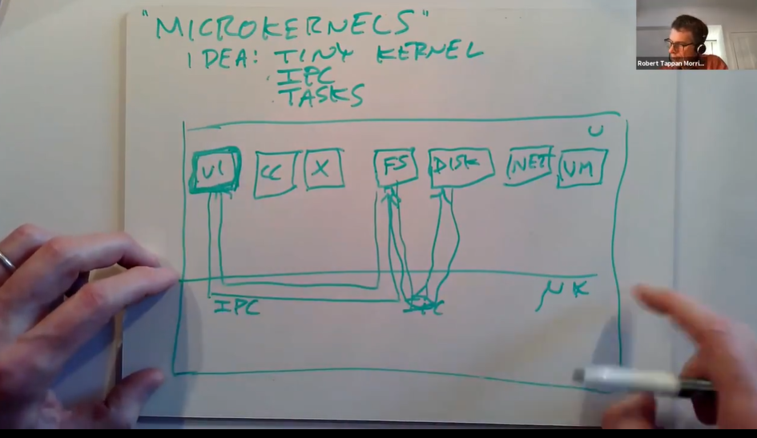
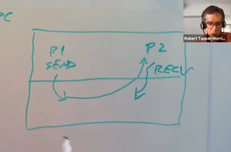
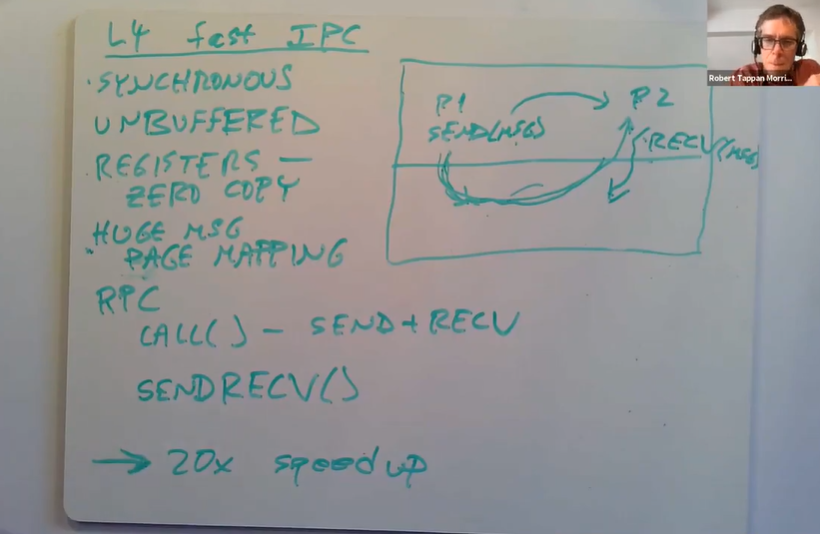
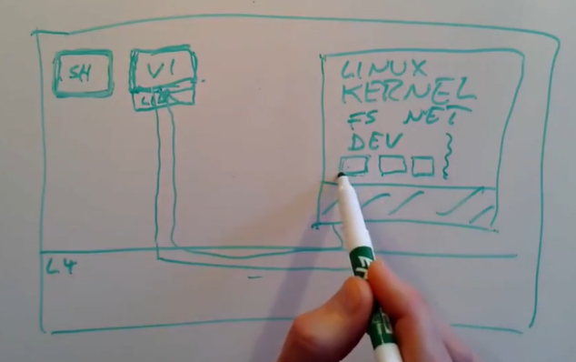
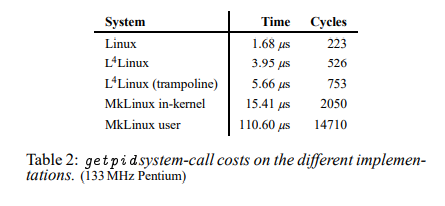
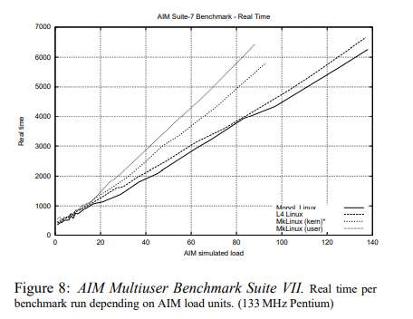

# LEC 18 (rtm): OS Organization

笔记大量参考了[肖宏辉](https://www.zhihu.com/people/xiao-hong-hui-15)大佬的翻译。

目录：

<!-- @import "[TOC]" {cmd="toc" depthFrom=2 depthTo=2 orderedList=false} -->

<!-- code_chunk_output -->

- [抽象能力强大的 Monolithic Kernel 宏内核](#抽象能力强大的-monolithic-kernel-宏内核)
- [Micro kernel 微内核](#micro-kernel-微内核)
- [L4 micro kernel](#l4-micro-kernel)

<!-- /code_chunk_output -->

细分目录：

<!-- @import "[TOC]" {cmd="toc" depthFrom=2 depthTo=6 orderedList=false} -->

<!-- code_chunk_output -->

- [抽象能力强大的 Monolithic Kernel 宏内核](#抽象能力强大的-monolithic-kernel-宏内核)
  - [宏内核好处](#宏内核好处)
  - [宏内核劣势](#宏内核劣势)
- [Micro kernel 微内核](#micro-kernel-微内核)
  - [微内核的核心就是实现了IPC](#微内核的核心就是实现了ipc)
  - [micro kernel 使用动机](#micro-kernel-使用动机)
  - [micro kernel 内核面临挑战](#micro-kernel-内核面临挑战)
- [L4 micro kernel](#l4-micro-kernel)
  - [L4 的系统调用](#l4-的系统调用)
  - [L4提供的线程切换与 Pager](#l4提供的线程切换与-pager)
  - [Improving IPC by Kernel Design](#improving-ipc-by-kernel-design)
    - [基于 Unix Pipe 异步传输（较慢）](#基于-unix-pipe-异步传输较慢)
    - [L4 采用的 Synchronized 同步传输（简单快速）](#l4-采用的-synchronized-同步传输简单快速)
  - [Run Linux on Top of L4 Micro Kernel](#run-linux-on-top-of-l4-micro-kernel)
  - [L4 Linux 性能分析](#l4-linux-性能分析)

<!-- /code_chunk_output -->

## 抽象能力强大的 Monolithic Kernel 宏内核

今天我主要会讨论微内核（Mircro kernel）。

我们来看一下为什么人们会研究微内核？微内核是人们在思考操作系统内核应该做什么事情的过程中设计出来的。比如说XV6是一个Unix系统，它按照Unix风格提供了各种功能，并提供了Unix系统调用。实现一个Unix系统就是我们设计XV6的目标。但是一个完全值得思考的问题是，一个操作系统内核本身应该具备什么功能？或许XV6和Linux具备的功能并不是一个完美操作系统应该有的功能，又或许是呢。我们现在正在讨论一个变化莫测的问题，内核可以看做是一种程序员的开发平台，而我们知道不同的程序员对于他们喜欢的开发平台有着非常不同的主观喜好，所以我们不能期望这个问题有一个完美的答案。但是我们可以仍然可以期望从思考这个问题的过程中学到一些东西，并且尝试想一下答案可能是什么。

### 宏内核好处

首先，让我说明一下操作系统的传统实现方式以及应该具备的功能。我个人将Linux，Unix，XV6称为用传统方式实现的操作系统。另一个形容这些操作系统的词是monolithic。monolithic的意思是指操作系统内核是一个完成了各种事情的大的程序。实际上，这也反应了人们觉得内核应该具备什么样的功能。类似于Linux的典型操作系统内核提供了功能强大的抽象。它们选择提供例如文件系统这样一个极其复杂的组件，并且将文件，目录，文件描述符作为文件系统的接口，而不是直接将磁盘硬件作为接口暴露给应用程序。monolithic kernel通常拥有例如文件系统这样强大的抽象概念，这比提供一些简单的抽象有着巨大的优势。
- 其中一个好处是，这些高度抽象的接口通常是可移植的，你可以在各种各样的存储上实现文件和目录，你可以使用文件和目录而不用担心它们是运行在什么牌子的磁盘，什么类型的存储之上，或许是SSD，或许是HDD，或许是NFS，但是因为文件系统接口是高度抽象的，所以它们都拥有相同的接口。所以这里的一个好处是可以获取可移植性。你可以在不修改应用程序的前提下，将其运行在各种各样的硬件之上。
- 另一个例子是，Linux/Unix提供地址空间的抽象而不是直接访问MMU硬件的权限。这不仅可以提供可移植性，并且也可以向应用程序隐藏复杂性。所以操作系统具备强大抽象的另一个好处是，它们可以向应用程序隐藏复杂性。举个例子，XV6提供的文件描述符非常简单，你只需要对文件描述符调用read/write就可以，但是在XV6内核中是非常复杂的代码来实现读写磁盘上的文件系统。这对于程序员是极好的，但是内核却因此变得又大又复杂。
- 这里的强大的抽象还可以帮助管理共享资源。例如我们将内存管理委托给了内核，内核会跟踪哪些内存是空闲的。类似的，内核还会跟踪磁盘的哪个部分是空闲的，磁盘的哪个部分正在被使用，这样应用程序就不用考虑这些问题，所以这可以帮助简化应用程序。同时也可以提供健壮性和安全性，因为如果允许应用程序决定磁盘的某个位置是否是空闲的，那么应用程序或许可以使用一个已经被其他应用程序使用的磁盘位置。所以，内核管理硬件资源可以提供资源共享能力和安全性。但是同样的，这也使得内核变得更大。内核提供的这些诱人的抽象能力，使得内核包含了很多的复杂性，进而导致内核很大且复杂。
- 有关monolithic kernel的另一个好处是，因为所有这些功能都在一个程序里面，所有的内核子系统，例如文件系统，内存分配，调度器，虚拟内存系统都是集成在一个巨大的程序中的一个部分，这意味着它们可以访问彼此的数据结构，进而使得依赖多个子系统的工具更容易实现。举个例子，exec系统调用依赖文件系统，因为它要从磁盘中读取二进制文件并加载到内存中，同时它也依赖内存分配和虚拟内存系统，因为它需要设置好新的进程的地址空间，但是它的实现是相对简单的。在XV6或者Linux中做到这些完全没问题，因为这些操作系统已经在内核程序中包含了文件系统和虚拟内存系统。但是如果严格分隔了文件系统和虚拟内存系统，那么实现类似exec的系统调用将会难得多。在一个monolithic操作系统中，因为本身就是一个大的程序，实现起来会容易的多。
- 另一个使得类似于XV6或者Linux的操作系统中可以更简单实现软件的原因是，内核的所有代码都以完整的硬件权限在运行。举个例子，整个XV6都运行在Supervisor mode，这意味着你可以读写任意内存地址，并且所有的内核代码都以最大的权限在运行。Linux操作系统也是这样。

### 宏内核劣势

所以，monolithic kernel这种设计策略对于内核开发人员来说非常方便，并且也更容易构建更强大的抽象，进而对于应用程序开发人员来说也更容易。然而，对于传统的monolithic kernel，也有一些缺点。这也是之所以会出现其他内核架构，比如说微内核的原因。所以这里的问题是，为什么不在所有的场合使用monolithic kernel呢？

- 第一个原因是它们大且复杂。取决于你怎么计算，Linux总是有数十万到数百万行代码。Linux的一部分可以查看Linux的另一个部分的数据，的确使得编程更加容易，但是同样也使得内部代码有大量的交互和依赖。有的时候查看并弄明白Linux代码会有点挑战。任何时候你有了一个大的程序，尤其它们还具有复杂的结构，你都会有Bug，操作系统内核也不例外。在这些年，内核有过各种各样的Bug，包括了安全性相关的Bug。所以这是一个令人烦恼的关系图，如果你使用了大的内核，你不可避免的会遇到Bug和安全漏洞。
- 另一个人们不喜欢monolithic kernel的原因是，随着时间的推移，它们倾向于发展成拥有所有的功能。Linux应用在各种场合中，从移动电话到桌面工作站，从笔记本电脑到平板电脑，从服务器到路由器。Linux可以支持这么多设备是极好的，但是这也使得Linux非常的通用，所以Linux支持了很多很多不同的东西。而任何一个应用程序，例如我的web server程序不太会需要用到Linux中非常复杂的声卡支持。所以，Linux中包含了大量的内容使得它很通用，这很好，但是另一方面，通用就意味着慢。对于各种不同的场景都能支持，或许就不能对某些特定场景进行优化。当你尝试快速运行一些程序时，如果程序只做一两件事情是极好的，因为这样你就可以专注在优化一两个代码路径上。但是如果你的程序想要做上千件事情，优化会更加难。Linux并不一定慢，但是你或许会想，它真的在所有场景下都达到了最快速度吗？如果你去看Linux或者XV6中的任何模块，你或许会想它们真的有必要去做所有的事情吗？例如，你从一个进程向一个Pipe写一个字节传输到另一个进程，即使在XV6这样一个简单的内核中，都有大量的指令需要被执行。这里有buffering，locking，或许在Pipe的读写中有sleep/wakeup，或许有线程调度导致context switching，对于从一个进程移动一个字节到另一个进程来说，这里有大量的内容或许并不是必须的。
- 对于monolithic kernel来说，另一个潜在的问题是，因为它们是如此之大，它们会削弱一些复杂的抽象能力。在内核中会有大量的设计考虑，应用程序需要遵守这些设计并与之共存。反之，在一个理想世界中，应用程序或许可以做更多的决定。举个例子，在Unix中，你可以wait子进程，比如说你fork出来的子进程，但是你不能wait其他进程，或许你会想要wait孙子进程或者一个不相关的进程，但是这是不可能的。或许你会想要更改其他进程的地址空间，比如说替其它受你控制的进程调用mmap，但是这也不可能。mmap只能修改你自己的地址空间，但是不能修改其他进程的地址空间。 **或许你是个数据库，你在磁盘上有B树索引，你或许知道很多快速展开B树的方法，但是当你读写文件系统中的文件时，文件系统并不知道你正在读写一个B树，以及如何更快的在磁盘上展开B树。所以如果你是个数据库的话，你或许很高兴文件系统可以任你摆布，但是文件系统并不会按照你想要的方式工作。以上就是内核中需要考虑的设计。**
- monolithic kernel的最后一个问题是，可扩展性（Extensibility）。应用程序或许想要实时更改内核，比如说向内核下载代码并更改内核的工作方式，这样数据库或许就可以更改数据在磁盘上的分布方式。至少在10年前，monolithic kernel没有任何功能可以支持这里的Extensibility，你只能使用内核提供的能力。

以上就是人们认为的monolithic kernel的问题。这些问题使得人们去思考操作系统的其他架构。这里有很多不同的想法，其中一些想法非常的激进，我们今天只会讨论其中的一种，也是现在非常流行的一种，这就是微内核，Micro kernel。

## Micro kernel 微内核

有关微内核的很多思想可以回溯到计算机的发展历史中。微内核从1980年代中后期开始就是一个非常热门的研究课题，它是指一种通用的方法或者概念，它并不特指任何特定的产品。有很多人遵循微内核的设计思想并构建了操作系统，但是这些项目中的每一个具体的操作系统都与另一个非常不一样。

### 微内核的核心就是实现了IPC

微内核的核心就是实现了IPC（Inter-Process Communication）以及线程和任务的tiny kernel。所以微内核只提供了进程抽象和通过IPC进程间通信的方式，除此之外别无他物。任何你想要做的事情，例如文件系统，你都会通过一个用户空间进程来实现，完全不会在内核中实现。

画个图来展示一下，整个计算机还是分为两层，下面是kernel，上面是用户空间。在用户空间或许还是会有各种各样常见的程序，例如VI，CC，桌面系统。除此之外，在用户空间还会有文件系统以及知道如何与磁盘交互的磁盘驱动，或许我们还会有一个知道如何进行TCP通信的网络协议栈，或许还有一个可以实现酷炫虚拟内存技巧的虚拟内存系统。

当文本编辑器VI需要读取一个文件时，它需要与文件系统进行交互，所以它通过IPC会发送一条消息到文件系统进程。文件系统进程中包含了所有的文件系统代码，它知道文件，目录的信息。文件系统进程需要与磁盘交互，所以它会发送另一个IPC到磁盘驱动程序。磁盘驱动程序再与磁盘硬件进行交互，之后磁盘驱动会返回一个磁盘块给文件系统。之后文件系统再将VI请求的数据通过IPC返回给VI。

这里需要注意的关键信息是，在内核中唯一需要做的是支持进程/任务/线程，以及支持IPC来作为消息的传递途径，除此之外，内核不用做任何事情。 **内核中没有任何文件系统，没有任何设备驱动，没有网络协议栈，所有这些东西以普通用户进程在运行。所以这提供给你一种非常小的内核，以及相对少的代码去优化，你可以优化IPC，除此之外也没有别的东西了。** 上图就是我们在这节课剩下的时间要讨论的内容。

在今天仍然有使用微内核的场景。实际上，[今天论文](../lec/microkernel.pdf)要讨论的L4微内核就有很多很多的运行实例，它用在很多手机中用来控制手机的射频， **在最近的iphone中的一个旁路处理器中，也使用了L4微内核来隐藏加密密钥。所以在一些微型嵌入式系统中，微内核能够胜出，比如说在一些专门为某种功能设计的计算机中，你需要使用某种操作系统，而你又不需要Linux带来的复杂性。**

微内核中的用户进程通过IPC通信，这在很多操作系统都存在。例如我现在运行的macOS，它就是一个普通的monolithic kernel，它也很好的支持用户进程通过IPC进行通信。所以用户进程通过内核内的IPC相互通信，这是一个成功的思想并且被广泛采用。

以上就是微内核的基本架构，我接下来会讨论一下这个架构的优势。

### micro kernel 使用动机

人们构建微内核的动机是什么？

其中一个动机你可能不常看到，这就是审美（注，原话是sense of aesthetic）。我认为很多人都觉得像Linux内核这样大的复杂的程序并不十分优雅。我们肯定可以构建一些小得多且专注的多的设计，而不是这样一个巨大的拥有各种随机特性的集合体。所以从审美角度来说，我们必然可以做的比大的内核更好。

其他还有一些更具体且可量化的动机。
- 更小的内核或许会更加的安全。只有几行代码的话，Bug也不会太多，其他人利用Bug来破坏安全性的可能也就更小。
- 在特殊场景下，你需要证明一个操作系统是正确的，没有Bug，并且只做了它应该做的事情。现实中至少有一种经过验证是安全的微内核系统：seL4。这是L4微内核的多个衍生项目之一。人们知道怎么去验证中小型程序，但是不知道怎么验证巨大的程序。微内核通常都很小，这是它能够被证明是安全的一个关键因素。
- 小内核的另一个优势是，少量代码的程序比巨大的程序更容易被优化。
- 小内核可能会运行的更快，你不用为一些用不上的很多功能付出代价。相比monolithic kernel，微内核几乎不会做任何事情，所以你不用为你不使用的很多功能付出代价。
- 使用小内核的另一个原因是，小内核或许自带了少得多的设计限制，进而使得应用程序的设计限制也更少。这样给应用程序提供了更多的灵活性，使得应用程序可以自己做出设计决定。

以上都不是微内核必须要支持的特性，只是说人们期望通过使用微内核可以得到的特性。
- 另一个微内核吸引人的原因是，有很多我们习惯了位于内核的功能和函数，现在都运行在用户空间。这种将内核拆分，并在用户空间的不同部分运行，比如说在用户空间运行文件系统服务，可以使得代码更模块化。
- 用户空间代码通常会比内核更容易被修改，调整和替换，所以它更容易被定制化。
- 将操作系统放在用户空间，或许可以使得它更加的健壮。如果内核出错了，通常你需要panic并重启，因为如果内核有Bug，并且会随机更改数据，那就不能信任内核了。然而，如果你将内核运行成一些用户空间的服务，其中一个出现故障，比如说除以0，索引了一个野指针，或许只有这一个服务会崩溃，操作系统的剩余部分还是完好的，这样你可以只重启那一个服务。所以，将操作系统的功能移到用户进程可以使得系统更加健壮。这对于驱动来说尤其明显，内核中大部分Bug都在硬件驱动中，如果我们能将设备驱动从内核中移出的话，那么内核中可能会有少的多的Bug和Crash。
- 最后一个优势是，你可以在微内核上模拟或者运行多个操作系统。所以尽管微内核几乎不做任何事情，你还是可以在它之上运行一个Unix系统之类的，或许还可以在同一个机器上运行超过一个操作系统。今天的论文主要就是描述如何在微内核之上将Linux作为服务来运行。

以上就是人们在微内核这条道路上期望得到的一些好处。

### micro kernel 内核面临挑战

当然，这里也有一些挑战。
- 如果你想要设计属于你自己的微内核，其中一个挑战是你会想要你的微内核的系统调用接口尽可能的简单，因为使用微内核的出发点就是内核很小。那么什么才是有用的系统调用的最小集？这一点并不十分明确。所以这里我们要确定最少的系统调用API，你需要这些系统调用API尽可能的少，但是你又需要基于这些API构建一些非常复杂的功能，因为即使内核没有做太多工作，你最终还是要运行程序。或许你想要在微内核之上运行Unix，你需要能执行类似fork，mmap的工作。所以底层的系统调用在简单的同时，需要能够足够强大以支持人们需要做的各种事情，比如说exec，fork，copy-on-write fork，mmap file。
- 但是内核又完全不知道文件和文件系统。所以现在系统调用需要支持exec，而内核又不知道文件。微内核或许会非常简单，但是我们仍然需要开发一些用户空间服务来实现操作系统的其他部分。
- 最后，微内核的设计需要进程间通过IPC有大量的通信。所以有很大的需求使得IPC能够足够的快。我们会好奇，IPC可以足够的快来使得微内核足够有竞争力吗？
- 有关性能，不仅与IPC的速度相关。通常来说，monolithic kernel可以获得更好的性能，是因为它里面的文件系统代码和与虚拟内存代码可以直接交互，它们开心地位于一个巨大的程序中。但是如果你需要将这些模块都拆分开成为不同的服务，那么在集成的时候就有更少的机会可以优化，这或许会影响性能。

## L4 micro kernel

今天要讨论的论文，有许多有关L4微内核的内容。这是今天论文作者开发和使用的一种微内核。L4必然不是最早的微内核，但是从1980年代开始，它是最早一批可以工作的微内核之一，并且它非常能展现微内核是如何工作的。在许多年里面它一直都有活跃的开发和演进。如果你查看Wikipedia，L4有15-20个变种，有一些从1980年代开始开发的项目现在还存在。接下来我将从我的理解向你们解释L4在今天的论文发表的时候是如何工作的。

首先，L4是微内核，它只有7个系统调用，虽然其中有一些稍微有点复杂，但是它还是只有7个系统调用。然而现在的Linux，我上次数了下有大概350个系统调用。甚至XV6这个极其简单的内核，也有21个系统调用。从这个指标来看，L4更加简单。

其次，L4并不大，论文发表的时候，它只有13000行代码，这并不多。XV6的代码更少，我认为XV6内核只有6000-7000行代码，所以作为内核XV6非常的简单。L4也没有复杂太多，它只有Linux代码的几十分之一，所以它非常的小。

第三，它只包含几个非常基础的抽象。

它在内部有一个叫做Task或者地址空间的概念，这或多或少的对应了Uinx内的进程概念。Task包含了一些内存，地址从0开始，并且可以像进程一样执行指令。区别于XV6的是，每个Task可以有多个线程，L4会调度每个Task内的多个线程的执行。这样设计的原因是，可以非常方便的用线程来作为组织程序结构的工具。我不知道在论文发表的时候，L4是否支持了多处理器，或许它包含了在多个处理器上运行同一个程序的能力。所以L4内核知道Task，知道线程，也知道地址空间，这样你就可以告诉L4如何映射地址空间内的内存Page。

另一个L4知道的事情是IPC。每一个线程都有一个标识符，其中一个线程可以说，我想要向拥有这个标识符的另一个线程发送几个字节。
这里的Task，线程，地址空间，IPC是L4唯一有的抽象。

### L4 的系统调用

我不确定是否能列出所有的系统调用，这里涉及到的系统调用有：
- Threadcreate系统调用，你提供一个地址空间ID并要求创建一个新的线程。如果地址空间或者Task不存在，系统调用会创建一个新的Task。所以这个系统调用即可以创建线程，又可以创建Task。
- Send/Recv IPC系统调用。
- Mapping系统调动可以映射内存Page到当前Task或者其他Task的地址空间中。你可以要求L4来改变当前Task的地址空间和Page Table，如果你有足够的权限，你也可以要求L4改变其他Task的地址空间。这实际上是通过IPC完成的，你会发送一个特殊的IPC消息到目标线程，内核可以识别这个IPC消息，并会修改目标线程的地址空间。如果你创建一个先的线程，新线程最开始没有任何内存。所以如果你想创建一个线程，你先调用Threadcreate系统调用来创建新的线程，新的Task和地址空间。然后你创建一个特殊 IPC，将你自己内存中的一部分，其中包含了指令和数据，映射到新的Task的地址空间中。之后你再发送一个特殊的Start IPC消息到这个新的Task，其中包含了你期望新的Task开始执行程序的程序计数器和Stack Pointer。之后新的Task会在你设置好的内存中，从你要求的程序计数器位置开始执行。
- 虽然我不知道具体是怎么实现的，但是Privileged Task可以将硬件控制寄存器映射到自己的地址空间中。所以L4并不知道例如磁盘或者网卡的设备信息，但是实现了设备驱动的用户空间软件可以直接访问设备硬件。
- 你可以设置L4将任何一个设备的中断转换成IPC消息。这样，运行设备驱动的Task不仅可以读写了设备，并且也可以设置L4将特定设备的中断通过IPC消息发送给自己。
- 最后，一个Task可以设置L4内核通知自己有关另一个Task的Page Fault。所以如果一个Task发生了Page Fault，L4会将Page Fault转换成一个IPC消息，并发送给另一个指定的Pager Task。每一个Task都有个与之关联的Pager Task用来处理自己相关的Page Fault。这就是关联到Page Fault的方法，通过它可以实现类似copy-on-write fork或者lazy allocation。

以上就是内核的内容，L4里面不包含其他的功能，没有文件系统，没有fork/exec系统调用，除了这里非常简单的IPC之外，没有其他例如pipe的通信机制，没有设备驱动，没有网络的支持等等。任何其他你想要的功能，你需要以用户空间进程的方式提供。

### L4提供的线程切换与 Pager

L4能提供的一件事情是完成线程间切换。L4会完成线程调度和context switch，来让多个线程共用一个CPU。它实现的方式你会觉得非常熟悉，L4会为每个Task保存寄存器，当它执行一个线程时，它会跳到用户空间，切换到那个线程对应Task的Page Table，之后那个线程会在用户空间执行一会。之后或许会有一个定时器中断，定时器是L4知道的一个设备，定时器中断会使代码执行返回到L4内核，L4会保存线程的用户寄存器，然后在一个类似于XV6的线程调度循环中，选择一个Task来运行。通过将这个Task之前保存的寄存器恢复出来，切换Page Table，就可以跳转到Task中再运行一会，直到再发生另一个定时中断，或者当前Task出让了CPU。所以我认为L4或许还有一个yield系统调用。在这种情况下Task可以等待接收一个IPC消息，这时代码会跳转回L4内核，L4内核会保存寄存器，并切换到一个新的Task。所以L4中有关线程切换的部分你们会非常熟悉。

**我之前提到过这个概念，Pager。如果一个进程触发了Page Fault，通过trap走到了内核，内核会将Page Fault转换成IPC消息并发送到指定的Pager Task，并告诉Pager Task是哪个线程的哪个地址触发了Page Fault。在Pager Task中，如果它实现了lazy allocation，那么它会负责从L4分配一些内存，向触发Page Fault的Task发送一个特殊的IPC，来恢复程序的运行。所以Pager Task实现了XV6或者Linux在Page Fault Handler中实现的所有功能。** 如果你想的话，你可以在Pager Task中实现copy-on-write fork或者memory mapped files，Pager Task可以实现基于Page Fault的各种技巧。

这是类似L4的微内核相比传统的内核，对于用户程序要灵活的多的众多例子之一。如果Linux并没有copy-on-write fork，并且你想要有这个功能，你不可能在不修改内核的前提下完成这个功能。Linux中没有办法写一些可移植的用户空间代码来实现copy-on-write fork。这样描述可能并不完全正确，但是一定要这么做的话会很复杂。然而，在L4里面，这就相对简单了。L4就好像是完全设计成让你去写用户空间代码来获取Page Fault，并实现copy-on-write fork。所有这些都可以在用户空间完成，而不用弄乱内核。

- 学生提问：能说明一下Task和线程之间的区别吗？
- Robert教授：可以。一个Task就像XV6的一个进程一样，它有一些内存，一个地址空间，你可以在其中运行用户代码。如果你在XV6中有一个进程，它只能包含一个线程。但是在现代的操作系统和L4中，在一个进程，一个地址空间中，可以有多个线程。如果你有多个CPU核，那么多个CPU核可以同时运行一个Task。每个线程在Task的地址空间中都有一个设置好的Stack，这意味着你可以写一个程序，并通过并行运行在多个CPU核上得到性能的提升，其中的每个线程都运行在不同的CPU核上。

所以你们可以看到，这里的设计非常依赖IPC，因为如果你想与你的文件系统交互，文件系统想要与设备驱动交互，你都需要来回发送IPC消息。对于每个系统调用，每个Page Fault，每个设备中断，都会有反复的IPC消息。所以IPC系统需要非常快。

### Improving IPC by Kernel Design

#### 基于 Unix Pipe 异步传输（较慢）

接下来我们讨论微内核里面一个非常重要的问题：IPC的速度。首先让我展示一个非常简单，但是也非常慢的设计。这个设计基于Unix Pipe。我之所以介绍这种方法，是因为一些早期的微内核以一种类似的方式实现的IPC，而这种方式实际上很慢。

假设我们有两个进程，P1和P2，P1想要给P2发送消息。这里该怎么工作呢？一种可能是使用send系统调用，传入你想将消息发送到的线程的ID，以及你想发送消息的指针。这个系统调用会跳到内核中，假设我们是基于XV6的pipe来实现，那么这里会有一个缓存。或许P2正在做一些其他的事情，并没有准备好处理P1的消息，所以消息会被先送到内核的缓存中。所以当你调用send系统调用，它会将你的消息追加到一个缓存中等待P2来接收它。在实际中，几乎很少情况你会只想要发送一个消息，你几乎总是想要能再得到一个回复。所以P1在调用完send系统调用之后，会立即调用recv来获取回复。但是现在让我们先假设我们发送的就是单向的IPC消息，send会将你的消息追加到位于内核的缓存中，我们需要从用户空间将消息逐字节的拷贝到内核的缓存中。之后再返回，这样P1可以做一些其他的事情，或许是做好准备去接受回复消息。

过了一会，P2可以接收消息了，它会调用recv系统调用，这个系统调用会返回发送消息线程的ID，并将消息从内核拷贝到P2的内存中。所以这里会从内核缓存中取出最前的消息，并拷贝到P2的内存中，之后再返回。

这种方式被称为异步传输，因为P1发完消息之后，只是向缓存队列中追加了一条消息，并没有做任何等待就返回了。同时这样的系统这也被称作是buffered system，因为内核在发送消息时将每条消息都拷贝到了内部的缓存中，之后当接收消息时，又从buffer中将消息拷贝到了目标线程。所以这种方法是异步buffered。

如果P1要完成一次完整的消息发送和接收，那么可以假设有两个buffer，一个用来发送消息，一个用来接收消息。P1会先调用send，send返回之后。之后P1会立即调用recv，recv会等待接收消息的buffer出现数据，所以P1会出让CPU。在一个单CPU的系统中，只有当P1出让了CPU，P2才可以运行。论文中的讨论是基于单CPU系统，所以P1先执行，之后P1不再执行，出让CPU并等待回复消息。这时，P2才会被调度，之后P2调用recv，拷贝消息。之后P2自己再调用send将回复消息追加到buffer，之后P2的send系统调用返回。假设在某个时间，或许因为定时器中断触发导致P2出让CPU，这时P1可以恢复运行，内核发现在接收消息buffer有了一条消息，会返回到用户空间的P1进程。

这意味着在这个慢的设计中，为了让消息能够发送和回复，将要包含：
- 4个系统调用，两个send，两个recv
- 对应8次用户空间内核空间之间的切换，而每一次切换明显都会很慢
- 在recv的时候，需要通过sleep来等待数据出现
- 并且需要至少一次线程调度和context switching来从P1切换到P2

**每一次用户空间和内核空间之间的切换和context switching都很费时，因为每次切换，都需要切换Page Table，进而清空TLB，也就是虚拟内存的查找缓存，这些操作很费时。** 所以这是一种非常慢的实现方式，它包含了大量的用户空间和内核空间之间的切换、消息的拷贝、缓存的分配等等。 **实际中，对于这里的场景：发送一个消息并期待收到回复，你可以抛开这种方法并获得简单的多的设计，L4就是采用了后者。**

#### L4 采用的 Synchronized 同步传输（简单快速）

有关简单的设计在一篇著名的论文中有提到，论文是[Improving IPC by Kernel Design]()，这篇论文在今天要讨论的论文前几年发布。相比上面的慢设计，它有几点不同：
- 其中一点是，它是同步的（Synchronized）。所以这里不会丢下消息并等待另一个进程去获取消息，这里的send会等待消息被接收，并且recv会等待回复消息被发送。如果我是进程P1，我想要发送消息，我会调用send。send并不会拷贝我的消息到内核的缓存中，P1的send会等待P2调用recv。P2要么已经在内核中等待接收消息，要么P1的send就要等P2下一次调用recv。当P1和P2都到达了内核中，也就是P1因为调用send进入内核，P2因为调用recv进入内核，这时才会发生一些事情。这种方式快的一个原因是，如果P2已经在recv中，P1在内核中执行send可以直接跳回到P2的用户空间，从P2的角度来看，就像是从recv中返回一样，这样就不需要context switching或者线程调度。相比保存寄存器，出让CPU，通过线程调度找到一个新的进程来运行，这是一种快得多的方式。P1的send知道有一个正在等待的recv，它会立即跳转到P2，就像P2从自己的recv系统调用返回一样。这种方式也被称为unbuffered。它不需要buffer一部分原因是因为它是同步的。
- 当send和recv都在内核中时，内核可以直接将消息从用户空间P1拷贝到用户空间P2，而不用先拷贝到内核中，再从内核中拷出来。因为现在消息收发的两端都在等待另一端系统调用，这意味着它们消息收发两端的指针都是确定的。recv会指定它想要消息被投递的位置，所以在这个时间点，我们知道两端的数据内存地址，内核可以直接拷贝消息，而不是需要先拷贝到内核。
- 如果消息超级小，比如说只有几十个字节，它可以在寄存器中传递，而不需要拷贝，你可以称之为Zero Copy。前面说过，发送方只会在P2进入到recv时继续执行，之后发送方P1会直接跳转到P2进程中。从P1进入到内核的过程中保存P1的用户寄存器，这意味着，如果P1要发送的消息很短，它可以将消息存放到特定的寄存器中。当内核返回到P2进程的用户空间时，会恢复保存了的寄存器，这意味着当内核从recv系统调用返回时，特定寄存器的内容就是消息的内容，因此完全不需要从内存拷贝到内存，也不需要移动数据，消息就存放在寄存器中，可以非常快的访问到。当然，这只对短的消息生效。
- 对于非常长的消息，L4可以在一个IPC消息中携带一个Page映射，所以对于巨大的消息，比如说从一个文件读取数据，你可以发送一个物理内存Page，这个Page会被再次映射到目标Task地址空间，这里也没有拷贝。这里提供的是共享Page的权限。所以短的消息很快，非常长的消息也非常快。对于长的消息，你需要调整目的Task的Page Table，但是这仍然比拷贝快的多。

- 最后一个L4使用的技巧是，如果它发现这是个RPC，有request和response，并且有非常标准的系统调用包括了send和recv，你或许会结合这两个系统调用，以减少用户态和内核态的切换。所以对于RPC这种特别的场景，同时也是人们使用IPC的一个常见场景，有一个call系统调用，它基本上结合了send和recv，区别是这里不会像两个独立的系统调用一样，先返回到用户空间，再次进入到内核空间。在消息的接收端，会有一个sendrecv系统调用将回复发出，之后等待来自任何人的request消息。这里基本是发送一个回复再加上等待接收下一个request，这样可以减少一半的内核态和用户态切换。

实际中，所有的这些优化，对于短的RPC请求这样一个典型的场景，可以导致20倍速度的提升。这是论文中给出的对比之前慢设计提升的性能倍数。这个数字很了不起。Improving IPC by Kernel Design这篇论文是由今天这篇论文的同一个作者在前几年发表的，因为现在IPC可以变得非常的快，它使得人们可以更加认同微内核。

- 学生提问：当使用这些系统调用时，进程是什么时候发送和接收消息的？
- Robert教授：对于包含request和response的RPC，进程使用call和sendrecv这一对系统调用，而不是send和recv。对于call，你会传入两个参数，你想要发送的消息，以及你要存放回复消息的位置，这个系统调用在内核中会结合发送和接收两个功能。你可以认为这是一种hack，因为IPC使用的是如此频繁，它值得一些hack来使得它变得更快。
- 学生提问：在上面的图中，P2会调用recv系统调用，P2怎么知道应该去调用这个系统调用？
- Robert教授：在RPC的世界中，我们有client会发送request到server，server会做一些事情并返回。因为P2是一个server，我们会假设P2会一直在一个while循环中，它随时准备从任何client接收消息，做一些数据处理工作，比如在数据库中查找数据，之后再发送回复，然后再回到循环的最开始再等待接收消息。所以我们期望P2将所有时间都花费在等待从任何一个客户端接收消息上。前面讨论的设计需要依赖P2进程在暂停运行时，一直位于内核的recv系统调用中，并等待下一个request。这样，下一个request才可以直接从这个系统调用返回，这种快速路径在这里的设计中超级有效率。
- 学生提问：这里提到从P1返回到P2，为了能返回到P1，需要P2发送response吗？
- Robert教授：是的，我们期望P2发送一个response，发送response与发送request是同一个代码路径，只是方向相反（之前是P1到P2现在是P2到P1），所以当P2发送一个response，这会导致返回到P1。P1实际调用的是call系统调用，通过从call系统调用返回到P1，会将P2的response送到P1。
- 这里与你们以为的通常的设置略有不同，通常情况下，你从P1通过系统调用进入到内核，在内核中执行系统调用然后再返回，所有的工作都在P1这边，这也是pipe的read/write的工作方式。在这里，P1进入到内核，但是却返回到了P2。所以这里有点奇怪，但是却非常的快。

### Run Linux on Top of L4 Micro Kernel

前一节对于IPC的优化使得人们开始认真考虑使用微内核替代monolithic kernel。然而，这里仍然有个问题，即使IPC很快了，操作系统的剩余部分从哪里去获取？现在的微内核大概只有一个完整操作系统的百分之几，我们该怎么处理操作系统剩下的部分？这个问题通常会在一些有着相对较少资源的学校研究项目中被问到，我们需要从某个地方获取到所有这些用户空间服务。

**实际上在一些特殊的应用场合，以上的问题并不是问题，比如说我们运行的一些设备的控制器，例如车里的点火控制器，只运行了几千行代码，它并且不需要一个文件系统，这样我们就只需要很少的用户空间内容，微内核也特别适合这种应用程序。** 但是微内核项目发起时，人们非常有雄心壮志，人们想的是完全替换操作系统，人们希望可以构建一些运行在工作站，服务器等各种地方的微内核操作系统，并取代大的monolithic kernel。对于这种场景，你需要一个传统操作系统所需要的所有内容。

一种可能是，重新以微内核的方式，以大量的进程实现所有的内容。实际上有项目在这么做，但是这涉及到大量的工作。具体的说，比如我想要使用笔记本电脑，我的电脑必须要有emacs和我最喜欢的C编译器，否则我肯定不会用你的操作系统。这意味着，微内核要想获得使用，它必须支持现有的应用程序，它必须兼容或者提供相同的系统调用或者更高层的服务接口，它必须能够完全兼容一些现有的操作系统，例如Unix，Linux，这样人们才愿意切换到微内核。所以这些微内核项目都面临一个具体的问题，它们怎么兼容一些为Linux，Windows写的应用程序？对于论文中提到的项目，也就是L4，对标的是Linux。与其写一些完全属于自己的新的用户空间服务，并模仿Linux，论文中决定采用一种容易的多的方法，其实许多项目也都采用了这种方法，也就是简单的将一个现有的monolithic kernel运行在微内核之上，而不是重新实现一些新的东西。这就是今天论文要介绍的内容。

在今天论文的讨论中，L4微内核位于底部，但是同时， **一个完整的Linux作为一个巨大的服务运行在用户空间进程中。** 听起来有点奇怪，一般的kernel都是运行在硬件之上，而现在Linux kernel是一个用户空间进程。

实际上，如你在QEMU上运行XV6时所见，内核也是运行在用户空间。Linux kernel不过就是一个程序，对其做一些修改它就可以运行在用户空间，所以现在Linux需要被修改。论文中提到需要对Linux的底层做一些修改，例如Linux中期望能直接修改Page Table的内容，读写CPU寄存器。 **Linux中一部分需要被修改以将它们改成调用L4微内核的系统调用，或者发送IPC，而不是直接访问硬件。但是Linux的大部分内容都可以不做修改而直接运行。** 所以按照这种方式，作为Linux的一部分，现在得到了文件系统，网络支持，各种设备驱动等等，而不需要自己实现这些。

这里的实现方式是将Linux内核作为一个L4 Task运行，每一个Linux进程又作为一个独立的L4 Task运行。所以当你登录到Linux中时，你要它运行一个Shell或者terminal，它会在用户空间创建一个L4 Task来运行这个Linux程序。所以现在有一个Task运行Linux，以及N个Task来运行每一个你在Linux中启动的进程。

Linux不会直接修改进程的Page Table，而是会向L4发送正确的IPC让L4来修改进程的Page Table。

**这里有很多小的改动，其中一个有意思的地方是，当VI想要执行一个系统调用时，VI并不知道它运行在L4之上，在上面的方案中，所有的程序都以为它们运行在Linux中。** 当VI要执行系统调用时，L4并不支持，因为VI要执行的是Linux系统调用而不是L4系统调用。 **所以对于Linux进程，会有一个小的库与之关联，这个库会将类似于fork，exec，pipe，read，write的系统调用，转换成发送到Linux kernel Task的IPC消息，并等待Linux kernel Task的返回，然后再返回到进程中。** 从VI的角度看起来好像就是从系统调用返回了。所以这些小的库会将系统调用转成发送到Linux kernel Task的IPC消息。这意味着，如果Linux kernel Task没有做其他事情的话，它会在一个recv系统调用中等待接收从任何一个进程发来的下一个系统调用请求IPC。

这导致了这里的Linux和普通的Linux明显不同的工作方式。在普通的Linux中，就像XV6一样，会有一个内核线程对应每一个用户空间进程。当用户空间进程调用系统调用时，内核会为这个系统调用运行一个内核线程。并且，在普通的Linux中，如果内核在内核线程之间切换，这基本上意味着从一个用户进程切换到另一个用户进程。所以这里Linux kernel的内核线程以及当Linux完成工作之后要运行的用户进程之间有一对一的关系。

在这里架构中，这种一对一的关系断了，这里的Linux kernel运行在一个L4线程中。然而，就像XV6一样，这个线程会使用与XV6中的context switching非常相似的技术，在与每个用户进程对应的内核线程之间切换。不过这些内核线程完全是在Linux中实现的，与L4线程毫无关系，唯一的L4线程就是运行了Linux kernel的控制线程。

但是哪个用户进程可以运行，是由L4决定的。所以在这里的设置中，Linux kernel或许在内核线程中执行来自VI的系统调用，同时，L4又使得Shell在用户空间运行了。这在XV6或者Linux极不可能发生，在这两个系统中，活跃的内核线程和用户进程有直接的对应关系，而L4会运行它喜欢的任何Task。因为Linux kernel中的内核线程都是私有的实现，Linux可以同时执行不同阶段的多个系统调用，或许一个进程在它的内核线程中在等待磁盘，这时Linux可以运行另一个进程的内核线程来处理另一个进程的系统调用。

你或许会想知道为什么不直接使用L4线程来实现Linux内的内核线程，或者说Linux为什么要实现自己内部的内核线程，而不是使用L4线程，答案如下。
- 在论文发表时，还没有用到多核CPU硬件，他们使用的是单核CPU硬件。所以在内核中同时运行多个内核线程并没有性能优势，因为只有一个CPU核，所以第二个线程不能执行，由于硬件的限制，一次只能执行一个线程。
- 另一个或许是更强大的原因是，在论文发表时，他们使用的Linux版本并不支持将Linux kernel运行在多个CPU核上。所以他们使用的是旧版本的单核Linux，一次只能期望在内核中使用一个CPU，它并没有类似于XV6的spinlock，可以使得它能正确的在内核中使用多核。所以在Linux内核中使用多个L4线程并没有性能优势。如果一定要使用的话，在没有性能优势的前提下，又需要加入spinlock和其他的内容来支持并发。所以论文中没有在Linux内核使用L4线程。

这种架构的一个缺点是，在普通原生的Linux中，存在大量复杂的线程调度机制，例如在不同进程上增加优先级，确保调度公平性等等。Linux可以在你的笔记本上运行这些机制，因为Linux控制了哪些进程可以运行在哪些CPU核上。但是在这里的架构中，Linux完全控制不了哪些进程可以运行，因为现在是L4而不是Linux在完成调度，这些进程都是被L4所调度。所以这里的架构失去了Linux的调度能力，这是这种架构的缺点，我相信L4的后续版本有一些方法能够让Linux通知L4调度器，来给某个进程更高优先级等等。

### L4 Linux 性能分析

你应该问自己：通过论文可以学到有关微内核的什么内容呢？

对于我们来说，论文中有很多有趣的有关微内核是如何运行，有关Linux是如何运行的小的知识点，以及你该如何设计这么一个系统。但是论文并没有回答这个问题：微内核是不是一个好的设计？论文只是讨论了微内核是否有足够的性能以值得使用。

论文之所以讨论这个内容的原因是，在论文发表的前5-10年，有一场著名的测试针对一种更早的叫做MACH的微内核。它也运行了与L4类似的结构，但是内部的设计完全不一样。通过测试发现，当按照前一节的架构运行时，MACH明显慢于普通的Unix。这里有很多原因，比如IPC系统并没有如你期望的一样被优化，这样会有更多的用户空间和内核空间的转换，cache-miss等等。有很多原因使得MACH很慢。但是很多人并不关心原因，只是看到了这个测试结果，发现MACH慢于原生的操作系统，并坚信微内核是无可救药的低效，几乎不可能足够快且足够有竞争力。很多人相信应该都使用monolithic kernel。

今天的论文像是对于这种观点的一个反驳，论文中的观点是，你可以构建类似上一节的架构，如果你花费足够的精力去优化性能，你可以获取与原生操作系统相比差不多的性能。因此，你不能只是因为性能就忽视微内核。 **今天的论文要说明的是，你可以因为其他原因不喜欢微内核，但是你不能使用性能作为拒绝微内核的原因。**

达成这一点的一个重要部分是，IPC被优化的快得多了。

论文的表二做了性能对比，运行在硬件上的原生Linux执行一个简单的系统调用getpid花费1.7us，对于上一节的实现，需要发送一个IPC request，并获取一个IPC response，以实现getpid系统调用，这需要花费接近4us，这是原生Linux的两倍多。主要是因为这里有两倍的工作，这里涉及到两次用户空间到内核空间的切换，而不是一个简单的系统调用。这也说明L4已经将这种基于IPC的系统调用的代价降到了最低，也就是2倍于一个原生Linux的系统调用。因此，它可以做的大概与你期望的一样好。

当然这里的系统调用仍然只有原生Linux一半的速度。现在还不清楚这是否是一个灾难，还是说并没有问题。如果你执行大量的系统调用或许就是个问题；如果你执行了相对较少的系统调用，或者系统调用本身就有很多工作，或者你的系统调用比getpid要复杂的多，这又或许不是个问题。论文中通过使用AIM做的测试结果，给出了答案。测试结果在论文的图8。

AIM会执行各种系统调用，例如read/write文件，创建进程等等。从图8可以看出，在AIM设置的一个更完整的应用中，基于L4的Linux之比原生Linux慢几个百分点。因此，理想情况下你可以期望你想要运行在计算机上行的应用，如果在L4+Linux上运行可以与运行在原生操作系统上一样快。因为可以以近似原生Linux的速度运行，所以你们现在应该认真对待微内核。图8是一个非常不错的结果，有点超出预期。

让时间快进20年，如果之前所说，现在人们实际上在一些嵌入式系统中使用L4，尤其在智能手机里有很多L4实例在运行，它们与Unix并没有兼容性。在一些更通用的场景下，像是工作站和服务器， 微内核从来没有真正的流行过，并不是因为这里的设计有什么问题，只是为了能够吸引一些软件，微内核需要做的更好，这样人们才会有动力切换到微内核。对于人们来说很难决定微内核是否足够好，这样才值得让他们经历从现在正在运行的Linux或者其他系统迁移到微内核的所需要的各种麻烦事。所以，微内核从来没有真正流行过，因为它们并没有明显的更好。

另一方面来看，微内核的很多思想都有持久的影响。
- 人们实现了更加灵活和有趣的方法来在微内核上使用虚拟内存。这些复杂的多的接口导致了mmap这样的系统调用合并到了例如Linux的主流操作系统中。
- 论文中将一个操作系统作为一个用户程序运行另一个操作系统之上，今天以另一种方式非常流行的存在：在Virtual Machine Monitor上运行虚拟机。这种方式在各种场景，例如云主机上，都有使用。
- 为了让内核能够具有一个用户空间服务一样的可扩展性，在Linux中演进成了可加载的内核模块，这使得你可以在线修改Linux的工作方式。
- 当然，这里基于IPC的Client-Server支持，也在macOS有所体现，macOS中也有好用的IPC。

以上就是这节课的所有内容，有什么问题吗？

- 学生提问：论文4.3 Dual-Space Mistake能介绍一下吗？
- Robert教授：这里稍微有点复杂。这里的一部分背景是，论文发表时的Linux，甚至直到最近，当你运行在x86上，且运行在用户空间时，使用的Page Table同时会有用户空间的内存Page，以及所有的内核内存Page。所以当你执行系统调用，并跳转到内核中，内核已经映射到了Page Table中，因此不需要切换Page Table。所以当你执行一个系统调用时，代价要小得多，因为这里没有切换Page Table。如果你回想我们之前介绍的内容，trampoline代码会切换Page Table（注，也就是更新SATP寄存器）。这是个代价很高的操作，因为这会涉及到清除TLB。所以出于性能的考虑，Linux将内核和用户进程映射到同一个Page Table，进而导致更快的系统调用。
- 论文中期望的是，当用户空间进程向Linux发送一个系统调用，并且Linux的内核线程在处理系统调用，Page Table也包含发送系统调用的进程的所有虚拟内存映射，这会使得作为系统调用参数传入的虚拟内存地址查找更加的简单。但是为什么这里不能很好工作？
- 首先，L4并不知道这里的任何具体实现，在L4的眼里这就是两个进程。当你从一个进程发送IPC到另一个进程，L4只是会切换Page Table。由于现在Linux的系统调用是基于L4实现的，没有办法在系统调用的过程中保持Page Table，因为L4在两个进程间切换时总是会切换Page Table。所以这里不能得到系统调用时不切换Page Table带来的性能优势。
- 我认为这里希望得到可以在内核中直接使用用户空间的虚拟内存地址的便利，但是这意味着在Linux内核中需要知道是在执行哪个进程的系统调用，并使用那个进程的Page Table。当然L4并不知道这里的细节，它只是给每个进程关联了一个Page Table。所以L4只会给Linux关联一个Page Table，Linux并没有办法在处理不同进程的系统调用时使用不同的Page Table。
- 为了解决这个问题，论文中为每个进程都做了共享内存拷贝，每一个共享内存拷贝都有内核的所有内存，所以都有相同的数据结构。因为每个进程都有一个kernel task与之关联，因此可以使得L4切换到合适的Page Table同时包含了进程和内核的内存。我认为这里可以工作，但是忘记了这里是否会很慢之类的，因为这里有大量的任务。这是个复杂的故事，我不知道解释清楚了没有。
- 学生提问：看起来一些任务更适合在内核中，但是内核的方案中，要么所有东西都在内核要么都不在。所以要么你有一个monolithic kernel可以完成所有的事情，要么有个micro kernel什么也不做。我认为虚拟内存、文件系统和一些其他的事情在内核中做会非常的有效。不能有些系统具备有一些功能，然后你又可以选择用不用这些功能吗？
- Robert教授：所有你说的都有非常有道理。 **实际上有很多微内核相关的项目都构建了各种hybrid内核，MACH有一些不同的版本，其中一些就是hybrid内核，这些内核的核心是包括了IPC的微内核，同时在内核中又是一个完整的Unix系统，比如MACH 2.5就是这样一个hybrid内核，其中一些东西是按照微内核的方式构建，一些东西又是按照Unix方式构建。现代的macOS也以与你描述类似的方式构建，macOS本身是个完整的操作系统，包含了文件系统，同时也很好的支持了IPC和其他用来构建微内核的东西。Google Fuchsia也实现了一些这里的想法。**

