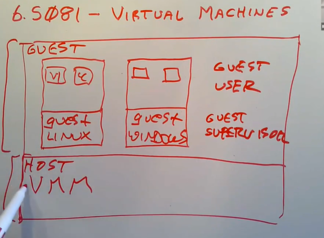
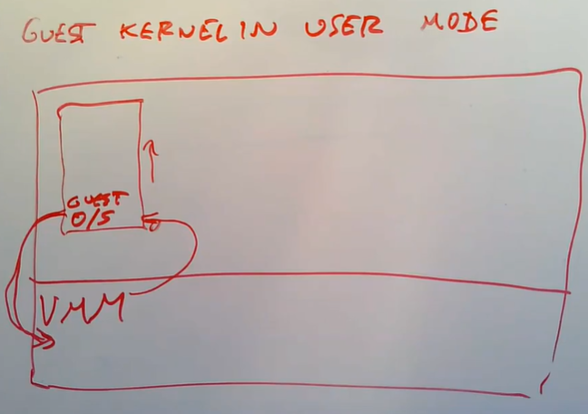
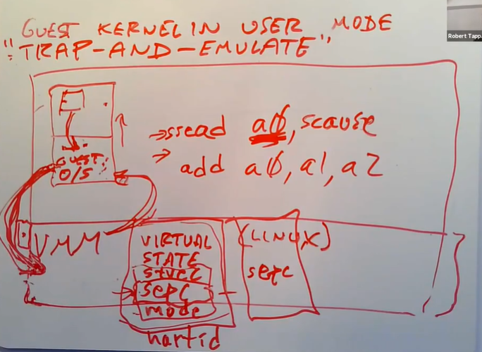
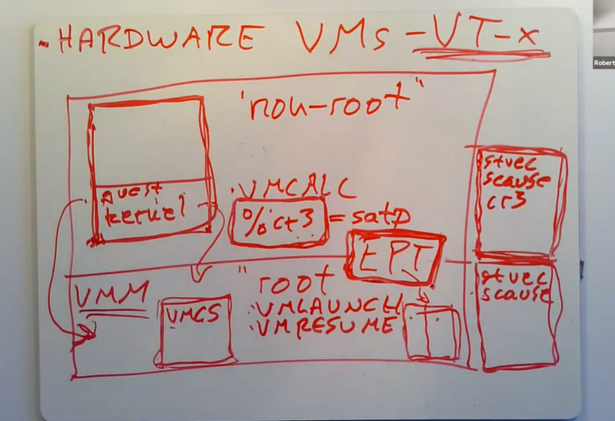
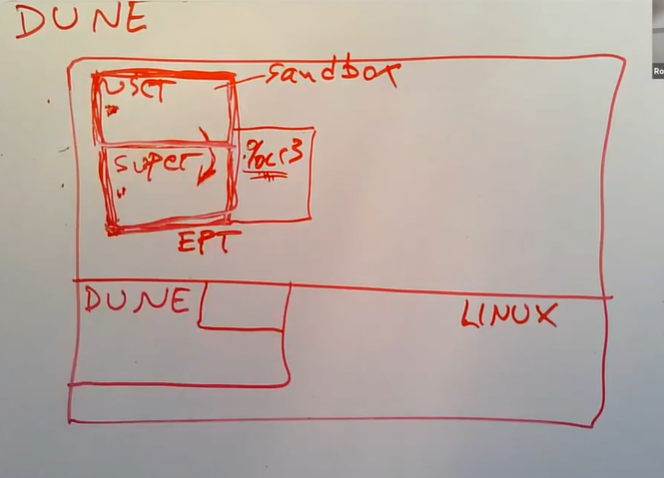
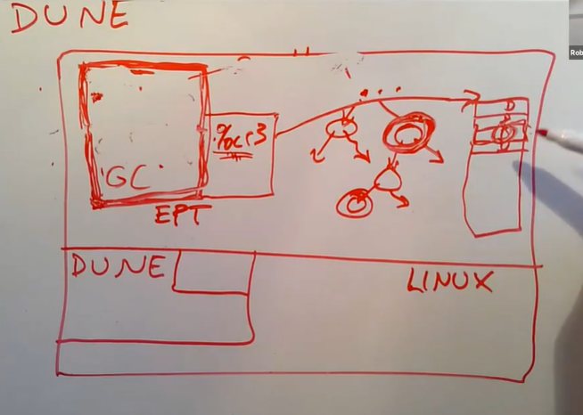
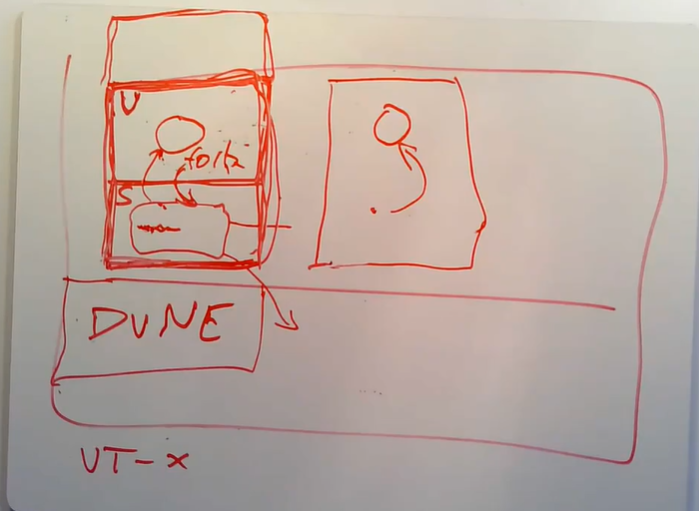

# LEC 19 (rtm): Virtual Machines

笔记大量参考了[肖宏辉](https://www.zhihu.com/people/xiao-hong-hui-15)大佬的翻译。

目录：

<!-- @import "[TOC]" {cmd="toc" depthFrom=2 depthTo=2 orderedList=false} -->

<!-- code_chunk_output -->

- [Virtual Machine 虚拟机概述](#virtual-machine-虚拟机概述)
- [Trap-and-Emulate](#trap-and-emulate)
- [硬件对虚拟机的支持（以 Intel VT-x 为例）](#硬件对虚拟机的支持以-intel-vt-x-为例)
- [Dune: Safe User-level Access to Privileged CPU Features](#dune-safe-user-level-access-to-privileged-cpu-features)

<!-- /code_chunk_output -->

细分目录：

<!-- @import "[TOC]" {cmd="toc" depthFrom=2 depthTo=6 orderedList=false} -->

<!-- code_chunk_output -->

- [Virtual Machine 虚拟机概述](#virtual-machine-虚拟机概述)
    - [虚拟机使用场景](#虚拟机使用场景)
- [Trap-and-Emulate](#trap-and-emulate)
  - [Trap](#trap)
  - [Emulate](#emulate)
  - [Page Table](#page-table)
  - [Devices](#devices)
- [硬件对虚拟机的支持（以 Intel VT-x 为例）](#硬件对虚拟机的支持以-intel-vt-x-为例)
- [Dune: Safe User-level Access to Privileged CPU Features](#dune-safe-user-level-access-to-privileged-cpu-features)

<!-- /code_chunk_output -->

## Virtual Machine 虚拟机概述

今天讨论的话题是虚拟机。今天的内容包含三个部分:
- 第一个部分是Trap and Emulate，这部分会介绍如何在RISC-V或者QEMU上构建属于自己的Virtual Machine Monitor（注，有些场合也称为Hypervisor）。
- 第二部分会描述最近在硬件上对于虚拟化的支持。
- 最后是讨论一下今天的论文，它使用了第二部分中硬件上的支持。

首先什么是虚拟机？你可以认为这是对于计算机的一种模拟，这种模拟足够能运行一个操作系统。QEMU可以认为是虚拟机的一个例子（注，QEMU应该是属于VMM/Hypervisor）。



在架构的最底层，位于硬件之上存在一个Virtual Machine Monitor（VMM），它取代了标准的操作系统内核。VMM的工作是模拟多个计算机用来运行Guest操作系统。VMM往上一层，如果对比一个操作系统的架构应该是用户空间，但是现在是叫做Guest空间。所以在今天的架构图里面，上面是Guest空间，下面是Host空间（注，也就是上面运行Guest操作系统，下面运行VMM）。

在Guest空间，会有一个或者多个Guest操作系统内核，或许其中一个是Linux kernel。这里的Linux kernel会觉得自己就是个普通的内核，并在自己之上还运行一堆用户进程，例如VI，C Compiler。我们或许还有另一个Guest运行了Windows操作系统，同时也包含了Windows用户进程。所以，在Host空间运行的是VMM，在Guest空间运行的是普通的操作系统。除此之外，在Guest空间又可以分为Guest Supervisor Mode，也就是Guest操作系统内核运行的模式，和Guest User Mode。

VMM的主要目的是提供对计算机的模拟，这样你可以不做修改就启动普通的Linux，普通的Windows系统，并运行在虚拟机内，并且不用担心任何奇怪的事情发生。所以，VMM必须要能够完全按照实际硬件的行为来模拟Guest Supervisor Mode和Guest User Mode，尽管实际上不可能完全一样，我们之后会讨论VMM对于这两种模式的模拟。

#### 虚拟机使用场景

那么人们为什么会想要使用虚拟机呢？实际中有很多原因使得人们会在一个计算机上运行多个相互独立的操作系统。在一个大公司里面，你需要大量的服务器，例如DNS，Firewall等等，但是每个服务器并没有使用太多的资源，所以单独为这些服务器购买物理机器有点浪费，但是将这些低强度的服务器以虚拟机的形式运行在一个物理机上可以节省时间和资金。

虚拟机在云计算中使用的也非常广泛。云厂商，例如AWS，不想直接出借物理服务器给用户，因为这很难管理。它们想向用户出借的是可以随意确定不同规格的服务器。或许有两个用户在一台物理服务器上，但是他们并没有太使用计算机，这样AWS可以继续向同一个物理服务器上加入第三或者第四个用户。这样可以不使用额外的资金而获得更高的收益。所以，虚拟机提供了额外的灵活性，这里借助的技术是：将操作系统内核从之前的内核空间上移至用户空间，并在操作系统内核之下增加新的一层（注，也就是虚拟机的内核是运行在宿主机的用户空间，虚拟机的内核通过新增加的一层VMM来对接底层硬件）以提供这里的灵活性。

还有一些其他的原因会使得人们使用虚拟机。第一个是开发内核，这就是为什么我们在课程中一直使用QEMU。能够在虚拟环境而不是一个真实的计算机运行XV6，使得这门课程对于你们和我们来说都要方便的多。同时对于调试也更容易，因为相比在物理计算机上运行XV6，在QEMU提供的虚拟机环境中运行可以更容易的提供gdb的访问权限。

最后一个人们使用虚拟机的原因是，通过新增的VMM提供的抽象可以实现更多的功能。例如，你可以为整个操作系统和其中的用户进程做一个快照，并在磁盘中保存下来。稍后再恢复快照，并将操作系统和其中的用户进程恢复成做快照时的状态。这可以增加运行的可靠性，或者用来调试，或者用来拷贝虚拟机的镜像并运行多次。除此之外，还可以将一个Guest操作系统迁移到另一个计算机上。如果你在一个物理计算机上运行了一个Guest操作系统，现在需要关闭并替换该物理计算机，你可以在不干扰虚拟机运行的前提下，将它迁移到另一个物理计算机，这样你就可以安全的关闭第一个物理计算机。

以上就是人们喜欢使用虚拟机的原因。虚拟机实际上应用的非常非常广泛，并且它也有着很长的历史。虚拟机最早出现在1960年代，经过了一段时间的开发才变得非常流行且易用。

对于这们课程来说，我们之所以要学习虚拟机是因为VMM提供了对于操作系统的一种不同视角。在操作系统的架构中，内核之上提供的封装单元（注，视频中说的是container，但是container还有容器的意思，所以这里说成是封装单元）是我们熟悉的进程，内核管理的是多个用户进程。而在VMM的架构中，VMM之上提供的封装单元是对计算机的模拟。VMM的架构使得我们可以从另一个角度重新审视我们讨论过的内容，例如内存分配，线程调度等等，这或许可以给我们一些新的思路并带回到传统的操作系统内核中。所以，在虚拟机场景下，大部分的开发设计研究工作，从传统的内核移到了VMM。某种程度上来说，传统操作系统内核的内容下移了一层到了VMM。

今天课程的第一部分我将会讨论如何实现我们自己的虚拟机。这里假设我们要模拟的是RISC-V，并运行针对RISC-V设计的操作系统，例如XV6。我们的目的是让运行在Guest中的代码完全不能区分自己是运行在一个虚拟机还是物理机中，因为我们希望能在虚拟机中运行任何操作系统，甚至是你没有听说过的操作系统，这意味着对于任何操作系统的行为包括使用硬件的方式，虚拟机都必须提供提供对于硬件的完全相同的模拟，这样任何在真实硬件上能工作的代码，也同样能在虚拟机中工作。

除了不希望Guest能够发现自己是否运行在虚拟机中，我们也不希望Guest可以从虚拟机中逃逸。 **很多时候人们使用虚拟机是因为它为不被信任的软件甚至对于不被信任的操作系统提供了严格的隔离。假设你是Amazon，并且你出售云服务，通常是你的客户提供了运行在虚拟机内的操作系统和应用程序，所以有可能你的客户运行的不是普通的Linux而是一个特殊的修改过的Linux，并且会试图突破虚拟机的限制来访问其他用户的虚拟机或者访问Amazon用来实现虚拟机隔离的VMM。所以Guest不能从虚拟机中逃逸还挺重要的。** Guest可以通过VMM使用内存，但是不能使用不属于自己的内存。类似的，Guest也不应该在没有权限的时候访问存储设备或者网卡。所以这里我们会想要非常严格的隔离。虚拟机在很多方面比普通的Linux进程提供了更加严格的隔离。Linux进程经常可以相互交互，它们可以杀掉别的进程，它们可以读写相同的文件，或者通过pipe进行通信。但是在一个普通的虚拟机中，所有这些都不被允许。运行在同一个计算机上的不同虚拟机，彼此之间是通过VMM完全隔离的。所以出于安全性考虑人们喜欢使用虚拟机，这是一种可以运行未被信任软件的方式，同时又不用担心bug和恶意攻击。

**前面已经指出了虚拟机的目标是提供一种对于物理服务器的完全准确的模拟。但是实际中出于性能的考虑，这个目标很难达到。你将会看到运行在Guest中的Linux与VMM之间会相互交互，所以实际中Linux可以发现自己是否运行在VMM之上。出于效率的考虑，在VMM允许的前提下，Linux某些时候知道自己正在与VMM交互，以获得对于设备的高速访问权限。但这是一种被仔细控制的例外，实现虚拟机的大致策略还是完全准确的模拟物理服务器。**

## Trap-and-Emulate

我们该如何构建我们自己的VMM呢？一种实现方式是完全通过软件来实现，你可以想象写一个类似QEMU的软件，这个软件读取包含了XV6内核指令的文件，查看每一条指令并模拟RISC-V的状态，这里的状态包括了通过软件模拟32个寄存器。你的软件读取每条指令，确定指令类型，再将指令应用到通过软件模拟的32个寄存器和控制寄存器中。实际中有的方案就是这么做的，虽然说考虑到细节还需要做很多工作，但是这种方案从概念上来说很简单直观。

**但是纯软件解析的虚拟机方案应用的并不广泛，因为它们很慢。如果你按照这种方式实现虚拟机，那么Guest应用程序的运行速度将远低于运行在硬件上，因为你的VMM在解析每一条Guest指令的时候，都可能要转换成几十条实际的机器指令，所以这个方案中的Guest的运行速度比一个真实的计算机要慢几个数量级。在云计算中，这种实现方式非常不实用。所以人们并不会通过软件解析来在生产环境中构建虚拟机。**

相应的， **一种广泛使用的策略是在真实的CPU上运行Guest指令。** 所以如果我们要在VMM之上运行XV6，我们需要先将XV6的指令加载到内存中，之后再跳转到XV6的第一条指令，这样你的计算机硬件就能直接运行XV6的指令。当然，这要求你的计算机拥有XV6期望的处理器（注，也就是RISC-V）。

**但是实际中你又不能直接这么做，因为当你的Guest操作系统执行了一个privileged指令（注，也就是在普通操作系统中只能在kernel mode中执行的指令）之后，就会出现问题。现在我们在虚拟机里面运行了操作系统内核，而内核会执行需要privileged权限指令，比如说加载一个新的Page Table到RISC-V的SATP寄存器中，而这时就会出现问题。**

前面说过，我们将Guest kernel按照一个Linux中的普通用户进程来运行，所以Guest kernel现在运行在User mode，而在User mode加载SATP寄存器是个非法的操作，这会导致我们的程序（注，也就是虚拟机）crash。 **但是如果我们蠢到将Guest kernel运行在宿主机的Supervisor mode（注，也就是kernel mode），那么我们的Guest kernel不仅能够修改真实的Page Table，同时也可以从虚拟机中逃逸，因为它现在可以控制PTE（Page Table Entry）的内容，并且读写任意的内存内容。所以我们不能直接简单的在真实的CPU上运行Guest kernel。**

相应的，这里会使用一些技巧。

### Trap

首先将Guest kernel运行在宿主机的User mode，这是最基本的策略。这意味着，当我们自己写了一个VMM，然后通过VMM启动了一个XV6系统，VMM会将XV6的kernel指令加载到内存的某处，再设置好合适的Page Table使得XV6看起来自己的内存是从地址0开始向高地址走。之后VMM会使用trap或者sret指令来跳转到位于User mode的Guest操作系统的第一条指令，这样不论拥有多少条指令，Guest操作系统就可以一直执行下去。



**一旦Guest操作系统需要使用privileged指令，因为它当前运行在User mode而不是Supervisor mode，会使得它触发trap并走回到我们的VMM中（注，在一个正常操作系统中，如果在User mode执行privileged指令，会通过trap走到内核，但是现在VMM替代了内核），之后我们就可以获得控制权。** 所以当Guest操作系统尝试修改SATP寄存器，RISC-V处理器会通过trap走回到我们的VMM中，之后我们的VMM就可以获得控制权。并且我们的VMM也可以查看是什么指令引起的trap，并做适当的处理。这里核心的点在于Guest操作系统并没有实际的设置SATP寄存器。

- 学生提问：VMM改如何截获Guest操作系统的指令？它应该要设置好一个trap handler对吧，但这不是一个拥有privileged权限的进程才能做的事情吗？而VMM又是个宿主机上的用户程序，是吧？
- Robert教授：我这里假设VMM运行在Supervisor mode。所以在这里的图中，VMM就是宿主机的kernel。这里我们不是启动类似Linux的操作系统，而是启动VMM（注，类似VMware的ESXi）。VMM以privileged权限运行，并拥有硬件的完整控制权限，这样我们就可以在VMM里面设置各种硬件寄存器。有一些VMM就是这么运行的，你在硬件上启动它们，并且只有VMM运行在Supervisor mode。实际上还有很多很多其他的虚拟机方案，比如说在硬件上启动Linux，之后要么Linux自带一个VMM，要么通过可加载的内核模块将VMM加载至Linux内核中，这样VMM可以在Linux内核中以Supervisor mode运行。今天我们要讨论的论文就是采用后者。
- 这里主要的点在于，我们自己写的可信赖的VMM运行在Supervisor mode，而我们将不可信赖的Guest kernel运行在User mode，通过一系列的处理使得Guest kernel看起来好像自己是运行在Supervisor mode。

在RISC-V上，如果在User mode尝试运行任何一个需要Supervisor权限的指令都会触发trap。这里需要Supervisor权限的指令并不包括与Page Table相关的指令，我们稍后会介绍相关的内容。所以每当Guest操作系统尝试执行类似于读取SCAUSE寄存器，读写STVEC寄存器，都会触发一个trap，并走到VMM，之后我们就可以获得控制权。

### Emulate

VMM会为每一个Guest维护一套虚拟状态信息。所以VMM里面会维护虚拟的STVEC寄存器，虚拟的SEPC寄存器以及其他所有的privileged寄存器。当Guest操作系统运行指令需要读取某个privileged寄存器时，首先会通过trap走到VMM，因为在用户空间读取privileged寄存器是非法的。之后VMM会检查这条指令并发现这是一个比如说读取SEPC寄存器的指令，之后VMM会模拟这条指令，并将自己维护的虚拟SEPC寄存器，拷贝到trapframe的用户寄存器中（注，这里假设Guest操作系统通过类似“`sread a0, sepc`”的指令想要将spec读取到用户寄存器a0）。之后，VMM会将trapframe中保存的用户寄存器拷贝回真正的用户寄存器，通过sret指令，使得Guest从trap中返回。这时，用户寄存器a0里面保存的就是SEPC寄存器的值了，之后Guest操作系统会继续执行指令。最终，Guest读到了VMM替自己保管的虚拟SEPC寄存器。

- 学生提问：VMM是怎么区分不同的Guest？
- Robert教授：VMM会为每个Guest保存一份虚拟状态信息，然后它就像XV6知道是哪个进程一样，VMM也知道是哪个Guest通过trap走到VMM的。XV6有一个针对每个CPU的变量表明当前运行的是哪个进程，类似的VMM也有一个针对每个CPU的变量表明当前是哪个虚拟机在运行，进而查看对应的虚拟状态信息。
- 学生提问：VMM可以给一个Guest分配多个CPU核吗？
- Robert教授：稍微复杂点的VMM都可以实现。
- 学生提问：在实际的硬件中会有对应寄存器，那么为什么我们不直接使用硬件中的寄存器，而是使用虚拟的寄存器？
- Robert教授：这里的原因是，VMM需要使用真实的寄存器。举个例子，想象一下SCAUSE寄存器，当Guest操作系统尝试做任何privileged操作时（注，也就是读写privileged寄存器），会发生trap。硬件会将硬件中真实的SCAUSE寄存器设置成引起trap的原因，这里的原因是因为权限不够。但是假设Guest操作系统只是从Guest用户进程执行了一个系统调用，Guest操作系统需要看到SCAUSE的值是系统调用。也就是说Guest操作系统在自己的trap handler中处理来自Guest用户进程的系统调用时，需要SCAUSE的值表明是系统调用。
- 而实际的SCAUSE寄存器的值却表明是因为指令违反了privilege规则才走到的trap。通常情况下，VMM需要看到真实寄存器的值，而Guest操作系统需要能看到符合自己视角的寄存器的值。（注，在Guest操作系统中，可能有两种情况会触发trap，一种是Guest用户空间进程的系统调用，也就是正常操作系统中正常的trap流程，另一种是Guest内核空间读取privileged寄存器时，因为Guest内核空间实际上也是在宿主机的用户空间，导致这是个非法操作并触发trap。Robert这边举的例子的流程应该是这样，Guest用户进程执行系统调用，在这一个瞬间SCAUSE寄存器的值是ECALL，也就是8。但是稍后在Guest系统内核的trap handler中需要读取SCAUSE的值，以确定在Guest中引起trap的原因，但是这就触发了第二种trap，SCAUSE的值会变成Illegal Access。我们不能让Guest系统内核看到这个值，所以VMM这里将它变成ECALL并返回）



在这种虚拟机的实现中，Guest整个运行在用户空间，任何时候它想要执行需要privilege权限的指令时，会通过trap走到VMM，VMM可以模拟这些指令。这种实现风格叫做Trap and Emulate。你可以完全通过软件实现这种VMM，也就是说你可以只通过修改软件就将XV6变成一个可以运行在RISC-V上的VMM，然后再在之上运行XV6虚拟机。当然，与常规的XV6一样，VMM需要运行在Supervisor mode。

**所有以S开头的寄存器，也就是所有的Supervisor控制寄存器都必须保存在虚拟状态信息中。** 同时还有一些信息并不能直接通过这些控制寄存器体现，但是又必须保存在这个虚拟状态信息中。其中一个信息就是mode。VMM需要知道虚拟机是运行在Guest user mode还是Guest Supervisor mode。例如，Guest中的用户代码尝试执行privileged指令，比如读取SCAUSE寄存器，这也会导致trap并走到VMM。但是这种情况下VMM不应该模拟指令并返回，因为这并不是一个User mode中的合法指令。所以VMM需要跟踪Guest当前是运行在User mode还是Supervisor mode，所以在虚拟状态信息里面也会保存mode。

VMM怎么知道Guest当前的mode呢？当Guest从Supervisor mode返回到User mode时会执行sret指令，而sret指令又是一个privileged指令，所以会通过trap走到VMM，进而VMM可以看到Guest正在执行sret指令，并将自己维护的mode从Supervisor变到User。

虚拟状态信息中保存的另外一个信息是hartid，它代表了CPU核的编号。即使通过privileged指令，也不能直接获取这个信息，VMM需要跟踪当前模拟的是哪个CPU。

实际中，在不同类型的CPU上实现Trap and Emulate虚拟机会有不同的难度。不过RISC-V特别适合实现Trap and Emulate虚拟机，因为RISC-V的设计人员在设计指令集的时候就考虑了Trap and Emulate虚拟机的需求。举个例子，设计人员确保了每个在Supervisor mode下才能执行的privileged指令，如果在User mode执行都会触发trap。你可以通过这种机制来确保VMM针对Guest中的每个privileged指令，都能看到一个trap。

- 学生提问：Guest操作系统内核中会实际运行任何东西吗？还是说它总是会通过trap走到VMM？
- Robert教授： **如果你只是执行一个ADD指令，这条指令会直接在硬件上以硬件速度执行。如果你执行一个普通的函数调用，代码的执行也没有任何特殊的地方。所有User代码中合法的指令，以及内核代码中的non-priviledged指令，都是直接以全速在硬件上执行。**
- 学生提问：在Guest操作系统中是不是也有类似的User mode和Kernel mode？
- Robert教授：有的。Guest操作系统就是一个未被修改的普通操作系统，所以我们在Guest中运行的就是Linux内核或者XV6内核。而XV6内核知道自己运行在Supervisor mode，从代码的角度来说，内核代码会认为自己运行在Supervisor mode，并执行各种privileged指令，并期望这些指令能工作。当Guest操作系统执行sret指令时，它也知道自己将要进入到User空间。不过在宿主机上，Guest操作系统是运行在User mode，VMM也确保了这里能正常工作。但是从Guest角度来说，自己的内核看起来像是运行在Supervisor mode，自己的用户程序看起来像是运行在User mode。

所以，当Guest执行sret指令从Supervisor mode进入到User mode，因为sret是privileged指令，会通过trap进入到VMM。VMM会更新虚拟状态信息中的mode为User mode，尽管当前的真实mode还是Supervisor mode，因为我们还在执行VMM中的代码。在VMM从trap中返回之前，VMM会将真实的SEPC寄存器设置成自己保存在虚拟状态信息中的虚拟SEPC寄存器。因为当VMM使用自己的sret指令返回到Guest时，它需要将真实的程序计数器设置成Guest操作系统想要的程序计数器值（注，因为稍后Guest代码会在硬件上执行，因此依赖硬件上的程序计数器）。所以在一个非常短的时间内，真实的SEPC寄存器与虚拟的SEPC寄存器值是一样的。同时，当VMM返回到虚拟机时，还需要切换Page table，这个我们稍后会介绍。

Guest中的用户代码，如果是普通的指令，就直接在硬件上执行。当Guest中的用户代码需要执行系统调用时，会通过执行ECALL指令触发trap，而这个trap会走到VMM中（注，因为ECALL也是个privileged指令）。VMM可以发现当前在虚拟状态信息中记录的mode是User mode，并且发现当前执行的指令是ECALL，之后VMM会更新虚拟状态信息以模拟一个真实的系统调用的trap状态。比如说，它将设置虚拟的SEPC为ECALL指令所在的程序地址（注，执行sret指令时，会将程序计数器的值设置为SEPC寄存器的值。这样，当Guest执行sret指令时，可以从虚拟的SEPC中读到正确的值）；将虚拟的mode更新成Supervisor；将虚拟的SCAUSE设置为系统调用；将真实的SEPC设置成虚拟的STVEC寄存器（注，STVEC保存的是trap函数的地址，将真实的SEPC设置成STVEC这样当VMM执行sret指令返回到Guest时，可以返回到Guest的trap handler。Guest执行系统调用以为自己通过trap走到了Guest内核，但是实际上却走到了VMM，这时VMM需要做一些处理，让Guest以及之后Guest的所有privileged指令都看起来好像是Guest真的走到了Guest内核）；之后调用sret指令跳转到Guest操作系统的trap handler，也就是STVEC指向的地址。

### Page Table

有关Trap and Emulate的实现还有两个重要的部分，一个是Page Table，另一个是外部设备。

Page Table包含了两个部分，第一个部分是Guest操作系统在很多时候会修改SATP寄存器（注，SATP寄存器是物理内存中包含了Page Table的地址），当然这会变成一个trap走到VMM，之后VMM可以接管。但是我们不想让VMM只是简单的替Guest设置真实的SATP寄存器，因为这样的话Guest就可以访问任意的内存地址，而不只是VMM分配给它的内存地址，所以我们不能让Guest操作系统简单的设置SATP寄存器。

但是我们的确又需要为SATP寄存器做点什么，因为我们需要让Guest操作系统觉得Page Table被更新了。此外，当Guest上的软件运行了load或者store指令时，或者获取程序指令来执行时，我们需要数据或者指令来自于内存的正确位置，也就是Guest操作系统认为其PTE指向的内存位置。所以当Guest设置SATP寄存器时，真实的过程是，我们不能直接使用Guest操作系统的Page Table，VMM会生成一个新的Page Table来模拟Guest操作系统想要的Page Table。

```
GUEST PAGE TBL
  gva -> gpa
VMM MAP
  gpa -> hpa
```

所以现在的Page Table翻译过程略微有点不一样，首先是Guest kernel包含了Page Table，但是这里是将Guest中的虚拟内存地址（注，下上面的gva）映射到了Guest的物理内存地址（注，上面的gpa）。Guest物理地址是VMM分配给Guest的地址空间，例如32GB。并且VMM会告诉Guest这段内存地址从0开始，并一直上涨到32GB。但是在真实硬件上，这部分内存并不是连续的。所以我们不能直接使用Guest物理地址，因为它们不对应真实的物理内存地址。

相应的，VMM会为每个虚拟机维护一个映射表，将Guest物理内存地址映射到真实的物理内存地址，我们称之为主机物理内存地址（注，上面的hpa）。这个映射表与Page Table类似，对于每个VMM分配给Guest的Guest物理内存Page，都有一条记录表明真实的物理内存Page是什么。

当Guest向SATP寄存器写了一个新的Page Table时，在对应的trap handler中，VMM会创建一个Shadow Page Table，Shadow Page Table的地址将会是VMM向真实SATP寄存器写入的值。Shadow Page Table由上面两个Page Table组合而成，所以它将gva映射到了hpa。Shadow Page Table是这么构建的：
- 从Guest Page Table中取出每一条记录，查看gpa。
- 使用VMM中的映射关系，将gpa翻译成hpa。
- 再将gva和hpa存放于Shadow Page Table。
- 在创建完之后，VMM会将Shadow Page Table设置到真实的SATP寄存器中，再返回到Guest内核中（注，这样的效果是，Guest里面看到的Page Table就是一个正常的Page Table，而Guest通过SATP寄存器指向的Page Table，将虚拟内存地址翻译得到的又是真实的物理内存地址）。

所以，Guest kernel认为自己使用的是一个正常的Page Table，但是实际的硬件使用的是Shadow Page Table。这种方式可以阻止Guest从被允许使用的内存中逃逸。Shadow Page Table只能包含VMM分配给虚拟机的主机物理内存地址。 **Guest不能向Page Table写入任何VMM未分配给Guest的内存地址。这是VMM实现隔离的一个关键部分。**

- 学生提问：如果Guest操作系统想要为一个进程创建一个新的Page Table，会发生什么呢？
- Robert教授：Guest会完全按照Linux或者XV6的行为来执行。首先是格式化Page Table Entries以构造一个Page Table。之后执行指令将Page Table的地址写入到SATP寄存器，这就是Guest操作系统的行为。但是它又不能设置实际的SATP寄存器，因为这是一个privileged操作，所以设置SATP寄存器会触发trap并走到VMM。VMM会查看trap对应的指令，并发现Guest要尝试设置SATP寄存器，之后VMM会创建一个新的Shadow Page Table。VMM会查看Guest尝试要设置的Page Table的每一条记录，通过`gpa->hpa`的映射关系，将gva和hpa的对应关系翻译出来。如果Guest尝试使用一个不被允许的物理地址，VMM会生成一个真实的Page Fault。之后VMM会将Shadow Page Table设置到真实的SATP寄存器中，并返回到Guest中。

Shadow Page Table是实现VMM时一个比较麻烦的地方。除了设置SATP寄存器，Guest操作系统还有另一种方式可以与Page Table进行交互。XV6有时候会直接修改属于自己的Page Table Entry，或者读取PTE中的dirty bit。如果你读了RISC-V的文档，你可以发现在RISC-V上，如果软件更改了PTE，RISC-V不会做任何事情。如果你修改了PTE，RISC-V并不承诺可以立即观察到对于PTE的修改，在修改那一瞬间，你完全是不知道PTE被修改了（注，这里主要对比的是privileged指令，因为如果在用户空间执行了privileged指令，会立刻触发trap，而这里修改PTE不会有任何的额外的动作）。相应的，文档是这么说的，如果你修改PTE并且希望MMU可以看到这个改动，你需要执行sfence.vma指令，这个指令会使得硬件注意到你对Page Table的修改。所以如果你要自己写一个VMM，你在RISC-V上的VMM会完全忽略Guest对于PTE的修改，但是你知道Guest在修改完PTE之后将会执行sfence.vma指令，并且这是一个privileged指令，因为它以s开头，所以这条指令会通过trap走到VMM，VMM就可以知道sfence.vma指令被执行了。之后VMM会重新扫描Guest的当前Page Table，查找更新了的Page Table Entry。如果修改合法的话，VMM会将修改体现在Shadow Page Table中，并执行真实的sfence.vma指令来使得真实的硬件注意到Shadow Page Table的改动。最后再会返回到Guest操作系统中。

- 学生提问：所以MMU只使用了一个Page Table，也就是Shadow Page Table，对吧？这里并没有使用EPT（Extended Page Table），对吧？
- Robert教授：这里还没有EPT。
- 学生提问：所以Guest认为它自己有一个Page Table，也就是`gva->gpa`，但是这里并没有做任何的翻译工作。VMM通过两个映射关系构建了属于自己的Page Table。
- Robert教授：是的。这里澄清一下，EPT是一种非常不一样的虚拟机实现方式，并且需要硬件的支持。我们这里假设除了对privileged指令触发trap以外，不需要使用任何特殊的硬件支持来构建一个虚拟机。
- 学生提问：这里会弄乱direct mapping吗？
- Robert教授：这里不会有direct map。Guest会认为自己有一个direct mapping，但这只是在虚拟的世界里的一个direct mapping，在真实的机器上这不是direct mapping。但是这没有关系，因为我们这里欺骗了Guest使得看起来像是direct mapping。
- 学生提问：我们刚刚说过性能的损耗，如果我们使用VMM，对于这里的trap机制看起来也会有大量的性能损耗。
- Robert教授：是的。如果你的操作系统执行了大量的privileged指令，那么你也会有大量的trap，这会对性能有大的损耗。这里的损耗是现代硬件增加对虚拟机支持的动机。今天要讨论的论文使用的就是现在硬件对于虚拟机的支持，Intel和AMD在硬件上支持更加有效的trap，或者说对于虚拟机方案，会有少得多的trap。所以是的，性能很重要。但是上面介绍的方案，人们也使用了很多年，它能工作并且也很成功，尽管它会慢的多，但是还没有慢到让人们讨厌的程度，人们其实很喜欢这个方案。

### Devices

接下来我们来看Trap and Emulate的最后一个部分，也就是虚拟机的外部设备。外部设备是指，一个普通的操作系统期望能有一个磁盘用来存储文件系统，或者是期望有一个网卡，甚至对于XV6来说期望有一个UART设备来与console交互，或者期望有一张声卡，一个显卡，键盘鼠标等等各种各样的东西。所以我们我们的虚拟机方案，需要能够至少使得Guest认为所有它需要的外部设备是存在的。

这里人们通常会使用三种策略。

第一种是，模拟一些需要用到的并且使用非常广泛的设备，例如磁盘。也就是说，Guest并不是拥有一个真正的磁盘设备，只是VMM使得与Guest交互的磁盘看起来好像真的存在一样。这里的实现方式是，Guest操作系统仍然会像与真实硬件设备交互一样，通过Memory Map控制寄存器与设备进行交互。通常来说，操作系统会假设硬件已经将自己的控制寄存器映射到了内核地址空间的某个地址上。 **在VMM中不会映射这些内存地址对应的Page，相应的会将这些Page设置成无效。这样当Guest操作系统尝试使用UART或者其他硬件时，一访问这些地址就会通过trap走到VMM。** VMM查看指令并发现Guest正在尝试在UART发送字符或者从磁盘中读取数据。VMM中会对磁盘或者串口设备有一些模拟，通过这些模拟，VMM知道如何响应Guest的指令，之后再恢复Guest的执行。 **这就是我们之前基于QEMU介绍XV6时，QEMU实现UART的方式。** 在之前的介绍中，并没有UART硬件的存在，但是QEMU模拟了一个UART来使得XV6正常工作。这是一种常见的实现方式，但是这种方式可能会非常的低效，因为每一次Guest与外设硬件的交互，都会触发一个trap。但是对于一些低速场景，这种方式工作的较好。 **如果你的目标就是能启动操作系统并使得它们完全不知道自己运行在虚拟机上，你只能使用这种策略。**

**在现代的世界中，操作系统在最底层是知道自己运行在虚拟机之上的。所以第二种策略是提供虚拟设备，而不是模拟一个真实的设备。** 通过在VMM中构建特殊的设备接口，可以使得Guest中的设备驱动与VMM内支持的设备进行高效交互。现在的Guest设备驱动中可能没有Memory Mapped寄存器了，但是相应的在内存中会有一个命令队列，Guest操作系统将读写设备的命令写到队列中。 **在XV6中也使用了一个这种方式的设备驱动，在XV6的virtio_disk.c文件中，你可以看到一个设备驱动尝试与QEMU实现的虚拟磁盘设备交互。** 在这个驱动里面要么只使用了很少的、要么没有使用Memory Mapped寄存器，所以它基本不依赖trap，相应的它在内存中格式化了一个命令队列。之后QEMU会从内存中读取这些命令，但是并不会将它们应用到磁盘中，而是将它们应用到一个文件，对于XV6来说就是fs.image。这种方式比直接模拟硬件设备性能要更高，因为你可以在VMM中设计设备接口使得并不需要太多的trap。

第三个策略是对于真实设备的pass-through，这里典型的例子就是网卡。现代的网卡具备硬件的支持，可以与VMM运行的多个Guest操作系统交互。 **你可以配置你的网卡，使得它表现的就像多个独立的子网卡，每个Guest操作系统拥有其中一个子网卡。经过VMM的配置，Guest操作系统可以直接与它在网卡上那一部分子网卡进行交互，并且效率非常的高。所以这是现代的高性能方法。在这种方式中，Guest操作系统驱动可以知道它们正在与这种特别的网卡交互。**

以上就是实现外部设备的各种策略。我认为在实现一个VMM时，主要的困难就在于构建外部设备和设备驱动，并使得它们能正确的与Guest操作系统配合工作。这里或许是实现VMM的主要工作，尤其是当你使用第一种策略时。

- 学生提问：我并没有太理解策略一emulation和策略二virtual device的区别。
- Robert教授：它们是类似的。可以这么想，如果你启动了一个完全不知道虚拟机的操作系统，它或许包含了很多磁盘驱动，但是所有的驱动都是为真实硬件提供的。如果你想要在虚拟机中启动这样一个操作系统，你需要选择其中一种真实的硬件，并且以一种非常准确的方式来模拟该硬件。这种方式并没有问题，只是大部分情况下硬件接口并没有考虑Trap and Emulate VMM下的性能。所以真实的设备驱动需要你频繁的读写它的控制寄存器，而VMM需要为每一次写控制寄存器都获取控制权，因为它需要模拟真实的硬件。这意味着每一次写控制寄存器都会触发一次trap走到VMM，并消耗数百个CPU cycles。所以策略一非常的慢且低效。
- 策略二并没有卑微地模仿真实的设备，某些设计人员提出了一种设备驱动，这种设备驱动并不对接任何真实的硬件设备，而是只对接由VMM实现的虚拟设备。这种驱动设计的并不需要很多trap，并且这种驱动与对应的虚拟设备是解耦的，并不需要立即的交互。
- 从功能层面上来说，使用策略一的话，你可以启动任何操作系统，使用策略二的话，如果你想要使用虚拟设备，你只能启动知道虚拟设备的操作系统。实际中，策略二是一种标准，并且很多虚拟机的实现方案都能提供。虽然我们并没有在除了QEMU以外的其他场景测试过，XV6中的virtio_disk.c稍作修改或许也可以在其他虚拟机方案上运行。
- 学生提问：所以对于每一种主板，取决于不同的磁盘，编译XV6都需要不同的磁盘驱动，是吗？
- Robert教授：是的。我认为或许你可以买到支持virtio_disk驱动的真实硬件，但是大部分的磁盘硬件还不支持这个驱动，这时你需要为真实的硬件实现一种新的驱动。

## 硬件对虚拟机的支持（以 Intel VT-x 为例）

接下来我将讨论硬件对于虚拟机的支持，这里特指的就是Intel的VT-x。为什么Intel和其他的硬件厂商会为虚拟机提供直接的硬件支持呢？
- 首先虚拟机应用的非常广泛，硬件厂商的大量客户都在使用虚拟机
- 其次，我们刚刚描述的Trap and Emulate虚拟机方案中，经常会涉及到大量高成本的trap，所以这种方案性能并不特别好。
- 第三个原因或许就没那么有趣了。RISC-V非常适合Trap and Emulate虚拟机方案，但是Intel的x86处理器的一些具体实现使得它可以支持虚拟化，但是又没那么容易。所以Intel也有动力来修复这里的问题，因为它的很多客户想要在x86上运行VMM。

这里硬件上的支持，是为了让人们能够更容易的构建可以更快运行的虚拟机。它已经存在了10年左右了，并且现在在构建虚拟机时使用的非常非常广泛。在Trap and Emulate方案中， **VMM会为每个Guest在软件中保存一份虚拟状态信息，而现在，这些虚拟状态信息会保存在硬件中。** 这样Guest中的软件可以直接执行privileged指令来修改保存在硬件中的虚拟寄存器，而不是通过trap走到VMM来修改VMM中保存在软件中的虚拟寄存器。所以这里的目标是Guest可以在不触发trap的前提下，执行privileged指令。**

我们还是有一个VMM在内核空间，并且Guest运行在用户空间。当我们使用这种新的硬件支持的方案时，我们的VMM会使用真实的控制寄存器，而当VMM通知硬件切换到Guest mode时，硬件里还会有一套完全独立，专门为Guest mode下使用的虚拟控制寄存器。在Guest mode下可以直接读写控制寄存器，但是读写的是寄存器保存在硬件中的拷贝，而不是真实的寄存器。



硬件会对Guest操作系统的行为做一些额外的操作，以确保Guest不会滥用这些寄存器并从虚拟机中逃逸。在这种硬件支持的虚拟机方案中，存在一些技术术语，至少Intel是这么叫的，Guest mode被称为non-root mode，Host mode中会使用真实的寄存器，被称为root mode。所以，硬件中保存的寄存器的拷贝，或者叫做虚拟寄存器是为了在non-root mode下使用，真实寄存器是为了在root mode下使用。

现在，当我们运行在Guest kernel时，可以在不触发任何trap的前提下执行任何privileged指令。比如说如果想读写STVEC寄存器，硬件允许我们直接读写STVEC寄存器的non-root拷贝。这样，privileged指令可以全速运行，而不用通过trap走到VMM。这对于需要触发大量trap的代码，可以运行的快得多。

现在当VMM想要创建一个新的虚拟机时，VMM需要配置硬件。在VMM的内存中，通过一个结构体与VT-x硬件进行交互。这个结构体称为VMCS（注，Intel的术语，全称是Virtual Machine Control Structure）。当VMM要创建一个新的虚拟机时，它会先在内存中创建这样一个结构体，并填入一些配置信息和所有寄存器的初始值，之后VMM会告诉VT-x硬件说我想要运行一个新的虚拟机，并且虚拟机的初始状态存在于VMCS中。Intel通过一些新增的指令来实现这里的交互。
- VMLAUNCH，这条指令会创建一个新的虚拟机。你可以将一个VMCS结构体的地址作为参数传给这条指令，再开始运行Guest kernel。
- VMRESUME。在某些时候，Guest kernel会通过trap走到VMM，然后需要VMM中需要通过执行VMRESUME指令恢复代码运行至Guest kernel。
- VMCALL，这条新指令在non-root模式下使用，它会使得代码从non-root mode中退出，并通过trap走到VMM。

通过硬件的支持，Guest现在可以在不触发trap的前提下，直接执行普通的privileged指令。但是还是有一些原因需要让代码执行从Guest进入到VMM中，其中一个原因是调用VMCALL指令，另一个原因是设备中断，例如定时器中断会使得代码执行从non-root模式通过trap走到VMM。所以通常情况下设备驱动还是会使得Guest通过trap走回到VMM。这表示着Guest操作系统不能持续占有CPU，每一次触发定时器中断，VMM都会获取控制权。如果有多个Guest同时运行，它们可以通过定时器中断来分时共享CPU（注，类似于线程通过定时器中断分时共享CPU一样）。

VT-x机制中的另外一大部分是对于Page Table的支持。当我们在Guest中运行操作系统时，我们仍然需要使用Page Table。首先Guest kernel还是需要属于自己的Page Table，并且会想要能够加载CR3寄存器，这是Intel中类似于SATP的寄存器。VT-x使得Guest可以加载任何想要的值到CR3寄存器，进而设置Page Table。而硬件也会执行Guest的这些指令，这很好，因为现在Guest kernel可以在不用通过trap走到VMM再来加载Page Table。

但是我们也不能让Guest任意的修改它的Page Table，因为如果这样的话，Guest就可以读写任意的内存地址。所以VT-x的方案中，还存在另一个重要的寄存器：EPT（Extended Page Table）。EPT会指向一个Page Table。当VMM启动一个Guest kernel时，VMM会为Guest kernel设置好EPT，并告诉硬件这个EPT是为了即将运行的虚拟机准备的。

之后，当计算机上的MMU在翻译Guest的虚拟内存地址时，它会先根据Guest设置好的Page Table，将Guest虚拟地址（gva）翻译到Guest 物理地址（gha）。之后再通过EPT，将Guest物理地址（gha）翻译成主机物理地址（hpa）。硬件会为每一个Guest的每一个内存地址都自动完成这里的两次翻译。EPT使得VMM可以控制Guest可以使用哪些内存地址。Guest可以非常高效的设置任何想要的Page Table，因为它现在可以直接执行privileged指令。但是Guest能够使用的内存地址仍然被EPT所限制，而EPT由VMM所配置，所以Guest只能使用VMM允许其使用的物理内存Page（注，EPT类似于 Shadow Page Table ）。

- 学生提问：我对于硬件中保存的虚拟寄存器有问题，如果你有两个CPU核，然后你想要运行两个虚拟机，你会得到多少虚拟寄存器？
- Robert教授：每一个CPU核都有一套独立的VT-x硬件。所以每一个CPU核都有属于自己的32个通用寄存器，属于自己的真实的控制寄存器，属于自己的用在Guest mode下的虚拟控制寄存器，属于自己的EPT，所以你可以在两个CPU核上运行两个不同的虚拟机，它们不会共用任何寄存器，每个CPU核都有属于自己的寄存器。
- 学生提问：那也需要一个新的VMM吗？
- Robert教授：VMM可以像一个普通的操作系统一样。XV6可以支持多个进程，并且为每个进程配备一个proc结构体。而我们的VMM也会为每个虚拟机配备一个vm结构体，用来跟踪Guest的信息。并且，如我之前所说的，如果你只有一个CPU核，但是有3个Guest，可以通过定时器中断结合VMM在3个Guest之间切换。

## Dune: Safe User-level Access to Privileged CPU Features

今天要讨论的论文利用了上一节介绍的硬件对于虚拟机的支持，但是却将其用作其他的用途，这是这篇论文的有趣之处， **它利用了这种完全是为了虚拟机而设计的硬件，但是却用来做一些与虚拟机完全无关的事情。从一个全局的视角来看这篇论文的内容，它想要实现的是普通的进程。所以现在我们的场景是在一个Linux而不是VMM中，但是我们又用到了硬件中的VT-x。** 我们将会在Linux中加载Dune可加载模块，所以Dune作为kernel的一部分运行在Supervisor mode（注，又或者叫做kernel mode），除此之外，内核的大部分还是原本的Linux。



因为这里运行的是Linux进程，所以我们期望Dune可以支持进程，以及包括系统调用在内的各种Linux进程可以做的事情。不过现在我们想要使用VT-x硬件来使得普通的Linux进程可以做一些额外的事情。Dune会运行一些进程，或者说允许一个进程切换到Dune模式，这意味着，之前的进程只是被Page Table保护和隔离，现在这个进程完全被VT-x机制隔离开了。现在进程有了一套完整的虚拟控制寄存器，例如CR3寄存器，并且这些进程可以运行在non-root Supervisor mode，所以它可以在VT-x管理的虚拟状态信息上直接执行所有的privileged指令。

基于上面的描述，Dune管理的进程可以通过属于自己的CR3寄存器，设置好属于自己的Page Table。当然Dune也会控制属于这个进程的EPT，EPT会被设置的只包含这个进程相关的内存Page。所以进程可以向CR3寄存器写入任意的Page Table地址，但是因为MMU会在翻译完正常的Page Table之后再将地址送到EPT去翻译，所以进程不能从分配给它的内存中逃逸。所以进程并不能修改其他进程或者kernel的内存，它只是有了一种更灵活的设置自己内存的方式。

**Dune管理的进程也可以拥有Guest Supervisor mode和Guest User mode，就像一个小的虚拟机一样，并且可以保护运行在Supervisor mode的代码，不受运行在User mode的代码影响。**

论文中提到了可以基于Dune做的两件事情。

首先， **Dune能够在硬件层面支持进程同时拥有Guest Supervisor mode和Guest User mode，这样进程可以在自己的User mode中运行未被信任的插件代码。** 这里的主进程或许是一个网页浏览器，你可以为浏览器下载并运行各种各样的插件，或许是一个新的视频解码器，一个新的广告拦截插件等等。但是我们并不能完全信任这个插件，所以我们希望能够在权限受控的前提下运行它。虽然一个普通的Linux也可以达到这个目的，但是会比较麻烦。通过Dune，我们可以在Guest User mode下运行插件，同时让网页浏览器运行在进程的Guest Supervisor mode下。因为现在可以修改CR3寄存器，所以可以为Guest User mode配置一个不同的Page Table。这样，即使插件是恶意的，进程也可以安全的运行这里的未被信任的插件代码，因为插件代码现在不能任意的读写主浏览器的内存，只能访问网页浏览器指定的某些内存Page。进程的Guest User代码可能会执行系统调用，但是这些系统调用会通过trap走到进程的Guest Supervisor mode，而不是Linux内核，所以这里的插件代码或许会认为自己调用了fork/read/write等系统调用，但是实际上这里尝试运行的系统调用通过trap走到了进程对应的网页浏览器，而网页浏览器可以做任意的事情，它可以选择执行或者不执行系统调用。所以现在网页浏览器对于插件代码有了完全的控制能力。

公平的说，这里提到的隔离效果可以通过Linux中一些非常不一样的技术来实现，但是Dune通过使用VT-x应将，为你可以提供一个特别优雅且有效的实现方式。

**进程可以做的另一个事情是：通过Dune，进程的垃圾回收（Garbage Collect，GC）变得更快了。** 在这个场景中，没有了Guest Supervisor mode和Guest User mode。假设我们在运行任意一种带有GC的编程语言，比如说Java或者Python。GC可能会很慢，并且本身有着非常非常多的技术可以使得GC变快。许多GC都会扫描并找到位于内存中仍然在使用的对象，扫描会从寄存器中保存的对象指针开始，依次找到所有正在使用对象的所有指针。如果在扫描之后没能找到某个对象，那说明这个对象不被任何指针引用，那么它就可以被释放了。许多GC会同时在主程序的一个线程中运行，所以GC会从寄存器中保存的指针开始，根据指针之间的树或者图的关系，扫描一个个的对象。



但是因为GC与程序本身是并行的在运行，所以程序可能会修改GC已经扫描过的对象，这很糟糕，因为这样的话，GC在扫描完成之后确定的要释放和不能释放的对象清单可能就不再正确了。Dune使用了Page Table Entry中的一个特性来帮助GC检测这样的修改。Dune管理的进程首先会设置好由VT-x提供的虚拟CR3寄存器，指向属于自己的Page Table，其中的PTE都是有效的。每一条PTE的dirty位，表明对于对应的Page存在写操作。所以如果程序在GC的过程中修改了某些对象，那么对应PTE的dirty位会被设置为1。当GC查找完所有的对象之后，它会查看所有PTE中的dirty位，找到包含了可能修改过的对象的内存Page，然后再重新扫描这些对象。

**实际中，获取PTE dirty位的过程在普通的Linux中既困难又慢，我甚至都不确定Linux是否支持这个操作，在一些其他操作系统中你可以通过系统调用来查询PTE的dirty位。** 但是如果你使用Dune和 VT-x，进程可以很快的使用普通的load和store指令获取PTE，进而获取dirty位。所以这里，Dune使得某些需要频繁触发GC的程序明显变得更快。

- 学生提问：如果Guest User mode中的插件程序想要运行自己的GC会怎样？
- Robert教授：现在我们使用了Dune，并且有一个进程是被Dune管理的。这个进程通过VT-x实现了Supervisor mode和User mode，我们在User mode运行了一个插件，并且插件也是由带GC的编程语言写的，所以它有属于自己的Page Table，并且其中的PTE也包含了dirty位。但是刚刚说的GC加速在这不能工作，因为Dune会将插件运行在Guest User mode，而就像普通的User mode一样，Guest User mode不允许使用CR3寄存器。所以在Guest User mode，我们不能快速的访问PTE的dirty位。只有在Guest Supervisor mode，才能通过CR3寄存器访问Page Table。所以，并不能同时使用以上Dune提供的两种功能。
- 学生提问：如果某人基于Dune写了个浏览器，那么对于不支持Dune的计算机来说就很难使用这样的浏览器，对吗？就像很难直接让Chrome使用Dune，因为不是所有的计算机都有这个内核模块。
- Robert教授：首先，这里提到的内容需要运行在支持VT-x的计算机上，也就是说底层的计算机必须支持VT-x，所以需要VT-x来运行Dune。其次Dune需要被加载来运行浏览器以利用前面说到的特性。所以是的，你需要将所有的东西都设置好。并且Dune是一个研究项目，它的目标是使得人们去思考可以部署在真实世界，并且有足够的价值的一些东西。就像Linux一样，Linux有成千上万个功能，如果某人决定将Dune添加到Linux中作为一个标准功能，那么我们就可以依赖这个功能，并且Chrome也可以直接用它了。
- 学生提问：所以从整体来看，这里就像是创建了一个VM，但是实际上运行的又是一个进程？
- Robert教授：你可以这么描述。这里主要是对进程进行抽象，但是这里没有用Page Table硬件来时先进程间的隔离（注，其实也使用了，但是主要不依赖Page Table硬件），这里使用的是CPU上的硬件来支持进程，这里说的CPU上的硬件就是VT-x，它包含了一些额外的功能，例如设置好属于进程的Page Table。
- 学生提问：论文里提到了，如果Dune管理的一个进程fork了，那就会变成一个不被Dune管理的进程，这不会是一个安全漏洞吗？比如说你通过Dune运行了一个进程，并且认为它现在是安全的。但是fork之后的进程因为不被管理所以可能会逃逸。
- Robert教授：Dune管理的进程的Guest Supervisor mode中，不存在安全的问题。这部分代码已经拥有了相应的权限，通过fork也不会获得更多的权限。但是另一方面，Dune的Guest User mode代码中，我们有未被信任的代码，如果让它在没有Dune管理的情况下运行会有一定的风险。所以这部分代码不能fork，如果它尝试执行fork系统调用，会通过trap走到进程的Guest Supervisor mode。



- 假设进程的Guest Supervisor mode部分代码写的非常的小心，并且不会被欺骗，那么它不会执行fork，所以这时fork不能工作。如果Supervisor mode的代码允许fork，它会调用Linux的fork系统调用，并得到一个fork进程包含了与原进程有相同的内存镜像，所以我们在新进程中包含可能是恶意的插件代码。如果新进程没有意识到Dune已经被关闭了，那么原来的Supervisor mode中的privileged指令会是非法的。所以我们需要假设Dune管理的进程里面的Supervisor mode部分代码能够足够的小心且足够的聪明，来阻止User mode中的插件代码执行fork。
- 学生：被Dune管理的进程拥有Supervisor mode并没有不安全，因为它实际上是non-root mode下的Supervisor mode，就像是Guest操作系统中的Supervisor mode一样，你可以让它做任何事情，因为VT-x的存在，进程就像是一个虚拟机一样，并不能伤害到真正的操作系统。
- Robert教授：是的，进程不能逃逸出来，因为存在EPT，而EPT会限制进程的地址空间。
- 学生提问：在VT-x的方案中，当我们访问Page Table时，因为我们需要通过EPT进行第二层翻译，将Guest物理内存地址翻译到Host物理内存地址，这样从Page Table返回的延时是不是增加了？
- Robert教授：这里可能会花费更多的时间让硬件MMU来翻译内存地址。在最坏的情况下，比如在RISC-V中，会有多层Page Table，MMU需要一层一层的去查找PTE，x86下同样也有多层Page Table，所以在x86中首先会查找主Page Table，如果要访问更多的内存地址，每一次内存地址的访问都需要再次走到EPT，而EPT也是一个多层的Page Table。所以我并不知道最差情况下需要访问Page Table多少次才能完成翻译，但是很明显在VT-x下会比普通情况下差得多。不过实际中会有cache所以通常不会走到最坏的情况。
- 学生提问：今天的虚拟机还是普遍会更慢吗？如果是的话，AWS是怎么工作的，因为看起来还挺快的，并且工作的也很好。
- Robert教授：我认为他们使用了硬件上的VT-x支持，并且使用了我们讨论过的一些功能，这样使得AWS虚拟机比较快，或者并不比真实的计算机慢多少。
- 学生提问：我对于Trap and Emulate中的Shadow Page Table有个问题，每次都会创建Shadow Page Table吗？难道不能记住上次的Shadow Page Table吗？
- Robert教授：VMM需要创建新的Shadow Page Table以供真实的硬件使用。当然在很多时候都可以增加缓存，对于一个聪明的VMM，它可以注意到Guest更新了一个PTE，VMM可以做相应的有限的工作来更新Shadow Page Table。如果机器是在多个虚拟机上分时复用的，VMM会为还在运行的虚拟机保存Shadow Page Table，这样这些虚拟机可以在恢复时直接重用。
- 学生提问：这难道不是意味着VMM为每个虚拟机中的每个进程都保存了Shadow Page Table的拷贝？
- Robert教授：是的，虚拟机里面有很多很多个Page Table，所以维护Shadow Page Table需要大量的工作。而类似于VT-x的硬件支持使得这部分工作更加的容易了，因为EPT表示你不用构建Shadow Page Table了。
- 学生提问：我有个问题有关GC的，如果有dirty位的话需要重新扫描对象，那么有没有可能会无限扫描？
- Robert教授：是的，这有个问题，如果一直有对象在更新，扫描能正常结束吗？实际中，GC会先扫描一次，之后它会冻结除了GC线程以外的其他线程，所以这期间不可能再发生任何其他的变更。之后GC才会查看所有PTE的dirty位，但是因为其他所有线程都冻结了，所以不可能会有更多的dirty位了，所以GC查看了所有的dirty位，之后结束GC会结束扫描并创建需要释放对象的列表，最后再恢复所有之前冻结的线程的执行。GC是一个复杂的流程，Dune的论文中并没有足够的篇幅讨论它。
