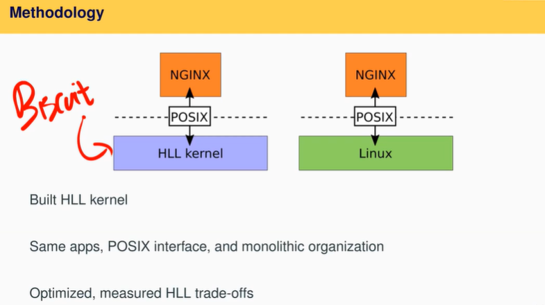
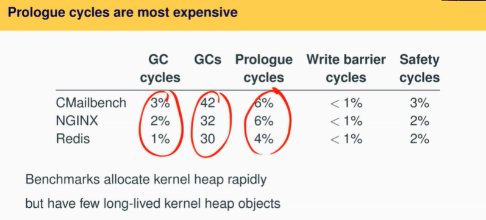

# LEC 20 (fk): Kernels and HLL

笔记大量参考了[肖宏辉](https://www.zhihu.com/people/xiao-hong-hui-15)大佬的翻译。

目录：

<!-- @import "[TOC]" {cmd="toc" depthFrom=2 depthTo=2 orderedList=false} -->

<!-- code_chunk_output -->

- [C语言实现操作系统的优劣势](#c语言实现操作系统的优劣势)
- [高级编程语言（HLL）实现操作系统的优劣势](#高级编程语言hll实现操作系统的优劣势)
- [本节 HLL 论文概述](#本节-hll-论文概述)
- [总结：Should one use HLL for a new kernel?](#总结should-one-use-hll-for-a-new-kernel)

<!-- /code_chunk_output -->

细分目录：

<!-- @import "[TOC]" {cmd="toc" depthFrom=2 depthTo=6 orderedList=false} -->

<!-- code_chunk_output -->

- [C语言实现操作系统的优劣势](#c语言实现操作系统的优劣势)
  - [C 语言实现 OS 的优势](#c-语言实现-os-的优势)
  - [C 语言实现 OS 的劣势](#c-语言实现-os-的劣势)
- [高级编程语言（HLL）实现操作系统的优劣势](#高级编程语言hll实现操作系统的优劣势)
  - [高级编程语言实现 OS 优势](#高级编程语言实现-os-优势)
  - [高级编程语言实现 OS 劣势](#高级编程语言实现-os-劣势)
- [本节 HLL 论文概述](#本节-hll-论文概述)
  - [论文的目标是能够测量出高级编程语言的优劣势](#论文的目标是能够测量出高级编程语言的优劣势)
  - [高级编程语言选择 Golang](#高级编程语言选择-golang)
  - [Biscuit 操作系统](#biscuit-操作系统)
  - [Biscuit 实现的困难： Heap Exhaustion](#biscuit-实现的困难-heap-exhaustion)
    - [不能解决 Heap Exhaustion 的方案（strawman）](#不能解决-heap-exhaustion-的方案strawman)
    - [BISCUIT solution: reserve memory](#biscuit-solution-reserve-memory)
  - [HLL benefits 概述](#hll-benefits-概述)
    - [HLL benefits 之提供了 GC](#hll-benefits-之提供了-gc)
    - [Read-lock-free example （引出 RCU）](#read-lock-free-example-引出-rcu)
    - [HLL 是否能阻止前面提到的内核漏洞](#hll-是否能阻止前面提到的内核漏洞)
  - [HLL performance cost](#hll-performance-cost)
- [总结：Should one use HLL for a new kernel?](#总结should-one-use-hll-for-a-new-kernel)
  - [怎么在硬件上直接运行 Go runtime ？](#怎么在硬件上直接运行-go-runtime)
  - [关于 goroutine 其他问题](#关于-goroutine-其他问题)

<!-- /code_chunk_output -->

## C语言实现操作系统的优劣势

今天我们要讨论使用高级编程语言实现操作系统的优点和代价。今天课程的内容主要是[我们之前写的一篇论文](../lec/biscuit.pdf)，论文作者包括了Robert和我，以及一个主要作者Cody Cutler，他是这门课程的一个TA。我通常不会讨论我们自己写的论文，但是因为这篇论文与课程内容相关，所以它在这。今天我们会用一些PPT，而不是在白板上讲解这节课。

这篇论文的起因是这样一个问题：你应该用什么样的编程语言来实现操作系统内核？这个问题很多同学都问过，可能是因为你发现了在操作系统中有Bug，然后你会想，如果我使用一种其他的编程语言，或许我就不会有这些Bug了，所以这是一个经常出现的问题。虽然这也是操作系统社区里的一个热烈争论的问题，但是并没有很多事实来支撑这里的讨论。在课程结束的时候，我们其实也不能对这个问题有个干脆的回答。但是至少这篇论文贡献了一些数据使得你可以对应该使用什么样的编程语言来实现内核这个话题，有一些更深入的讨论。这是这篇论文的出发点。

为了能回答上面的问题，我们使用了一个带自动内存管理的编程语言写了一个新的内核，所以现在内核带了Garbage Collector，你不用调用free来释放内存，这样就可以避免一类Bug。GC是高级编程语言通常都带有的属性，我们选择了一种带GC的编程语言，并且实现过程中我们遵循了传统的monolithic UNIX风格，这样我们才能做出公平的对比。实际上，从某些角度你可以认为我们创建的是类似于XV6的内核，但是拥有了更多的特性和更高的性能。你知道的，XV6中里存在各种O(n^2)算法和O(n)的查找，如果你想要写一个高性能的操作系统，你不能有这样的实现。以上就是论文的起因，以及我们创建Biscuit（也就是上面提到的操作系统）的原因，我们想要回答上面的问题，或者至少给出一些启发。

今天这节课首先我要讨论一些通用的背景，之后我们会深入到Biscuit的细节中。

现在很多操作系统都是用C实现的，你知道的，XV6是用C写的，一些更流行的运行在你的电脑、手机的操作系统，例如Windows，Linux，以及各种形式的BSD都是用C写的。

### C 语言实现 OS 的优势

为什么它们都是用C实现的呢？
- 首先C提供了大量的控制能力，从我们的实验中你可以看到，C可以完全控制内存分配和释放
- C语言几乎没有隐藏的代码，你几乎可以在阅读C代码的时候想象到对应的RISC-V机器指令是什么
- 通过C可以有直接内存访问能力，你可以读写PTE的bit位或者是设备的寄存器
- 使用C会有极少的依赖，因为你不需要一个大的程序运行时。你几乎可以直接在硬件上运行C程序。你们可以在XV6启动过程中看到这一点， 只通过几行汇编代码，你就可以运行C代码

### C 语言实现 OS 的劣势

以上就是C代码的优点，也是我们喜欢C语言的原因。但是C语言也有一些缺点。

在过去几十年已经证明了，很难写出安全的C代码。这里存在各种各样的Bug
- 首先是最著名的buffer overrun，比如说数组越界，撑爆了Stack等等
- 其次是use-after-free bugs，你可能会释放一些仍然在使用的内存，之后其他人又修改了这部分内存。
- 第三，当线程共享内存时，很难决定内存是否可以被释放。其中一些Bug在XV6中已经出现，其他的一些不太常见

因为XV6很少有动态内存分配，几乎所有的东西都是预分配的，所以共享内存Bug很少出现，但是buffer overrun和use-after-free bugs的确出现过。

CVEs一个跟踪所有的安全漏洞的组织，如果你查看他们的网站，你可以发现，在2017年有40个Linux Bugs可以让攻击者完全接管机器。很明显，这些都是非常严重的Bugs，这些Bug是由buffer overrun和一些其他memory-safety bug引起。这就太糟糕了，如果你用C写代码，就很难能够完全正确运行。当然，我可以肯定你们在之前的实验中都见过了这些Bug，之前在课程论坛上的一些问题涉及了use-after-free Bug。特别是在copy-on-write lab中，这些问题出现了好几次。

## 高级编程语言（HLL）实现操作系统的优劣势

### 高级编程语言实现 OS 优势

高级编程语言吸引人的一个原因是它提供了memory-safety，所以上一节中CVEs提到的所有Bugs，都将不再存在。要么当它们发生时程序运行时会检查数组是否越界，如果越界了就panic；要么高级编程语言不允许你写出引起Bug的代码，所以这些问题完全不可能出现。

当然，高级编程语言还有一些其他的优点：
- 首先是Type safety，类型安全
- 通过GC实现了自动的内存管理，所以free更容易了，你都不用去考虑它，GC会为你完成所有的内存释放工作
- 对并发更友好
- 有更好的抽象，接口和类等面向对象的语法使得你可以写出更加模块化的代码

### 高级编程语言实现 OS 劣势

高级编程语言有这么多优势，你不禁会想它有哪些缺点呢？为什么XV6或者Linux没有用Java，Golang，Python来写？

这里的原因是高级编程语言通常有更差的性能。高级编程语言通常都有一些额外的代价，这被称为High Level Language Tax。

- 比如说在索引一个数组元素时检查数据边界，比如说检查空指针，比如说类型转换。
- 除此之外，GC也不是没有代价的，需要花费一些时间来跟踪哪些对象可以被释放。

除了性能之外，高级编程语言与内核编程本身不兼容。
- 比如说高级编程语言没有直接访问内存的能力，因为这从原则上违反了Type safety。
- 高级编程语言不能集成汇编语言，而在内核中的一些场景你总是需要一些汇编程序，比如说两个线程的context switching，或者系统启动
- 编程语言本身支持的并发与内核需要的并发并不一致，比如我们在调度线程的时候，一个线程会将锁传递给另一个线程。一些并发管理模式在用户程序中不太常见，但是在内核中会出现。

## 本节 HLL 论文概述

### 论文的目标是能够测量出高级编程语言的优劣势

今天论文的目标是能够测量出高级编程语言的优劣势，并从safety，programmability和性能损失角度，探索使用高级编程语言而不是C语言实现内核的效果。

当然，为了做到这一点，你需要在一个产品级的内核上做实验，而不是在XV6上。XV6现在是由C语言写的很慢的内核，如果你用Golang也写了个很慢的内核，这不能说明C还是Golang更快，这只能说明XV6很慢。所以，你会想要在一个为高性能而设计的内核中完成这里的测量。

很奇怪之前并没有一个论文完成了这里的测量。有很多论文研究了在用户程序中高级编程语言的优劣势，但是你知道的，内核与用户程序还是很不一样的，比如内核中需要有更小心的内存管理，内核中的并发或许会略有不同。所以，现在我们想要在内核中而不是用户程序中完成分析，而我们并没有找到之前的任何论文真正做了这个工作。

之前的确有很多内核是用高级编程语言写的，这里有很长的历史，甚至可以回溯到最早的计算机中。但是最近的一些基于高级编程语言的内核并不是为了评估High Level Language Tax，而是为了探索新的内核设计和新的内核架构，所以这些内核并没有在保持结构相同的同时，直接对比C语言内核。只有保持系统结构相同，你才可以真正的关注语言本身，而不是一些其他的问题。

为什么没有很多论文做这样的对比测试？一个原因可能是这里的工作有点棘手。如果你想得到正确的结果，你需要与产品级别的C内核进行对比，例如Linux，Windows等等。同时，你也需要构建一个产品级别的内核。很明显，这对于一个小的团队来说很难，因为有许多许多的Linux开发人员日复一日做了许多许多的更新才创造了Linux，所以很难用高级编程语言实现同样的功能并构建同样的内核，所以我们这里会构建一个功能稍微少的系统内核。

所以我们能做到的最好情况是：
- 用高级编程语言构建内核
- 保留与Linux中最重要的部分对等的功能
- 优化性能使得其与Linux基本接近，即使这里的功能与Linux并不完全一致，但是我们至少可以将它们拉到一个范围内
- 最后我们就可以测量高级编程语言的优劣

当然，这种方法的风险在于我们构建的内核与Linux还是略有不同，它不会与Linux完全一样，所以在得出结论时需要非常小心。这就是为什么不能对论文提出的问题（注，也就是应该使用什么样的编程语言实现操作系统）给出一个十分清晰的答案的原因。尽管如此，我们还是可以期望更深入的了解这个问题，而不是完全不知道它的内容。

以上就是论文的背景，以及为什么很少有人会做同样的工作的原因。

### 高级编程语言选择 Golang



接下来我们看一下对比方法，图中左边是Biscuit，这是一个我们为了论文专门用Golang写的内核，它以大概类似的方式提供了Linux中系统调用的子集。Biscuit和Linux的系统调用有相同的参数和相同的调用方式。并且我们在内核之上运行的是相同的应用程序，这里的应用程序是NGINX，这是一个web server，这里我们将相同的应用程序分别运行在Biscuit和Linux之上，应用程序会执行相同的系统调用，并传入完全相同的参数，Biscuit和Linux都会完成涉及系统调用的相同操作。之后，我们就可以研究高级编程语言内核和Linux之间的区别，并讨论优劣势是什么。以上就是对比方法的核心。

因为Linux和Biscuit并不完全一样，它们会有一些差异，所以我们花费了大量的时间来使得这里的对比尽可能的公平。

有很多同学可能会问，这里会使用什么样的高级编程语言呢？基于以下原因，我们选用了Golang。
- 这是一个静态编译的编程语言，不像Python这里没有解释器。我们喜欢静态编译的语言的原因是编译语言性能通常更好，实际上Go编译器就非常好，所以基本上来说这是一种高性能编程语言
- 另外，Golang被设计成适合系统编程，而内核就是一种系统编程所以Golang也符合这里的场景。例如：
  - Golang非常容易调用汇编代码，或者其他的外部代码
  - Golang能很好的支持并发
  - Golang非常的灵活
- 另一个原因是Golang带有Garbage Collector。使用高级编程语言的一个优点就是你不需要管理内存，而GC是内存管理的核心

在我们开始写论文的时候，Rust并不十分流行，并且也不是十分成熟和稳定。但是如果你现在再做相同的事情，你或许会想要用Rust来实现。因为Rust也是为系统编程而设计，它有一个小的运行时，它能生成好的代码。不过Rust相比Golang还有一个缺点，Rust认为高性能程序不能有GC，所以Rust不带GC。实际上Rust的类型系统以一种非常聪明且有趣的方式实现，所以GC对于Rust并不是必须的。这里涉及到一个有趣的问题：通过高级编程语言实现内核时，GC的代价到底有多少？而Rust通过不使用GC而跳过了这个问题。

- 学生提问：如果我们这里使用Rust而不是Golang来实现高级编程语言内核，通过一定的优化有没有可能达到比C内核更高的性能？
- Frans教授：因为我们没有做过这样的实验，所以我就猜一下。我觉得不会有比C内核更高的性能，但是基本在同一个范围内。因为C是如此的底层，你可以假设你在Rust做的工作，都可以在C中完成。

这里有一个问题，并且在这节课最后我们会再次回顾这个问题。我们想要使用高级编程语言内核的部分原因是为了避免一类特定的Bug，那么你可以问自己的一个问题的是，你们在实验中遇到的Bug，是否可以通过使用高级编程语言来避免？我肯定你可以回想起一些Bug，它们耗费了你很多的时间，很多精力，现在你可以问自己，如果实验中的XV6是使用某种高级编程语言实现的，你的生活会不会更轻松一些？你是否能有更多时间做一些其他的事情。让我们记住这个问题，并在这节课结束的时候再看这个问题。

### Biscuit 操作系统

接下来我将对Biscuit稍作介绍，包括了Biscuit是如何工作的，以及在实现中遇到的问题。其中有些问题是预期内的，有些问题不在预期之内。


就像Linux和XV6一样，Biscuit是经典的monolithic kernel。所以它也有用户空间和内核空间，用户空间程序可能是你的编译器gcc，或者论文中主要用到的webserver。这里用户空间程序主要用C实现，尽管原则上它可以是任何编程语言实现的，但是因为这里只是性能测试，我们这里统一选用的是C版本的应用程序。大部分用户程序都是多线程的，所以不像在XV6中每个用户程序只有一个线程，在Biscuit中支持用户空间的多线程。 **基本上，对于每个用户空间线程，都有一个对应的位于内核的内核线程，这些内核线程是用Golang实现的，在Golang里面被称为goroutine。你可以认为goroutine就是普通的线程，就像XV6内核里的线程一样。区别在于，XV6中线程是由内核实现的，而这里的goroutine是由Go runtime提供。所以Go runtime调度了goroutine，Go runtime支持sleep/wakeup/conditional variable和同步机制以及许多其他特性，所以这些特性可以直接使用而不需要Biscuit再实现一遍。**

**Biscuit中的Go runtime直接运行在硬件上，稍后我将介绍更多这部分内容，但是你现在可以认为当机器启动之后，就会启动Go runtime。** 这里会稍微复杂，因为Go runtime通常是作为用户空间程序运行在用户空间，并且依赖内核提供服务，比如说为自己的heap向内核申请内存。 **所以Biscuit提供了一个中间层，使得即使Go runtime运行在裸金属之上，它也认为自己运行在操作系统之上，这样才能让Go runtime启动起来。**

Biscuit内核本身与XV6非常相似，除了它更加的复杂，性能更高。它有虚拟内存系统可以实现mmap，有更高性能的文件系统，有一些设备驱动，比如磁盘驱动，以及网络协议栈。所以Biscuit比XV6更加完整，它有58个系统调用，而XV6只有大概18-19个系统调用；它有28000行代码，而XV6我认为只有少于10000行代码。所以Biscuit有更多的功能。

- 学生提问：这里的接口与XV6类似对吧，所以进程需要存数据在寄存器中，进程也会调用ECALL。
- Frans教授：我稍后会再做介绍，但是这里完全相同。

以上是Biscuit的特性，有些我已经提到过了。
- 首先它支持多核CPU。Golang对于并发有很好的支持，所以Biscuit也支持多核CPU。类似的，XV6却只对多核CPU有有限的支持。所以在这里，我们相比XV6有更好的同步协调机制。
- 它支持用户空间多线程，而XV6并没有。
- 它有一个相比XV6更高性能的Journaled File System（注，Journaled就是指log，可以实现Crash Recovery）。如果你还记得EXT3论文，它与EXT3的Journaled File System有点类似。
- 它有在合理范围内较为复杂的虚拟内存系统，使用了VMAs并且可以支持mmap和各种功能
- 它有一个完整的TCP/IP栈，可以与其他的服务器通过互联网连接在一起
- 它还有两个高性能的驱动，一个是Intel的10Gb网卡，以及一个非常复杂的磁盘驱动AHCI，这比virtIO磁盘驱动要复杂的多

Biscuit支持的用户程序中：
- 每个用户程序都有属于自己的Page Table
- 用户空间和内核空间内存是由硬件隔离的，也就是通过PTE的User/Kernel bit来区分
- 每个用户线程都有一个对应的内核线程，这样当用户线程执行系统调用时，程序会在对应的内核线程上运行。如果系统调用阻塞了，那么同一个用户地址空间的另一个线程会被内核调度起来
- 如之前提到的，内核线程是由Go runtime提供的goroutine实现的。如果你曾经用Golang写过用户空间程序，其中你使用go关键字创建了一个goroutine，这个goroutine就是Biscuit内核用来实现内核线程的goroutine。

来看一下系统调用。就像刚刚的问题一样，这里的系统调用工作方式与XV6基本一致：
- 用户线程将参数保存在寄存器中，通过一些小的库函数来使用系统调用接口
- 之后用户线程执行SYSENTER。现在Biscuit运行在x86而不是RISC处理器上，所以进入到系统内核的指令与RISC-V上略有不同
- 但是基本与RISC-V类似，控制权现在传给了内核线程
- 最后内核线程执行系统调用，并通过SYSEXIT返回到用户空间

所以这里基本与XV6一致，这里也会构建trapframe和其他所有的内容。

- 学生提问：我认为Golang更希望你使用channel而不是锁，所以这里在实现的时候会通过channel取代之前需要锁的场景吗？
- Frans教授：这是个好问题，我会稍后看这个问题，接下来我们有几页PPT会介绍我们在Biscuit中使用了Golang的什么特性，但是我们并没有使用太多的channel，大部分时候我们用的就是锁和conditional variable。所以某种程度上来说Biscuit与XV6的代码很像，而并没有使用channel。我们在文件系统中尝试过使用channel，但是结果并不好，相应的性能很差，所以我们切换回与XV6或者Linux类似的同步机制。

在实现Biscuit的时候有一些挑战：
- 首先，我们需要让Go runtime运行在裸金属之上。我们希望对于runtime不做任何修改或者尽可能少的修改，这样当Go发布了新的runtime，我们就可以直接使用。在我们开发Biscuit这几年，我们升级了Go runtime好几次，所以Go runtime直接运行在裸金属之上是件好事。并且实际上也没有非常困难。Golang的设计都非常小心的不去依赖操作系统，因为Golang想要运行在多个操作系统之上，所以它并没有依赖太多的操作系统特性，我们只需要仿真所需要的特性。大部分这里的特性是为了让Go runtime能够运行起来，一旦启动之后，就不太需要这些特性了。
- 我们需要安排goroutine去运行不同的应用程序。通常在Go程序中，只有一个应用程序，而这里我们要用goroutine去运行不同的用户应用程序，这些不同的用户应用程序需要使用不同的Page Table。这里困难的点在于，Biscuit并不控制调度器，因为我们使用的是未经修改过的Go runtime，我们使用的是Go runtime调度器，所以在调度器中我们没法切换Page Table。Biscuit采用与XV6类似的方式，它会在内核空间和用户空间之间切换时更新Page Table。所以当进入和退出内核时，我们会切换Page Table。这意味着像XV6一样，当你需要在用户空间和内核空间之间拷贝数据时，你需要使用copy-in和copy-out函数，这个函数在XV6中也有，它们基本上就是通过软件完成Page Table的翻译工作。
- 另一个挑战就是设备驱动，Golang通常运行在用户空间，所以它并不能从硬件收到中断。但是现在我们在裸金属上使用它，所以它现在会收到中断，比如说定时器中断，网卡中断，磁盘驱动中断等等，我们需要处理这些中断。然而在Golang里面并没有一个概念说是在持有锁的时候关闭中断，因为中断并不会出现在应用程序中，所以我们在实现设备驱动的时候要稍微小心。我们采取的措施是在设备驱动中不做任何事情，我们不会考虑锁，我们不会分配任何内存，我们唯一做的事情是向一个非中断程序发送一个标志，之后唤醒一个goroutine来处理中断。在那个goroutine中，你可以使用各种各样想要的Golang特性，因为它并没有运行在中断的context中，它只是运行在一个普通goroutine的context中。
- 前三个挑战我们完全预料到了，我们知道在创造Biscuit的时候需要处理它们，而最难的一个挑战却不在我们的预料之中。这就是heap耗尽的问题。所以接下来我将讨论一下heap耗尽问题，它是什么，它怎么发生的，以及我们怎么解决的？

### Biscuit 实现的困难： Heap Exhaustion

让我们讨论一下Heap耗尽问题，我不会像论文一样深入讨论，但是至少会演示问题是什么。


假设蓝色的矩形是内核，内核会有一个heap，它会从其中申请动态内存。在XV6中，我们并没有这样一个heap，我们在内核中没有内存分配器，所有内存都是静态分配的。但是任何其他的内核中，都会有heap，所以你在内核中可以调用malloc和free。可能通过heap分配的对象有socket对象，文件描述符对象和进程对象。所以，我们在XV6中静态分配的所有结构体，例如struct proc，struct fd，在正常的内核中都是动态分配的。所以当你打开一个新的文件描述符时，内核会通过heap分配一个文件描述符对象。

这里的问题是，你可以运行很多个应用程序，它们会打开很多个文件描述符，拥有很多个socket，它们会逐渐填满heap。

在某个时间点，heap会被填满，这时没有额外的空间可以用来分配一个新的对象。如果这时应用程序需要打开一个新的文件描述符，或者调用了fork使得内核想要在heap中分配一个新的proc结构体，heap中没有了空间。这时你该怎么办呢？这是一个不太常见的常见问题，但是如果你使劲用你的电脑，你或许会遇到所有内存都被使用了的情况，你的heap满了，并且没有进程调用free，因为它们都还在运行且想分配更多的内存。所有的内核都会遇到这个问题，不管是C内核也好，Biscuit也好，任何内核都需要解决这个问题。

**之所以这个问题对于我们来说是个严重的问题，是因为在很多内核中，你可以对malloc返回错误，实际上，XV6就是这么做的。但是在Go runtime中，当你调用new来分配一个Go对象，并没有error condition，new总是可以成功。让我们来讨论一些可以解决这里问题的方法。**

#### 不能解决 Heap Exhaustion 的方案（strawman）


- 第一种方法我们在XV6中见过。如果XV6不能找到一个空闲的block cache来保存disk block，它会直接panic。这明显不是一个理想的解决方案。这并不是一个实际的解决方案，所以我们称之为strawman。
- 另一个strawman方法是，当你在申请一块新的内存时，你会调用alloc或者new来分配内存，你实际上可以在内存分配器中进行等待。这实际上也不是一个好的方案，原因是你可能会有死锁。假设内核有把大锁，当你调用malloc，因为没有空闲内存你会在内存分配器中等待，那么这时其他进程都不能运行了。因为当下一个进程想要释放一些内存时，但是因为死锁也不能释放。对于内核中有大锁的情况，这里明显有问题，但是即使你的锁很小，也很容易陷入到这种情况：在内存分配器中等待的进程持有了其他进程需要释放内存的锁，这就会导致死锁的问题。
- 下一个strawman方法是，如果没有内存了就返回空指针，你检查如果是空指针就直接失败，这被称为bail out。但是bail out并不是那么直观，进程或许已经申请了一些内存，那么你需要删除它们，你或许做了一部分磁盘操作，比如说你在一个多步的文件系统操作中间，你只做了其中的一部分，你需要回退。所以实际中非常难做对。

当研究这部分，并尝试解决这个问题，Linux使用了前面两种方法，但是两种方法都有问题。实际中，内核开发人员很难将这里弄清楚。如果你对这个问题和相关的讨论感兴趣，可以Google搜索“too small to fail”，会有一篇小的文章讨论释放内存，在内存分配器中等待的复杂性。

对于Biscuit来说，strawman 2 解决方案不可能实施，因为new不会fail，它总是能成功。除此之外，这里的方案都不理想，所以我们需要有一种更好的方法。

#### BISCUIT solution: reserve memory

Biscuit的解决方案非常直观，当应用程序执行系统调用，例如read，fork时，在系统调用的最开始，跳转到内核之前，它会先调用reserve函数，reserve函数会保留足够的内存以运行系统调用。所以reserve会保留足够这个系统调用使用的空闲内存，以使得系统调用总是能成功。所以一旦系统调用被执行，且保留了足够的内存，那么它就可以一直运行而不会有内存耗尽和heap exhaustion的问题。

如果reserve函数执行时没有足够的内存，那么程序会在这里等待。因为现在在系统调用的最开始，系统调用现在还没有持有任何的锁，也没有持有任何的资源，所以在这里等待完全没有问题，也不会有死锁的风险。当程序在等待的时候，内核可以撤回cache并尝试在heap增加空闲空间，比如说kill一个进程来迫使释放一些内存。一旦内存够用了，并且内核决定说是可以满足需要保留的内存，之后内核会让系统调用继续运行，然后执行系统调用需要的操作。

在最后，当系统调用完成的时候，所有之前保留的内存都返回到池子中，这样后续的系统调用可以继续使用。

这个方案中有一些很好的特性：
- 在内核中没有检查。你不需要检查内存分配是否会失败，在我们的例子中这尤其的好，因为在Golang中内存分配不可能会失败。
- 这里没有error handling代码。
- 这里没有死锁的可能，因为你在最开始还没有持有锁的时候，就避免了程序继续执行。

当然，现在的问题是如何实现reserve函数，你如何计算运行一个系统调用会需要多少内存？

你保留的内存数量是重要的，你可以为每个系统调用保留一半的内存或者一些其他夸张的内存数量。但是这意味着你限制了可以并发执行的系统调用的个数，所以你这里尽量精确的计算一个系统调用的内存边界。


这里的解决方法是使用了高级编程语言的特性。Golang实际上非常容易做静态分析，Go runtime和Go生态里面有很多包可以用来分析代码，我们使用这些包来计算系统调用所需要的内存。所以你可以想象，如果你有一个read系统调用，我们可以通过系统调用的函数调用图查看比如函数f调用函数g调用函数h等等等等。我们可以做的是弄清楚这里调用的最大深度，对于最大的深度，计算这里每个函数需要的内存是多少。

比如说函数f调用了new，因为这是一个高级编程语言，我们知道new的对象类型，所以我们可以计算对象的大小。我们将所有的new所需要的内存加起来，得到了一个总和S，这就是这个调用图（或者说系统调用）任何时间可能需要的最大内存。

实际中并没有这么简单，会有点棘手。因为函数h可能会申请了一些内存，然后再回传给函数g。所以当h返回时，g会得到h申请的一些内存。这被称为escaping，内存从h函数escape到了函数g。

存在一些标准算法来完成这里的escape分析，以决定哪些变量escape到了函数调用者。当发生escape时，任何由函数h申请的内存并且还在函数g中存活，我们需要将它加到函数g的内存计数中，最后加到S中。

- 学生提问：某些函数会根据不同的工作负载申请不同量的内存，那么在计算函数消耗的内存时，会计算最差的情况吗？
- Frans教授：是的。这里的工具会计算最深函数调用时最大可能使用的内存量。所以它会计算出每个系统调用可能使用的最多内存，虽然实际中系统调用可能只会使用少的多的内存。但是保险起见，我们会为最坏情况做准备。一些系统调用内的for循环依赖于传给系统调用的参数，所以你不能静态的分析出内存边界是什么。所以在一些场景下，我们会标注代码并规定好这是这个循环最大循环次数，并根据这个数字计算内存总量S。
- 类似的，如果有你有递归调用的函数，谁知道会递归多少次呢？或许也取决于一个动态变量或者系统调用的参数。实际中，我们在Biscuit中做了特殊处理以避免递归函数调用。所以最后，我们才可能完成这里的内存分析。

所以，这里的内存分析不是没有代价的，也不是完全自动的。这花费了Cody（论文一作）好几天检查代码，检查所有的循环并标注代码。还有一些其他的Golang特有的问题需要处理，例如，向Slice添加元素可能会使内存使用量扩大一倍，所以我们也给Slice标注了最大的容量。但是所有这些工作都是可完成的，在花费了几天时间之后，使用这里的内存分析工具，你可以得到对于系统调用使用的最大内存量的合理评估。以上基本就是Biscuit如何解决heap exhaustion问题。

- 学生提问：这里的静态内存分析工具，如果不是用来构建内核，它们通常会用来干嘛？
- Frans教授：Go编译器内部使用它来完成各种各样的优化，并分析得出最优的编译方式。这里正好编译器使用了一个包，我们也可以使用同样的包。在后面你还可以看到，我们还将它用于一些其他特性，有这么一个包非常的方便。

### HLL benefits 概述

Biscuit的实现与其他内核，例如XV6，非常相似，除了Biscuit比XV6性能要高的多。Biscuit采用了很多Linux内核的优化和聪明的设计：
- 我们对于内核文本采用了大页，以避免TLB的代价
- 我们有针对每个CPU的网卡队列，这样可以避免CPU核之间同步
- 我们有RCU实现了不需要读锁的Directory Cache
- ……

通常为了高性能而做的优化，编程语言并不会成为阻碍。Golang并没有成为阻碍这些优化实现的因素。这些优化之前是在C和Linux中实现，我们现在只是在Golang中又实现它们。在实现这些优化时有很多的工作，但是这些工作与编程语言本身无关。

今天论文的出发点就是了解用高级编程语言实现操作系统的收益和代价。所以我们将分两部分来评估，首先是收益，其次是代价。

有关高级编程语言，我们要回答三个问题：
- 首先，我们有没有作弊？或许我们避免使用了所有Golang提供的高级编程语言中代价较高的功能
- 其次，高级编程语言是否有简化Biscuit代码？
- 最后，高级编程语言是否能阻止前面提到的内核漏洞？

首先，我们有没有使用高级编程语言的特性？我们会对比一下Biscuit与其他两个大的Golang项目在使用语言特性上是否类似，这样我们才可使说我们的内核以类似的方式利用了相同的语言特性。这里我们使用了相同的静态分析工具来分析两个大的Golang项目，它们都有超过100万行代码，其中一个项目是Go runtime以及包含的所有包，另一个是一个叫做Moby的系统。


之后我们画出了一些高级语言特性在每1000行代码中的使用量。图中X轴是语言特性：
- allocation对应于new
- maps就是hashtable
- slice是动态数组
- channel是同步的工具，如你所见我们用的很少，Go runtine和Moby也用的很少
- 很明显我们最喜欢的特性就是函数返回多个值
- 我们使用了Closure（闭包）
- 我们稍微使用了defer
- 我们使用了Interface
- 使用了Type assertion来以一种类型安全的方式将一个类型转换成另一个类型
- 同时我们也import了很多包，Biscuit内核是由很多个包构建出来的，而不是一个大的单一的程序

如你所见，有些特性Biscuit用的比Go runtime和moby更少，有些特性Biscuit用的更多，这里没有很明显的区别。所以从这张图中可以得出的主要结论是：Biscuit使用了Golang提供的高级编程语言特性，而不是为了得到好的性能而避开使用它们。

- 学生提问：你这里是怎么统计的？是不是使用了静态分析工具？
- Frans教授：是的，这里使用的就是静态分析工具。通过写一个小程序利用静态分析工具来查看这些项目的每一行代码，并记录对应的特性是什么，这样就能统计这些特性的使用数量。

#### HLL benefits 之提供了 GC

第二个问题有点主观，高级编程语言有没有简化Biscuit代码？笼统的说我认为有的，我这里会讨论一两个例子。

**使用Garbage allocation是极好的，你可以回想XV6，当你调用exit时，有大量的数据结构需要被释放回给内核，这样后面的进程才能使用。如果使用Garbage Collector这里的工作着实容易，Garbage Collector会完成这里的所有工作，你基本不用做任何事情。如果你从地址空间申请了一段内存，对应这段内存的VMA会自动被GC释放，所以这里可以简化代码。**

如之前所说的，函数返回多个值对于代码风格很好。闭包很好，map也很好。XV6中很多地方通过线性扫描查找数据，但是如果你有map和hashtable作为可以直接使用的对象，那么你就不用线性扫描了。你可以直接使用map，runtime会高效的为你实现相应的功能。所以直观上的感受是，你可以得到更简单的代码。

但是前面只是定性的评估，下面会介绍一些更具体的例子。当有大量的并发线程，且线程有共享的数据时，GC如何起作用的。

```go
buf := new(object_t)
// Initialize buf...

go func() {
  process1(buf)
}()
process2(buf)
// When should C code free(buf)?
```

这里有个最简单的例子。假设你申请了一些动态的对象，比如说buffer，你fork一个线程来处理这个buffer，原线程也会处理同一个buffer。当两个线程都完成了工作，buffer需要被释放，这样内存才可以被后面的内核代码使用。这在C语言里面有点难协调，因为你需要有某种方式来决定buffer不再被使用。如果你使用GC，那么就没什么好决定的，因为当两个线程都处理完buffer之后，没有线程会指向那个buffer。GC会从线程栈开始追踪，并且在任何线程栈中都找不到buffer，因此GC会在稍后某个时间释放内存。所以在一个带GC的编程语言中，你完全不必考虑这个问题。

在C中你可以这样解决这个问题，为对象增加引用计数，引用计数需要被锁或者一些原子性操作保护，当引用计数到达0时，你可以释放内存。

#### Read-lock-free example （引出 RCU）

实际中锁加上引用计数代价稍微有点高。如果你想要高性能，并且并发可以扩展到CPU核数，这可能会是个瓶颈，我们在后面介绍RCU的时候会看这部分。所以，如果你想要高性能，好的并发能力，人们倾向于不给读数据加锁。

```go
var Head *Node

func get() *Node {
  return atomic_load(&Head)
}

func pop() {
  Lock()
  v := Head
  if v != nil {
    atomic_store(&Head, v.next)
  }
  Unlock()
}
```

在实际中，我们会使得读数据至少是不需要锁的，这样你就不需要付出额外的代价。上面是我们在Golang中的实现，我们有个get函数，它会读取并返回链表的头结点。这里就没有使用锁，而是使用了atomic_load，它会读取头结点，但是又不需要锁。后面的pop函数使用了锁。这种风格在Linux内核中非常常见，写数据需要加锁，读数据不用加锁。这里pop函数会从链表中弹出头结点，这样你就可以重用头结点对应的内存。在C中实现这种风格会有点困难，因为有可能当你释放头结点内存时，其他并发的线程正好读取到了头结点的指针。这样当你做完atomic_store，你不能释放指针内容，因为有可能有另一个线程的指针指向了这部分内容。如果你在这里释放了指针内容，你有可能会有use-after-free Bug。

我们在这门课程的最后一节课会看到，Linux内核对这个问题有一种非常聪明的解决办法，被称为Read-Copy-Update或者是RCU。它的工作就是推迟释放内存，直到确定指针不再被使用，并且它有一种非常聪明的方案来决定什么时候可以安全释放内存。但是这个方案有各种各样的限制，程序员需要在RCU关键区域内遵守各种规则。比如说你不能在RCU关键区域sleep，也不能切换线程。

所以尽管实际中Linux内核非常成功的使用了RCU，但是RCU还是有点容易出错，并且需要小心编程来使得它能正确工作。在带有GC的编程语言，例如Golang，这就不是问题了，因为GC会决定某个对象不再被使用，只有这时才释放它。所以现在对于编程人员来说没有限制了，所有的限制都被GC考虑了。这是一种带有GC的编程语言的明显优势。

#### HLL 是否能阻止前面提到的内核漏洞

接下来看看CVEs Bugs，这在前面提到过


我们手动的检查了所有的CVEs Bug，并尝试确定Golang是否修复了问题。
- 第一行代表我们不能弄清楚这些Bug的结果是什么，它会怎么展现，我们知道如何修复这些问题，但是我们不能确定Golang是否能避免这些问题
- 有很多逻辑Bug，可以认为Golang会有与C相同的Bug，所以结果是相同的
- 接下来是40个memory-safety Bugs，包括了use-after-free，double-free，out-of-bound。其中8个直接消失了，因为GC考虑了内存释放，32个会产生panic，比如说数组越界。当然panic并不好，因为内核会崩溃，但是或许要比直接的安全漏洞更好。所以在这40个Bug中，高级编程语言有帮到我们

以上就是使用高级编程语言实现内核的优势，接下来讨论一些代价，也就是High Level Language Tax。

### HLL performance cost


以上是6个问题，我应该不会全部介绍，因为我想在课程的最后留些时间来回顾我们在本节课开始时提出的问题。

测试环境见论文，Biscuit运行在裸金属之上，所以我们的测试是在物理服务器而不是QEMU之上。我们使用了三个应用程序来做性能测试，它们分别是，Webserver，K/V store，Mail server benchmark。


这三个应用程序都会给内核一定的压力，它们会执行系统调用，内核会做大量的工作。你可以看到，大部分CPU时间都在内核中。

首先的问题是，Biscuit是否是一个工业质量的内核？我们将前面的三个应用程序分别运行在Linux和Biscuit上，并进行对比。

在Linux中，我们会关闭所有Biscuit不提供的功能，比如Page Table隔离，repoline等等很多功能，这样的对比才会尽可能的公平。有些特性会比较难关闭，但是我们会尽量将它们关闭。


之后我们会测试吞吐量，如你所见Biscuit总是会比Linux更慢，mailbench可能差10%，nginx和redis差10%到15%。这里的数字并不是绝对的，因为两个系统并不完全一样。但是可以看出两个系统基本在同一个范围内，而不是差个2倍或者10倍。

接下来我们会分析代码，并找到高级编程语言额外的CPU cycle消耗。我们会找到：
- 哪些CPU cycle是GC使用的
- 哪些是函数调用的Prologue使用的。Golang会为函数调用做一些额外的工作来确保Stack足够大，这样就不会遇到Out-of-Stack的问题
- Write barrier是GC用来跟踪不同空间的指针的方法
- Safety cycles是用在数组边界检查，空指针检查上的CPU cycles



通过测试上面的应用程序，可以得到测量结果。
- 3%的执行时间用在了GC cycles中，这里我稍后会介绍为什么这很少。同时这也可以说明GC是在运行的，我们并不是用了一大块内存而没有使用GC
- 令人奇怪的是，Prologue占有的CPU时间最多，这基本上跟我们用来检查kernel Stack或者goroutine Stack是否需要增加的方案有关，这里或许更容易降低一些
- Write barrier使用的时间很少
- 2%-3%的CPU时间用在了Safety cycles中

这些数据都很好，High Level Language Tax并不是那么的大。

当然GC的占比可能会更高，因为它完全取决于heap大小和存活对象的数量，GC会跟踪所有的存活对象，并决定哪些对象已经不被使用。如果有大量的存活对象，GC也需要跟踪更多的对象。所以这里的CPU时间完全与存活对象的数量相关。

所以我们做了一些其他的实验。我们创建了大量的存活对象，大概有200万个vnode，可以认为这是200万个inode。然后修改heap的headroom，也就是GC可以使用的空闲内存数量，最后再测量GC的代价。


上图就是测量结果，存活对象占了640MB内存，我们在不同内存大小下运行测试。第一次测试时，有320MB空闲内存，是存活对象内存的一半，这时Golang有非常严重的overhead，大概是34%，GC因为没有足够的headroom需要运行很多额外的程序。如果空闲内存是存活对象的2倍，那么GC的overhead就没有那么疯狂，只有9%。所以，为了保持GC的overhead在10%以内，物理内存大小需要是heap大小的三倍。

- 学生提问：什么是write barrier？是设置权限吗？
- Frans教授：你还记得Lec17的内容吗？当GC在运行的时候，需要检查指针是否在from空间，如果在from空间你需要拷贝它到to空间。write barrier是非常类似的功能，它的想法是一样的，你需要检查指针看它是否在你需要运行GC的区域内。
- 学生提问：当存活对象的内存大于空闲内存的时候，GC该怎么工作呢？
- Frans教授：你设置一些内存，vnode会使用一些内存，然后还剩下320MB空闲内存。当应用程序申请更多内存时，首先会从空闲内存中申请，直到空闲内存也用光了。与此同时，GC也在运行。所以我们刚刚的测试中是在3个不同配置下运行，在最后一个配置中，空闲内存是存活对象占用内存的两倍。这意味着GC有大量的headroom来与应用程序并行的运行，如果有大量的headroom，GC的overhead就没那么高了，只有10%左右，而不是34%。在第一个配置中，总共是640+320MB内存，而不是只有320MB内存。

接下来稍微介绍GC pause。Go的GC是一个带有短暂pause的并发GC，它在一段非常短的时间内停止程序运行来执行write barrier，之后再恢复应用程序的运行，同时GC也会完成自己的工作。Go的GC也是递增的，就像我们在Lec17中介绍过的一样，每次调用new都会做一些GC的工作。所以每次GC做一些工作的时候，应用程序都会有一些延时，这就是代价。

所以我们做了一些测试，我们找了个应用程序并测试了最大的pause时间。也就是由于GC可能导致应用程序最大的停止时间。

最大的单个pause时间是115微秒，也就是在web server中，因为使用了TCP stack，TCP Connection table中很大一部分需要被标记（注，GC的一部分工作是标记对象），这花费了115微秒。一个HTTP请求最大的pause时间是582微秒，所以当一个请求走到一个机器，最多会有总共582微秒延时来执行这个请求。而超过100微秒的pause发生的非常非常少，只有少于0.3%。

如果你尝试达成某种SLA，其中要求的最长请求处理时间很短，那么582微秒就很严重。但是如果你查看Google论文，[The Tail at Scale](https://research.google/pubs/pub40801/)，其中介绍有关一个请求最长可以有多长处理时间，他们讨论的都是几毫秒或者几十毫秒这个量级。所以Biscuit拥有最大pause时间是582微秒还在预算之内，虽然不理想，但是也不会很夸张。这表明了，Golang的设计人员把GC实现的太好了。并且我们在做Biscuit项目的时候发现，每次我们升级Go runtime，新的runtime都会带一个更好的GC，相应的GC pause时间也会变得更小。

之前在Linux和Biscuit之间的对比并不真正的公平，因为Biscuit和Linux实现的是不同的功能。所以我们做了一个额外的测试，我们写了两个完全相同的内核，一个用C实现，另一个用Golang实现。这两个内核实现了完全相同的东西，并且我们会查看汇编代码以检查区别在哪。可能会有一些区别，因为Golang会做一些安全检查，但是对于基本功能来说，汇编代码是一样的。


以上是有关测试的一部分，通过pipe来回传输一个字节。我们查看内核中有关将一个字节从pipe的一端传到另一端的代码。Go里面是1.2K行代码，C里面是1.8K行代码。这里没有内存分配和GC，所以这里只有语言上的差异。我们还查看了两种实现语言中花费最多时间的10个地方，这样我们才能确保两种语言实现的代码尽可能的接近。


之后我们查看了每秒可以完成的操作数，如你可见Golang要慢15%。如果你查看Golang的Prologue和safety-check，这些指令是C代码所没有的，这些指令占了16%，这与更慢的处理速度匹配的上。所以这里的主要结论是Golang是更慢，但并不是非常夸张的慢，Golang还是非常有竞争力的。并且这与我们早些时候做的Biscuit和Linux对比结果一致。

## 总结：Should one use HLL for a new kernel?

最后我想讨论我们在最开始问过的一个问题，你应该在一个新内核中使用高级编程语言吗?


与其直接回答这个问题，我在这页有一些我们的结论和一些考虑。或许你们该回退一步，并问自己，你们更喜欢哪种方式？你们是喜欢像在实验中用C写XV6，还是喜欢使用类似Golang的高级编程语言。更具体的说，你们更想避免哪类Bug？或许在这节课的过程中想想你们遇到过什么Bug？我想听听你们的体验，你们是怎么想的？切换到高级编程语言会不会改变你们的体验？

当然，我们不会将XV6改成Golang或者任何高级编程语言。具体原因刚刚一些同学已经提到了，Golang还是隐藏了太多细节，这门课的意义在于理解系统调用接口到CPU之间的所有内容。 **举个例子，Golang隐藏了线程，我们并不想隐藏线程，我们想要向你解释线程是如何实现的。所以接下几年，这门课程还是会使用C语言。**

但是如果你要实现一个新的内核，并且目标不是教育你的学生有关内核的知识，目标是写一个安全的高性能内核。你可以从我们的研究中得出一些结论：
- 如果性能真的至关重要，比如说你不能牺牲15%的性能，那么你应该使用C
- 如果你想最小化内存使用，你也应该使用C
- 如果安全更加重要，那么应该选择高级编程语言
- 或许在很多场景下，性能不是那么重要，那么使用高级编程语言实现内核是非常合理的选择

Cody、Robert和我在实现这个项目的过程中学到的一件事情是，任何一种编程语言就是编程语言，你可以用它来实现内核，实现应用程序，它并不会阻止你做什么事情。

### 怎么在硬件上直接运行 Go runtime ？

- 学生提问：我很好奇你们是怎么实现的Biscuit，你们直接在硬件上运行的Go runtime，具体是怎么启动的？
- Frans教授：这里有一层中间层设置好了足够的硬件资源，这样当Go runtime为heap请求内存时，我们就可以响应。这是Go runtime依赖的一个主要内容。
- 学生提问：我知道你们实现了一些Go runtime会调用的接口，因为你们现在自己在实现内核，所以没有现成的接口可以使用。你们是全用汇编实现的这些接口吗？还是说有些还是用Golang实现，然后只在必要的时候用汇编？
- Frans教授：这就是Biscuit中1500行汇编代码的原因，它会准备好一切并运行Go runtime。有一些我们可以用C来实现，但是我们不想这么做，我们不想使用任何C代码，所以我们用汇编来实现。并且很多场景也要求用汇编，因为这些场景位于启动程序。
- 我们的确写了一些Go代码运行在程序启动的最开始，这些Go代码要非常小心，并且不做内存分配。我们尽可能的用Golang实现了，我需要查看代码才能具体回答你的问题，你也可以查看[git repo](https://github.com/mit-pdos/biscuit)。

### 关于 goroutine 其他问题

- 学生提问：我有个不相关的问题，Golang是怎么实现的goroutine，使得它可以运行成百上千个goroutine，因为你不可能运行成百上千个线程，对吧？
- Frans教授：运行线程的主要问题是需要分配Stack，而Go runtime会递增的申请Stack，并在goroutine运行时动态的增加Stack。这就是Prologue代码的作用。当你执行函数调用时，如果没有足够的Stack空间，Go runtime会动态的增加Stack。而在线程实现中，申请线程空间会是一种更重的方法，举个例子在Linux中，对应的内核线程也会被创建。
- 学生提问：goroutine的调度是完全在用户空间完成的吗？
- Frans教授：大部分都在用户空间完成。Go runtime会申请m个内核线程，在这之上才实现的的Go routine。所有的Go routine会共享这些内核线程。人们也通过C/C++实现了类似的东西。
- 学生提问：C是一个编译型语言，所以它可以直接变成汇编或者机器语言，它可以直接运行在CPU上，所以对于XV6来说就不用加中间层代码。但是我理解Golang也是一种编译型语言，所以它也会变成汇编语言，那么为什么还要中间层（位于机器和Go runtime之间）？XV6有这样的中间层吗？为什么有一些事情不能直接编译后运行在CPU上？
- Frans教授：好问题。Go runtime提供了各种你在XV6中运行C时所没有的功能。Go runtime提供了线程，提供了调度器，提供了hashtable，提供了GC。举个例子，为了支持GC，需要一个heap来申请内存，通常是向底层的操作系统来申请内存作为heap。这里说的中间层Go runtime需要用来完成工作的相应功能（比如说响应内存申请）。
- 学生提问：我们不能直接将runtime编译到机器代码吗？
- Frans教授：Runtime会被编译到机器码，但是当你运行Go代码时，有一部分程序是要提前运行的，这部分程序需要在那。即使C也有一个小的runtime，比如printf就是C runtime的中间层的一部分，或者字符串处理也是C runtime的一部分，它们也会被编译。C runtime有一些函数，但是这个runtime是如此之小，不像Go runtime需要支持许多Go程序所依赖的功能。
- 学生提问：看起来这里的中间层像是一个mini的系统层，它执行了一些底层的系统功能。
- Frans教授：是的，或许一种理解中间层的方法是，XV6也有一个非常非常小的中间层。当它启动的时候，它做的第一件事情是分配一些Stack这样你才能调用C的main函数。你可以认为这一小段代码是针对XV6的中间层。一旦你执行了这些指令，你就在C代码中了，然后一切都能愉快的运行。Go runtime的中间层稍微要大一些，因为有一些功能需要被设置好，之后Go runtime才能愉快的运行。
