# LEC 21 (rtm): Networking

笔记大量参考了[肖宏辉](https://www.zhihu.com/people/xiao-hong-hui-15)大佬的翻译。

目录：

<!-- @import "[TOC]" {cmd="toc" depthFrom=2 depthTo=2 orderedList=false} -->

<!-- code_chunk_output -->

- [计算机网络概述](#计算机网络概述)
- [运行在主机上的网络协议栈 Network Stack](#运行在主机上的网络协议栈-network-stack)
- [Receive Livelock](#receive-livelock)

<!-- /code_chunk_output -->

细分目录：

<!-- @import "[TOC]" {cmd="toc" depthFrom=2 depthTo=6 orderedList=false} -->

<!-- code_chunk_output -->

- [计算机网络概述](#计算机网络概述)
  - [基本网络场景：局域网、路由](#基本网络场景局域网-路由)
  - [二层网络 Ethernet](#二层网络-ethernet)
  - [二/三层地址转换 ARP](#二三层地址转换-arp)
  - [三层网络 Internet](#三层网络-internet)
  - [四层网络 UDP](#四层网络-udp)
- [运行在主机上的网络协议栈 Network Stack](#运行在主机上的网络协议栈-network-stack)
  - [简单的网络协议栈分层图](#简单的网络协议栈分层图)
  - [packet的控制流程是如何工作](#packet的控制流程是如何工作)
  - [当 packet 送到网卡时](#当-packet-送到网卡时)
  - [Ring Buffer](#ring-buffer)
- [Receive Livelock](#receive-livelock)
  - [中断的 Livelock](#中断的-livelock)
  - [如何解决 Livelock](#如何解决-livelock)

<!-- /code_chunk_output -->

## 计算机网络概述

今天我想讨论一下Networking以及它与操作系统的关联。今天这节课的很多内容都与最后一个lab，也就是构建一个网卡驱动相关。在这节课，我们首先会大概看一下操作系统中网络相关的软件会有什么样的结构，之后我们会讨论[今天的论文Livelock](../lec/mogul96usenix.pdf)。Livelock展示了在设计网络协议栈时可能会出现的有趣的陷阱。

### 基本网络场景：局域网、路由

首先，让我通过画图来描述一下基本的网络场景。网络连接了不同的主机，这里的连接有两种方式。

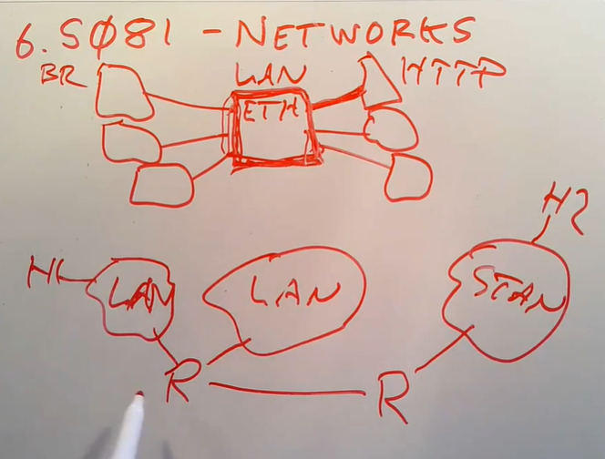

相近的主机连接在同一个网络中。例如有一个以太网设备，可能是交换机或者单纯的线缆，然后有一些主机连接到了这个以太网设备。这里的主机可能是笔记本电脑，服务器或者路由器。在设计网络相关软件的时候，通常会忽略直接连接了主机的网络设备。这里的网络设备可能只是一根线缆（几十年前就是通过线缆连接主机）；也可能是一个以太网交换机；也可能是wifi无线局域网设备（主机通过射频链路与网络设备相连）， **但是不管是哪种设备，这种直接连接的设备会在网络协议栈的底层被屏蔽掉。**

每个主机上会有不同的应用程序，或许其中一个主机有网络浏览器，另一个主机有HTTP server，它们需要通过这个局域网来相互通信。

一个局域网的大小是有极限的。局域网（Local Area Network）通常简称为LAN。一个局域网需要能让其中的主机都能收到彼此发送的packet。有时，主机需要广播packet到局域网中的所有主机。当局域网中只有25甚至100个主机时，是没有问题的。但是你不能构建一个多于几百个主机的局域网。

所以为了解决这个问题，大型网络是这样构建的。首先有多个独立的局域网，假设其中一个局域网是MIT，另一个局域网是Harvard，还有一个很远的局域网是Stanford， **在这些局域网之间会有一些设备将它们连接在一起，这些设备通常是路由器Router。** 其中一个Router接入到了MIT的局域网，同时也接入到了Harvard的局域网。

路由器是组成互联网的核心，路由器之间的链路，最终将多个局域网连接在了一起。

现在MIT有一个主机需要与Stanford的一个主机通信，他们之间需要经过一系列的路由器，路由器之间的转发称为Routing。所以我们需要有一种方法让MIT的主机能够寻址到Stanford的主机，并且我们需要让连接了MIT的路由器能够在收到来自MIT的主机的packet的时候，能够知道这个packet是发送给Harvard的呢，还是发送给Stanford的。

从网络协议的角度来说，局域网通信由以太网协议决定。而局域网之上的长距离网络通信由Internet Protocol协议决定。以上就是网络的概述。

### 二层网络 Ethernet

接下来我想介绍一下，在局域网和互联网上传递的packet有什么样的结构，之后再讨论在主机和路由器中的软件是如何处理这些packet。

让我从最底层开始，我们先来看一下一个以太网packet的结构是什么。当两个主机非常靠近时，或许是通过相同的线缆连接，或许连接在同一个wifi网络，或许连接到同一个以太网交换机。 **当局域网中的两个主机彼此间要通信时，最底层的协议是以太网协议。** 你可以认为Host1通过以太网将Frame发送给Host2。Frame是以太网中用来描述packet的单词，本质上这就是两个主机在以太网上传输的一个个的数据Byte。以太网协议会在Frame中放入足够的信息让主机能够识别彼此，并且识别这是不是发送给自己的Frame。每个以太网packet在最开始都有一个Header，其中包含了3个数据。Header之后才是payload数据。Header中的3个数据是：目的以太网地址，源以太网地址，以及packet的类型。

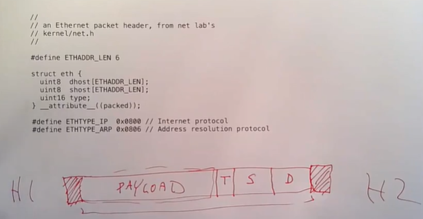

每一个以太网地址都是48bit的数字，这个数字唯一识别了一个网卡。packet的类型会告诉接收端的主机该如何处理这个packet。接收端主机侧更高层级的网络协议会按照packet的类型检查并处理以太网packet中的payload。

整个以太网packet，包括了`48bit+48bit`的以太网地址，16bit的类型，以及任意长度的payload这些都是通过线路传输。除此之外，虽然对于软件来说是不可见的，但是在packet的开头还有被硬件识别的表明packet起始的数据（注，Preamble + SFD），在packet的结束位置还有几个bit表明packet的结束（注，FCS）。packet的开头和结束的标志不会被系统内核所看到，其他的部分会从网卡送到系统内核。

如果你们查看了这门课程的最后一个lab，你们可以发现我们提供的代码里面包括了一些新的文件，其中包括了`kernel/net.h`，这个文件中包含了大量不同网络协议的packet header的定义。上图中的代码包含了以太网协议的定义。我们提供的代码使用了这里结构体的定义来解析收到的以太网packet，进而获得目的地址和类型值 **（注，实际中只需要对收到的raw data指针强制类型转换成结构体指针就可以完成解析）** 。

- 学生提问：硬件用来识别以太网packet的开头和结束的标志是不是类似于lab中的End of Packets？
- Robert教授：并不是的，EOP是帮助驱动和网卡之间通信的机制。这里的开头和结束的标志是在线缆中传输的电信号或者光信号，这些标志位通常在一个packet中是不可能出现的。以结束的FCS为例，它的值通常是packet header和payload的校验和，可以用来判断packet是否合法。

有关以太网48bit地址，是为了给每一个制造出来的网卡分配一个唯一的ID，所以这里有大量的可用数字。这里48bit地址中， **前24bit表示的是制造商，每个网卡制造商都有自己唯一的编号，并且会出现在前24bit中。（实际上就是 MAC 地址）** 后24bit是由网卡制造商提供的任意唯一数字，通常网卡制造商是递增的分配数字。所以，如果你从一个网卡制造商买了一批网卡，每个网卡都会被写入属于自己的地址，并且如果你查看这些地址，你可以发现，这批网卡的高24bit是一样的，而低24bit极有可能是一些连续的数字。

**虽然以太网地址是唯一的，但是出了局域网，它们对于定位目的主机的位置是没有帮助的。如果网络通信的目的主机在同一个局域网，那么目的主机会监听发给自己的地址的packet。但是如果网络通信发生在两个国家的主机之间，你需要使用一个不同的寻址方法，这就是IP地址的作用。**

在实际中，你可以使用tcpdump来查看以太网packet。这将会是lab的一部分。下图是tcpdump的一个输出。

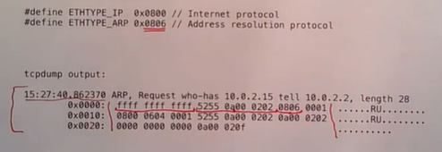

tcpdump输出了很多信息，其中包括：
- 接收packet的时间
- 第一行的剩下部分是可读的packet的数据
- 接下来的3行是收到packet的16进制数

如果按照前面以太网header的格式，可以发现packet中：
- 前48bit是一个广播地址，`0xffffffffffff`。广播地址是指packet需要发送给局域网中的所有主机
- 之后的48bit是发送主机的以太网地址，我们并不能从这个地址发现什么，实际上这个地址是运行在QEMU下的XV6生成的地址，所以地址中的前24bit并不是网卡制造商的编号，而是QEMU编造的地址
- 接下来的16bit是以太网packet的类型，这里的类型是0x0806，对应的协议是ARP
- 剩下的部分是ARP packet的payload

### 二/三层地址转换 ARP

下一个与以太网通信相关的协议是ARP。在以太网层面，每个主机都有一个以太网地址。 **但是为了能在互联网上通信，你需要有32bit的IP地址。** 为什么需要IP地址呢？因为IP地址有额外的含义。IP地址的高位bit包含了在整个互联网中，这个packet的目的地在哪。所以IP地址的高位bit对应的是网络号， **虽然实际上要更复杂一些，但是你可以认为互联网上的每一个网络都有一个唯一的网络号。路由器会检查IP地址的高bit位，并决定将这个packet转发给互联网上的哪个路由器。** IP地址的低bit位代表了在局域网中特定的主机。 **当一个经过互联网转发的packet到达了局域以太网，我们需要从32bit的IP地址，找到对应主机的48bit以太网地址。这里是通过一个动态解析协议完成的，也就是Address Resolution Protocol，ARP协议。**

当一个packet到达路由器并且需要转发给同一个以太网中的另一个主机，或者一个主机将packet发送给同一个以太网中的另一个主机时，发送方首先会在局域网中广播一个ARP packet，来表示任何拥有了这个32bit的IP地址的主机，请将你的48bit以太网地址返回过来。如果相应的主机存在并且开机了，它会向发送方发送一个ARP response packet。

下图是一个ARP packet的格式。

它会出现在一个以太网packet的payload中。所以你们看到的将会是这样的结构：首先是以太网header，它包含了48bit的目的以太网地址，48bit的源以太网地址，16bit的类型； **之后的以太网的payload会是ARP packet，包含了上图的内容。**

接收到packet的主机通过查看以太网header中的16bit类型可以知道这是一个ARP packet。在ARP中类型值是`0x0806`。通过识别类型，接收到packet的主机就知道可以将这个packet发送给ARP协议处理代码。

**有关ARP packet的内容，包含了不少信息，但是基本上就是在说，现在有一个IP地址，我想将它转换成以太网地址，如果你拥有这个IP地址，请响应我。**

同样的，我们也可以通过tcpdump来查看这些packet。在网络的lab中，XV6会在QEMU模拟的环境下发送IP packet。所以你们可以看到在XV6和其他主机之间有ARP的交互。下图中第一个packet是我的主机想要知道XV6主机的以太网地址，第二个packet是XV6在收到了第一个packet之后，并意识到自己是IP地址的拥有者，然后返回response。

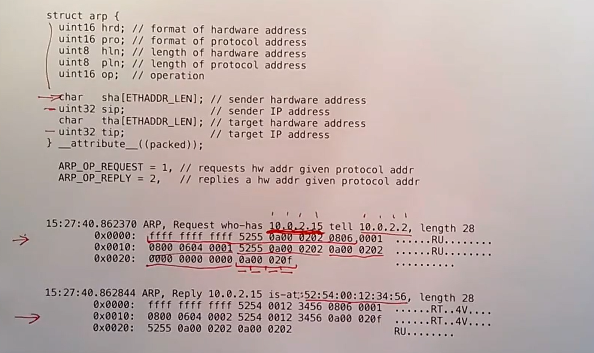

tcpdump能够解析出ARP packet，并将数据打印在第一行。对应ARP packet的格式，在第一个packet中，`10.0.2.2`是SIP（发送者的 IP），`10.0.2.15`是DIP（接收者的 IP）。在第二个packet中，`52:54:00:12:34:56`对应SHA（以太网 MAC 地址）。

同时，我们也可以自己分析packet的原始数据。对于第一个packet：
- 前14个字节是以太网header，包括了48bit目的以太网地址，48bit源以太网地址，16bit类型
- 从后往前看，倒数4个字节是TIP，也就是发送方想要找出对应以太网地址的IP地址。每个字节对应了IP地址的一块，所以`0a00 020f`对应了IP地址`10.0.2.15`
- 再向前数6个字节，是THA，也就是目的地的以太网地址，现在还不知道所以是全0
- 再向前数4个字节是SIP，也就是发送方的IP地址，`0a00 0202`对应了IP地址`10.0.2.2`
- 再向前数6个字节是SHA，也就是发送方的以太网地址
- 剩下的8个字节表明了我们感兴趣的是以太网和IP地址格式

- 学生提问：ethernet header中已经包括了发送方的以太网地址，为什么ARP packet里面还要包含发送方的以太网地址？
- Robert教授：我并不清楚为什么ARP packet里面包含了这些数据，我认为如果你想的话是可以精简一下ARP packet。或许可以这么理解，ARP协议被设计成也可以用在其他非以太网的网络中，所以它被设计成独立且不依赖其他信息，所以ARP packet中包含了以太网地址。现在我们是在以太网中发送ARP packet，以太网packet也包含了以太网地址，所以，如果在以太网上运行ARP，这些信息是冗余的。但是如果在其他的网络上运行ARP，你或许需要这些信息，因为其他网络的packet中并没有包含以太网地址。
- 学生提问：tcpdump中原始数据的右侧是什么内容？
- Robert教授：这些是原始数据对应的`ASCII`码，“`.`”对应了一个字节并没有相应的`ASCII`码，`0x52`对应了`R`，`0x55`对应了`U`。**当我们发送的packet包含了ASCII字符时，这里的信息会更加有趣。**

我希望你们在刚刚的讨论中注意到这一点， **网络协议和网络协议header是嵌套的。我们刚刚看到的是一个packet拥有了ethernet header和ethernet payload。** 在ethernet payload中，首先出现的是ARP header，对于ARP来说并没有的payload。 **但是在ethernet packet中还可以包含其他更复杂的结构，比如说ethernet payload中包含一个IP packet，IP packet中又包含了一个UDP packet，所以IP header之后是UDP header。如果在UDP中包含另一个协议，那么UDP payload中又可能包含其他的packet，例如DNS packet。** 所以发送packet的主机会按照这样的方式构建packet：DNS相关软件想要在UDP协议之上构建一个packet；UDP相关软件会将UDP header挂在DNS packet之前，并在IP协议之上构建另一个packet；IP相关的软件会将IP heade挂在UDP packet之前；最后Ethernet相关的软件会将Ethernet header挂在IP header之前。所以整个packet是在发送过程中逐渐构建起来的。

类似的，当一个操作系统收到了一个packet，它会先解析第一个header并知道这是Ethernet，经过一些合法性检查之后，Ethernet header会被剥离，操作系统会解析下一个header。在Ethernet header中包含了一个类型字段，它表明了该如何解析下一个header。同样的在IP header中包含了一个protocol字段，它也表明了该如何解析下一个header。

软件会解析每个header，做校验，剥离header，并得到下一个header。一直重复这个过程直到得到最后的数据。这就是嵌套的packet header。

### 三层网络 Internet

**Ethernet header足够在一个局域网中将packet发送到一个host。如果你想在局域网发送一个IP packet，那么你可以使用ARP获得以太网地址。但是IP协议更加的通用，IP协议能帮助你向互联网上任意位置发送packet。** 下图是一个IP packet的header，你们可以在lab配套的代码中的net.h文件找到。

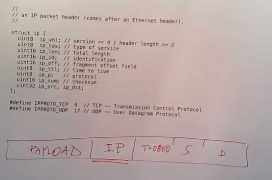

如果IP packet是通过以太网传输，那么你可以看到，在一个以太网packet中，最开始是目的以太网地址，源以太网地址，以太网类型是0x0800，之后是IP header，最后是IP payload。

**在一个packet发送到世界另一端的网络的过程中，IP header会被一直保留，而Ethernet header在离开本地的以太网之后会被剥离。或许packet在被路由的过程中，在每一跳（hop）会加上一个新的Ethernet header。但是IP header从源主机到目的主机的过程中会一直保留。**

**IP header具有全局的意义，而Ethernet header只在单个局域网有意义。所以IP header必须包含足够的信息，这样才能将packet传输给互联网上遥远的另一端。对于我们来说，关键的信息是三个部分，目的IP地址（ip_dst），源IP地址（ip_src）和协议（ip_p）。** 目的IP地址是我们想要将packet送到的目的主机的IP地址。地址中的高bit位是网络号，它会帮助路由器完成路由。IP header中的协议字段会告诉目的主机如何处理IP payload。

如果你们看到过MIT的IP地址，你们可以看到IP地址是`18.x.x.x`，虽然最近有些变化，但是在很长一段时间18是MIT的网络号。所以MIT的大部分主机的IP地址最高字节就是18。全世界的路由器在看到网络号18的时候，就知道应该将packet路由到离MIT更近的地方。

接下来我们看一下包含了IP packet的tcpdump输出。

因为这个IP packet是在以太网上传输，所以它包含了以太网header。实际上这个packet里面有点问题，我不太确定具体的原因是什么， **但是Ethernet header中目的以太网地址不应该是全f，因为全f是广播地址，它会导致packet被发送到所有的主机上。一个真实网络中两个主机之间的packet，不可能出现这样的以太网地址。** 所以我提供的针对network lab的方案，在QEMU上运行有点问题。不管怎么样，我们可以看到以太网目的地址，以太网源地址，以及以太网类型`0x0800`。`0x0800`表明了Ethernet payload是一个IP packet。

P header的长度是20个字节，所以中括号内的是IP header。

从后向前看：
- 目的IP地址是`0x0a00 0202`，也就是`10.0.2.2`
- 源IP地址是`0x0a00 020f`，也就是`10.0.2.15`
- 再向前有16bit的`checksum`，也就是`0x3eae`。IP相关的软件需要检查这个校验和，如果结果不匹配应该丢包
- 再向前一个字节是`protocol`，`0x11` **对应的是10进制17，表明了下一层协议是UDP**
- 其他的就是我们不太关心的一些字段了，例如packet的长度

IP header中的protocol字段告诉了目的主机的网络协议栈，这个packet应该被UDP软件处理

### 四层网络 UDP

IP header足够让一个packet传输到互联网上的任意一个主机，但是我们希望做的更好一些。每一个主机都运行了大量需要使用网络的应用程序，所以我们需要有一种方式能区分一个packet应该传递给目的主机的哪一个应用程序，而IP header明显不包含这种区分方式。有一些其他的协议完成了这里的区分工作，其中一个是TCP，它比较复杂，而另一个是UDP。TCP不仅帮助你将packet发送到了正确的应用程序，同时也包含了序列号等用来检测丢包并重传的功能，这样即使网络出现问题，数据也能完整有序的传输。相比之下，UDP就要简单的多，它以一种“尽力而为”的方式将packet发送到目的主机，除此之外不提供任何其他功能。

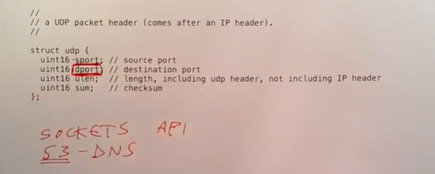

**UDP header中最关键的两个字段是sport源端口和dport目的端口。**

当你的应用程序需要发送或者接受packet，它会使用socket API，这包含了一系列的系统调用。一个进程可以使用socket API来表明应用程序对于特定目的端口的packet感兴趣。当应用程序调用这里的系统调用，操作系统会返回一个文件描述符。每当主机收到了一个目的端口匹配的packet，这个packet会出现在文件描述符中，之后应用程序就可以通过文件描述符读取packet。

这里的端口分为两类，一类是常见的端口，例如53对应的是DNS服务的端口，如果你想向一个DNS server发请求，你可以发送一个UDP packet并且目的端口是53。除此之外，很多常见的服务都占用了特定的端口。除了常见端口，16bit数的剩下部分被用来作为匿名客户端的源端口。比如说，我想向一个DNS server的53端口发送一个packet，目的端口会是53，但是源端口会是一个本地随机选择的端口，这个随机端口会与本地的应用程序的socket关联。所以当DNS server向本地服务器发送一个回复packet，它会将请求中的源端口拷贝到回复packet的目的端口，再将回复packet发送回本地的服务器。本地服务器会使用这个端口来确定应该将packet发送给哪个应用程序。

接下来我们看一下UDP packet的tcpdump输出。

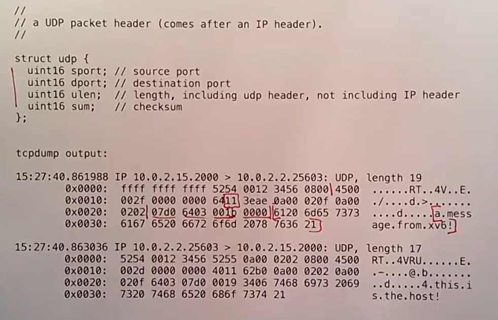

首先，我们同样会有一个以太网Header，以及20字节的IP header。IP header中的`0x11`表明这个packet的IP协议号是17，这样packet的接收主机就知道应该使用UDP软件来处理这个packet。

接下来的8个字节是UDP header。这里的packet是由lab代码生成的packet，所以它并没有包含常见的端口，源端口是`0x0700`，目的端口是`0x6403`。第4-5个字节是长度，第6-7个字节是校验和。XV6的UDP软件并没有生成UDP的校验和。

UDP header之后就是UDP的payload。在这个packet中，应用程序发送的是ASCII文本，所以我们可以从右边的ASCII码看到，内容是“`a.message.from.xv6`”。所以ASCII文本放在了一个UDP packet中，然后又放到了一个IP packet中，然后又放到了一个Ethernet packet中。最后发布到以太网上。

- 学生提问：当你发送一个packet给一个主机，但是你又不知道它的以太网地址，这个packet是不是会被送到路由器，之后再由路由器来找到以太网地址？
- Robert教授：如果你发送packet到一个特定的IP地址，你的主机会先检查packet的目的IP地址来判断目的主机是否与你的主机在同一个局域网中。如果是的话，你的主机会直接使用ARP来将IP地址翻译成以太网地址，再将packet通过以太网送到目的主机。更多的场景是，我们将一个packet发送到互联网上某个主机。这时，你的主机会将packet发送到局域网上的路由器，路由器会检查packet的目的IP地址，并根据路由表选择下一个路由器，将packet转发给这个路由器。这样packet一跳一跳的在路由器之间转发，最终离目的主机越来越近。
- 学生提问：对于packet的长度有限制吗？
- Robert教授：有的。这里有几个不同的限制，每一个底层的网络技术，例如以太网，都有能传输packet的上限。今天我们要讨论的论文基于以太网最大可传输的packet是1500字节。最新的以太网可以支持到9000或者10000字节的最大传输packet。

为什么不支持传输无限长度的packet呢？这里有几个原因：
- 发送无限长度的packet的时间可能要很长， **期间线路上会有信号噪音和干扰，所以在发送packet的时候可能会收到损坏的bit位。基本上每一种网络技术都会在packet中带上某种校验和或者纠错码，但是校验和也好，纠错码也好，只能在一定长度的bit位内稳定的检测错误。** 如果packet长度增加，遗漏错误的可能性就越来越大。所以一个校验和的长度，例如16bit或者32bit，限制了传输packet的最大长度。
- 另一个限制是， **如果发送巨大的packet，传输路径上的路由器和主机需要准备大量的buffer来接收packet。** 这里的代价又比较高，因为较难管理一个可变长度的buffer，管理一个固定长度的buffer是最方便的。而固定长度的buffer要求packet的最大长度不会太大。

所以，以太网有1500或者9000字节的最大packet限制。除此之外，所有的协议都有长度字段，例如UDP的长度字段是16bit。所以即使以太网支持传输更大的packet，协议本身对于数据长度也有限制。

以上就是UDP的介绍。在lab的最后你们会通过实验提供的代码来向谷歌的DNS server发送一个查询，收到回复之后代码会打印输出。你们需要在设备驱动侧完成以太网数据的处理。

## 运行在主机上的网络协议栈 Network Stack

### 简单的网络协议栈分层图

与packet的协议和格式对应的是运行在主机上的网络协议栈。人们有各种各样的方式来组织网络软件，接下来我会介绍最典型的，并且至少我认为是最标准的组织方式。

假设我们现在在运行Linux或者XV6，我们有一些应用程序比如浏览器，DNS服务器。这些应用程序使用socket API打开了socket layer的文件描述符。 **Socker layer是内核中的一层软件，它会维护一个表单来记录文件描述符和UDP/TCP端口号之间的关系。同时它也会为每个socket维护一个队列用来存储接收到的packet。** 我们在networking lab中提供的代码模板包含了一个非常原始的socket layer。

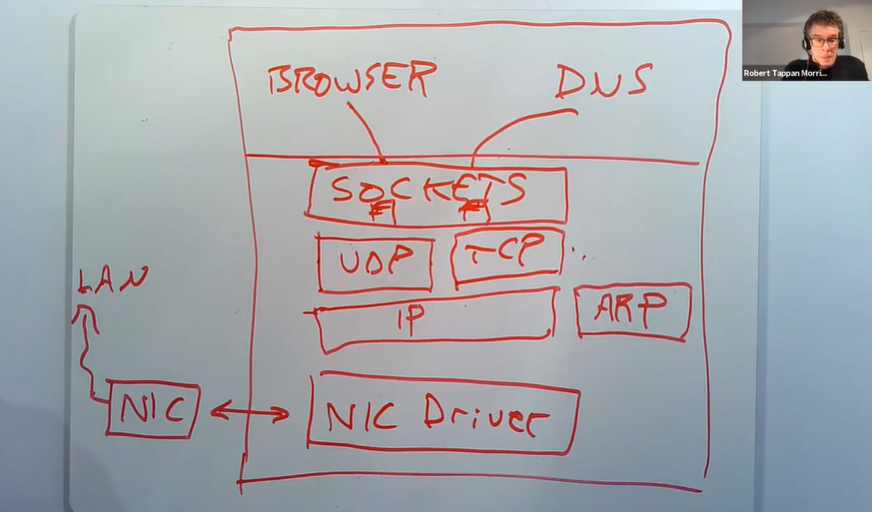

在socket layer之下是UDP和TCP协议层。UDP软件几乎不做任何事情，它只是检查收到的packet，获取目的端口号，并将UDP payload传输给socket layer中对应的队列。TCP软件会复杂的多，它会维护每个TCP连接的状态，比如记录每个TCP连接的序列号，哪些packet没有被ACK，哪些packet需要重传。所以TCP的协议控制模块会记录大量的状态，但是UDP中不会记录任何状态。UDP和TCP通常被称为传输层。networking lab提供的代码中有一个简单的UDP层，但是没有TCP的代码。

在TCP/UDP之下是IP层，IP层的软件通常很简单。虽然我不确定是在同一层还是下一层，与IP层在一起的还有ARP层。

**再往下的话，我们可以认为还会有一层以太网。但是通常并没有一个独立的以太网层。通常来说这个位置是一个或者多个网卡驱动，这些驱动与实际的网卡硬件交互。网卡硬件与局域网会有实际的连接。**

当一个packet从网络送达时，网卡会从网络中将packet接收住并传递给网卡驱动。网卡驱动会将packet向网络协议栈上层推送。在IP层，软件会检查并校验IP header，将其剥离，再把剩下的数据向上推送给UDP。UDP也会检查并校验UDP header，将其剥离，再把剩下的数据加入到socker layer中相应文件描述符对应的队列中。所以一个packet在被收到之后，会自底向上逐层解析并剥离header。当应用程序发送一个packet，会自顶向下逐层添加header，直到最底层packet再被传递给硬件网卡用来在网络中传输。所以内核中的网络软件通常都是被嵌套的协议所驱动。

这里实际上我忘了一件重要的事情， **在整个处理流程中都会有packet buffer。所以当收到了一个packet之后，它会被拷贝到一个packet buffer中，这个packet buffer会在网络协议栈中传递。** 通常在不同的协议层之间会有队列，比如在socker layer就有一个等待被应用程序处理的packet队列，这里的队列是一个linked-list。通常整个网络协议栈都会使用buffer分配器，buffer结构。在我们提供的networking lab代码中，buffer接口名叫MBUF。

以上就是一个典型的网络协议栈的分层图。

### packet的控制流程是如何工作

对于今天的论文，了解packet的控制流程是如何工作的还是比较重要，这里的控制流程与前一节介绍的分层网络协议栈还不太一样。

**有关网络协议栈，通常会有多个独立的actor会处理packet，解析packet并生成输出。出于各种各样的原因，这些不同的actor之间是解耦的，这样它们可以并发的运行，并且连接不同的packet队列。** 这对于今天的论文来说，是非常重要的前提。

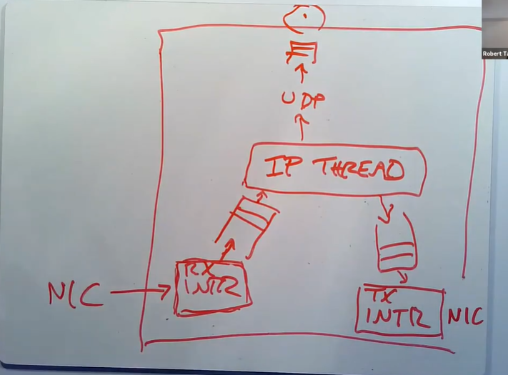

现在我们有了一张网卡，有了一个系统内核。当网卡收到了一个packet，它会生成一个中断。系统内核中处理中断的程序会被触发，并从网卡中获取packet。 **因为我们不想现在就处理这个packet，中断处理程序通常会将packet挂在一个队列中并返回，** packet稍后再由别的程序处理。所以中断处理程序这里只做了非常少的工作，也就是将packet从网卡中读出来，然后放置到队列中。

**在一个传统的网络协议栈中，我们之所以想要快速的将packet从网卡中读出并存放于软件队列中，是因为通常来说网卡中用来存储packet的内存都非常小，而在计算机的RAM中，会有GB级别的内存，所以计算机的内存要大得多。** 如果有大量的packet发送到网卡，网卡可能会没有足够的内存来存储packet，所以我们需要尽快将packet拷贝到计算机的内存中。

之后，在一个独立的线程中，会有一个叫做IP processing thread的程序。它会读取内存中的packet队列，并决定如何处理每一个packet。其中一个可能是将packet向上传递给UDP，再向上传递给socket layer的某个队列中，最后等待某个应用程序来读取。通常来说，这里的向上传递实际上就是在同一个线程context下的函数调用。

**另一种可能就是，这个主机实际上是个路由器，packet从一个网卡进来，经过路由需要从另一个网卡出去。通过例如Linux操作系统构建路由器是非常常见的。** 如果你买一个wifi路由器，或者一个有线调制解调器，非常有可能里面运行的就是Linux系统，并且使用了Linux网络协议栈，因为Linux的协议栈实现了完整的路由协议。 **所以，如果IP process thread查看了packet的目的IP地址，并决定将packet从另一个网卡转发出去，它会将packet加入到针对发送网卡的发送队列中。**

在这个结构中，有一点非常重要，这里存在一些并发的组件，它们以不同的方式调度。 **中断处理程序由网卡的发送或者接受中断触发。IP processing thread就是一个内核线程。在一个处理器上，IP processing thread不能与中断处理程序同时运行，因为中断处理程序的优先级最高，不过在多核处理器上，并发度可能会更高。最后，应用程序要能够读取socket layer中的packet，应用程序又是另一个独立调度的组件。所有这些组件都会参与到CPU的调度中。**

缓存队列经常会被提到，在上图中，总共有3个队列。这里的队列的作用是，一个独立的组件会向队列中添加packet，其他的组件会从队列中读取packet。在网络系统中，这样的队列很常见，主要出于以下几个原因：
- 其中一个原因是可以应对短暂的大流量。比如，IP processing thread只能以特定的速度处理packet，但是网卡可能会以快得多的速度处理packet。对于短暂的大流量，我们想要在某个位置存储这些packet，同时等待IP processing来处理它们，这是网卡的接收方向。
- 在网卡的发送方向，我们可能需要在队列中存储大量的packet，这样网卡可以在空闲的时候一直发送packet。有的时候100%利用网卡的发送性能还是很重要的。
- 第三个原因是，队列缓存可以帮助组件之间解耦。我们不会想要IP processing thread或者应用程序知道中断处理程序的具体实现。在一个传统的操作系统中，IP processing thread并不必须知道中断是什么时候发生，或者应用程序怎么运行的。

- 学生提问：同一个网卡可以即是接收方又是发送方吗？
- Robert教授：可以的。比如说我的笔记本只有一个网卡连接到了wifi，packet会从一个网卡进入并发出。双网卡通常用在路由器中。比如说我家里的wifi路由器，它就有两张网卡，其中一个网卡连接到线缆并进一步连接到整个互联网，另一个网卡是wifi网卡。有很多服务器也有多个网卡， **尤其是对于web服务器来说，会有一个网卡连接互联网，另一个网卡连接你的私有的敏感的数据库信息。两个网卡连接的是完全不同的网络。**
- 学生提问：所以多网卡的场景在于想要连接不同的网络？
- Robert教授：是的。如果你想要连接不同的网络，那么你需要有多块网卡。

### 当 packet 送到网卡时

我想再讨论一下当packet送到网卡时，网卡会做什么操作？这与networking lab非常相关。对于一个网卡的结构，会有一根线缆连接到外面的世界。网卡会检查线缆上的电信号，并将电信号转换成packet。网卡会接入到一个主机上，主机会带有网卡的驱动软件。我们需要将网卡解码出来的packet传递给主机的内存，这样软件才能解析packet。

**网卡内有许多内置的内存，当packet到达时，网卡会将packet存在自己的缓存中，并向主机发送中断，所以网卡内部会有一个队列。而主机的驱动包含了一个循环，它会与网卡交互，并询问当前是否缓存了packet。如果是的话，主机的循环会逐字节地拷贝packet到主机的内存中，再将内存中的packet加到一个队列中。** 这是我们今天要看的论文中网卡的工作方式：网卡驱动会负责拷贝网卡内存中的数据到主机内存。这在30年前还是有意义的，但是今天通过驱动中的循环来从硬件拷贝数据是非常慢的行为。即使是在同一个计算机上，外设到CPU之间的距离也非常的长，所以它们之间的交互需要的时间比较长。所以人们现在不会这么设计高速接口了。

接下来我将讨论一下E1000网卡的结构，这是你们在实验中要使用的网卡。 **E1000网卡会监听网线上的电信号，但是当收到packet的时候，网卡内部并没有太多的缓存，所以网卡会直接将packet拷贝到主机的内存中，而内存中的packet会等待驱动来读取自己。** 所以，网卡需要事先知道它应该将packet拷贝到主机内存中的哪个位置。E1000是这样工作的，主机上的软件会格式化好一个DMA ring，ring里面存储的是packet指针。所以，DMA ring就是一个数组，里面的每一个元素都是指向packet的指针。

### Ring Buffer

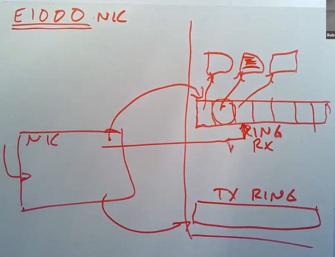

当位于主机的驱动初始化网卡的时候，它会分配一定数量，例如16个1500字节长度的packet buffer，然后再创建一个16个指针的数组。为什么叫ring呢？因为在这个数组中，如果用到了最后一个buffer，下一次又会使用第一个buffer。主机上的驱动软件会告诉网卡DMA ring在内存中的地址，这样网卡就可以将packet拷贝到内存中的对应位置。

当网卡收到packet时，网卡还会记住当前应该在DMA ring的哪个位置并通过DMA将packet传输过去。

传输完成之后，网卡会将内部的记录的指针指向DMA ring的下一个位置，这样就可以拷贝下一个packet。

刚才说的都是接收packet，对应的是RX ring。类似的，驱动还会设置好发送buffer，也就是TX ring。驱动会将需要网卡传输的packet存储在 TX ring中，网卡也需要知道TX ring的地址。

你们在networking lab中的主要工作就是写驱动来处理这些ring。

- 学生提问：E1000与生产环境的高性能场景使用的网卡有什么区别吗？
- Robert教授：E1000曾经是最优秀的网卡，没有之一，并且它也曾经使用在生产环境中，但这是很多年前的事了。

现代的网卡更加的“智能”，但是我们这里介绍的DMA ring结构并没有太多的变化，现在你仍然可以发现网卡使用DMA来传输packet，内存中对应的位置是由ring buffer的位置决定。现代的网卡更加“智能”在以下几个方面。
- E1000只能与一个RX ring传输数据，而现代网卡可以与多个RX ring同时传输数据。比如说你可以告诉一张现代的网卡，将接受到的packet分别传输给21个RX ring，网卡会根据packet的内容，决定将packet送到哪个RX ring。人们在很多地方都使用了这个特性，比如说在主机上运行了多个虚拟机，你可以使用这个特性将虚拟机对应的packet送到虚拟机对应的RX ring中，这样虚拟机可以直接读取相应的RX ring。（注，也就是网卡多队列）
- 现代网卡更加“智能”的体现是，它们会完成一些TCP的处理，最常见的就是校验和计算。（注，各种TCP offload）

所以，现代的网卡有与E1000相似的地方，但是更加的“智能”。

- 学生提问：在接下来的networking lab中，IP层和驱动之间没有队列，是吗？
- Robert教授：是的，lab中的网络栈已经被剥离到了最小，它比实际的网络协议栈简单的多
- 学生提问：那这样的话，性能会不会很差？
- Robert教授：我不知道，我没有在实际环境中运行过这些代码。在写networking lab的代码时，我们没有关注过性能。大多数情况下，性能不是问题，lab中的代码可以完成一个网络协议栈95%的功能，例如处理多网卡，处理TCP。
- 学生提问：为了让网卡能支持DMA，需要对硬件做一些修改吗？在E1000之前的网卡中，所有的数据传输都是通过CPU进行传输。
- Robert教授：我们在介绍E1000之前的网卡时，网卡并不能访问内存。我认为这里最重要的问题是，当网卡想要使用主机内存中的某个地址时，虚拟内存地址是如何翻译的。我不知道这里是如何工作的。
- 网卡通过总线，并经过一些可编程芯片连接到了DRAM，我认为在现代的计算机中，你可以设置好地址翻译表，这样网卡可以使用虚拟内存地址，虚拟内存地址会由网卡和DRAM之间的硬件翻译，这对于一些场景还是很有价值的。
- 另一方面，如果网卡需要读写一些内存地址，而内存数据现在正在CPU的cache中，那么意味着内存对应的最新数据位于CPU cache中，而不是在RAM。这种情况下，当网卡执行DMA时，我们希望网卡能读取CPU的cache而不是RAM。在Intel的机器上，有一些精心设计的机制可以确保当网卡需要从内存读取数据而最新的内存数据在CPU cache中时，CPU cache而不是RAM会返回数据。一些软件基于这种机制来获得高性能。对于写数据同样的也适用，网卡可以直接将数据写到CPU cache中，这样CPU可以非常快的读到数据。
- 我们介绍的E1000的结构非常简单，但是实际中的网卡机制非常的复杂。

## Receive Livelock

### 中断的 Livelock

接下来我们看一下[今天的论文](../lec/mogul96usenix.pdf)。因为我们已经介绍了很多论文相关的背景知识，我们直接来看一下论文的图1。我们之后根据论文中的图来开展讨论。

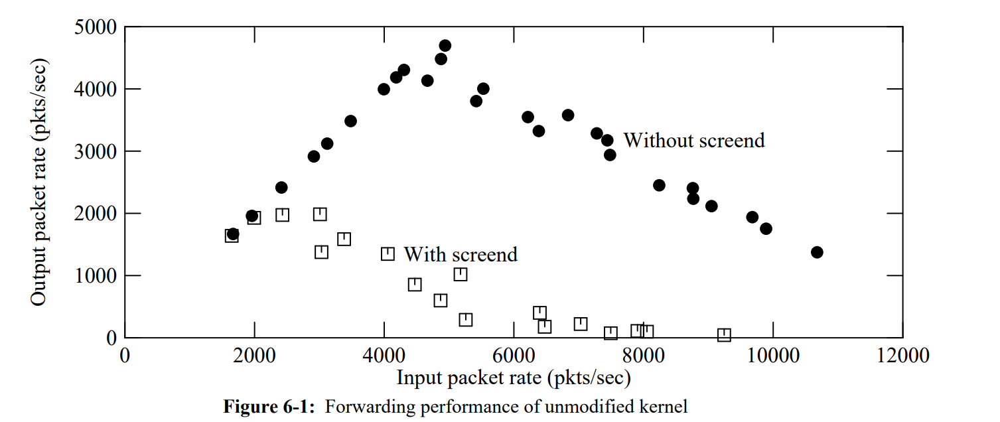

这张图是一个路由器的性能图。这是一个有两张网卡的路由器，它的工作是从一个网卡接收packet，再从另一个网卡送出 。X轴是接收速率，也就是接收端网卡的收到packet的速率。Y轴是发送速率，也就是观察到的发送端网卡发送packet的速率。 **我们关心的是实心圆对应的曲线，它先上升，再下降。** 所以即使还不知道任何上下文，看到这个图之后我们会问自己，为什么这个曲线先上升，再下降？曲线的转折点有什么特殊之处？是什么决定了曲线的上升斜率和下降斜率？即使不知道任何背景知识，我们还是可以问出这么多问题。

首先，为什么这条曲线开始会上升？

学生回答：在到达处理的瓶颈之前，路由器可以处理更多的接收方向的packet，也可以处理更多的发送发向的packet。

完全正确， **在出现错误之前，对于每个接收到的packet，路由器都可以转发出去。比如说当packet以2000pps的速度接收时，路由器直接将packet从输入网卡拷贝到输出网卡，所以路由器的发送速率与接收速率一样，都是2000pps，所以这里X轴与Y轴的值相等。** 这种状态一直保持，直到曲线到达转折点。

那么为什么曲线不是一直上升的呢？

学生回答：是不是因为中断不能被处理导致的？

这个其实是为什么曲线会下降的原因。我这里的问题是为什么曲线在某个点之后就不再上升了。假设这里的设计是合理的，对于一个合理的系统，对应的曲线会一直上升吗？

学生回答：我认为不会，就算系统能足够快的处理packet，对于足够多的packet，还是可能触发系统的瓶颈。

是的， **CPU的算力并不是无限的，CPU最多每秒执行一定数量的指令。对于每个packet，IP软件会查看packet的header，检查校验和，根据目的地址查找转发表等等，这个过程会消耗数百甚至数千条CPU指令时间来处理一个packet。** 所以，我们不能期望曲线能一直向上走，它必然会在某个位置停止向上。

上面的图中，曲线在5000的位置就停止不再上升了，这告诉我们这台机器处理每个packet要消耗200微秒。所以，曲线的转折点隐含的包含了处理一个packet需要的时间信息。虽然这只是一个猜想，但是通常与真实的结果非常相近。或许我们可以修改软件使其更加的高效，我们可以优化到处理每个packet只需要150微秒，我们或许可以将曲线的转折点向上移一些，但是在到达了这台机器每秒能处理的packet数量的极限时，我们还是会到达曲线的转折点。

**除了CPU的性能，还有一些不是必然存在的瓶颈需要注意一下。最明显的一个就是网络的性能。** 如果你使用的网络只有10Mb/s，那么底层的网路硬件最多就能按照这个速率传输数据，这也有可能构成一个限制。所以也有可能是因为网络传输的速率决定了曲线的顶点是在5000pps这个位置。论文中并没有说明究竟是CPU还是网速是这里的限制因素，但是对于一个10Mb/s的网络，如果你传输小包的话，是可以达到 10-15 Kpps，这实际上是网线的能达到的极限，而上图中转折点对应的5Kpps远小于10-15Kpps，所以几乎可以确定限制是来自CPU或者内存，而不是网络本身。

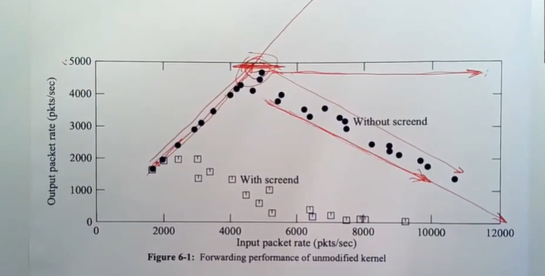

**在一个设计良好的路由器中，如果处理每个packet要200微秒，那么我们期望看到的是不论负载多高，路由器至少每秒能处理5000个packet。所以我们期望看到的曲线在5000pps之后是一条水平线，路由器每秒处理5000个packet，并丢弃掉其他的packet。**

但是我们实际拥有的曲线会更加的糟糕，当收到的packets超过5000pps时，成功转发的packets随着收到的packet的增多反而趋向于0。为什么曲线会下降呢？前面有同学已经提到了。

**论文作者给出的原因是，随着packet接收速率的增加，每个收到的packet都会生成一个中断，而这里的中断的代价非常高，因为中断涉及到CPU将一个packet从网卡拷贝到主机的内存中。** 如果我们知道packet将会以10K每秒的速率到达，并且我们知道我们不能处理这么多packet，那么我们可以期望的最好结果就是每秒转发5000个packet，并且丢弃5000个packet之外的其他packet。但是实际上，5000个packet之外的其他packet，每个都生成了一个昂贵的中断，收到的packet越多，生成的中断就越多。 **而中断有更高的优先级，所以每一个额外的packet都会消耗CPU时间，导致更少的CPU时间可以用来完成packet的转发。最后，100%的CPU时间都被消耗用来处理网卡的输入中断，CPU没有任何时间用来转发packet。**

**这里曲线的下降被称为中断的Livelock，这是一个在很多系统中都会出现的现象。** 这里背后的原因是有两个独立的任务，比如这里的两个任务是输入中断和转发packet程序。 **由于调度的策略，输入中断的优先级更高，使得转发packet的任务可能分配不到任何CPU时间。几乎在任何需要处理输入的系统中，如果输入速率过高，都有可能出现Livelock。Livelock不仅会因为CPU耗尽而发生，也可能是其他原因，比如说网卡的DMA耗尽了RAM的处理时间，那么网卡占据了RAM导致CPU不能使用RAM。所以，即使你拥有大量的CPU空闲时间，还是有可能触发Livelock。不管怎样，这曲线的下降被称为Livelock。**

你或许会问，不能处理的packet最后怎么样了？我们回想一下网络协议软件的结构，网卡会通知网卡的接收中断，接收中断将packet拷贝到队列缓存中，之后会有一个线程处理队列缓存中的packet。

所以packet会在队列缓存中丢失。队列缓存有一个最大的长度，至少RAM的大小是有限制大，但是队列缓存的大小会远小于RAM的大小。 **如果网卡的接收中断从网卡获得了一个packet，并且发现队列缓存的长度已经是最长了，接收中断程序会丢弃packet。**

### 如何解决 Livelock

论文作者对于Livelock提出了一种解决方法。这种解决方法的最直接结果就是，当packet的输入速率达到了5000pps，随着输入速率的增加，转发性能维持在5000pps。

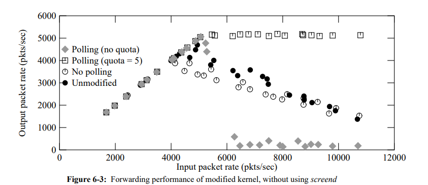

曲线后半部分的水平是一种完美的non-livelock性能曲线。之所以是水平的，是因为受CPU的限制，最多只能处理5000pps的转发。

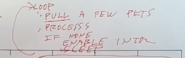

在这个解决方案中，还是存在处理packet的线程和中断处理程序。 **当网卡第一次触发中断时，会导致中断处理函数的运行。但是中断处理函数并不会从网卡拷贝packet，相应的，它会唤醒处理packet的线程，并且关闭网卡的中断，这样接下来就收不到任何中断了。** 处理packet的线程会有一个循环，在循环中它会检查并从网卡拉取几个packet，论文中我记得是最多拉取5个packet，之后再处理这些packet。所以现在处理packet的线程是从网卡读取packet，而不是从中断处理程序读取。如果网卡中没有等待处理的packet，那么处理线程会重新打开网卡中断，并进入sleep状态。因为最后打开了中断，当下一个packet到达时，中断处理程序会唤醒处理packet线程，线程会从sleep状态苏醒并继续处理packet。这就是论文介绍的解决Livelock的方法。

这里的处理方式实际上是将中断模式（Interrupt Scheme）转变成了轮询模式（Polling Scheme）。在高负载的情况下，中断会被关闭，并且CPU会一直运行这里的循环中，不断读取packet并处理packet。因为中断被关闭了，CPU用来运行主线程的时间不会被中断占据。在低负载的情况下，中断会被打开，在收到packet之后，线程会被中断处理程序直接唤醒。

- 学生提问：这里的循环会检查所有的设备吗？还是只会检查产生中断的设备？
- Robert教授：这是个好问题，如果存在多个网卡，我并不知道这里的循环会怎么工作。一个非常合理的设计是，packet处理线程需要记录每个网卡是在中断模式还是在轮询模式，然后只对轮询模式的网卡。等一下，因为中断处理程序现在不从网卡读取packet，所以线程中的循环可以直接检查所有网卡，如果网卡中有待处理的packet，就读取几个packet并处理。如果所有的网卡都没有待处理的packet，主循环会打开所有网卡的中断，并进入sleep状态。之后，任何一个网卡的中断都会唤醒packet处理线程。
- 学生提问：当处理线程运行的时候，packet是如何进入到一个等待读取的队列中？我觉得网卡上只会有一个packet。
- Robert教授：最开始的时候，packet会在网卡自己的内存中按照队列形式缓存。而处理线程的主循环会询问每个网卡是否在自己的内存中有待处理的packet。如果有的话，主循环会在主机的RAM中申请缓存，再将packet数据从网卡中拷贝到RAM中的缓存，再处理packet。
- 学生提问：所以一次可以拷贝多个packet？
- Robert教授：是的，我认为论文中说的是一次拷贝5个packet。即使有100packet在网卡中等待处理，一次也只会读取5个，这样可以避免阻塞输出。
- 学生提问：但是这就要求提升网卡的内存容量了吧？
- Robert教授：Well，我不知道要多少内存容量。在Livelock曲线的转折点之前，都是靠中断来处理的。**在转折点之前，如果网卡收到了一个packet，处理线程会立即被唤醒并读出packet。但是在转折点之后，处理线程就一直在轮询模式而不是中断模式。在转折点之后，肯定会有丢包，因为现在输入速率和输出速率之间是有差异的，而这个差异间的packet都被丢弃了。** 因为这些packet不论如何都会被丢弃，增加网卡的内存并不太能减少这里的丢包，所以不太确定网卡是否需要增加内存容量。在论文中，一次会读取最多5个packet，那么网卡必然需要存储5个packet的内存容量，但是更多的packet是否有好处就不太确定了。
- 网卡上的buffer大小，对于短暂的高pps有帮助，这样可以保存好packet等处理线程来读取它们。但是我们这里并没有讨论短暂的overload，我们讨论的是持续的overload。所以增加网卡的buffer，并不是很有用。
- 学生提问：当网卡中断被关闭了，网卡还能在自己的buffer上加入新的packet吗？
- Robert教授：可以的。网卡是自治的，不论中断是打开还是关闭，只要有一个packet到达了网卡，网卡都会将packet加入到自己的缓存队列中。当然不同的网卡设计可能非常不一样，但是在论文中网卡不会调用DMA，不会主动访问主机内存。如果网卡上内存都用光了，packet会被丢弃。所以，在这里的设计中，丢包发生在网卡内部。在一个overload的场景下，网卡中的队列总是满的，当再收到一个packet时，网卡会直接丢包，这样就不会浪费CPU时间。网卡可以在不消耗CPU时间的前提下直接丢包，是避免Livelock的直接原因。
- 学生提问：有没有这种可能，CPU从网卡读取packet，但是处理线程内部的队列满了？
- Robert教授：当然。在其他地方肯定也有瓶颈，例如对于收到的packet，需要交给监听了socket的应用程序去处理，如果应用程序并没有以足够快的速度读取packet，相应的socket buffer会满，那么packet会在处理线程中丢包，而这也可能导致Livelock。
- **Livelock发生的根本原因是我们浪费时间处理了一些最终会被丢弃的packet，这里的处理是徒劳。** 另一种发生Livelock的可能是，当负载增加时，我们可能会消耗100%的CPU时间在packet处理线程上，而留给应用程序的CPU时间为0，这时还是会发生Livelock。论文在第六节中有相应的介绍，如果一个packet将要被传输给本地的应用程序，网络线程会查看应用程序的socket buffer，如果socket buffer过满的话，网络线程会停止从网卡读取packet，直到socket buffer变小。这意味着网络线程会停止运行，并给应用程序机会运行并处理packet，所以如果你不够小心的话，你可能会在任何阶段都经历类似Livelock的问题。
