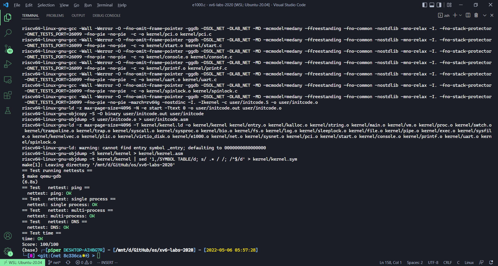

# Lab: networking

本节作业：
- https://github.com/PiperLiu/xv6-labs-2020/tree/net

目录：

<!-- @import "[TOC]" {cmd="toc" depthFrom=2 depthTo=2 orderedList=false} -->

<!-- code_chunk_output -->


<!-- /code_chunk_output -->

细分目录：

<!-- @import "[TOC]" {cmd="toc" depthFrom=2 depthTo=6 orderedList=false} -->

<!-- code_chunk_output -->

- [Lab: networking](#lab-networking-1)
  - [阅读代码，一些知识点：大小端变量转换、 __attribute__((packed))](#阅读代码一些知识点大小端变量转换-__attribute__packed)
  - [网络协议栈的实现](#网络协议栈的实现)
  - [简历一个最简单的 socket 连接](#简历一个最简单的-socket-连接)
  - [万物皆文件](#万物皆文件)
  - [完成作业：向网卡传输数据，处理网卡中断](#完成作业向网卡传输数据处理网卡中断)

<!-- /code_chunk_output -->

### Lab: networking

**Background**

Before writing code, you may find it helpful to review "Chapter 5: Interrupts and device drivers" in the [xv6 book](../lec/book-riscv-rev1.pdf).

You'll use a network device called the E1000 to handle network communication. To xv6 (and the driver you write), the E1000 looks like a real piece of hardware connected to a real Ethernet local area network (LAN). In fact, the E1000 your driver will talk to is an emulation provided by qemu, connected to a LAN that is also emulated by qemu. On this emulated LAN, xv6 (the "guest") has an IP address of 10.0.2.15. Qemu also arranges for the computer running qemu to appear on the LAN with IP address 10.0.2.2. When xv6 uses the E1000 to send a packet to 10.0.2.2, qemu delivers the packet to the appropriate application on the (real) computer on which you're running qemu (the "host").

You will use QEMU's "user-mode network stack". QEMU's documentation has more about the user-mode stack [here](https://www.qemu.org/docs/master/system/net.html#using-the-user-mode-network-stack). We've updated the Makefile to enable QEMU's user-mode network stack and the E1000 network card.

The Makefile configures QEMU to record all incoming and outgoing packets to the file `packets.pcap` in your lab directory. It may be helpful to review these recordings to confirm that xv6 is transmitting and receiving the packets you expect. To display the recorded packets:

```
tcpdump -XXnr packets.pcap
```

We've added some files to the xv6 repository for this lab. The file `kernel/e1000.c` contains initialization code for the E1000 as well as empty functions for transmitting and receiving packets, which you'll fill in. `kernel/e1000_dev.h` contains definitions for registers and flag bits defined by the E1000 and described in the Intel E1000 [Software Developer's Manual](../lec/8254x_GBe_SDM.pdf). `kernel/net.c` and `kernel/net.h` contain a simple network stack that implements the [IP](https://en.wikipedia.org/wiki/Internet_Protocol), [UDP](https://en.wikipedia.org/wiki/User_Datagram_Protocol), and [ARP](https://en.wikipedia.org/wiki/Address_Resolution_Protocol) protocols. These files also contain code for a flexible data structure to hold packets, called an `mbuf`. Finally, `kernel/pci.c` contains code that searches for an E1000 card on the PCI bus when xv6 boots.

**Your Job**

Your job is to complete `e1000_transmit()` and `e1000_recv()`, both in `kernel/e1000.c`, so that the driver can transmit and receive packets. You are done when `make grade` says your solution passes all the tests.

While writing your code, you'll find yourself referring to the E1000 [Software Developer's Manual](../lec/8254x_GBe_SDM.pdf). Of particular help may be the following sections:
- Section 2 is essential and gives an overview of the entire device.
- Section 3.2 gives an overview of packet receiving.
- Section 3.3 gives an overview of packet transmission, alongside section 3.4.
- Section 13 gives an overview of the registers used by the E1000.
- Section 14 may help you understand the init code that we've provided.

Browse the E1000 [Software Developer's Manual](../lec/8254x_GBe_SDM.pdf). This manual covers several closely related Ethernet controllers. QEMU emulates the 82540EM. Skim Chapter 2 now to get a feel for the device. To write your driver, you'll need to be familiar with Chapters 3 and 14, as well as 4.1 (though not 4.1's subsections). You'll also need to use Chapter 13 as a reference. The other chapters mostly cover components of the E1000 that your driver won't have to interact with. Don't worry about the details at first; just get a feel for how the document is structured so you can find things later. The E1000 has many advanced features, most of which you can ignore. Only a small set of basic features is needed to complete this lab.

The `e1000_init()` function we provide you in `e1000.c` configures the E1000 to read packets to be transmitted from RAM, and to write received packets to RAM. This technique is called DMA, for direct memory access, referring to the fact that the E1000 hardware directly writes and reads packets to/from RAM.

Because bursts of packets might arrive faster than the driver can process them, `e1000_init()` provides the E1000 with multiple buffers into which the E1000 can write packets. The E1000 requires these buffers to be described by an array of "descriptors" in RAM; each descriptor contains an address in RAM where the E1000 can write a received packet. `struct rx_desc` describes the descriptor format. The array of descriptors is called the receive ring, or receive queue. It's a circular ring in the sense that when the card or driver reaches the end of the array, it wraps back to the beginning. `e1000_init()` allocates `mbuf` packet buffers for the E1000 to DMA into, using `mbufalloc()`. There is also a transmit ring into which the driver places packets it wants the E1000 to send. `e1000_init()` configures the two rings to have size `RX_RING_SIZE` and `TX_RING_SIZE`.

When the network stack in `net.c` needs to send a packet, it calls `e1000_transmit()` with an mbuf that holds the packet to be sent. Your transmit code must place a pointer to the packet data in a descriptor in the TX (transmit) ring. `struct tx_desc` describes the descriptor format. You will need to ensure that each mbuf is eventually freed, but only after the E1000 has finished transmitting the packet (the E1000 sets the `E1000_TXD_STAT_DD` bit in the descriptor to indicate this).

When the E1000 receives each packet from the ethernet, it first DMAs the packet to the mbuf pointed to by the next RX (receive) ring descriptor, and then generates an interrupt. Your `e1000_recv()` code must scan the RX ring and deliver each new packet's mbuf to the network stack (in `net.c`) by calling `net_rx()`. You will then need to allocate a new mbuf and place it into the descriptor, so that when the E1000 reaches that point in the RX ring again it finds a fresh buffer into which to DMA a new packet.

In addition to reading and writing the descriptor rings in RAM, your driver will need to interact with the E1000 through its memory-mapped control registers, to detect when received packets are available and to inform the E1000 that the driver has filled in some TX descriptors with packets to send. The global variable `regs` holds a pointer to the E1000's first control register; your driver can get at the other registers by indexing `regs` as an array. You'll need to use indices `E1000_RDT` and `E1000_TDT` in particular.

To test your driver, run `make server` in one window, and in another window run `make qemu` and then run nettests in xv6. The first test in `nettests` tries to send a UDP packet to the host operating system, addressed to the program that `make server` runs. If you haven't completed the lab, the E1000 driver won't actually send the packet, and nothing much will happen.

After you've completed the lab, the E1000 driver will send the packet, qemu will deliver it to your host computer, `make server` will see it, it will send a response packet, and the E1000 driver and then `nettests` will see the response packet. Before the host sends the reply, however, it sends an "ARP" request packet to xv6 to find out its 48-bit Ethernet address, and expects xv6 to respond with an ARP reply. `kernel/net.c` will take care of this once you have finished your work on the E1000 driver. If all goes well, `nettests` will print `testing ping: OK`, and `make server` will print `a message from xv6!`.

`tcpdump -XXnr packets.pcap` should produce output that starts like this:

```
reading from file packets.pcap, link-type EN10MB (Ethernet)
15:27:40.861988 IP 10.0.2.15.2000 > 10.0.2.2.25603: UDP, length 19
        0x0000:  ffff ffff ffff 5254 0012 3456 0800 4500  ......RT..4V..E.
        0x0010:  002f 0000 0000 6411 3eae 0a00 020f 0a00  ./....d.>.......
        0x0020:  0202 07d0 6403 001b 0000 6120 6d65 7373  ....d.....a.mess
        0x0030:  6167 6520 6672 6f6d 2078 7636 21         age.from.xv6!
15:27:40.862370 ARP, Request who-has 10.0.2.15 tell 10.0.2.2, length 28
        0x0000:  ffff ffff ffff 5255 0a00 0202 0806 0001  ......RU........
        0x0010:  0800 0604 0001 5255 0a00 0202 0a00 0202  ......RU........
        0x0020:  0000 0000 0000 0a00 020f                 ..........
15:27:40.862844 ARP, Reply 10.0.2.15 is-at 52:54:00:12:34:56, length 28
        0x0000:  ffff ffff ffff 5254 0012 3456 0806 0001  ......RT..4V....
        0x0010:  0800 0604 0002 5254 0012 3456 0a00 020f  ......RT..4V....
        0x0020:  5255 0a00 0202 0a00 0202                 RU........
15:27:40.863036 IP 10.0.2.2.25603 > 10.0.2.15.2000: UDP, length 17
        0x0000:  5254 0012 3456 5255 0a00 0202 0800 4500  RT..4VRU......E.
        0x0010:  002d 0000 0000 4011 62b0 0a00 0202 0a00  .-....@.b.......
        0x0020:  020f 6403 07d0 0019 3406 7468 6973 2069  ..d.....4.this.i
        0x0030:  7320 7468 6520 686f 7374 21              s.the.host!
```

Your output will look somewhat different, but it should contain the strings "ARP, Request", "ARP, Reply", "UDP", "a.message.from.xv6" and "this.is.the.host".

`nettests` performs some other tests, culminating in a DNS request sent over the (real) Internet to one of Google's name server. You should ensure that your code passes all these tests, after which you should see this output:

```
$ nettests
nettests running on port 25603
testing ping: OK
testing single-process pings: OK
testing multi-process pings: OK
testing DNS
DNS arecord for pdos.csail.mit.edu. is 128.52.129.126
DNS OK
all tests passed.
```

You should ensure that `make grade` agrees that your solution passes.

**Hints**

Start by adding print statements to `e1000_transmit()` and `e1000_recv()`, and running `make server` and (in xv6) `nettests`. You should see from your print statements that nettests generates a call to `e1000_transmit`.

Some hints for implementing `e1000_transmit`:
- First ask the E1000 for the TX ring index at which it's expecting the next packet, by reading the `E1000_TDT` control register.
- Then check if the the ring is overflowing. If `E1000_TXD_STAT_DD` is not set in the descriptor indexed by `E1000_TDT`, the E1000 hasn't finished the corresponding previous transmission request, so return an error.
- Otherwise, use `mbuffree()` to free the last mbuf that was transmitted from that descriptor (if there was one).
- Then fill in the descriptor. `m->head` points to the packet's content in memory, and `m->len` is the packet length. Set the necessary cmd flags (look at Section 3.3 in the E1000 manual) and stash away a pointer to the mbuf for later freeing.
- Finally, update the ring position by adding one to `E1000_TDT` modulo `TX_RING_SIZE`.
- If `e1000_transmit()` added the mbuf successfully to the ring, return 0. On failure (e.g., there is no descriptor available to transmit the mbuf), return -1 so that the caller knows to free the mbuf.

Some hints for implementing `e1000_recv`:
- First ask the E1000 for the ring index at which the next waiting received packet (if any) is located, by fetching the `E1000_RDT` control register and adding one modulo `RX_RING_SIZE`.
- Then check if a new packet is available by checking for the `E1000_RXD_STAT_DD` bit in the status portion of the descriptor. If not, stop.
- Otherwise, update the mbuf's `m->len` to the length reported in the descriptor. Deliver the mbuf to the network stack using `net_rx()`.
- Then allocate a new mbuf using `mbufalloc()` to replace the one just given to `net_rx()`. Program its data pointer (`m->head`) into the descriptor. Clear the descriptor's status bits to zero.
- Finally, update the `E1000_RDT` register to be the index of the last ring descriptor processed.
- `e1000_init()` initializes the RX ring with mbufs, and you'll want to look at how it does that and perhaps borrow code.
- At some point the total number of packets that have ever arrived will exceed the ring size (16); make sure your code can handle that.

You'll need locks to cope with the possibility that xv6 might use the E1000 from more than one process, or might be using the E1000 in a kernel thread when an interrupt arrives.

这里重点是阅读教授写的代码。

#### 阅读代码，一些知识点：大小端变量转换、 __attribute__((packed))

kernel/net.h

```c
//
// packet buffer management
//

#define MBUF_SIZE              2048
#define MBUF_DEFAULT_HEADROOM  128

/**
 * 在整个处理流程中都会有packet buffer。
 * 所以当收到了一个packet之后，它会被拷贝到一个packet buffer中，
 * 这个packet buffer会在网络协议栈中传递。
 * 通常在不同的协议层之间会有队列，
 * 比如在socker layer就有一个等待被应用程序处理的packet队列，
 * 这里的队列是一个linked-list。
 * 通常整个网络协议栈都会使用buffer分配器，buffer结构。
 * 在我们提供的networking lab代码中，buffer接口名叫MBUF。
 */
struct mbuf {
  struct mbuf  *next; // the next mbuf in the chain
  char         *head; // the current start position of the buffer
  unsigned int len;   // the length of the buffer
  char         buf[MBUF_SIZE]; // the backing store
};

char *mbufpull(struct mbuf *m, unsigned int len);
char *mbufpush(struct mbuf *m, unsigned int len);
char *mbufput(struct mbuf *m, unsigned int len);
char *mbuftrim(struct mbuf *m, unsigned int len);

// The above functions manipulate the size and position of the buffer:
//            <- push            <- trim
//             -> pull            -> put
// [-headroom-][------buffer------][-tailroom-]
// |----------------MBUF_SIZE-----------------|
//
// These marcos automatically typecast and determine the size of header structs.
// In most situations you should use these instead of the raw ops above.
// 这似乎就在 C 中实现了一个简单泛型
#define mbufpullhdr(mbuf, hdr) (typeof(hdr)*)mbufpull(mbuf, sizeof(hdr))
#define mbufpushhdr(mbuf, hdr) (typeof(hdr)*)mbufpush(mbuf, sizeof(hdr))
#define mbufputhdr(mbuf, hdr) (typeof(hdr)*)mbufput(mbuf, sizeof(hdr))
#define mbuftrimhdr(mbuf, hdr) (typeof(hdr)*)mbuftrim(mbuf, sizeof(hdr))

struct mbuf *mbufalloc(unsigned int headroom);
void mbuffree(struct mbuf *m);

struct mbufq {
  struct mbuf *head;  // the first element in the queue
  struct mbuf *tail;  // the last element in the queue
};

void mbufq_pushtail(struct mbufq *q, struct mbuf *m);
struct mbuf *mbufq_pophead(struct mbufq *q);
int mbufq_empty(struct mbufq *q);
void mbufq_init(struct mbufq *q);


// 大小端支持，这里两个函数实现了对 16 、 32 位变量的大小端转换
// endianness support
//

static inline uint16 bswaps(uint16 val)
{
  return (((val & 0x00ffU) << 8) |
          ((val & 0xff00U) >> 8));
}

static inline uint32 bswapl(uint32 val)
{
  return (((val & 0x000000ffUL) << 24) |
          ((val & 0x0000ff00UL) << 8) |
          ((val & 0x00ff0000UL) >> 8) |
          ((val & 0xff000000UL) >> 24));
}

// Use these macros to convert network bytes to the native byte order.
// Note that Risc-V uses little endian while network order is big endian.
#define ntohs bswaps
#define ntohl bswapl
#define htons bswaps
#define htonl bswapl


//
// useful networking headers
//

#define ETHADDR_LEN 6

/** __attribute__((packed))
 * 使用该属性对struct 或者union 类型进行定义，
 * 设定其类型的每一个变量的内存约束。
 * 就是告诉编译器取消结构在编译过程中的优化对齐（使用1字节对齐），
 * 按照实际占用字节数进行对齐，是GCC特有的语法
 */
// an Ethernet packet header (start of the packet).
struct eth {
  uint8  dhost[ETHADDR_LEN];
  uint8  shost[ETHADDR_LEN];
  uint16 type;
} __attribute__((packed));

#define ETHTYPE_IP  0x0800 // Internet protocol
#define ETHTYPE_ARP 0x0806 // Address resolution protocol

// an IP packet header (comes after an Ethernet header).
struct ip {
  uint8  ip_vhl; // version << 4 | header length >> 2
  uint8  ip_tos; // type of service
  uint16 ip_len; // total length
  uint16 ip_id;  // identification
  uint16 ip_off; // fragment offset field
  uint8  ip_ttl; // time to live
  uint8  ip_p;   // protocol
  uint16 ip_sum; // checksum
  uint32 ip_src, ip_dst;
};

#define IPPROTO_ICMP 1  // Control message protocol
#define IPPROTO_TCP  6  // Transmission control protocol
#define IPPROTO_UDP  17 // User datagram protocol

#define MAKE_IP_ADDR(a, b, c, d)           \
  (((uint32)a << 24) | ((uint32)b << 16) | \
   ((uint32)c << 8) | (uint32)d)

// a UDP packet header (comes after an IP header).
struct udp {
  uint16 sport; // source port
  uint16 dport; // destination port
  uint16 ulen;  // length, including udp header, not including IP header
  uint16 sum;   // checksum
};

// an ARP packet (comes after an Ethernet header).
struct arp {
  uint16 hrd; // format of hardware address
  uint16 pro; // format of protocol address
  uint8  hln; // length of hardware address
  uint8  pln; // length of protocol address
  uint16 op;  // operation

  char   sha[ETHADDR_LEN]; // sender hardware address
  uint32 sip;              // sender IP address
  char   tha[ETHADDR_LEN]; // target hardware address
  uint32 tip;              // target IP address
} __attribute__((packed));

#define ARP_HRD_ETHER 1 // Ethernet

enum {
  ARP_OP_REQUEST = 1, // requests hw addr given protocol addr
  ARP_OP_REPLY = 2,   // replies a hw addr given protocol addr
};

// an DNS packet (comes after an UDP header).
struct dns {
  uint16 id;  // request ID

  uint8 rd: 1;  // recursion desired
  uint8 tc: 1;  // truncated
  uint8 aa: 1;  // authoritive
  uint8 opcode: 4; 
  uint8 qr: 1;  // query/response
  uint8 rcode: 4; // response code
  uint8 cd: 1;  // checking disabled
  uint8 ad: 1;  // authenticated data
  uint8 z:  1;  
  uint8 ra: 1;  // recursion available
  
  uint16 qdcount; // number of question entries
  uint16 ancount; // number of resource records in answer section
  uint16 nscount; // number of NS resource records in authority section
  uint16 arcount; // number of resource records in additional records
} __attribute__((packed));

struct dns_question {
  uint16 qtype;
  uint16 qclass;
} __attribute__((packed));
  
#define ARECORD (0x0001)
#define QCLASS  (0x0001)

struct dns_data {
  uint16 type;
  uint16 class;
  uint32 ttl;
  uint16 len;
} __attribute__((packed));
```

#### 网络协议栈的实现

kernel/net.c

这里实现了协议栈，发送一层套一层，接收一层解一层；建议从最后一个函数看起，很有趣。

```c
//
// networking protocol support (IP, UDP, ARP, etc.).
//

#include "types.h"
#include "param.h"
#include "memlayout.h"
#include "riscv.h"
#include "spinlock.h"
#include "proc.h"
#include "net.h"
#include "defs.h"

static uint32 local_ip = MAKE_IP_ADDR(10, 0, 2, 15); // qemu's idea of the guest IP
static uint8 local_mac[ETHADDR_LEN] = { 0x52, 0x54, 0x00, 0x12, 0x34, 0x56 };
static uint8 broadcast_mac[ETHADDR_LEN] = { 0xFF, 0XFF, 0XFF, 0XFF, 0XFF, 0XFF };

// The above functions manipulate the size and position of the buffer:
//            <- push            <- trim
//             -> pull            -> put
// [-headroom-][------buffer------][-tailroom-]
// |----------------MBUF_SIZE-----------------|
// 这里把 net.h 的说明拿过来

// Strips data from the start of the buffer and returns a pointer to it.
// Returns 0 if less than the full requested length is available.
char *
mbufpull(struct mbuf *m, unsigned int len)
{
  char *tmp = m->head;
  if (m->len < len)
    return 0;
  m->len -= len;
  m->head += len;
  return tmp;
}

// Prepends data to the beginning of the buffer and returns a pointer to it.
char *
mbufpush(struct mbuf *m, unsigned int len)
{
  m->head -= len;
  if (m->head < m->buf)
    panic("mbufpush");
  m->len += len;
  return m->head;
}

// Appends data to the end of the buffer and returns a pointer to it.
char *
mbufput(struct mbuf *m, unsigned int len)
{
  char *tmp = m->head + m->len;
  m->len += len;
  if (m->len > MBUF_SIZE)
    panic("mbufput");
  return tmp;
}

// Strips data from the end of the buffer and returns a pointer to it.
// Returns 0 if less than the full requested length is available.
char *
mbuftrim(struct mbuf *m, unsigned int len)
{
  if (len > m->len)
    return 0;
  m->len -= len;
  return m->head + m->len;
}

// Allocates a packet buffer.
struct mbuf *
mbufalloc(unsigned int headroom)
{
  struct mbuf *m;
 
  if (headroom > MBUF_SIZE)
    return 0;
  m = kalloc();
  if (m == 0)
    return 0;
  m->next = 0;
  m->head = (char *)m->buf + headroom;
  m->len = 0;
  memset(m->buf, 0, sizeof(m->buf));
  return m;
}

// Frees a packet buffer.
void
mbuffree(struct mbuf *m)
{
  kfree(m);
}

// Pushes an mbuf to the end of the queue.
void
mbufq_pushtail(struct mbufq *q, struct mbuf *m)
{
  m->next = 0;
  if (!q->head){
    q->head = q->tail = m;
    return;
  }
  q->tail->next = m;
  q->tail = m;
}

// Pops an mbuf from the start of the queue.
struct mbuf *
mbufq_pophead(struct mbufq *q)
{
  struct mbuf *head = q->head;
  if (!head)
    return 0;
  q->head = head->next;
  return head;
}

// Returns one (nonzero) if the queue is empty.
int
mbufq_empty(struct mbufq *q)
{
  return q->head == 0;
}

// Intializes a queue of mbufs.
void
mbufq_init(struct mbufq *q)
{
  q->head = 0;
}

// This code is lifted from FreeBSD's ping.c, and is copyright by the Regents
// of the University of California.
// 校验算法
static unsigned short
in_cksum(const unsigned char *addr, int len)
{
  int nleft = len;
  const unsigned short *w = (const unsigned short *)addr;
  unsigned int sum = 0;
  unsigned short answer = 0;

  /*
   * Our algorithm is simple, using a 32 bit accumulator (sum), we add
   * sequential 16 bit words to it, and at the end, fold back all the
   * carry bits from the top 16 bits into the lower 16 bits.
   */
  while (nleft > 1)  {
    sum += *w++;
    nleft -= 2;
  }

  /* mop up an odd byte, if necessary */
  if (nleft == 1) {
    *(unsigned char *)(&answer) = *(const unsigned char *)w;
    sum += answer;
  }

  /* add back carry outs from top 16 bits to low 16 bits */
  sum = (sum & 0xffff) + (sum >> 16);
  sum += (sum >> 16);
  /* guaranteed now that the lower 16 bits of sum are correct */

  answer = ~sum; /* truncate to 16 bits */
  return answer;
}

// sends an ethernet packet
static void
net_tx_eth(struct mbuf *m, uint16 ethtype)
{
  struct eth *ethhdr;

  // 注意这里是从后向前填充 mbuf ，放入 ethhdr
  ethhdr = mbufpushhdr(m, *ethhdr);
  memmove(ethhdr->shost, local_mac, ETHADDR_LEN);
  // In a real networking stack, dhost would be set to the address discovered
  // through ARP. Because we don't support enough of the ARP protocol, set it
  // to broadcast instead.
  memmove(ethhdr->dhost, broadcast_mac, ETHADDR_LEN);
  // 因为 RISC-V 是小端机，而网络传输是大端
  // 为什么上面的 mac 地址不用转换端呢？因为人家是 char ，本来就只有两个字节
  ethhdr->type = htons(ethtype);
  // 把 m 写到 TX ring 上，让网卡有空就发送
  // 如果返回 0 则是说明成功，不 mbuffree
  if (e1000_transmit(m)) {
    mbuffree(m);
  }
}

// sends an IP packet
static void
net_tx_ip(struct mbuf *m, uint8 proto, uint32 dip)
{
  struct ip *iphdr;

  // push the IP header
  iphdr = mbufpushhdr(m, *iphdr);
  memset(iphdr, 0, sizeof(*iphdr));
  iphdr->ip_vhl = (4 << 4) | (20 >> 2);
  iphdr->ip_p = proto;
  iphdr->ip_src = htonl(local_ip);
  iphdr->ip_dst = htonl(dip);
  iphdr->ip_len = htons(m->len);
  iphdr->ip_ttl = 100;
  iphdr->ip_sum = in_cksum((unsigned char *)iphdr, sizeof(*iphdr));

  // now on to the ethernet layer
  net_tx_eth(m, ETHTYPE_IP);
}

// sends a UDP packet
void
net_tx_udp(struct mbuf *m, uint32 dip,
           uint16 sport, uint16 dport)
{
  struct udp *udphdr;

  // put the UDP header
  udphdr = mbufpushhdr(m, *udphdr);
  udphdr->sport = htons(sport);
  udphdr->dport = htons(dport);
  udphdr->ulen = htons(m->len);
  udphdr->sum = 0; // zero means no checksum is provided

  // now on to the IP layer
  net_tx_ip(m, IPPROTO_UDP, dip);
}

// sends an ARP packet
static int
net_tx_arp(uint16 op, uint8 dmac[ETHADDR_LEN], uint32 dip)
{
  struct mbuf *m;
  struct arp *arphdr;

  m = mbufalloc(MBUF_DEFAULT_HEADROOM);
  if (!m)
    return -1;

  // generic part of ARP header
  arphdr = mbufputhdr(m, *arphdr);
  arphdr->hrd = htons(ARP_HRD_ETHER);
  arphdr->pro = htons(ETHTYPE_IP);
  arphdr->hln = ETHADDR_LEN;
  arphdr->pln = sizeof(uint32);
  arphdr->op = htons(op);

  // ethernet + IP part of ARP header
  memmove(arphdr->sha, local_mac, ETHADDR_LEN);
  arphdr->sip = htonl(local_ip);
  memmove(arphdr->tha, dmac, ETHADDR_LEN);
  arphdr->tip = htonl(dip);

  // header is ready, send the packet
  net_tx_eth(m, ETHTYPE_ARP);
  return 0;
}

// receives an ARP packet
static void
net_rx_arp(struct mbuf *m)
{
  struct arp *arphdr;
  uint8 smac[ETHADDR_LEN];
  uint32 sip, tip;

  arphdr = mbufpullhdr(m, *arphdr);
  if (!arphdr)
    goto done;

  // validate the ARP header
  if (ntohs(arphdr->hrd) != ARP_HRD_ETHER ||
      ntohs(arphdr->pro) != ETHTYPE_IP ||
      arphdr->hln != ETHADDR_LEN ||
      arphdr->pln != sizeof(uint32)) {
    goto done;
  }

  // only requests are supported so far
  // check if our IP was solicited
  tip = ntohl(arphdr->tip); // target IP address
  if (ntohs(arphdr->op) != ARP_OP_REQUEST || tip != local_ip)
    goto done;

  // handle the ARP request
  memmove(smac, arphdr->sha, ETHADDR_LEN); // sender's ethernet address
  sip = ntohl(arphdr->sip); // sender's IP address (qemu's slirp)
  // 对于一个 arp 请求，我自动恢复一个 arp （告诉其我的 ip 地址）
  net_tx_arp(ARP_OP_REPLY, smac, sip);

done:
  mbuffree(m);
}

// receives a UDP packet
static void
net_rx_udp(struct mbuf *m, uint16 len, struct ip *iphdr)
{
  struct udp *udphdr;
  uint32 sip;
  uint16 sport, dport;


  udphdr = mbufpullhdr(m, *udphdr);
  if (!udphdr)
    goto fail;

  // TODO: validate UDP checksum

  // validate lengths reported in headers
  if (ntohs(udphdr->ulen) != len)
    goto fail;
  len -= sizeof(*udphdr);
  if (len > m->len)
    goto fail;
  // minimum packet size could be larger than the payload
  mbuftrim(m, m->len - len);

  // parse the necessary fields
  sip = ntohl(iphdr->ip_src);
  sport = ntohs(udphdr->sport);
  dport = ntohs(udphdr->dport);
  // 这里要和
  sockrecvudp(m, sip, dport, sport);
  return;

fail:
  mbuffree(m);
}

// receives an IP packet
static void
net_rx_ip(struct mbuf *m)
{
  struct ip *iphdr;
  uint16 len;

  iphdr = mbufpullhdr(m, *iphdr);
  if (!iphdr)
	  goto fail;

  // check IP version and header len
  if (iphdr->ip_vhl != ((4 << 4) | (20 >> 2)))
    goto fail;
  // validate IP checksum
  if (in_cksum((unsigned char *)iphdr, sizeof(*iphdr)))
    goto fail;
  // can't support fragmented IP packets
  if (htons(iphdr->ip_off) != 0)
    goto fail;
  // is the packet addressed to us?
  if (htonl(iphdr->ip_dst) != local_ip)
    goto fail;
  // can only support UDP
  if (iphdr->ip_p != IPPROTO_UDP)
    goto fail;

  len = ntohs(iphdr->ip_len) - sizeof(*iphdr);
  //对于一个 ip 来讲，在这里只能是再接着解包 udp （没实现 tcp 协议）
  net_rx_udp(m, len, iphdr);
  return;

fail:
  mbuffree(m);
}

// called by e1000 driver's interrupt handler to deliver a packet to the
// networking stack
void net_rx(struct mbuf *m)
{
  struct eth *ethhdr;
  uint16 type;

  // 从以太网（数据链路层？）层面开始解包
  ethhdr = mbufpullhdr(m, *ethhdr);
  if (!ethhdr) {
    mbuffree(m);
    return;
  }

  type = ntohs(ethhdr->type);
  if (type == ETHTYPE_IP)
    net_rx_ip(m);
  else if (type == ETHTYPE_ARP)
    net_rx_arp(m);
  else
    mbuffree(m);
}
```

#### 简历一个最简单的 socket 连接

下面是和 socket 连接相关内容。

kernel/sysnet.c

```c
//
// network system calls.
//

#include "types.h"
#include "param.h"
#include "memlayout.h"
#include "riscv.h"
#include "spinlock.h"
#include "proc.h"
#include "defs.h"
#include "fs.h"
#include "sleeplock.h"
#include "file.h"
#include "net.h"

struct sock {
  struct sock *next; // the next socket in the list
  uint32 raddr;      // the remote IPv4 address
  uint16 lport;      // the local UDP port number
  uint16 rport;      // the remote UDP port number
  struct spinlock lock; // protects the rxq
  struct mbufq rxq;  // a queue of packets waiting to be received
};

static struct spinlock lock;
static struct sock *sockets;

void
sockinit(void)
{
  initlock(&lock, "socktbl");
}

int
sockalloc(struct file **f, uint32 raddr, uint16 lport, uint16 rport)
{
  struct sock *si, *pos;

  si = 0;
  *f = 0;
  if ((*f = filealloc()) == 0)
    goto bad;
  if ((si = (struct sock*)kalloc()) == 0)
    goto bad;

  // initialize objects
  si->raddr = raddr;
  si->lport = lport;
  si->rport = rport;
  initlock(&si->lock, "sock");
  mbufq_init(&si->rxq);
  (*f)->type = FD_SOCK;
  (*f)->readable = 1;
  (*f)->writable = 1;
  (*f)->sock = si;

  // add to list of sockets
  acquire(&lock);
  pos = sockets;
  while (pos) {
    if (pos->raddr == raddr &&
        pos->lport == lport &&
	pos->rport == rport) {
      release(&lock);
      goto bad;
    }
    pos = pos->next;
  }
  si->next = sockets;
  sockets = si;
  release(&lock);
  return 0;

bad:
  if (si)
    kfree((char*)si);
  if (*f)
    fileclose(*f);
  return -1;
}

void
sockclose(struct sock *si)
{
  struct sock **pos;
  struct mbuf *m;

  // remove from list of sockets
  acquire(&lock);
  pos = &sockets;
  while (*pos) {
    if (*pos == si){
      *pos = si->next;
      break;
    }
    pos = &(*pos)->next;
  }
  release(&lock);

  // free any pending mbufs
  while (!mbufq_empty(&si->rxq)) {
    m = mbufq_pophead(&si->rxq);
    mbuffree(m);
  }

  kfree((char*)si);
}

int
sockread(struct sock *si, uint64 addr, int n)
{
  struct proc *pr = myproc();
  struct mbuf *m;
  int len;

  acquire(&si->lock);
  while (mbufq_empty(&si->rxq) && !pr->killed) {
    sleep(&si->rxq, &si->lock);
  }
  if (pr->killed) {
    release(&si->lock);
    return -1;
  }
  m = mbufq_pophead(&si->rxq);
  release(&si->lock);

  len = m->len;
  if (len > n)
    len = n;
  if (copyout(pr->pagetable, addr, m->head, len) == -1) {
    mbuffree(m);
    return -1;
  }
  mbuffree(m);
  return len;
}

int
sockwrite(struct sock *si, uint64 addr, int n)
{
  struct proc *pr = myproc();
  struct mbuf *m;

  m = mbufalloc(MBUF_DEFAULT_HEADROOM);
  if (!m)
    return -1;

  if (copyin(pr->pagetable, mbufput(m, n), addr, n) == -1) {
    mbuffree(m);
    return -1;
  }
  net_tx_udp(m, si->raddr, si->lport, si->rport);
  return n;
}

// called by protocol handler layer to deliver UDP packets
// 把属于这个 socket 连接的 udp 数据放到 socket 的 mbuf 链表中
void
sockrecvudp(struct mbuf *m, uint32 raddr, uint16 lport, uint16 rport)
{
  //
  // Find the socket that handles this mbuf and deliver it, waking
  // any sleeping reader. Free the mbuf if there are no sockets
  // registered to handle it.
  //
  struct sock *si;

  acquire(&lock);
  si = sockets;
  while (si) {
    if (si->raddr == raddr && si->lport == lport && si->rport == rport)
      goto found;
    si = si->next;
  }
  release(&lock);
  mbuffree(m);
  return;

found:
  acquire(&si->lock);
  mbufq_pushtail(&si->rxq, m);
  wakeup(&si->rxq);
  release(&si->lock);
  release(&lock);
}
```

注意 kernel/sysfile.c 里新增了一个系统调用。

```c
#ifdef LAB_NET
int
sys_connect(void)
{
  struct file *f;
  int fd;
  uint32 raddr;
  uint32 rport;
  uint32 lport;

  if (argint(0, (int*)&raddr) < 0 ||
      argint(1, (int*)&lport) < 0 ||
      argint(2, (int*)&rport) < 0) {
    return -1;
  }

  // 这里我的理解就是新增一个 socket 链表中的端口对应记录
  // 发送方:端口号 -> 本地端口号

  if(sockalloc(&f, raddr, lport, rport) < 0)
    return -1;
  if((fd=fdalloc(f)) < 0){
    fileclose(f);
    return -1;
  }

  return fd;
}
#endif
```

#### 万物皆文件

kernel/file.c

Unix 操作系统万物皆文件，因此在 file 中把 socket 当作一类文件来看待。

```c
// Read from file f.
// addr is a user virtual address.
int
fileread(struct file *f, uint64 addr, int n)
{
  int r = 0;

  if(f->readable == 0)
    return -1;

  if(f->type == FD_PIPE){
    r = piperead(f->pipe, addr, n);
  } else if(f->type == FD_DEVICE){
    if(f->major < 0 || f->major >= NDEV || !devsw[f->major].read)
      return -1;
    r = devsw[f->major].read(1, addr, n);
  } else if(f->type == FD_INODE){
    ilock(f->ip);
    if((r = readi(f->ip, 1, addr, f->off, n)) > 0)
      f->off += r;
    iunlock(f->ip);
  }
#ifdef LAB_NET
  else if(f->type == FD_SOCK){
    r = sockread(f->sock, addr, n);
  }
#endif
  else {
    panic("fileread");
  }

  return r;
}

// Write to file f.
// addr is a user virtual address.
int
filewrite(struct file *f, uint64 addr, int n)
{
  int r, ret = 0;

  if(f->writable == 0)
    return -1;

  if(f->type == FD_PIPE){
    ret = pipewrite(f->pipe, addr, n);
  } else if(f->type == FD_DEVICE){
    if(f->major < 0 || f->major >= NDEV || !devsw[f->major].write)
      return -1;
    ret = devsw[f->major].write(1, addr, n);
  } else if(f->type == FD_INODE){
    // write a few blocks at a time to avoid exceeding
    // the maximum log transaction size, including
    // i-node, indirect block, allocation blocks,
    // and 2 blocks of slop for non-aligned writes.
    // this really belongs lower down, since writei()
    // might be writing a device like the console.
    int max = ((MAXOPBLOCKS-1-1-2) / 2) * BSIZE;
    int i = 0;
    while(i < n){
      int n1 = n - i;
      if(n1 > max)
        n1 = max;

      begin_op();
      ilock(f->ip);
      if ((r = writei(f->ip, 1, addr + i, f->off, n1)) > 0)
        f->off += r;
      iunlock(f->ip);
      end_op();

      if(r != n1){
        // error from writei
        break;
      }
      i += r;
    }
    ret = (i == n ? n : -1);
  }
#ifdef LAB_NET
  else if(f->type == FD_SOCK){
    ret = sockwrite(f->sock, addr, n);
  }
#endif
  else {
    panic("filewrite");
  }

  return ret;
}
```

下面是网卡驱动相关代码。

kernel/e1000_dev.h

这个头文件就逻辑上来讲，不是很重要。

```c
//
// E1000 hardware definitions: registers and DMA ring format.
// from the Intel 82540EP/EM &c manual.
//

/* Registers */
#define E1000_CTL      (0x00000/4)  /* Device Control Register - RW */
#define E1000_ICR      (0x000C0/4)  /* Interrupt Cause Read - R */
#define E1000_IMS      (0x000D0/4)  /* Interrupt Mask Set - RW */
#define E1000_RCTL     (0x00100/4)  /* RX Control - RW */
#define E1000_TCTL     (0x00400/4)  /* TX Control - RW */
#define E1000_TIPG     (0x00410/4)  /* TX Inter-packet gap -RW */
#define E1000_RDBAL    (0x02800/4)  /* RX Descriptor Base Address Low - RW */
#define E1000_RDTR     (0x02820/4)  /* RX Delay Timer */
#define E1000_RADV     (0x0282C/4)  /* RX Interrupt Absolute Delay Timer */
#define E1000_RDH      (0x02810/4)  /* RX Descriptor Head - RW */
#define E1000_RDT      (0x02818/4)  /* RX Descriptor Tail - RW */
#define E1000_RDLEN    (0x02808/4)  /* RX Descriptor Length - RW */
#define E1000_RSRPD    (0x02C00/4)  /* RX Small Packet Detect Interrupt */
#define E1000_TDBAL    (0x03800/4)  /* TX Descriptor Base Address Low - RW */
#define E1000_TDLEN    (0x03808/4)  /* TX Descriptor Length - RW */
#define E1000_TDH      (0x03810/4)  /* TX Descriptor Head - RW */
#define E1000_TDT      (0x03818/4)  /* TX Descripotr Tail - RW */
#define E1000_MTA      (0x05200/4)  /* Multicast Table Array - RW Array */
#define E1000_RA       (0x05400/4)  /* Receive Address - RW Array */

/* Device Control */
#define E1000_CTL_SLU     0x00000040    /* set link up */
#define E1000_CTL_FRCSPD  0x00000800    /* force speed */
#define E1000_CTL_FRCDPLX 0x00001000    /* force duplex */
#define E1000_CTL_RST     0x00400000    /* full reset */

/* Transmit Control */
#define E1000_TCTL_RST    0x00000001    /* software reset */
#define E1000_TCTL_EN     0x00000002    /* enable tx */
#define E1000_TCTL_BCE    0x00000004    /* busy check enable */
#define E1000_TCTL_PSP    0x00000008    /* pad short packets */
#define E1000_TCTL_CT     0x00000ff0    /* collision threshold */
#define E1000_TCTL_CT_SHIFT 4
#define E1000_TCTL_COLD   0x003ff000    /* collision distance */
#define E1000_TCTL_COLD_SHIFT 12
#define E1000_TCTL_SWXOFF 0x00400000    /* SW Xoff transmission */
#define E1000_TCTL_PBE    0x00800000    /* Packet Burst Enable */
#define E1000_TCTL_RTLC   0x01000000    /* Re-transmit on late collision */
#define E1000_TCTL_NRTU   0x02000000    /* No Re-transmit on underrun */
#define E1000_TCTL_MULR   0x10000000    /* Multiple request support */

/* Receive Control */
#define E1000_RCTL_RST            0x00000001    /* Software reset */
#define E1000_RCTL_EN             0x00000002    /* enable */
#define E1000_RCTL_SBP            0x00000004    /* store bad packet */
#define E1000_RCTL_UPE            0x00000008    /* unicast promiscuous enable */
#define E1000_RCTL_MPE            0x00000010    /* multicast promiscuous enab */
#define E1000_RCTL_LPE            0x00000020    /* long packet enable */
#define E1000_RCTL_LBM_NO         0x00000000    /* no loopback mode */
#define E1000_RCTL_LBM_MAC        0x00000040    /* MAC loopback mode */
#define E1000_RCTL_LBM_SLP        0x00000080    /* serial link loopback mode */
#define E1000_RCTL_LBM_TCVR       0x000000C0    /* tcvr loopback mode */
#define E1000_RCTL_DTYP_MASK      0x00000C00    /* Descriptor type mask */
#define E1000_RCTL_DTYP_PS        0x00000400    /* Packet Split descriptor */
#define E1000_RCTL_RDMTS_HALF     0x00000000    /* rx desc min threshold size */
#define E1000_RCTL_RDMTS_QUAT     0x00000100    /* rx desc min threshold size */
#define E1000_RCTL_RDMTS_EIGTH    0x00000200    /* rx desc min threshold size */
#define E1000_RCTL_MO_SHIFT       12            /* multicast offset shift */
#define E1000_RCTL_MO_0           0x00000000    /* multicast offset 11:0 */
#define E1000_RCTL_MO_1           0x00001000    /* multicast offset 12:1 */
#define E1000_RCTL_MO_2           0x00002000    /* multicast offset 13:2 */
#define E1000_RCTL_MO_3           0x00003000    /* multicast offset 15:4 */
#define E1000_RCTL_MDR            0x00004000    /* multicast desc ring 0 */
#define E1000_RCTL_BAM            0x00008000    /* broadcast enable */
/* these buffer sizes are valid if E1000_RCTL_BSEX is 0 */
#define E1000_RCTL_SZ_2048        0x00000000    /* rx buffer size 2048 */
#define E1000_RCTL_SZ_1024        0x00010000    /* rx buffer size 1024 */
#define E1000_RCTL_SZ_512         0x00020000    /* rx buffer size 512 */
#define E1000_RCTL_SZ_256         0x00030000    /* rx buffer size 256 */
/* these buffer sizes are valid if E1000_RCTL_BSEX is 1 */
#define E1000_RCTL_SZ_16384       0x00010000    /* rx buffer size 16384 */
#define E1000_RCTL_SZ_8192        0x00020000    /* rx buffer size 8192 */
#define E1000_RCTL_SZ_4096        0x00030000    /* rx buffer size 4096 */
#define E1000_RCTL_VFE            0x00040000    /* vlan filter enable */
#define E1000_RCTL_CFIEN          0x00080000    /* canonical form enable */
#define E1000_RCTL_CFI            0x00100000    /* canonical form indicator */
#define E1000_RCTL_DPF            0x00400000    /* discard pause frames */
#define E1000_RCTL_PMCF           0x00800000    /* pass MAC control frames */
#define E1000_RCTL_BSEX           0x02000000    /* Buffer size extension */
#define E1000_RCTL_SECRC          0x04000000    /* Strip Ethernet CRC */
#define E1000_RCTL_FLXBUF_MASK    0x78000000    /* Flexible buffer size */
#define E1000_RCTL_FLXBUF_SHIFT   27            /* Flexible buffer shift */

#define DATA_MAX 1518

/* Transmit Descriptor command definitions [E1000 3.3.3.1] */
#define E1000_TXD_CMD_EOP    0x01 /* End of Packet */
#define E1000_TXD_CMD_RS     0x08 /* Report Status */

/* Transmit Descriptor status definitions [E1000 3.3.3.2] */
#define E1000_TXD_STAT_DD    0x00000001 /* Descriptor Done */

// [E1000 3.3.3]
struct tx_desc
{
  uint64 addr;
  uint16 length;
  uint8 cso;
  uint8 cmd;
  uint8 status;
  uint8 css;
  uint16 special;
};

/* Receive Descriptor bit definitions [E1000 3.2.3.1] */
#define E1000_RXD_STAT_DD       0x01    /* Descriptor Done */
#define E1000_RXD_STAT_EOP      0x02    /* End of Packet */

// [E1000 3.2.3]
struct rx_desc
{
  uint64 addr;       /* Address of the descriptor's data buffer */
  uint16 length;     /* Length of data DMAed into data buffer */
  uint16 csum;       /* Packet checksum */
  uint8 status;      /* Descriptor status */
  uint8 errors;      /* Descriptor Errors */
  uint16 special;
};
```

#### 完成作业：向网卡传输数据，处理网卡中断

最后是我们的作业，要求实现向网卡传输数据，以及处理中断的逻辑。

kernel/e1000.c

```c
#include "types.h"
#include "param.h"
#include "memlayout.h"
#include "riscv.h"
#include "spinlock.h"
#include "proc.h"
#include "defs.h"
#include "e1000_dev.h"
#include "net.h"

#define TX_RING_SIZE 16
static struct tx_desc tx_ring[TX_RING_SIZE] __attribute__((aligned(16)));
static struct mbuf *tx_mbufs[TX_RING_SIZE];

#define RX_RING_SIZE 16
static struct rx_desc rx_ring[RX_RING_SIZE] __attribute__((aligned(16)));
static struct mbuf *rx_mbufs[RX_RING_SIZE];

// remember where the e1000's registers live.
static volatile uint32 *regs;

struct spinlock e1000_lock;

// called by pci_init().
// xregs is the memory address at which the
// e1000's registers are mapped.
void
e1000_init(uint32 *xregs)
{
  int i;

  initlock(&e1000_lock, "e1000");

  regs = xregs;

  // Reset the device
  regs[E1000_IMS] = 0; // disable interrupts
  regs[E1000_CTL] |= E1000_CTL_RST;
  regs[E1000_IMS] = 0; // redisable interrupts
  __sync_synchronize();

  // [E1000 14.5] Transmit initialization
  memset(tx_ring, 0, sizeof(tx_ring));
  for (i = 0; i < TX_RING_SIZE; i++) {
    tx_ring[i].status = E1000_TXD_STAT_DD;
    tx_mbufs[i] = 0;
  }
  regs[E1000_TDBAL] = (uint64) tx_ring;
  if(sizeof(tx_ring) % 128 != 0)
    panic("e1000");
  regs[E1000_TDLEN] = sizeof(tx_ring);
  regs[E1000_TDH] = regs[E1000_TDT] = 0;
  
  // [E1000 14.4] Receive initialization
  memset(rx_ring, 0, sizeof(rx_ring));
  for (i = 0; i < RX_RING_SIZE; i++) {
    rx_mbufs[i] = mbufalloc(0);
    if (!rx_mbufs[i])
      panic("e1000");
    rx_ring[i].addr = (uint64) rx_mbufs[i]->head;
  }
  regs[E1000_RDBAL] = (uint64) rx_ring;
  if(sizeof(rx_ring) % 128 != 0)
    panic("e1000");
  regs[E1000_RDH] = 0;
  regs[E1000_RDT] = RX_RING_SIZE - 1;
  regs[E1000_RDLEN] = sizeof(rx_ring);

  // filter by qemu's MAC address, 52:54:00:12:34:56
  regs[E1000_RA] = 0x12005452;
  regs[E1000_RA+1] = 0x5634 | (1<<31);
  // multicast table
  for (int i = 0; i < 4096/32; i++)
    regs[E1000_MTA + i] = 0;

  // transmitter control bits.
  regs[E1000_TCTL] = E1000_TCTL_EN |  // enable
    E1000_TCTL_PSP |                  // pad short packets
    (0x10 << E1000_TCTL_CT_SHIFT) |   // collision stuff
    (0x40 << E1000_TCTL_COLD_SHIFT);
  regs[E1000_TIPG] = 10 | (8<<10) | (6<<20); // inter-pkt gap

  // receiver control bits.
  regs[E1000_RCTL] = E1000_RCTL_EN | // enable receiver
    E1000_RCTL_BAM |                 // enable broadcast
    E1000_RCTL_SZ_2048 |             // 2048-byte rx buffers
    E1000_RCTL_SECRC;                // strip CRC
  
  // ask e1000 for receive interrupts.
  regs[E1000_RDTR] = 0; // interrupt after every received packet (no timer)
  regs[E1000_RADV] = 0; // interrupt after every packet (no timer)
  regs[E1000_IMS] = (1 << 7); // RXDW -- Receiver Descriptor Write Back
}

int
e1000_transmit(struct mbuf *m)
{
  //
  // Your code here.
  //
  // the mbuf contains an ethernet frame; program it into
  // the TX descriptor ring so that the e1000 sends it. Stash
  // a pointer so that it can be freed after sending.
  //

  // 首先获取 E1000 锁（只能有一个线程处理网卡）
  acquire(&e1000_lock);

  // TX Descripotr Tail
  uint32 idx = regs[E1000_TDT];
  // 从 tx_ring 上读取网卡的 buf
  struct tx_desc *desc = &tx_ring[idx];

  // 如果该 buf 还未传输完，则说明 tx_ring 已满
  if (!(desc->status & E1000_TXD_STAT_DD)) {
    release(&e1000_lock);
    return -1;
  }

  // 首先释放 idx 对应的 tx_mbufs 中的 mbuf
  if (tx_mbufs[idx]) {
    mbuffree(tx_mbufs[idx]);
    tx_mbufs[idx] = 0;
  }

  // 将要发送的 mbuf 信息写到 tx_ring 中
  desc->addr = (uint64) m->head;
  desc->length = m->len;
  // E1000_TXD_CMD_EOP 是结束符，代表这是一个完整的 packet
  // E1000_TXD_CMD_RS 表示网卡应该在发送成功后将 status 设为 DD
  desc->cmd = E1000_TXD_CMD_EOP | E1000_TXD_CMD_RS;
  // 记录 mbuf ，在下次循环队列到这里时再释放
  tx_mbufs[idx] = m;

  // 循环队列尾指针加一
  regs[E1000_TDT] = (regs[E1000_TDT] + 1) % TX_RING_SIZE;
  
  release(&e1000_lock);
  return 0;
}

static void
e1000_recv(void)
{
  //
  // Your code here.
  //
  // Check for packets that have arrived from the e1000
  // Create and deliver an mbuf for each packet (using net_rx()).
  //

  // 从 rx_ring 中尽可能读取 packet
  while (1) {
    uint32 idx = (regs[E1000_RDT] + 1) % RX_RING_SIZE;
    struct rx_desc *desc = &rx_ring[idx];
    // 如果头指针的元素都工作完毕，则没有要接收的内容了
    if (!(desc->status & E1000_RXD_STAT_DD)) return ;

    // 把 desc 数据读给 mbuf
    rx_mbufs[idx]->len = desc->length;
    // 解包（传输给上层网络栈）
    net_rx(rx_mbufs[idx]);

    // 把 mbuf 置空（告诉 desc 下次把数据放在哪）
    rx_mbufs[idx] = mbufalloc(0);
    desc->addr = (uint64) rx_mbufs[idx]->head;
    desc->status = 0;

    // 修改队列尾指针
    regs[E1000_RDT] = idx;
  }
}

// 处理网卡中断
// 也就是接收的逻辑
void
e1000_intr(void)
{
  // tell the e1000 we've seen this interrupt;
  // without this the e1000 won't raise any
  // further interrupts.
  regs[E1000_ICR] = 0xffffffff;

  e1000_recv();
}
```


