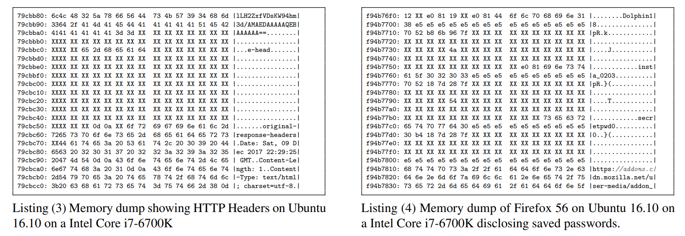

# LEC 22 (rtm): Meltdown

笔记大量参考了[肖宏辉](https://www.zhihu.com/people/xiao-hong-hui-15)大佬的翻译。

目录：

<!-- @import "[TOC]" {cmd="toc" depthFrom=2 depthTo=2 orderedList=false} -->

<!-- code_chunk_output -->

- [Meltdown 发生的背景](#meltdown-发生的背景)
- [可能导致 Meltdown 成功的 CPU 特性](#可能导致-meltdown-成功的-cpu-特性)
- [Meltdown Attack and Fix](#meltdown-attack-and-fix)

<!-- /code_chunk_output -->

细分目录：

<!-- @import "[TOC]" {cmd="toc" depthFrom=2 depthTo=6 orderedList=false} -->

<!-- code_chunk_output -->

- [Meltdown 发生的背景](#meltdown-发生的背景)
  - [一个极简的 meltdown 例子](#一个极简的-meltdown-例子)
- [可能导致 Meltdown 成功的 CPU 特性](#可能导致-meltdown-成功的-cpu-特性)
  - [Speculative execution 预测执行](#speculative-execution-预测执行)
    - [预测执行例子（branch prediction 分支预测）](#预测执行例子branch-prediction-分支预测)
    - [为什么 Meltdown 能在分支预测生效](#为什么-meltdown-能在分支预测生效)
  - [CPU caches](#cpu-caches)
    - [L1 cache 和 L2 cache](#l1-cache-和-l2-cache)
    - [现代 CPU cache](#现代-cpu-cache)
    - [Flush and Reload 用 Cache 做 Meltdown](#flush-and-reload-用-cache-做-meltdown)
- [Meltdown Attack and Fix](#meltdown-attack-and-fix)
  - [Meltdown, including Flush+Reload](#meltdown-including-flushreload)
  - [Meltdown Fix](#meltdown-fix)

<!-- /code_chunk_output -->

## Meltdown 发生的背景

今天讲的是Meltdown，之所以我会读这篇论文，是因为我们在讲解如何设计内核时总是会提到安全。内核提供安全性的方法是隔离，用户程序不能读取内核的数据，用户程序也不能读取其他用户程序的数据。我们在操作系统中用来实现隔离的具体技术是硬件中的User/Supervisor mode，硬件中的Page Table，以及精心设计的内核软件，例如系统调用在使用用户提供的指针具备防御性。

但是同时也值得思考，如何可以破坏安全性？实际上，内核非常积极的提供隔离性安全性，但总是会有问题出现。今天的论文讨论的就是最近在操作系统安全领域出现的最有趣的问题之一，它发表于2018年。包括我在内的很多人发现对于用户和内核之间的隔离进行攻击是非常令人烦恼的，因为它破坏了人们对于硬件上的Page Table能够提供隔离性的设想。这里的攻击完全不支持这样的设想。

同时，Meltdown也是被称为`Micro-Architectural Attack`的例子之一， **这一类攻击涉及利用CPU内隐藏的实现细节。通常来说CPU如何工作是不公开的，但是人们会去猜，一旦猜对了CPU隐藏的实现细节，就可以成功的发起攻击。** Meltdown是可被修复的，并且看起来已经被完全修复了。然后它使得人们担心还存在类似的Micro-Architectural Attack。所以这是最近发生的非常值得学习的一个事件。

让我从展示攻击的核心开始，之后我们再讨论具体发生了什么。

### 一个极简的 meltdown 例子

```c
//
// The core of the Meltdown attack
//

char buf[8192]
r1 = <a kernel virtual address>
r2 = *r1
r2 = r2 & 1
r2 = r2 * 4096
r3 = buf[r2]
```

这是论文中展示攻击是如何工作的代码的简化版。如果你是攻击者，出于某种原因你可以在计算机上运行一些软件，这个计算机上有一些你想要窃取的数据。虽然你不能直接访问这些数据，但是这些数据还是位于内存中，或许是内核内存，或许是另一个进程的内存。你可以在计算机上运行一个进程，或许因为你登录到了分时共享的机器，也或许你租用了运行在主机上的服务。你可以这样发起攻击：
- 在程序中你在自己的内存中声明了一个buffer，这个buffer就是普通的用户内存且可以被正常访问。
- 然后你拥有了内核中的一个虚拟内存地址，其中包含了一些你想要窃取的数据。
- 这里的程序是C和汇编的混合，代码 `r2 = *r1` 的意思是你拥有了内核的虚拟内存地址，你从这个内存地址取值出来并保存在寄存器r2中。
- `r2 = r2 & 1` 获取寄存器r2的低bit位，所以 **这里这种特定的攻击只是从内核一个内存地址中读取一个bit。**
- `r2 = r2 * 4096` 将这个值乘以4096，因为低bit要么是1，要么是0，所以这意味着r2要么是4096，要么是0。
- `r3 = buf[r2]` 中，我们就是读取前面申请的buffer，要么读取位置0的buffer，要么读取位置4096的buffer。

这就是攻击的基本流程。

这里的一个问题是，为什么这里不能直接工作？在 `r2 = *r1` ，我们读取了内核的内存地址指向的数据，我们可以直接读取内核的内存地址吗？并不能，我们相信答案是否定的。如果我们在用户空间，我们不可能直接从内核读取数据。我们知道CPU不能允许这样的行为，因为当我们使用一个内核虚拟地址时，这意味着我们会通过Page Table进行查找，而Page Table有权限标志位，我们现在假设操作系统并没有在PTE中为内核虚拟地址设置标志位来允许用户空间访问这个地址，这里的标志位在RISC-V上就是`pte_u`标位置。因此这里的读取内核内存地址指令必然会失败，必然会触发Page Fault。实际中如果我们运行代码，这些代码会触发Page Fault。如果我们在代码的最后增加printf来打印r3寄存器中的值，我们会在 `r2 = *r1` 得到Page Fault，我们永远也走不到printf。这时我们发现我们不能直接从内核中偷取数据。

然而，如论文展示的一样，这里的指令序列是有用的。虽然现在大部分场景下已经不是事实了，但是论文假设内核地址被映射到了每个用户进程的地址空间中了。也就是说，当用户代码在运行时，完整的内核PTE也出现在用户程序的Page Table中，但是这些PTE的`pte_u`比特位没有被设置，所以用户代码在尝试使用内核虚拟内存地址时，会得到Page Fault。在论文写的时候，所有内核的内存映射都会在用户程序的Page Table中，只是它们不能被用户代码使用而已，如果用户代码尝试使用它们，会导致Page Fault。操作系统设计人员将内核和用户内存地址都映射到用户程序的Page Table中的原因是，这使得系统调用非常的快，因为这使得当发生系统调用时，你不用切换Page Table。切换Page Table本身就比较费时，同时也会导致CPU的缓存被清空，使得后续的代码执行也变慢。所以通过同时将用户和内核的内存地址都映射到用户空间可以提升性能。但是上面的攻击依赖了这个习惯。我将会解释这里发生了什么使得上面的代码是有用的。

- 学生提问：能重复一下上面的内容吗？
- Robert教授：在XV6中，当进程在用户空间执行时，如果你查看它的Page Table，其中包含了用户的内存地址映射，trampoline和trap frame page的映射，除此之外没有别的映射关系，这是XV6的工作方式。而这篇论文假设的Page Table不太一样，当这篇论文在写的时候，大部分操作系统都会将内核内存完整映射到用户空间程序。所以所有的内核PTE都会出现在用户程序的Page Table中，但是因为这些PTE的`pte_u`比特位没有被设置，用户代码并不能实际的使用内核内存地址。
- 这么做的原因是，当你执行系统调用时，你不用切换Page Table，因为当你通过系统调用进入到内核时，你还可以使用同一个Page Table，并且因为现在在Supervisor mode，你可以使用内核PTE。这样在系统调用过程中，进出内核可以节省大量的时间。所以大家都使用这个技术，并且几乎可以肯定Intel也认为一个操作系统该这样工作。
- 在论文中讨论的攻击是基于操作系统使用了这样的结构。最直接的摆脱攻击的方法就是不使用这样的结构。但是当论文还在写的时候，所有的内核PTE都会出现在用户空间。
- 学生提问：所以为了能够攻击，需要先知道内核的虚拟内存地址？
- Robert教授：是的。或许找到内存地址本身就很难，但是你需要假设攻击者有无限的时间和耐心，如果他们在找某个数据，他们或许愿意花费几个月的时间来窃取这个数据。有可能这是某人用来登录银行账号或者邮件用的密码。这意味着攻击者可能需要尝试每一个内核内存地址，以查找任何有价值的数据。
- 或许攻击者会研究内核代码，找到内核中打印了数据的地址，检查数据结构和内核内存，最后理解内核是如何工作的，并找到对应的虚拟内存地址。因为类似的攻击已经存在了很长的时间，内核实际上会保护自己不受涉及到猜内核内存地址的攻击的影响。论文中提到了Kernal address space layout randomization。所以现代的内核实际上会将内核加载到随机地址，这样使得获取内核虚拟地址更难。这个功能在论文发表很久之前就存在，因为它可以帮助防御攻击。
- 在这个攻守双方的游戏中，我们需要假设攻击者最后可以胜出并拿到内核的虚拟内存地址。所以我们会假设攻击者要么已经知道了一个内核虚拟地址，要么愿意尝试每一个内核虚拟内存地址。

我们会好奇，上面的代码怎么会对攻击者是有用的？如果CPU如手册中一样工作，那么这里的攻击是没有意义的，在 `r2 = *r1` 会有Page Fault。但是实际上CPU比手册中介绍的要复杂的多，而攻击能生效的原因是一些CPU的实现细节。

**这里攻击者依赖CPU的两个实现技巧，一个是Speculative execution（预测执行），另一个是CPU的缓存方式。**

## 可能导致 Meltdown 成功的 CPU 特性

### Speculative execution 预测执行

#### 预测执行例子（branch prediction 分支预测）

首先来看Speculative execution（预测执行），这里也有一个示例代码。

```c
//
// Speculative execution example
//

r0 = <something>
r1 = valid    // r1 is a register; valid is in RAM
if (r1 == 1) {
  r2 = *r0
  r3 = r2 + 1
} else {
  r3 = 0
}
```

现在我并没有讨论安全性， Speculative execution 是一种用来提升CPU性能的技术，所以这是CPU使用的一些优化技巧。假设我们在运行这里的代码：
- 在r0寄存器保存了一个内存地址，地址可能是有效的也可能是无效的，这取决于我代码的逻辑。
- 我们假设内存中还保存了一个valid变量。在使用r0中保存地址之前，我们会先将valid从内存中加载到r1。
- 并且只有当valid等于1时，才使用r0中的地址。如果valid等于0，我们将不会使用r0中的地址。
- 如果valid等于1，我们会将r0的地址指向的内容加载到r2。
- 并对r2寄存器加1，保存在r3寄存器中。

在一个简单的CPU实现中，在代码 `r1 = valid` ，你会将valid从内存中加载到r1，这里对应了从内存中读取数据的load指令。 **任何一个需要从内存中读取数据的load指令都会花费2GHZ CPU的数百个CPU cycle。** CPU最多可以在每个cycle执行一条指令，如果我们需要在代码的`r1 = valid`等待几百个CPU cycle，那么机器会闲置数百个CPU cycle。这是一个明显的降低性能的地方，因为如果一切都正常的话，CPU可以在每个cycle内执行一条指令，而不是每几百个cycle才执行一条指令。

所有现在的CPU都使用了叫做 branch prediction 的功能。if语句是一个branch，如果我们将其转换成机器指令，我们可以发现这里有一个branch，并且这是一个带条件的branch用来测试r1寄存器是否等于1。CPU的branch prediction会至少为每个最近执行过的branch保存一个缓存，并记住这个branch是否被选中了，所以这里可能是基于上次branch的选择的预测。但是即使CPU没有足够的信息做预测，它仍然会选择一个branch，并执行其中的指令。 **也就是说在CPU在知道 `r1 == 1` 是否为true之前，它会选择某一个branch并开始执行。或许branch选错了，但是CPU现在还不知道。**

所以在上面的代码中，或许在 `r1 = valid` 的load结束之前，也就是在知道valid变量的值之前，CPU会开始执行`r2 = *r0`的指令，并通过load指令读取r0指向的内存地址的内容。而r0中的内存地址或许是，也或许不是一个有效的指针。一旦load指令返回了一些内容，在代码的 `r3 = r2 + 1` 对返回内容加1并设置到r3寄存器中。

或许很久之后，`r1 = valid` 的load指令终于完成了，现在我们知道valid变量的值。如果valid等于1，那么一切都好，如果valid等于0，CPU会取消它执行第一个分支的效果，并重新执行合适的分支代码，也就是`r3 = 0`代码。

这里在确定是否应该执行之前就提前执行分支代码的行为，被称作预测执行。这是为了提升性能，如果CPU赌对了，那么它就可以超前执行一些指令，而不用等待费时的内存加载。

#### 为什么 Meltdown 能在分支预测生效

**CPU中为了支持预测执行的硬件及其复杂，CPU里面有大量的设计来让这里能工作，但是没有一个设计被公开了，这些都是Intel的内部信息，并且不在手册中。** 所以在Meltdown Attack时，涉及到大量有关CPU是如何工作的猜测来确保攻击能生效。

为了能回滚误判的预测执行，CPU需要将寄存器值保存在别处。虽然代码中第一个分支将值保存在了r2，r3，但是实际上是保存在了临时寄存器中。如果CPU赌对了，那么这些临时寄存器就成了真实寄存器，如果赌错了，CPU会抛弃临时寄存器，这样代码第一个分支就像从来没有发生过一样。

在这里的代码中，我们需要考虑如果r0中是有效的指针会发生什么，如果不是有效的指针，又会发生什么。如果我们在超前执行代码`r2 = *r0`，并且r0中是有效的指针，那么CPU会真实的加载指针的内容到r2寄存器的临时版本中。如果r0中的指针指向的内容位于CPU的cache中，那么必然可以将内容拷贝到r2寄存器的临时版本。如果CPU的cache中没有包含数据，我并不清楚CPU是否会会从内存中读取r0中指针指向的内容。

对于我们来说，更有趣的一个问题是，如果r0中的指针不是一个有效的指针，会发生什么？如果r0中的指针不是一个有效的地址，并且我们在超前执行`r2 = *r0`，机器不会产生Fault。 **机器或许知道r0是无效的地址，并且`r2 = *r0`尝试使用一个无效的地址，但是它不能产生Page Fault，因为它不能确定`r2 = *r0`是否是一个正确的代码分支，因为有可能CPU赌错了。** 所以直到CPU知道了valid变量的内容，否则CPU不能在`r2 = *r0`生成Page Fault。也就是说，如果CPU发现`r2 = *r0`中r0内的地址是无效的，且valid变量为1，这时机器才会生成Page Fault。如果r0是无效的地址，且valid变量为0，机器不会生成Page Fault。所以是否要产生Page Fault的决定，可能会推迟数百个CPU cycle，直到valid变量的值被确定。

当我们确定一条指令是否正确的超前执行了而不是被抛弃了这个时间点，对应的技术术语是`Retired`。所以当我们说一个指令被超前执行，在某个时间点Retired，这时我们就知道这条指令要么会被丢弃，要么它应该实际生效，并且对机器处于可见状态。一条指令如果是Retired需要满足两个条件：
- 首先它自己要结束执行，比如说结束了从内存加载数据，结束了对数据加1
- 其次，所有之前的指令也需要Retired。所以上面代码`r2 = *r0`在直到valid变量被从内存中加载出来且if被判定之前不能Retired，所以`r2 = *r0`的Retirement可能会延后数百个CPU cycle

这是Meltdown攻击非常关键的一个细节。

如果r0中的内存地址是无效的，且在Page Table中完全没有映射关系，那么我也不知道会发生什么。如果r0中的内存地址在Page Table中存在映射关系，只是现在权限不够，比如说pte_u标志位为0，那么Intel的CPU会加载内存地址对应的数据，并存储在r2寄存器的临时版本中。之后r2寄存器的临时版本可以被代码 `r3 = r2 + 1` 使用。所以尽管r0中的内存地址是我们没有权限的内存，比如说一个内核地址，它的数据还是会被加载到r2，之后再加1并存储在r3中。之后，当代码 `r2 = *r0` 时，CPU会发现这是一个无效的读内存地址行为，因为PTE不允许读取这个内存地址。这时CPU会产生Page Fault取消执行后续指令，并回撤对于r2和r3寄存器的修改。

所以，在这里的例子中，CPU进行了两个推测：一个是CPU推测了if分支的走向，并选择了一个分支提前执行；除此之外，CPU推测了 `r2 = *r0` 能够成功完成。对于load指令，如果数据在CPU缓存中且相应的PTE存在于Page Table，不论当前代码是否有权限，Intel CPU总是能将数据取出。如果没有权限，只有在 `r2 = *r0` Retired的时候，才会生成Page Fault，并导致预测执行被取消。

- 学生提问：我对CPU的第二个预测，也就是从r0中保存的内存地址加载数据有一些困惑，这是不是意味着r0对应的数据先被加载到了r2，然后再检查PTE的标志位？
- Robert教授：完全正确。 **在预测的阶段，不论r0指向了什么地址，只要它指向了任何东西，内存中的数据会被加载到r2中。之后，当load指令Retired时才会检查权限。如果我们并没有权限做操作，所有的后续指令的效果会被取消，也就是对于寄存器的所有修改会回滚。同时，Page Fault会被触发，同时寄存器的状态就像是预测执行的指令没有执行过一样。**
- 学生提问：难道不能限制CPU在Speculative execution的时候，先检查权限，再执行load指令吗？看起来我们现在的问题就是我们在不知道权限的情况下读取了内存，如果我们能先知道权限，那么Speculative execution能不能提前取消？
- Robert教授：这里有两个回答。首先，Intel芯片并不是这样工作的。其次，是的，我相信对于Intel来说如果先做权限检查会更简单，这样的话，在上面的例子中，r2寄存器就不会被修改。
- 你们或许注意到论文中提到，尽管AMD CPU的手册与Intel的一样，它们有相同的指令集，Meltdown Attack并不会在AMD CPU上生效。普遍接受的观点是，AMD CPU在Speculative execution时，如果没有权限读取内存地址，是不会将内存地址中的数据读出。这就是为什么Meltdown Attack在AMD CPU上不生效的原因。最近的Intel CPU明显也采用了这种方法，如果程序没有权限，在Speculative execution的时候也不会加载内存数据。
- 这里使用哪种方式对于性能来说没有明显区别，或许在指令Retired的时候再检查权限能省一些CPU的晶体管吧。这里我要提醒一下，这里有很多内容都是猜的，不过我认为我说的都是对的。Intel和AMD并没有太披露具体的细节。


这里有一些重要的术语。你可以从CPU手册中读到的，比如说一个add指令接收两个寄存器作为参数，并将结果存放在第三个寄存器，这一类设计被称为CPU的Architectural，或者通告的行为。如果你读取一个你没有权限的内存地址，你会得到一个Page Fault，你不允许读取这个内存地址，这就是一种通告的行为。 **CPU的实际行为被称作Micro-Architectural，CPU的通告行为与实际行为是模糊不清的。比如说CPU会悄悄的有Speculative execution。**

CPU设计者在设计Micro-Architectural时的初衷是为了让它是透明的。的确有很多行为都发生在CPU内部，但是结果看起来就像是CPU完全按照手册在运行。举个例子，在上面代码的 `r2 = *r0` ，或许Intel的CPU在读取内存时没有检查权限，但是如果权限有问题的话，在指令Retired的时候，所有的效果都会回滚，你永远也看不到你不该看到的内存内容。所以看起来就跟CPU的手册一样，你不允许读取你没有权限的内存地址。这里Architectural和Micro-Architectural的区别是Meltdown Attack的主要攻击点。这里的攻击知道CPU内部是如何工作的。

### CPU caches

#### L1 cache 和 L2 cache

接下来我将介绍Micro-Architectural的另一个部分，也就是缓存。我知道大家都知道CPU有cache，但是缓存或多或少应该是也透明的。让我画个图描述一下cache，因为我认为cache与Meltdown最相关。


首先，你有CPU核，这是CPU的一部分，它会解析指令，它包含了寄存器，它有加法单元，除法单元等等。所以这是CPU的执行部分。

当CPU核需要执行load/store指令时，CPU核会与内存系统通信。内存系统一些cache其中包含了数据的缓存。首先是L1 data cache，它或许有64KB，虽然不太大，但是它特别的快。如果你需要的数据在L1 cache中，只通过几个CPU cycle就可以将数据取回。L1 cache的结构包含了一些线路，每个线路持有了可能是64字节的数据。这些线路是个表单，它们通过虚拟内存地址索引。 **如果一个虚拟内存地址在cache中，并且cache为这个虚拟内存地址持有了数据，那么实际中可以认为L1 cache中也包含了来自对应于虚拟内存地址的PTE的权限。**

L1 cache是一个表单，当CPU核执行load指令时，首先硬件会检查L1 cache是否包含了匹配load指令的虚拟内存地址，如果有的话，CPU会直接将L1 cache中的数据返回，这样可以很快完成指令。

如果不在L1 cache，那么数据位于物理内存中，所以现在我们需要物理内存地址，这里需要Translation Lookaside Buffer（TLB），TLB是PTE的缓存。现在我们会检查load指令中的虚拟内存地址是否包含在TLB中。如果不在TLB，我们就需要做大量的工作，我们需要从内存中读取相关的PTE。让我们假设TLB中包含了虚拟内存地址对应的物理内存Page地址，我们就可以获取到所需要的物理内存地址。 **通常来说会有一个更大的cache（L2 cache），它由物理内存地址索引。**

现在通过TLB我们找到了物理内存地址，再通过L2 cache，我们有可能可以获取到数据。如果我们没有在L2 cache中找到物理内存地址对应的数据。我们需要将物理内存地址发送给RAM系统。这会花费很长的时间，当我们最终获得了数据时，我们可以将从RAM读取到的数据加入到L1和L2 cache中，最终将数据返回给CPU核。

以上就是CPU的cache。如果L1 cache命中的话可能只要几个CPU cycle，L2 cache命中的话，可能要几十个CPU cycle，如果都没有命中最后需要从内存中读取那么会需要几百个CPU cycle。 **一个CPU cycle在一个2GHZ的CPU上花费0.5纳秒。** 所以拥有cache是极其有利的，如果没有cache的话，你将会牺牲掉几百倍的性能。所以cache对于性能来说是非常关键的。

在Meltdown Attack的目标系统中，如果我们运行在用户空间，L1和L2 cache可以既包含用户数据，也包含内核数据。L2 cache可以包含内核数据因为它只是物理内存地址。 **L1 cache有点棘手，因为它是虚拟内存地址，当我们更换Page Table时，L1 cache的内容不再有效。因为更换Page Table意味着虚拟内存地址的意义变了，所以这时你需要清空L1 cache。** 不过实际中会有更多复杂的细节，可以使得你避免清空L1 cache。

论文中描述的操作系统并没有在内核空间和用户空间之间切换的时候更换Page Table，因为两个空间的内存地址都映射在同一个Page Table中了。这意味着我们不必清空L1 cache，也意味着L1 cache会同时包含用户和内核数据，这使得系统调用更快。如果你执行系统调用，当系统调用返回时，L1 cache中还会有有用的用户数据，因为我们在这个过程中并没与更换Page Table。所以，当程序运行在用户空间时，L1 cache中也非常有可能有内核数据。L1 cache中的权限信息拷贝自TLB中的PTE，如果用户空间需要访问内核内存数据，尽管内核数据在L1 cache中，你也不允许使用它，如果使用的话会触发Page Fault。

所以尽管Micro-Architectural设计的细节都是保密的，但是很多人对它都有强烈的兴趣，因为这影响了很多的性能。比如说编译器作者就知道很多Micro-Architectural的细节，因为很多编译器优化都基于人们对于CPU内部工作机制的猜测。实际中，CPU制造商发布的优化手册披露了一些基于Micro-Architectural的技巧，但是他们很少会介绍太多细节，肯定没有足够的细节来理解Meltdown是如何工作的。所以Micro-Architectural某种程度上说应该是透明的、隐藏的、不可见的，但同时很多人又知道一些随机细节。

#### 现代 CPU cache

- 学生提问：L1 cache是每个CPU都有一份，L2 cache是共享的对吧？
- Robert教授：不同CPU厂商，甚至同一个厂商的不同型号CPU都有不同的cache结构。今天普遍的习惯稍微有点复杂，在一个多核CPU上，每一个CPU核都有一个L1 cache，它离CPU核很近，它很快但是很小。每个CPU核也还有一个大点的L2 cache。除此之外，通常还会有一个共享的L3 cache。


另一种方式是所有的L2 cache结合起来，以方便所有的CPU共用L2 cache，这样我可以非常高速的访问我自己的L2 cache，但是又可以稍微慢的访问别的CPU的L2 cache，这样有效的cache会更大。

所以通常你看到的要么是三级cache，或者是两级cache但是L2 cache是合并在一起的。典型场景下，L2和L3是物理内存地址索引，L1是虚拟内存地址索引。

- 学生提问：拥有物理内存地址的缓存有什么意义？
- Robert教授：如果同一个数据被不同的虚拟内存地址索引，虚拟内存地址并不能帮助你更快的找到它。而L2 cache与虚拟内存地址无关，不管是什么样的虚拟内存地址，都会在L2 cache中有一条物理内存地址记录。
- 学生提问：MMU和TLB这里位于哪个位置？
- Robert教授：我认为在实际中最重要的东西就是TLB，并且我认为它是与L1 cache并列的。如果你miss了L1 cache，你会查看TLB并获取物理内存地址。MMU并不是一个位于某个位置的单元，它是分布在整个CPU上的。
- 学生提问：但是MMU不是硬件吗？
- Robert教授：是的，这里所有的东西都是硬件。CPU芯片有数十亿个晶体管，所以尽管是硬件，我们讨论的也是使用非常复杂的软件设计的非常复杂的硬件。所以CPU可以做非常复杂和高级的事情。所以是的，它是硬件，但是它并不简单直观。
- 学生提问：Page Table的映射如果没有在TLB中命中的话，还是要走到内存来获取数据，对吧？
- Robert教授：从L2 cache的角度来说，TLB miss之后的查找Page Table就是访问物理内存，所以TLB需要从内存中加载一些内存页，因为这就是加载内存，这些内容可以很容易将Page Table的内容缓存在L2中。

#### Flush and Reload 用 Cache 做 Meltdown

为什么Cache与Meltdown相关呢？接下来我将讨论一下论文中使用Cache的主要方法。论文中讨论了这种叫做Flush and Reload的技术，这个技术回答了一个问题：一段特定的代码是否使用了特定内存地址的数据？这个技术本身并不是一个直接的安全漏洞，因为它只能基于你有权限的内存地址工作。


所以如果你是用户代码，你可以使用属于你的用户空间内存，并且你现在要调用一个你自己的函数，你可以使用Flush and Reload来知道你刚刚执行的函数是否使用了某个属于你自己的内存。你不能直接使用这种技术来获取其他进程的私有内存。进程之间有时候会共享内存，你还是可以访问这部分共享的内存。所以Flush and Reload回答了这个问题，特定的函数是否使用了特定内存地址？它的具体工作步骤如下：
- 第一步，假设我们对地址X感兴趣，我们希望确保Cache中并没有包含位于X的内存数据。实际中，为了方便，Intel提供了一条指令，叫做`clflush`，它接收一个内存地址作为参数，并确保该内存地址不在任何cache中。这超级方便，不过即使CPU并没有提供这样的指令，实际中也有方法能够删除Cache中的数据，举个例子，如果你知道Cache有64KB，那么你load 64KB大小的随机内存数据，这些数据会被加载到Cache中，这时Cache中原本的数据会被冲走，因为Cache只有64KB大小。所以即使没有这个好用的指令，你仍然可以清空Cache中的所有数据。
- 第二步，如果你对某段可能使用了内存地址X的代码感兴趣，你可以调用这个函数，先不管这个函数做了什么，或许它使用了内存地址X，或许没有。
- 现在，你想要知道X是否在Cache中，如果是的话，因为在第一步清空了Cache，必然是因为第二步的函数中load了这个内存地址。所以你现在想要执行load，但是你更想知道load花费了多长时间，而且我们这里讨论的是纳秒级别的时间，比如5个纳秒或者100个纳秒，那么我们该怎样达到这种测量精度呢？这是个困难的任务。Intel CPU会提供指令来向你返回CPU cycle的数量，这被称为`rdtsc`。所以这里我们会执行`rdtsc`指令，它会返回CPU启动之后总共经过了多少个CPU cycle。如果是2GHZ的CPU，这意味着通过这个指令我们可以得到0.5纳秒的测量精度。
- 现在我们会将内存地址X的数据加载到junk对象中。
- 然后再通过`rdtsc`读取时间。如果两次读取时间的差是个位数，那么上一步的load指令走到了cache中，也就是第二步的函数中使用了内存地址X的数据。如果两次读取时间的差别超过100，这意味着内存地址X不在cache中，虽然这并不绝对，但是这可能代表了第二步的函数中并没有使用内存X的数据。因为函数中可能使用了内存地址X，然后又用了其他与X冲突的数据，导致内存地址X又被从cache中剔除了。但是对于简单的情况，如果两次时间差较大那么第二步的函数没有使用内存地址X，如果两次时间差较小那么第二步函数使用了内存地址X。

现在还没有涉及到攻击，因为这里我们需要能够访问到内存地址X，所以这是我们可以访问的内存地址。

以上就是有关Meltdown的前置知识。

## Meltdown Attack and Fix

### Meltdown, including Flush+Reload


这段代码比之前的代码更加完整，这里是一个更完整的Meltdown攻击代码，这里我们增加了Flush and Reload代码。

首先我们声明了一个buffer，现在我们只需要从内核中窃取1个bit的数据，我们会将这个bit乘以4096，所以我们希望下面的Flush and Reload要么看到buffer[0]在cache中，要么看到buffer[4096]在cache中。为什么要有这么的大的间隔？是因为硬件有预获取。如果你从内存加载一个数据，硬件极有可能会从内存中再加载相邻的几个数据到cache中。所以我们不能使用两个非常接近的内存地址，然后再来执行Flush and Reload，我们需要它们足够的远，这样即使有硬件的预获取，也不会造成困扰。所以这里我们将两个地址放到了两个内存Page中（注，一个内存Page 4096）。

现在的Flush部分直接调用了clflush指令（代码第4第5行），来确保我们buffer中相关部分并没有在cache中。

代码第7行或许并不必要，这里我们会创造时间差。我们将会在第10行执行load指令，它会load一个内核内存地址，所以它会产生Page Fault。但是我们期望能够在第10行指令Retired之前，也就是实际的产生Page Fault并取消这些指令效果之前，再预测执行（Speculative execution）几条指令。如果代码第10行在下面位置Retired，那么对我们来说就太早了。实际中我们需要代码第13行被预测执行，这样才能完成攻击。

所以我们希望代码第10行的load指令尽可能晚的Retired，这样才能推迟Page Fault的产生和推迟取消预测执行指令的效果。因为我们知道一个指令只可能在它之前的所有指令都Retired之后，才有可能Retired。所以在代码第7行，我们可以假设存在一些非常费时的指令，它们需要很长时间才能完成。或许要从RAM加载一些数据，这会花费几百个CPU cycle；或许执行了除法，或者平方根等。这些指令花费了很多时间，并且很长时间都不会Retired，因此也导致代码第10行的load很长时间也不会Retired，并给第11到13行的代码时间来完成预测执行。

现在假设我们已经有了内核的一个虚拟内存地址，并且要执行代码第10行。我们知道它会生成一个Page Fault，但是它只会在Retired的时候才会真正的生成Page Fault。我们设置好了使得它要过一会才Retired。因为代码第10行还没有Retired，并且在Intel CPU上，即使你没有内存地址的权限，数据也会在预测执行的指令中被返回。这样在第11行，CPU可以预测执行，并获取内核数据的第0个bit。第12行将其乘以4096。第13行是另一个load指令，load的内存地址是buffer加上r2寄存器的内容。我们知道这些指令的效果会被取消，因为第10行会产生Page Fault，所以对于r3寄存器的修改会被取消。**但是尽管寄存器都不会受影响，代码第13行会导致来自于buffer的部分数据被加载到cache中。取决于内核数据的第0bit是0还是1，第13行会导致要么是buffer[0]，要么是buffer[4096]被加载到cache中。之后，尽管r2和r3的修改都被取消了，cache中的变化不会被取消，因为这涉及到Micro-Architectural，所以cache会被更新。**

第15行表示最终Page Fault还是会发生，并且我们需要从Page Fault中恢复。用户进程可以注册一个Page Fault Handler，并且在Page Fault之后重新获得控制。论文还讨论了一些其他的方法使得发生Page Fault之后可以继续执行程序。

现在我们需要做的就是弄清楚，是buffer[0]还是buffer[4096]被加载到了cache中。现在我们可以完成Flush and Reload中的Reload部分了。第18行获取当前的CPU时间，第19行load buffer[0]，第20行再次读取当前CPU时间，第21行load buffer[4096]，第22行再次读取当前CPU时间，第23行对比两个时间差。哪个时间差更短，就可以说明内核数据的bit0是0还是1。**如果我们重复几百万次，我们可以扫描出所有的内核内存。**

- 学生提问：在这里例子中，如果`b-a<c-b`，是不是意味着buffer[0]在cache中？
- Robert教授：是的，你是对的。
- 学生提问：在第9行之前，我们需要if语句吗？
- Robert教授：并不需要，之前例子中的if语句是帮助我展示Speculative execution的合理理由：尽管CPU不知道if分支是否命中，它还是会继续执行。但是在这里，预测执行的核心是我们并不知道第10行的load会造成Page Fault，所以CPU会在第10行load之后继续预测执行。理论上，尽管这里的load可能会花费比较长的时间（例如数百个CPU cycle），但是它现在不会产生Page Fault，所以CPU会预测执行load之后的指令。如果load最终产生了Page Fault，CPU会回撤所有预测执行的效果。
- 预测执行会在任何长时间执行的指令，且不论这个指令是否能成功时触发。例如除法，我们不知道是否除以0。一旦触发预测执行，所有之后的指令就会开始被预测执行。
- 不管怎样，真正核心的预测执行从第10行开始，但是为了让攻击更有可能成功，我们需要确保预测执行从第7行开始。
- 学生提问：在这个例子中，我们只读了一个bit，有没有一些其他的修改使得我们可以读取一整个寄存器的数据？
- Robert教授：有的，将这里的代码运行64次，每次获取1个bit。
- 学生提问：为什么不能一次读取64bit呢？
Robert教授：如果这样的话，buffer需要是`2^64`再乘以4096，我们可能没有足够的内存来一次读64bit。或许你可以一次读8个bit，然后buffer大小是`256*4096`。论文中有相关的，因为这里主要的时间在第17行到第24行，也就是Flush and Reload的Reload部分。如果一次读取一个字节，那么找出这个字节的所有bit，需要256次Reload，每次针对一个字节的可能值。如果一次只读取一个bit，那么每个bit只需要2次Reload。所以一次读取一个bit，那么读取一个字节只需要16次Reload，一次读取一个字节，那么需要256次Reload。所以论文中说一次只读取一个bit会更快，这看起来有点反直觉，但是又好像是对的。
- 学生提问：这里的代码会运行在哪？会运行在特定的位置吗？
- Robert教授：这取决于你对于机器有什么样的权限，并且你想要窃取的数据在哪了。举个例子，你登录进了Athena（注，MIT的共享计算机系统），机器上还有几百个其他用户 ，然后你想要窃取某人的密码，并且你很有耐心。在几年前Athena运行的Linux版本会将内核内存映射到每一个用户进程的地址空间。那么你就可以使用Meltdown来一个bit一个bit的读取内核数据，其中包括了I/O buffer和network buffer。如果某人在输入密码，且你足够幸运和有耐心，你可以在内核内存中看见这个密码。实际中，内核可能会映射所有的物理内存，比如XV6就是这么做的，这意味着你或许可以使用Meltdown在一个分时共享的机器上，读取所有的物理内存，其中包括了所有其他进程的内存。这样我就可以看到其他人在文本编辑器的内容，或者任何我喜欢的内容。这是你可以在一个分时共享的机器上使用Meltdown的方法。其他的场景会不太一样。
- 分时共享的机器并没有那么流行了，但是这里的杀手场景是云计算。如果你使用了云服务商，比如AWS，它会在同一个计算机上运行多个用户的业务，取决于AWS如何设置它的VMM或者容器系统，如果你购买了AWS的业务，那么你或许就可以窥探其他运行在同一个AWS机器上的用户软件的内存。我认为这是人们使用Meltdown攻击的方式。
- 另一个可能有用的场景是，当你的浏览器在访问web时，你的浏览器其实运行了很多不被信任的代码，这些代码是各种网站提供的，或许是以插件的形式提供，或许是以javascript的形式提供。这些代码会被加载到浏览器，然后被编译并被运行。有可能当你在浏览网页的时候，你运行在浏览器中的代码会发起Meltdown攻击，而你丝毫不知道有一个网站在窃取你笔记本上的内容，但是我并不知道这里的细节。
- 学生提问：有人演示过通过javascript或者WebAssembly发起攻击吗？
- Robert教授：我不知道。人们肯定担心过WebAssembly，但是我不知道通过它发起攻击是否可行。对于javascript我知道难点在于时间的测量，你不能向上面一样获取到纳秒级别的时间，所以你并不能使用Flush and Reload。或许一些更聪明的人可以想明白怎么做，但是我不知道。

实际中Meltdown Attack并不总是能生效，具体的原因我认为论文作者并没有解释或者只是猜测了一下。如果你查看论文的最后一页如下。



你可以看到Meltdown Attack从机器的内核中读取了一些数据，这些数据里面有一些XXXX，这些是没能获取任何数据的位置，也就是Meltdown Attack失败的位置。论文中的Meltdown Attack重试了很多很多次，因为在论文6.2还讨论了性能，说了在某些场景下，获取数据的速率只有10字节每秒，这意味着代码在那不停的尝试了数千次，最后终于获取到了数据，也就是说Flush and Reload表明了两个内存地址只有一个在Cache中。所以有一些无法解释的事情使得Meltdown会失败，从上图看，Meltdown Attack获取了一些数据，同时也有一些数据无法获得。据我所知，人们并不真的知道所有的成功条件和失败条件，最简单的可能是如果内核数据在L1 cache中，Meltdown能成功，如果内核数据不在L1 Cache中，Meltdown不能成功。如果内核数据不在L1 cache中，在预测执行时要涉及很多机制，很容易可以想到如果CPU还不确定是否需要这个数据，并不一定会完成所有的工作来将数据从RAM中加载过来。你可以发现实际中并没有这么简单，因为论文说到，有时候当重试很多次之后，最终还是能成功。所以这里有一些复杂的情况，或许在CPU内有抢占使得即使内核数据并不在Cache中，这里的攻击偶尔还是可以工作。

论文的最后也值得阅读，因为它解释了一个真实的场景，比如说我们想要通过Meltdown窃取Firefox的密码管理器中的密码，你该怎么找出内存地址，以及一个攻击的完整流程，我的意思是由学院派而不是实际的黑客完成的一次完整的攻击流程。尽管如此，这里也包含了很多实用的细节。

### Meltdown Fix

我最后想讨论的是Meltdown的修复，你们实际已经接触了一些了。当论文发表的时候，它获取了很多的关注。实际中还有另一篇论文，也是由这篇论文的部分作者参与完成，另一篇论文讨论了一种使用了CPU内一种叫做Spectre的不同的预测执行的不同攻击方法。这一对论文的同时出现让人非常兴奋。

所以人们现在发现危害太大了，因为现在我们讨论的是操作系统的隔离性被破坏了。这里的技术破坏了Page Table的保护，这是我们用来实现用户和内核间隔离的技术，所以这是一个非常基础的攻击，或者至少以一种非常通用的方式破坏了安全性非常重要的一个部分。所以人们非常非常迫切的想要修复Meltdown。

很多操作系统在这篇论文发表之后数周内就推出的一个快速修复，这是一个叫做KAISER，现在在Linux中被称为KPTI的技术（Kernel page-table isolation）。这里的想法很简单，也就是不将内核内存映射到用户的Page Table中，相应的就像XV6一样，在系统调用时切换Page Table。所以在用户空间时，Page Table只有用户内存地址的映射，如果执行了系统调用，会有类似于XV6中trampoline的机制，切换到拥有内核内存映射的另一个Page Table中，这样才能执行内核代码。

这会导致Meltdown不能工作，因为现在你会切换Page Table，本来代表内核虚拟内存地址的r1寄存器不仅是没有权限，并且也没有意义了，因为现在的用户Page Table并没有包含对它的翻译，所以CPU并不知道该如何处理这个内存地址。现在这个虚拟内存地址不会存在于cache中，甚至都不会出现在TLB中。所以当在用户空间发起Meltdown Attack时，也就没有办法知道对应这个虚拟内存地址的数据是什么。这个虚拟内存地址并不是非法的，只是在用户空间没有意义了，这样会导致Meltdown Attack不能工作。

KAISER的缺点是，系统调用的代价更高了，因为如果不做任何事情的话，切换Page Table会导致TLB被清空，因为现在TLB中的映射关系都是前一个Page Table的。同时也会导致L1 cache被清空，因为其中对应的虚拟内存地址对于新的Page Table也没有意义了。在一些机器上，切换Page Table会使得系统调用明显变慢。

最近的CPU拥有叫做PCID（process-context identifiers）的技术，它可以帮助你在切换Page Table时避免清空Cache，尽管它还是要花费一些时间。

如果你上网看的话，当时人们有很多顾虑，当时人们认为这种两个Page Table的方案是不可接受的慢。但是实际中这并不是一个严重的问题，你上网看的话就可以发现人们有对于工作负载的整体影响的评估，因为毕竟程序也不是一直在进出内核，这里的影响大概是5%，所以这并不是一个坏的主意。人们非常快的采用了这种方案，实际上在论文发表时，已经有内核采用了这种方案来抵御其他的攻击。

除此之外，还有一个合理的硬件修复。我相信Intel在最近的处理器上已经添加了这个修复，AMD之前就已经有这个修复。

当指令从L1 cache中加载某个数据时，比如说我们想要窃取的内核数据，人们认为数据的权限标志位就在L1 cache中，所以CPU完全可以在获取数据的时候检查权限标志位。实际中，AMD CPU和最近的Intel CPU会在很早的时候检查权限标志位。如果检查不能通过，CPU不会返回数据到CPU核中。所以没有一个预测执行指令可以看到不该看到的数据。

- 学生提问：为什么你觉得Intel会做这个呢？对我来说这里像是个讨论，我们应该为预测执行指令检查权限标志位吗？Intel的回答是不，为什么要检查呢？
- Robert教授：是的，为什么要检查呢？反正用户也看不到对应的数据。如果更早的做权限检查，会在CPU核和L1 cache之间增加几个数字电路门，而CPU核和L1 cache之间路径的性能对于机器来说重要的，如果你能在这节省一些数字电路门的话，这可以使得你的CPU节省几个cycle来从L1 cache获取数据，进而更快的运行程序。所以很容易可以想到如果过早的检查权限，会在电路上增加几个晶体管。因为毕竟所有的预测执行指令都会Retired，并不是说过早的检查权限就可以节省一些后续的工作，在指令Retired的时候还是要触发Page Fault。我这里只是猜测，这里做一些权限检测并不能带来什么优势。
- 学生提问：既然Intel已经从CPU上修复了这个问题，有没有哪个内核计划取消KAISER来提升性能？
- Robert教授：我知道在很多内核上，这个是可选项，但是我并不完全清楚Intel修复的具体内容。我很确定他们有一些修复，但是具体内容我并不知道。
- Frans教授：我认为Linux中你可以查询哪些硬件修复已经存在，并根据返回要求Linux修改从软件对于硬件问题的规避。你可以在你的笔记本上运行一个Linux命令来查看它包含了哪些问题的修复，哪些问题已经在硬件中规避了。
- Robert教授：你是说如果CPU包含了修复的话，Linux实际会使用combined Page Table（注，也就是将内核内存映射到用户Page Table中）？
- Frans教授：是的，我99%相信是这样的，虽然我最近没有再看过了，但是我认为还是这样的。
- 学生提问：人们是在干什么的时候发现这个的？
- Robert教授：当人们尝试入侵一个计算机的时候。谁知道人们真正想要干什么呢？论文是由学院派写的，或许他们在研究的时候发现了一些安全问题。
- Frans教授：我认为很长时间他们的一个驱动力是，他们想破解Address Space Layout Randomization，他们有一些更早的论文，看起来在这个领域有一些研究者。我认为最开始的时候，人们来自不同的领域。 就像Robert说过的，人们在这个领域工作了几十年来找到可以理解和攻击的Bug。
- 学生提问：有多大的可能还存在另一种Meltdown？
- Robert教授：非常有可能。CPU制造商在几十年间向CPU增加了非常非常多酷炫的技术，以使得CPU运行的可以更快一些。人们之前并没有太担忧或者没有觉得这会是一个严重的安全问题。现在人们非常清楚这可能会是非常严重的安全问题，但是我们现在使用的CPU已经包含了30年的聪明思想，实际上在论文发表之前，已经存在很多基于Micro-Architectural的这一类攻击。我认为还需要一段时间才能把这一类问题完全消除。
- Frans教授：如果你查看过去两年的安全相关的会议，每个会议基本都有一个session是有关探索预测执行属性，来看看能不能发起一次攻击。
- Robert教授：或许这是一个更大的问题，是不是我们解决了有限的问题就没事了，又或者是上层设计方法出现问题了。这可能太过悲观了，但是你知道的，人们对于操作系统的隔离寄托了太多期望，可以非常合理的认为隔离可以工作。并且我们会在这种假设下设计类似于云计算，在浏览器中运行Javascript等等场景。但是现在这种假设实际并不成立，曾经人们认为操作系统的隔离性足够接近成立，但是这一整套基于Micro-Architectural的攻击使得这里的故事不再让人信服。
- 学生提问：CPU设计者可以做到什么程度使得不使用Micro-Architectural又能保持高性能，同时也有很好的安全性？
- Robert教授：有些内容明显是可以修复的，比如这节课介绍的Meltdown Attack是可以被修复的，并且不会牺牲任何性能。对于一些其他的攻击，并不十分确定你可以在不损伤性能的前提下修复它们。有些问题隐藏的非常非常的深，现在有很多共享的场景，例如分时共享的计算机，云计算。假设在你的云主机上有一个磁盘驱动和一个网卡驱动，你或许可以仅仅通过监测别人的流量是怎么影响你的流量的，这里的流量包括了网络流量和磁盘流量，来获取同一个主机上的其他用户信息。我不知道这是否可行，但是对于很多东西，人们都能发现可以攻击的点。
- 所以很多这里的Micro-Architectural带来的问题可以在不损伤性能的前提下清除掉，但是也或许不能。
