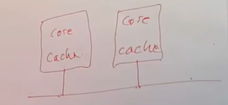
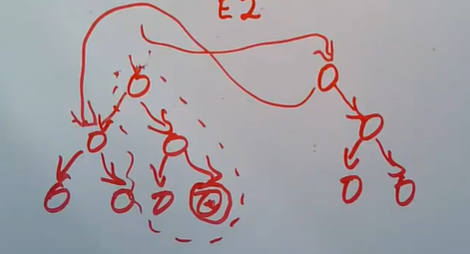
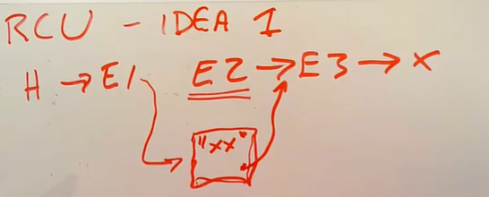
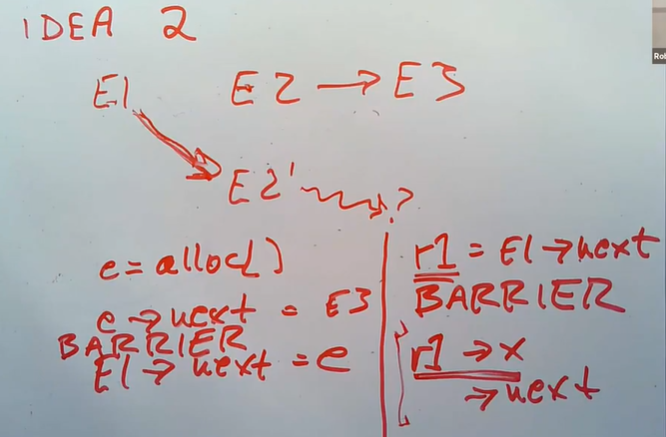
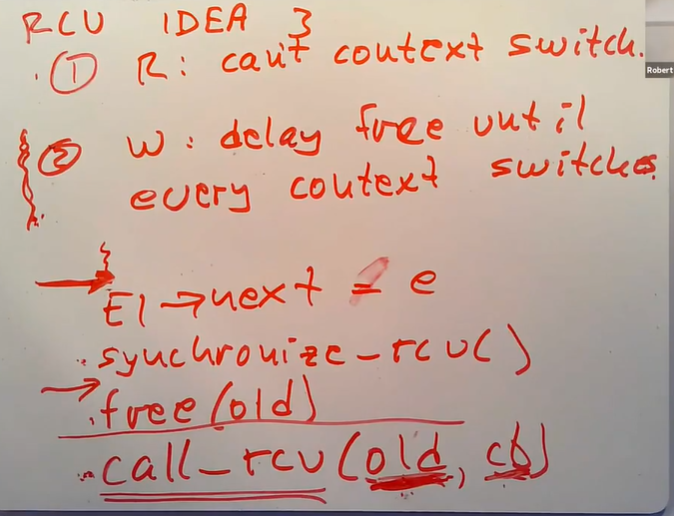

# LEC 23 (rtm): RCU

笔记大量参考了[肖宏辉](https://www.zhihu.com/people/xiao-hong-hui-15)大佬的翻译。

目录：

<!-- @import "[TOC]" {cmd="toc" depthFrom=2 depthTo=2 orderedList=false} -->

<!-- code_chunk_output -->

- [引言：使用锁带来的问题](#引言使用锁带来的问题)
- [读写锁 Read-Write Lock](#读写锁-read-write-lock)
- [RCU, Read Copy Update](#rcu-read-copy-update)
- [RCU 总结与问答](#rcu-总结与问答)

<!-- /code_chunk_output -->

细分目录：

<!-- @import "[TOC]" {cmd="toc" depthFrom=2 depthTo=6 orderedList=false} -->

<!-- code_chunk_output -->

- [引言：使用锁带来的问题](#引言使用锁带来的问题)
  - [自旋锁 spinlock 不能让人满意](#自旋锁-spinlock-不能让人满意)
  - [大量的场景只有读，因此自旋锁不合理](#大量的场景只有读因此自旋锁不合理)
- [读写锁 Read-Write Lock](#读写锁-read-write-lock)
  - [读写锁简单描述](#读写锁简单描述)
  - [读写锁会带来的问题](#读写锁会带来的问题)
- [RCU, Read Copy Update](#rcu-read-copy-update)
  - [RCU 实现基本讨论（规范写者行为，读者不加锁）](#rcu-实现基本讨论规范写者行为读者不加锁)
  - [RCU 修改写者行为：committing write （对数据结构有基本要求）](#rcu-修改写者行为committing-write-对数据结构有基本要求)
  - [RCU实现：Memory barrier](#rcu实现memory-barrier)
  - [RCU实现：读写规则](#rcu实现读写规则)
  - [RCU 代码示例](#rcu-代码示例)
  - [RCU 性能简单讨论](#rcu-性能简单讨论)
- [RCU 总结与问答](#rcu-总结与问答)

<!-- /code_chunk_output -->

## 引言：使用锁带来的问题

### 自旋锁 spinlock 不能让人满意

今天的话题是如何在多核CPU计算机上获得好的性能，这是一个非常有趣，深入且令人着迷的话题。今天我们只会涉及这个话题的很小的一个部分，也就是在面对内核中需要频繁读但是不需要频繁写的共享数据时，如何获得更好的性能。在不同的场景下有不同的方法可以在多核CPU的机器上获得更好的性能，我们今天要看的是Linux的RCU，它对于需要频繁读的内核数据来说是一种非常成功的方法。

如果你有一个现代的计算机，或许包含了4、8、16、64个并行运行的CPU核，这些CPU核共享了内存数据，操作系统内核将会是一个并行运行的程序。如果你想要获得好的性能，你需要确保内核能尽可能的在多个CPU核上并行的完成它的工作。如果你能将内核并行的运行在8个CPU核上，并且它们都能完成有效的工作，那么相比运行在单个CPU核上，你就能获得8倍的性能。从理论上来说，这明显是可能的。

如果你在内核中有大量的进程，那就不太用担心，在不做任何额外工作的前提下，这些进程极有可能是并行运行的。另一方面，如果你有很多应用程序都在执行系统调用，很多时候，不同的应用程序执行的不同系统调用也应该是相互独立的，并且在很多场景下应该在相互不影响的前提下运行。例如，通过fork产生的两个进程，或者读取不同pipe的两个进程，或者读写不同文件的两个进程。表面上看，这些进程之间没有理由会相互影响，也没有理由不能并行运行并获得n倍的吞吐量。

但问题是内核中包含了大量的共享数据。出于一些其他的原因，内核共享了大量的资源，例如内存，CPU，磁盘缓存，inode缓存，这些东西都在后台被不同的进程所共享。这意味着，即使两个完全不相关的进程在执行两个系统调用，如果这两个系统调用需要分配内存或使用磁盘缓存或者涉及到线程调度决策，它们可能最终会使用内核中相同的数据结构，因此我们需要有办法能让它们在使用相同数据的同时，又互不影响。

在过去的许多年里，人们付出了巨大的努力来让内核中的这些场景能更快的运行。我们之前看过其中一种可以保证正确性的方法，也就是spinlock。spinlock很直观，它的工作就是当两个进程可能会相互影响时，阻止并行运行。所以spinlock的直接效果就是降低性能。它使得正确性有了保障，但是又绝对的阻止了并行执行，这并不总是能令人满意。

### 大量的场景只有读，因此自旋锁不合理

今天我们会关注需要频繁读的数据，也就是说你的数据主要是在被读取，相对来说很少被写入。我将使用单链表来作为主要的例子。对于单链表，会存在一个指向头指针（head）的全局变量，之后是一些链表元素，每个链表元素都包含了一个数据，假设是字符串。第一个链表元素包含了“hello”。每个链表元素还包含了一个next指针，指向了下一个链表元素。最后一个链表元素的next指针指向空指针。

接下来我们假设对于这个链表的大部分操作是读，比如说内核线程大部分时候只会扫描链表来找到某些数据，而不会修改链表。假设一个写请求都没有的话，我们就根本不必担心这个链表，因为它是完全静态的，它从来都不会更新，我们可以自由的读它。但是接下来我们假设每隔一会，一些其他的线程会来修改链表元素中的数据；删除一个链表元素；又或者是在某个位置插入链表元素。所以尽管我们关注的主要是读操作，我们也需要关心写操作，我们需要保证读操作在面对写操作时是安全的。

在XV6中，我们是通过锁来保护这个链表。在XV6中，不只是修改数据的线程，读取数据的线程也需要获取锁，因为我们需要排除当我们在读的时候某人正在修改链表的可能，否则的话会导致读取数据的线程可能读到更新一半的数据或者是读到一个无效的指针等等，所以XV6使用了锁。

但是使用锁有个缺点，如果通常情况下没有修改数据的线程，那么意味着每次有一个读取数据的线程，都需要获取一个排他的锁。XV6中的spinlock是排他的，即使只是两个读取数据的线程也只能一次执行一个线程。所以一种改进这里场景的方法是使用一种新的锁，它可以允许多个读取线程和一个写入线程。接下来我们来看看这种锁，不仅因为它是有趣的，也因为它的不足促成了对于RCU的需求。

## 读写锁 Read-Write Lock

### 读写锁简单描述

这种锁被称为读写锁（Read-Write Lock），它的接口相比spinlock略显复杂。如果只是想要读取数据，那么可以调用`r_lock`，将锁作为参数传入，同样的还会有个`r_unlock`，数据的读取者使用这些接口。数据的写入者调用`w_lock`和`w_unlock`接口。

这里的语义是，要么你可以有多个数据的读取者获取了读锁，这样可以获得并行执行读操作的能力；要么你只能有一个数据写入者获取了写锁。但是不能两种情况同时发生， **读写锁排除了某人获取了数据的写锁，同时又有别人获取读锁的可能性。** 你要么只有一个数据写入者，要么有多个数据读取者，不可能有别的可能。

- 学生提问：当某人持有了读锁时，读写锁是采用什么方案来阻止其他人写入数据的？
- Robert教授：并没有什么方案，这就像XV6的锁一样。我们这里讨论的是由值得信赖且负责的开发人员编写的内核代码，所以就像XV6的spinlock一样，如果使用锁的代码是不正确的，那么结果就是不正确的，这是内核代码典型的编写方式，你只能假设开发内核的人员遵循这里的规则。

如果我们有一个大部分都是读取操作的数据结构，我们会希望能有多个用户能同时使用这个数据结构，这样我们就可以通过多核CPU获得真正的性能提升。如果没有其他问题的话，那么读写锁就可以解决今天的问题，我们也没有必要读[RCU这篇论文](../lec/l-rcu.pdf)。但实际上如果你深入细节，你会发现当你使用读写锁时，尤其对于大部分都是读取操作的数据结构，会有一些问题。为了了解实际发生了什么，我们必须看一下读写锁的代码实现。

```c
//
// A simplified version of Linux's read/write lock.
//

// n=0  -> not locker
// n=-1 -> locked by one writer
// n>0  -> locked by n readers
struct rwlock {
  int n;
};

r_lock(l):
  while 1:
    x = l->n
    if x < 0
      continue
    if CAS(&l->n, x, x+1)
      return

// CAS(p, a, b) is atomic compare-and-swap instruction
//   if *p == a, set *p = b, return true
//   else return false

w_lock(l):
  while 1:
    if CAS(&l->n, 0, -1)
      return
```

Linux实际上有读写锁的实现，上面是一种简化了的Linux代码。首先有一个结构体是rwlock，这与XV6中的lock结构体类似。rwlock结构体里面有一个计数器n。
- 如果n等于0那表示锁没有以任何形式被被任何人持有
- 如果n等于-1那表示当前有一个数据写入者持有写锁
- 如果n大于0表示有n个数据读取者持有读锁。我们需要记录这里的数字，因为我们只有在n减为0的时候才能让数据写入者持有写锁。

r_lock函数会一直在一个循环里面等待数据写入者释放锁。首先它获取读写锁中计数器n的拷贝，如果n的拷贝小于0的话那意味着存在一个数据写入者，我们只能继续循环以等待数据写入者退出。 **如果n的拷贝不小于0，我们会增加读写锁的计数器。但是我们只能在读写锁的计数器仍然大于等于0的时候，对其加1。所以我们不能直接对n加1，因为如果一个数据写入者在我们检查n和我们增加n之间潜入了，那么我们有可能在数据写入者将n设置为-1的同时，将n又加了1。所以我们只能在检查完n大于等于0，且n没有改变的前提下，将其加1。**

人们通过利用特殊的原子指令来实现这一点，我们之前在看XV6中spinlock的实现时看过类似的指令（注，类似 `test_and_set` 指令）。其中一个使用起来很方便的指令是`compare-and-swap`（CAS）。CAS接收三个参数，第一个参数是内存的某个地址，第二个参数是我们认为内存中该地址持有的数值，第三个参数是我们想设置到内存地址的数值。CAS的语义是，硬件首先会设置一个内部的锁，使得一个CAS指令针对一个内存地址原子的执行；之后硬件会检查当前内存地址的数值是否还是x；如果是的话，将其设置为第三个参数，也就是x+1，之后CAS指令会返回1；如果不是的话，并不会改变内存地址的数值，并返回0。这里必须是原子性，因为这里包含了两个操作，首先是检查当前值，其次是设置一个新的数值。

- 学生提问：有没有可能计算x的过程中，发生了一个中断？
- Robert教授：你是指我们在执行CAS指令之前计算它的第三个参数的过程中发生中断吗？CAS实际上是一个指令，如果中断发生在我们计算x+1的过程中，那么意味着我们还没有调用CAS，这时包括中断在内的各种事情都可能发生。如果我们在最初读取n的时候读到0，那么不管发不发生中断，我们都会将1作为CAS的第三个参数传入，因为中断并不会更改作为本地变量的x，所以CAS的第二个和第三个参数会是0和1。如果n还是0，我们会将其设置为1，这是我们想看到的；如果n不是0，那么CAS并不会更新n。
- 如果这里没有使用本地变量x，那么就会有大问题了，因为n可能在任意时间被修改，所以我们需要在最开始在本地变量x中存储n的一个固定的值。

上面介绍了w_lock与r_lock同时调用的场景。多个r_lock同时调用的场景同样也很有趣。假设n从0开始，当两个r_lock同时调用时，我们希望当两个r_lock都返回时，n变成2，因为我们希望两个数据读取者可以并行的使用数据。两个r_lock在最开始都将看到n为0，并且都会通过传入第二个参数0，第三个参数1来调用CAS指令，但是只有一个CAS指令能成功。CAS是一个原子操作，一次只能发生一个CAS指令。不管哪个CAS指令先执行，将会看到n等于0，并将其设置为1。另一个CAS指令将会看到n等于1，返回失败，并回到循环的最开始，这一次x可以读到1，并且接下来执行CAS的时候，第二个参数将会是1，第三个参数是2，这一次CAS指令可以执行成功。最终两次r_lock都能成功获取锁，其中一次r_lock在第一次尝试就能成功，另一次r_lock会回到循环的最开始再次尝试并成功。

### 读写锁会带来的问题

- 学生提问：如果开始有一堆数据读取者在读，之后来了一个数据写入者，但是又有源源不断的数据读取者加入进来，是不是就轮不到数据写入者了？
- Robert教授：如果多个数据读取者获取了锁，每一个都会通过CAS指令将n加1，现在n会大于0。如果这时一个数据写入者尝试要获取锁，它的CAS指令会将n与0做对比，只有当n等于0时，才会将其设置为-1。但是因为存在多个数据读取者，n不等于0，所以CAS指令会失败。数据写入者会在w_lock的循环中不断尝试并等待n等于0，如果存在大量的数据读取者，这意味着数据写入者有可能会一直等待。这是这种锁机制的一个缺陷。
- **学生提问：在刚刚两个数据读取者要获取锁的过程中，第二个数据读取者需要再经历一次循环，这看起来有点浪费，如果有多个数据读取者，那么它们都需要重试。**
- **Robert教授：你说到了人们为什么不喜欢这种锁的点子上了。即使没有任何的数据写入者，仅仅是在多个CPU核上有大量的数据读取者，r_lock也可能会有非常高的代价。**



在一个多核的系统中，每个CPU核都有一个关联的cache，也就是L1 cache。每当CPU核读写数据时，都会保存在cache中。除此之外，还有一些内部连接的线路使得CPU可以彼此交互，因为如果某个CPU核修改了某个数据，它需要告诉其他CPU核不要去缓存这个数据，这个过程被称为(cache) invalidation。

如果有多个数据读取者在多个CPU上同时调用r_lock，它们都会读取读写锁的计数`l->n`，并将这个数据加载到CPU的cache中，它们也都会调用CAS指令，但是第一个调用CAS指令的CPU会修改`l->n`的内容。作为修改的一部分，它需要使得其他CPU上的cache失效。所以执行第一个CAS指令的CPU需要通过线路发送invalidate消息给其他每一个CPU核，之后其他的CPU核在执行CAS指令时，需要重新读取`l->n`，但是这时CAS指令会失败，因为`l->n`已经等于1了，但x还是等于0。之后剩下的所有数据读取者都会回到循环的最开始，重复上面的流程，但这一次还是只有一个数据读取者能成功。

**假设有n个数据读取者，那么每个r_lock平均需要循环n/2次，每次循环都涉及到 $O(n)$ 级别的CPU消息，因为至少每次循环中所有CPU对于`l->n`的cache需要被设置为无效。这意味着，对于n个CPU核来说，同时获取一个锁的成本是 $O(n^2)$ ，当你为一份数据增加CPU核时，成本以平方增加。**

这是一个非常糟糕的结果，因为你会期望如果有10个CPU核完成一件事情，你将获得10倍的性能，尤其现在还只是读数据并没有修改数据。你期望它们能真正的并行运行，当有多个CPU核时，每个CPU核读取数据的时间应该与只有一个CPU核时读取数据的时间一致，这样并行运行才有意义，因为这样你才能同时做多件事情。但是现在，越多的CPU核尝试读取数据，每个CPU核获取锁的成本就越高。

对于一个只读数据，如果数据只在CPU的cache中的话，它的访问成本可能只要几十个CPU cycle。但是如果数据很受欢迎，由于 $O(n^2)$ 的效果，光是获取锁就要消耗数百甚至数千个CPU cycle，因为不同CPU修改数据（注，也就是读写锁的计数器）需要通过CPU之间的连线来完成缓存一致的操作。

所以这里的读写锁，将一个原本成本很低的读操作，因为要修改读写锁的`l->n`，变成了一个成本极高的操作。如果你要读取的数据本身就很简单，这里的锁可能会完全摧毁任何并行带来的可能的性能提升。

读写锁糟糕的性能是RCU存在的原因，因为如果读写锁足够有效，那么就没有必要做的更好。除了在有n个CPU核时，r_lock的成本是 $O(n^2)$ 之外，这里的读写锁将一个本来可以缓存在CPU中的，并且可能会很快的只读的操作，变成了需要修改锁的计数器`l->n`的操作。如果我们写的是可能与其他CPU核共享的数据，写操作通常会比读操作成本高得多。因为读一个未被修改的数据可以在几个CPU cycle内就从CPU cache中读到，但是修改可能被其他CPU核缓存的数据时，需要涉及CPU核之间的通信来使得缓存失效。不论如何修改数据结构，任何涉及到更改共享数据的操作对于性能来说都是灾难。

所以r_lock中最关键的就是它对共享数据做了一次写操作。 **所以我们期望找到一种方式能够在读数据的同时，又不需要写数据，哪怕是写锁的计数器也不行。这样读数据实际上才是一个真正的只读操作。**

## RCU, Read Copy Update

### RCU 实现基本讨论（规范写者行为，读者不加锁）

**一种可能的解决方案是：数据读取者完全不使用锁。在有些场景数据读取者可以直接读数据，只有数据的写入者才需要锁。** 我们接下来快速的看一下能不能让数据读取者在不上锁的时候直接读取链表。假设我们有个链表，链表元素中存的数据是字符串，我们将读取链表中的数据。如果没有数据的写入者，那么不会有任何问题。

接下来我们看一下存在数据写入者时的三种可能场景：
- 首先是数据的写入者只修改了链表元素的内容，将链表元素中的字符串改成了其他的字符串。
- 第二种场景是数据写入者插入了一个链表元素。
- 第三种场景是数据写入者删除了一个链表元素。

因为RCU需要分别考虑这三种场景，我们将会分别审视这三种场景并看一下同时发生数据的读写会有什么问题？
- 如果数据写入者想要修改链表元素内的字符串，而数据读取者可能正在读取相同字符串。如果不做任何特殊处理，数据读取者可能会读到部分旧的字符串和部分新的字符串。这是我们需要考虑的一个问题。
- 如果数据写入者正在插入一个链表元素，假设要在链表头部插入一个元素，数据写入者需要将链表的头指针指向新元素，并将新元素的next指针指向之前的第一个元素。这里的问题是，数据的写入者可能在初始化新元素之前，就将头指针指向新元素，也就是说这时新元素包含的字符串是无效的并且新元素的next指针指向的是一个无效的地址。这是插入链表元素时可能出错的地方。
- 如果数据写入者正在删除一个链表元素，我们假设删除的是第一个元素，所以需要将链表的头指针指向链表的第二个元素，之后再释放链表的第一个元素。这里的问题是，如果数据读取者正好在读链表的第一个元素，而数据写入者又释放了这个元素，那么数据读取者看到的是释放了的元素，这个链表元素可能接下来被用作其他用途，从数据读取者的角度来说看到的是垃圾数据。

如果我们完全不想为数据读取者提供任何锁，那么我们需要考虑这三个场景。我将不会讨论数据写入者对应的问题，因为 **在整个课程中我将会假设数据写入者在完成任何操作前，都会使用类似spinlock的锁。**

我们不能直接让数据读取者在无锁情况下完成读取操作，但是我们可以修复上面提到的问题，这就带出了RCU（Read Copy Update）这个话题。RCU是一种实现并发的特殊算法，它是一种组织数据读取者和写入者的方法，通过RCU数据读取者可以不用使用任何锁。 **RCU的主要任务就是修复上面的三种数据读取者可能会陷入问题的场景，它的具体做法是让数据写入者变得更加复杂一些，所以数据写入者会更慢一些。除了锁以外它还需要遵循一些额外的规则，但是带来的好处是数据读取者因为可以不使用锁、不需要写内存而明显的变快。**

### RCU 修改写者行为：committing write （对数据结构有基本要求）

在之前讨论的第一个场景中，数据写入者会更新链表元素的内容。RCU将禁止这样的行为，也就是说数据写入者不允许修改链表元素的内容。假设我们有一个链表，数据写入者想要更新链表元素E2。



由于现在不能直接修改E2的内容，RCU会创建并初始化一个新的链表元素。所以新的内容会写到新的链表元素中，之后数据写入者会将新链表元素的next指针指向E3，之后在单个的写操作中将E1的next指针指向新的链表元素。

所以这里不是修改链表元素的内容，而是用一个包含了更新之后数据的新链表元素代替之前的链表元素。 **对于数据读取者来说，** 如果遍历到了E1并正在查看E1的next指针：
- 要么看到的是旧的元素E2，这并没有问题，因为E2并没有被改变；
- 要么看到的是新版本的E2，这也没有问题，因为数据写入者在更新E1的next指针之前已经完全初始化好了新版本的E2。

不管哪种情况，数据读取者都将通过正确的next指针指向E3。这里核心的点在于，数据读取者永远也不会看到一个正在被修改的链表元素内容。

- 学生提问：旧的E2和E3之间的关系会被删除吗？
- Robert教授：会被保留。这是个好问题，并且这也是RCU中较为复杂的主要部分，现在我们假设旧的E2被保留了。
- 学生提问：我们并不用担心E2和E3之间的关系，因为在普通的实现中，E2也会被释放，就算没有RCU我们也不用担心这里的关系，是吗（注，这里应该说的是GC会回收E2）？
- Robert教授：这里的问题是，在我们更新E1的next指针时，部分数据读取者通过E1的旧的next指针走到了旧的E2，所以当完成更新时，部分数据读取者可能正在读取旧的E2，我们最好不要释放它。

这里将E1的next指针从旧的E2切换到新的E2，在我（Robert教授）脑海里，我将其称为`committing write`。 **这里能工作的部分原因是，单个`committing write`是原子的，从数据读取者的角度来说更新指针要么发生要么不发生。** 通过这一条不可拆分的原子指令，我们将E1的next指针从旧的E2切换到的新的E2。写E1的next指针完成表明使用的是新版本的E2。

这是对于RCU来说一个非常基本同时也是非常重要的技术，它表示RCU主要能用在具备单个committing write的数据结构上。 **这意味着一些数据结构在使用RCU时会非常的奇怪，例如一个双向链表，其中的每个元素都有双向指针，这时就不能通过单个committing write来删除链表元素，因为在大多数机器上不能同时原子性的更改两个内存地址。所以双向链表对于RCU来说不太友好。相反的，树是一个好的数据结构。** 如果你有一个如下图的树。



如果我们要更新图中的节点，我们可以构造树的虚线部分，然后再通过单个committing write更新树的根节点指针，切换到树的新版本。

数据写入者会创建树中更新了的那部分，同时再重用树中未被修改的部分，最后再通过单个committing write，将树的根节点更新到新版本的树的根节点。

但是对于其他的数据结构，就不一定像树一样能简单的使用RCU。以上就是实现RCU的第一部分。

### RCU实现：Memory barrier

在前一部分介绍的方法中，存在一个问题。在前一部分中，如果要更新E2的内容，需要先创建一个E2' 并设置好它的内容，然后将E2' 的next指针指向E3，最后才会将E1的next指针指向E2'。



你们或许还记得在XV6中曾经介绍过，许多计算机中都不存在“之后”或者“然后”这回事，通常来说所有的编译器和许多微处理器都会重排内存操作。我们用C代码表示刚才的过程如下。

```c
e = alloc()
e->next = E3
E1->next = e
```

如果你测试这里的代码，它可能可以较好的运行，但是在实际中就会时不时的出错。这里的原因是编译器或者计算机可能会重排这里的写操作，也有可能编译器或者计算机会重排数据读取者的读操作顺序。如果我们在初始化E2'的内容之前，就将E1的next指针设置成E2'，那么某些数据读取者可能就会读到垃圾数据并出错。

**所以实现RCU的第二个部分就是数据读取者和数据写入者都需要使用memory barriers，这里背后的原因是因为我们这里没有使用锁。** 对于数据写入者来说，memory barrier应该放置在committing write之前，如下。

```c
e = alloc()
e->next = E3
< BARRIER >
E1->next = e
```

这样可以告知编译器和硬件，先完成所有在barrier之前的写操作，再完成barrier之后的写操作。所以在E1设置next指针指向E2'的时候，E2'必然已经完全初始化完了。

对于数据读取者，需要先将E1的next指针加载到某个临时寄存器中，我们假设r1保存了E1的next指针，之后数据读取者也需要一个memory barrier，然后数据读取者才能查看r1中保存的指针。

```c
r1 = E1->next
< BARRIER >
r1 -> x
   -> next
```

这里的barrier表明的意思是，在完成E1的next指针读取之前，不要执行其他的数据读取，这样数据读取者从E1的next指针要么可以读到旧的E2，要么可以读到新的E2'。通过barrier的保障，我们可以确保成功在r1中加载了E1的next指针之后，再读取r1中指针对应的内容。

因为数据写入者中包含的barrier确保了在committing write时，E2'已经初始化完成。如果数据读取者读到的是E2'，数据读取者中包含的barrier确保了可以看到初始化之后E2'的内容。

- 学生提问：什么情况下才可能在将E1的next指针加载到r1之前，就先读取r1中指针指向的内容？
- Robert教授：我觉得你难住我了。一种可能是，不论r1指向的是什么，它或许已经在CPU核上有了缓存，或许一分钟之前这段内存被用作其他用途了，我们在CPU的缓存上有了E1->next对应地址的一个旧版本。我不确定这是不是会真的发生，这里都是我编的，如果`r1->x`可以使用旧的缓存的数据，那么我们将会有大麻烦。说实话我不知道这个问题的答案，呵呵。我课下会想一个具体的例子。

以上是实现RCU的第二个部分。

### RCU实现：读写规则

前面有同学也提到过，数据写入者会将E1的next指针从指向旧的E2切换到指向新的E2'，但是可能有数据读取者在切换之前读到了旧的E2，并且仍然在查看旧的E2。我们需要在某个时候释放旧的E2，但是最好不要在某些数据读取者还在读的时候释放。 **所以我们需要等待最后一个数据读取者读完旧的E2，然后才能释放旧的E2。** 这就是RCU需要解决的第三个问题，数据写入者到底要等待多久才能释放E2？你可以想到好几种方法来实现这里的等待。

例如，我们可以为每个链表元素设置一个引用计数，并让数据读取者在开始使用链表元素时对引用计数加1，用完之后对引用计数减1，然后让数据写入者等待引用计数为0。但是我们会第一时间就否定这个方案， **因为RCU的核心思想就是在读数据的时候不引入任何的写操作，因为我们前面看过了，如果有大量的数据读取者同时更新引用计数，相应的代价将十分高。所以我们绝对不会想要有引用计数的存在。**

另一种可能是使用自带垃圾回收（Garbage Collect）的编程语言。在带有GC的编程语言中，你不用释放任何对象，相应的GC会记住是否有任何线程或者任何数据结构对于某个对象还存在引用。如果GC发现对象不可能再被使用时，就会释放对象。这也是一种可能且合理的用来释放链表元素的方法。但是使用了RCU的Linux系统，并不是由带有GC的编程语言编写，并且我们也不确定GC能不能提升性能，所以这里我们也不能使用一个标准GC来释放E2。

RCU使用的是另一种方法，数据读取者和写入者都需要遵循一些规则，使得数据写入者可以在稍后再释放链表元素。规则如下：
- 数据读取者不允许在context switch时持有一个被RCU保护的数据（也就是链表元素）的指针。所以数据读取者不能在RCU critical 区域内出让CPU。
- 对于数据写入者，它会在每一个CPU核都执行过至少一次context switch之后再释放链表元素。

这里的第一条规则也是针对spin lock的规则，在spin lock的加锁区域内是不能出让CPU的。第二条规则更加复杂点，但是相对来说也更清晰，因为每个CPU核都知道自己有没有发生context switch，所以第二条规则是数据写入者需要等待的一个明确条件。数据写入者或许要在第二条规则上等待几个毫秒的时间才能确保没有数据读取者还在使用链表元素，进而释放链表元素。

人们创造了多种技术来实现上面第二条规则中的等待，论文里面讨论的 **最简单的一种方法是通过调整线程调度器，使得写入线程简短的在操作系统的每个CPU核上都运行一下，这个过程中每个CPU核必然完成了一次context switching。因为数据读取者不能在context switch的时候持有数据的引用，所以经过这个过程，数据写入者可以确保没有数据读取者还在持有数据。**



所以数据写入者的代码实际上看起来是这样的：
- 首先完成任何对于数据的修改
- 之后调用实现了上面第二条规则synchronize_rcu函数
- 最后才是释放旧的链表元素

**synchronize_rcu迫使每个CPU核都发生一次context switch，所以在synchronize_rcu函数调用之后，由于前面的规则1，任何一个可能持有旧的E1 next指针的CPU核，都不可能再持有指向旧数据的指针，这意味着我们可以释放旧的链表元素。**

你们可能会觉得synchronize_rcu要花费不少时间，可能要将近1个毫秒，这是事实并且不太好。其中一种辩解的方法是：对于RCU保护的数据来说，写操作相对来说较少，写操作多花费点时间对于整体性能来说不会太有影响。

**对于数据写入者不想等待的场景，可以调用另一个函数call_rcu，将你想释放的对象和一个执行释放的回调函数作为参数传入，RCU系统会将这两个参数存储到一个列表中，并立刻返回。之后在后台，RCU系统会检查每个CPU核的context switch计数，如果每个CPU核都发生过context switch，RCU系统会调用刚刚传入的回调函数，并将想要释放的对象作为参数传递给回调函数。这是一种避免等待的方法，因为call_rcu会立即返回。**

但是另一方面不推荐使用call_rcu，因为如果内核大量的调用call_rcu，那么保存call_rcu参数的列表就会很长，这意味着需要占用大量的内存，因为每个列表元素都包含了一个本该释放的指针。在一个极端情况下，如果你不够小心，大量的调用call_rcu可能会导致系统OOM，因为所有的内存都消耗在这里的列表上了。所以如果不是必须的话，人们一般不会使用call_rcu。

- 学生提问：这里的机制阻止了我们释放某些其他人还在使用的对象，但是并没有阻止数据读取者看到更新了一半的数据，对吗？
- Robert教授：RCU基本实现阻止了你说的情况，我们并不是在原地更新链表元素，如果是的话绝对会造成你说的那种情况。RCU不允许在原地更新数据，它会创建一个新的数据元素然后通过单个committing write替换原有数据结构中的旧数据元素。因为这里的替换是原子的，所以数据读取者看不到更新了一半的数据。
- 学生提问：上面提到的条件1，是不是意味着我们必须关注在RCU read crtical区域内的代码执行时间，因为它限制了CPU核在这个区域内不能context switch？
- Robert教授：是的，在RCU区域内，数据读取者会阻止CPU发生context switch，所以你会想要让这个区域变得较短，这是个需要考虑的地方。RCU使用的方式是，在Linux中本来有一些被普通锁或者读写锁保护的代码，然后某人会觉得锁会带来糟糕的性能问题，他会将Locking区域替换成RCU区域，尽管实际中会更加复杂一些。
- Locking区域已经尽可能的短了，因为当你持有锁的时候，可能有很多个CPU核在等待锁，所以普通锁保护的区域会尽量的短。因为RCU区域通常是用来替代Lock区域，它也趋向于简短，所以通常情况下不用担心RCU区域的长短。
- **这里实际的限制是，数据读取者不能在context switch时持有指针指向被RCU保护的数据，这意味着你不能读磁盘，然后在等读磁盘返回的过程中又持有指针指向被RCU保护的数据。所以通常的问题不是RCU区域的长短，而是禁止出让CPU。**

### RCU 代码示例

为了巩固前面介绍的内容，接下来看一段使用了RCU的简单代码。上半段是读取被RCU保护的链表 ，下半段代码是替换链表的第一个元素。

```c
// list reader:
rcu_read_lock()
e = head
while (p) {
  e = rcu_dereference(e);
  look at e->x ...
  e = e->next
}
rcu_read_unlock()

// replace the first list element:
acquire(lock)
old = head
e = alloc()
e->x = ...
e->next = head->next
rcu_assign_pointer(&head, e)
release(lock)
synchronize_rcu()
free(old)
```

数据读取位于rcu_read_lock和rcu_read_unlock之间，这两个函数几乎不做任何事情。 **rcu_read_lock会设置一个标志位，表明如果发生了定时器中断，请不要执行context switch，因为接下来要进入RCU critical区域。** 所以rcu_read_lock会设置一个标志位来阻止定时器中断导致的context switch，中断或许还会发生，但是不会导致context switch（注，也就是线程切换）。rcu_read_unlock会取消该标志位。所以这是一个集成在RCU critical区域的计数器。rcu_read_lock和rcu_read_unlock因为几乎不做任何工作所以极其的快 **（注，这里有个问题，之前描述的读写锁慢的原因是因为在读数据的时候引入了写计数器的操作，这里同样也是需要额外的写操作，为什么这里不会有问题？这是因为读写锁的计数器是所有CPU共享的，而这里的标志位是针对每个CPU的，所以修改这里的标志位并不会引起CPU之间的缓存一致消息）** 。

**其中的while循环会扫描链表，rcu_dereference函数会插入memory barrier，它首先会从内存中拷贝e，触发一个memory barrier，之后返回指向e的指针。之后我们就可以读取e指针指向的数据内容，并走向下一个链表元素。数据读取部分非常简单。**

数据写入部分更复杂点。
- RCU并不能帮助数据写入者之间避免相互干扰，所以必须有一种方法能确保一次只能有一个数据写入者更新链表。这里我们假设我们将使用普通的spinlock，所以最开始数据写入者获取锁。
- 如果我们要替换链表的第一个元素，我们需要保存先保存链表第一个元素的拷贝，因为最后我们需要释放它，所以有`old=head`。
接下来的代码执行的是之前介绍的内容，首先是分配一个全新的链表元素，之后是设置该链表元素的内容，设置该链表元素的next指针指向旧元素的next指针。
- 之后的`rcu_assign_pointer`函数会设置一个memory barrier，以确保之前的所有写操作都执行完，再将head指向新分配的链表元素e。
- 之后就是释放锁。
- 之后调用`synchronize_rcu`确保任何一个可能持有了旧的链表元素的CPU都执行一次`context switch`，因此这些CPU会放弃指向旧链表元素的指针。
- 最后是释放旧的链表元素。

**这里有件事情需要注意，在数据读取代码中，我们可以在循环中查看链表元素，但是我们不能将链表元素返回。例如，我们使用RCU的时候，不能写一个list_lookup函数来返回链表元素，也不能返回指向链表元素中数据的指针，也就是不能返回嵌入在链表元素中的字符串。我们必须只在RCU critical区域内查看被RCU保护的数据，如果我们写了一个通用的函数返回链表元素，或许我们能要求这个函数的调用者也遵循一些规则，但是函数的调用者还是可能会触发context switch。**如果我们在函数的调用者返回之前调用了rcu_read_unlock，这将会违反规则1，因为现在定时器中断可以迫使context switch，而被RCU保护的数据指针仍然被持有者。所以使用RCU的确会向数据读取者增加一些之前并不存在的限制。

- 学生提问：这样是不是说我们不可能返回下标是i的元素所包含的内容？
- Robert教授：可以返回一个拷贝，如果`e->x`是个字符串，那么我们可以返回一个该字符串的拷贝，这是没有问题的。但是如果我们直接返回一个指针指向`e->x`，那就违反了RCU规则。实际上返回e中的任何指针都是错误的，因为我们不能在持有指向RCU保护数据的指针时，发生context switch。 **通常的习惯是直接在RCU critical区域内使用这些数据。**

### RCU 性能简单讨论

接下来我将再简短的介绍性能。如果你使用RCU，数据读取会非常的快，除了读取数据本身的开销之外就几乎没有别的额外的开销了。如果你的链表有10亿个元素，读取链表本身就要很长的时间，但是这里的时间消耗并不是因为同步（注，也就是类似加锁等操作）引起的。 **所以你几乎可以认为RCU对于数据读取者来说没有额外的负担。** 唯一额外的工作就是在rcu_read_lock和rcu_read_unlock里面设置好不要触发context switch，并且在rcu_dereference中设置memory barrier，这些可能会消耗几十个CPU cycle，但是相比锁来说代价要小的多。

**对于数据写入者，性能会更加的糟糕。** 首先之前使用锁的时候所有的工作仍然需要做，例如获取锁和释放锁。其次，现在还有了一个可能非常耗时的synchronize_rcu函数调用。 **实际上在synchronize_rcu内部会出让CPU，所以代码在这不会通过消耗CPU来实现等待，但是它可能会消耗大量时间来等待其他所有的CPU核完成context switch。所以基于数据写入时的多种原因，和数据读取时的工作量，数据写入者需要消耗更多的时间完成操作。** 如果数据读取区域很短（注，这样就可以很快可以恢复context switch），并且数据写入并没有很多，那么数据写入慢一些也没关系。 **所以当人们将RCU应用到内核中时，必须要做一些性能测试来确认使用RCU是否能带来好处，因为这取决于实际的工作负载。**

## RCU 总结与问答

你们应该已经看到了RCU并不是广泛通用的，你不能把所有使用spinlock并且性能很差的场景转化成使用 RCU，并获得更好的性能。主要的原因是RCU完全帮不到写操作，甚至会让写操作更慢，只有当读操作远远多于写操作时才有可能应用RCU。因为RCU有这样的限制：代码不能在sleep的时候持有指针指向被RCU保护的数据，所以这会使得一些代码非常奇怪。当一定要sleep的时候，在sleep结束之后需要重新进入RCU critical区域再次查找之前已经看过的数据，前提是这些数据还存在。所以RCU使得代码稍微复杂了一些。

另一方面可以直接应用RCU的数据结构在更新时，需要能支持单个操作的`committing write`。你不能在原地更新数据，而是必须创建一个新的链表元素对象来替代之前的元素对象。所以单链表，树是可以应用RCU的数据结构，但是一些复杂的数据结构不能直接使用RCU。论文里面提到了一些更复杂的方法，例如sequence lock，可以在允许原地更新数据的同时，又不用数据读取者使用锁。但是这些方法要复杂一些，并且能够提升性能的场景也是受限的。

另一个小问题是，RCU并没有一种机制能保证数据读取者一定看到的是新的数据。因为如果某些数据读取者在数据写入者替换链表元素之前，获取了一个指针指向被RCU保护的旧数据，数据读取者可能会在较长的时间内持有这个旧数据。大部分时候这都无所谓，但是论文提到了在一些场景中，人们可能会因为读到旧数据而感到意外。

作为一个独立的话题，你们或许会想知道对于一个写操作频繁的数据该如何提升性能。RCU只关心读操作频繁的数据，但是这类数据只代表了一种场景。 **在一些特殊场景中，写操作频繁的数据也可以获取好的性能，但是我还不知道存在类似RCU这样通用的方法能优化写操作频繁的数据。不过仍然有一些思路可以值得借鉴。**
- 最有效的方法就是重新构造你的数据结构，这样它就不是共享的。有的时候共享数据完全是没必要的，一旦你发现数据共享是个问题，你可以尝试让数据不共享。
- 但是某些时候你又的确需要共享的数据，而这些共享数据并没有必要被不同的CPU写入。实际上你们已经在lab中见过这样的数据，在locking lab的kalloc部分，你们重构了free list使得每个CPU核都有了一个专属的free list，这实际上就是将一个频繁写入的数据转换成了每个CPU核的半私有数据。大部分时候CPU核不会与其他CPU核的数据有冲突，因为它们都有属于自己的free list。唯一的需要查看其他CPU核的free list的场景是自己的free list用光了。有很多类似的例子用来处理内核中需要频繁写入的数据，例如Linux中的内存分配，线程调度列表。对于每个CPU核都有一套独立的线程对象以供线程调度器查看。CPU核只有在自己所有工作都完成的时候才会查看其他CPU核的线程调度列表。另一个例子是统计计数，如果你在对某个行为计数，但是计数变化的很频繁，同时又很少被读出，你可以重构你的计数器，使得每个CPU核都有一个独立的计数器，这样每个CPU核只需要更新属于自己的计数器。当你需要读取计数值时，你只需要通过加锁读出每个CPU核的计数器，然后再加在一起。这些都是可以让写操作变得更快的方法，因为数据写入者只需要更新当前CPU核的计数器，但是数据读取者现在变得更慢了。如果你的计数器需要频繁写入，实际上通常的计数器都需要频繁写入，通过将更多的工作转换到数据读取操作上，这将会是一个巨大的收益。

这里想说的是，即使我们并没有太讨论，但是的确存在一些技术在某些场合可以帮助提升需要频繁写入数据的性能。

最后总结一下，论文中介绍的RCU对于Linux来说是一个巨大的成功。它在Linux中各种数据都有使用，实际中需要频繁读取的数据还挺常见的，例如block cache基本上就是被读取，所以一种只提升读性能的技术能够应用的非常广泛。尽管已经有了许多有趣的并发技术，同步（synchronization）技术，RCU还是很神奇，因为它对数据读取者完全去除了锁和数据写入（注，这里说的数据写入是指类似读写锁时的计数值，但是RCU在读数据的时候还是需要写标志位关闭context switch，只是这里的写操作代价并不高），所以相比读写锁，RCU是一个很大的突破。RCU能工作的核心思想是为资源释放（Garbage Collection）增加了grace period，在grace period中会确保所有的数据读取者都使用完了数据。所以尽管RCU是一种同步技术，也可以将其看做是一种特殊的GC技术。

- 学生提问：为什么数据读取者可以读到旧数据呢？在RCU critical区域里，你看到的应该就是实际存在的数据啊？

```c
x = 1
print "done"
```

Robert教授：通常来说这不是个问题。通常来说，你写代码，将1赋值给x，之后`print "done"`。

```c
rcu_list_replace(1, 2)
print "done"
```

在print之后，如果有人读取x，可能会看到你在将1赋值给x之前x的数值，这里或许有些出乎意料。而RCU允许这种情况发生，如果我们在使用RCU时，并将数据赋值改成`list_replace`，将包含1的元素的内容改成2。

在函数结束后，我们`print "done"`。如果一些其他的数据读取者在查看链表，它们或许刚刚看到了持有1的链表元素，之后它们过了一会才实际的读取链表元素内容，并看到旧的数值1（注，因为RCU是用替换的方式实现更新，数据读取者可能读到了旧元素的指针，里面一直包含的是旧的数值）。所以这就有点奇怪了，就算添加memory barrier也不能避免这种情况。不过实际上大部分场景下这也没关系，因为这里数据的读写者是并发的，通常来说如果两件事情是并发执行的，你是不会认为它们的执行顺序是确定的。

但是论文中的确举了个例子说读到旧数据是有关系的，并且会触发一个实际的问题，尽管我并不太理解为什么会有问题。

- 学生提问：RCU之所以被称为RCU，是因为它的基本实现对吧？
- Robert教授：Read-Copy-Update，是的我认为是因为它的基本实现，它不是在原地修改数据，你是先创建了一个拷贝再来更新链表。
- 学生提问：在介绍读写锁时，我们讨论了为了实现缓存一致需要 $O(n^2)$ 时间。对于spinlock这是不是也是个问题，为什么我们在之前在介绍spinlock的时候没有讨论这个问题，是因为spinlock有什么特殊的操作解决了这个问题吗？
- Robert教授：并没有，锁的代价都很高。如果没有竞争的话，例如XV6中的标准spinlock会非常快。但是如果有大量的CPU核在相同的时候要获取相同的锁就会特别的慢。存在一些其他的锁，在更高负载的时候性能更好，但是在更低负载的时候性能反而更差。这里很难有完美的方案。
- 学生提问：或许并不相关，可能存在不同操作系统之间的锁吗？
- Robert教授： **在分布式系统中，有一种锁可以存在于多个计算机之间。一个场景是分布式数据库，你将数据分发给多个计算机，但是如果你想要执行一个transaction，并使用分布在多个计算机上的数据，你将需要从多个计算机上收集锁。** 另一个场景是，有一些系统会尝试在独立的计算机之间模拟共享内存，比如说一个计算机使用了另一个计算机的内存，背后需要有一些工具能够使得计算机之间能交互并请求内存。这样就可以在一个集群的计算机上运行一些现有的并行程序，而不是在一个大的多核计算机上，这样成本会更低。这时需要对spinlock或者任何你使用的锁做一些额外的处理，人们发明了各种技术来使得锁能很好的工作，这些技术与我们介绍的技术就不太一样了，尽管避免性能损失的压力会更大。
