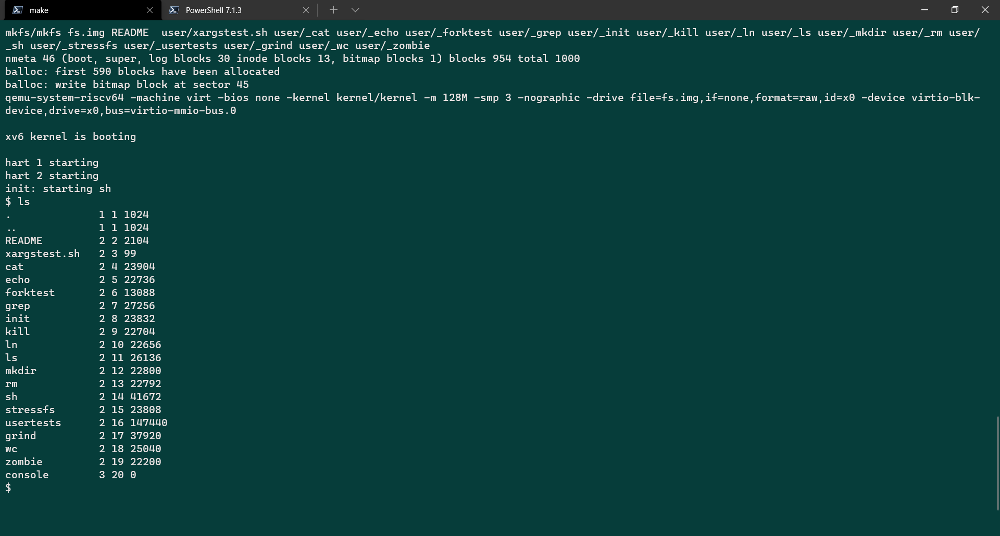

# xv6-labs-2020

MIT6.s081 麻省理工2020秋季学期操作系统工程（Operating System Engineering）实验。**Windows 下成功编译运行。**

🧀 课程资源汇总、课堂笔记、读书笔记：[github/PiperLiu/CS-courses-notes/mit6.s081](./README.md)

本仓库来自 `git clone git://g.csail.mit.edu/xv6-labs-2020` 。

## 🧂如何安装

实验基于 [xv6 操作系统](https://github.com/PiperLiu/xv6-riscv)（简化版 `Unix version 6`）。实验需要在类 unix 系统（MacOS/Linux）上安装 `RISC-V versions of a couple different tools: QEMU 5.1, GDB 8.3, GCC, and Binutils` 。官方安装说明在[这里](https://pdos.csail.mit.edu/6.S081/2020/tools.html)。

我使用的是 WSL2 （`Windows Subsystem for Linux 2`）。

```
🌭首先检查版本
$ cat /etc/debian_version
bullseye/sid

$ cat /proc/version
Linux version 4.19.104-microsoft-standard (oe-user@oe-host) (gcc version 8.2.0 (GCC)) #1 SMP Wed Feb 19 06:37:35 UTC 2020

🍿然后安装工具
$ sudo apt-get update

$ sudo apt-get install git build-essential gdb-multiarch qemu-system-misc gcc-riscv64-linux-gnu binutils-riscv64-linux-gnu
$ sudo apt-get remove qemu-system-misc
$ sudo apt-get install qemu-system-misc=1:4.2-3ubuntu6
```

## 🥓如何使用

切换到相应作业分支，然后 `make qemu` 后 xv6 操作系统就自动运行起来了。

比如：
```
$ git checkout util
$ make qemu

...编译、执行...

xv6 kernel is booting

hart 2 starting
hart 1 starting
init: starting sh
$ 
```

此时我们可以输入 `ls` 命令，发现成功执行。



## 🥚作业索引

Lab: Xv6 and Unix utilities
- [阅读echo、grep和rm](./docs/drafts/lec.01hw.md#阅读echo-grep和rm)
- [阅读 sleep](./docs/drafts/lec.01hw.md#阅读-sleep)
- [pingpong](./docs/drafts/lec.01hw.md#pingpong)
- [利用管道和进程求素数 primes](./docs/drafts/lec.01hw.md#利用管道和进程求素数-primes)
- [find 实现：递归探索子目录](./docs/drafts/lec.01hw.md#find-实现递归探索子目录)
- [实现 xargs （从标准输入读入一行数据送给子进程）](./docs/drafts/lec.01hw.md#实现-xargs-从标准输入读入一行数据送给子进程)

Lab: system calls
- [System call tracing 新建一个系统调用](./docs/drafts/lec.03hw.md#system-call-tracing-新建一个系统调用)
- [Sysinfo 获取 free memory 和 processes](./docs/drafts/lec.03hw.md#sysinfo-获取-free-memory-和-processes)

Lab: page tables
- [Print a page table](./docs/drafts/lec.04hw.md#print-a-page-table)
- [A kernel page table per process](./docs/drafts/lec.04hw.md#a-kernel-page-table-per-process)
- [Simplify copyin/copyinstr](./docs/drafts/lec.04hw.md#simplify-copyincopyinstr)

Lab: traps
- [RISC-V assembly（汇编、RISC-V是小端机）](./docs/drafts/lec.07hw.md#risc-v-assembly汇编-risc-v是小端机)
- [Backtrace 报错时回溯打印栈 stack](./docs/drafts/lec.07hw.md#backtrace-报错时回溯打印栈-stack)
- [Alarm 根据 tick 做回调](./docs/drafts/lec.07hw.md#alarm-根据-tick-做回调)
  - [test0: invoke handler](./docs/drafts/lec.07hw.md#test0-invoke-handler)
  - [test1/test2(): resume interrupted code](./docs/drafts/lec.07hw.md#test1test2-resume-interrupted-code)

Lab: xv6 lazy page allocation
- [Eliminate allocation from sbrk()](./docs/drafts/lec.08hw.md#eliminate-allocation-from-sbrk)
- [Lazy allocation](./docs/drafts/lec.08hw.md#lazy-allocation)
- [Lazytests and Usertests](./docs/drafts/lec.08hw.md#lazytests-and-usertests)

Lab: Copy-on-Write Fork for xv6
- [Implement copy-on write](./docs/drafts/lec.09hw.md#implement-copy-on-write)

Lab: Multithreading
- [Uthread: switching between threads （用户态模拟线程切换）](./docs/drafts/lec.11hw.md#uthread-switching-between-threads-用户态模拟线程切换)
- [Using threads 基于 unix 库给 pthread 加锁](./docs/drafts/lec.11hw.md#using-threads-基于-unix-库给-pthread-加锁)
- [Barrier 使用条件变量](./docs/drafts/lec.11hw.md#barrier-使用条件变量)

Lab: locks
- [Memory allocator 每个 CPU 核单独一个 freelist 链表](./docs/drafts/lec.13hw.md#memory-allocator-每个-cpu-核单独一个-freelist-链表)
- [Buffer cache 把 bcache 分桶（分成多个链表），这样可以分解加锁的压力](./docs/drafts/lec.13hw.md#buffer-cache-把-bcache-分桶分成多个链表这样可以分解加锁的压力)

Lab: file system
- [Large files 将 inode 的 block 改为二级映射](./docs/drafts/lec.14hw.md#large-files-将-inode-的-block-改为二级映射)
- [Symbolic links 实现软链接 soft link 系统调用](./docs/drafts/lec.14hw.md#symbolic-links-实现软链接-soft-link-系统调用)

Lab: mmap
- [写一个 mmap 和 munmap 系统调用](./docs/drafts/lec.17hw.md#写一个-mmap-和-munmap-系统调用)

Lab: networking
- [Lab: networking](./docs/drafts/lec.21hw.md#lab-networking-1)
  - [阅读代码，一些知识点：大小端变量转换、 __attribute__((packed))](./docs/drafts/lec.21hw.md#阅读代码一些知识点大小端变量转换-__attribute__packed)
  - [网络协议栈的实现](./docs/drafts/lec.21hw.md#网络协议栈的实现)
  - [简历一个最简单的 socket 连接](./docs/drafts/lec.21hw.md#简历一个最简单的-socket-连接)
  - [万物皆文件](./docs/drafts/lec.21hw.md#万物皆文件)
  - [完成作业：向网卡传输数据，处理网卡中断](./docs/drafts/lec.21hw.md#完成作业向网卡传输数据处理网卡中断)
