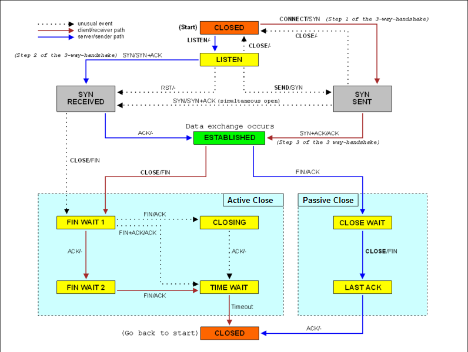

# 传输层协议、可靠通信与端到端原则

<!-- @import "[TOC]" {cmd="toc" depthFrom=2 depthTo=6 orderedList=false} -->

<!-- code_chunk_output -->

- [传输层的两大支柱：UDP 与 TCP](#传输层的两大支柱udp-与-tcp)
  - [UDP：轻装上阵的“信使”](#udp轻装上阵的信使)
  - [TCP：稳重可靠的“工程师”](#tcp稳重可靠的工程师)
  - [ICMP：网络层的“侦察兵”](#icmp网络层的侦察兵)
- [可靠性的基石：TCP 连接管理](#可靠性的基石tcp-连接管理)
  - [三次握手：建立连接](#三次握手建立连接)
  - [四次挥手：断开连接](#四次挥手断开连接)
- [TCP 的智慧：流量、窗口与拥塞控制](#tcp-的智慧流量-窗口与拥塞控制)
  - [流量控制：照顾接收方的感受](#流量控制照顾接收方的感受)
  - [拥塞控制：照顾整个网络的感受](#拥塞控制照顾整个网络的感受)
  - [总结：流量控制 vs. 拥塞控制](#总结流量控制-vs-拥塞控制)
- [互联网的设计哲学：端到端原则](#互联网的设计哲学端到端原则)
  - [弱端到端原则 (Weak End-to-End Principle)](#弱端到端原则-weak-end-to-end-principle)
  - [强端到端原则 (Strong End-to-End Principle)](#强端到端原则-strong-end-to-end-principle)
- [数据的“指纹”：错误检测机制](#数据的指纹错误检测机制)
- [TCP 的生命周期：深入理解 TCP 状态机](#tcp-的生命周期深入理解-tcp-状态机)
  - [宏观蓝图：TCP 状态转换图](#宏观蓝图tcp-状态转换图)
  - [第一幕：连接建立（三次握手）](#第一幕连接建立三次握手)
    - [被动方（服务器）的视角](#被动方服务器的视角)
    - [主动方（客户端）的视角](#主动方客户端的视角)
  - [第二幕：数据传输](#第二幕数据传输)
    - [示例 — 被动方收到 `FIN` -> `CLOSE_WAIT`（服务器端常见情况）](#示例--被动方收到-fin---close_wait服务器端常见情况)
    - [示例 — 主动方半关闭（client 发 `FIN` 后仍可读）：`FIN_WAIT_1` -> `FIN_WAIT_2` -> `TIME_WAIT`](#示例--主动方半关闭client-发-fin-后仍可读fin_wait_1---fin_wait_2---time_wait)
  - [第三幕：连接关闭（四次挥手）](#第三幕连接关闭四次挥手)
    - [主动关闭方（例如，客户端）的视角](#主动关闭方例如客户端的视角)
    - [`TIME_WAIT`：优雅退场的艺术](#time_wait优雅退场的艺术)
    - [被动关闭方（例如，服务器）的视角](#被动关闭方例如服务器的视角)
    - [示例 — 同时关闭 -> `CLOSING`](#示例--同时关闭---closing)
    - [示例 — RST（abortive close）：如何让连接立刻变为 `CLOSED`（“暴力关闭”）并产生 RST](#示例--rstabortive-close如何让连接立刻变为-closed暴力关闭并产生-rst)
    - [示例 — `TIME_WAIT` 与端口重用：`SO_REUSEADDR` / `SO_REUSEPORT` 行为提示](#示例--time_wait-与端口重用so_reuseaddr--so_reuseport-行为提示)
  - [特殊情况](#特殊情况)
    - [`CLOSE_WAIT` 泄漏示例](#close_wait-泄漏示例)
    - [`TIME_WAIT` 普遍存在](#time_wait-普遍存在)
    - [如果 send 后收到 `SIGPIPE`](#如果-send-后收到-sigpipe)
  - [小结：把 C 代码的行为映射回状态机](#小结把-c-代码的行为映射回状态机)

<!-- /code_chunk_output -->

互联网的核心魅力在于其连接能力，但这份连接的底层网络，本质上是“尽力而为”（best-effort）的——它不保证数据包一定能送达，也不保证它们的顺序或完整性。那么，我们每天使用的网页浏览、文件下载等需要高度可靠性的应用，是如何在这片“狂野西部”之上建立起秩序的呢？

答案就在 **传输层 (Transport Layer)** 。

这篇博文将和你一起，深入探讨传输层的两大核心协议：UDP 和 TCP，并揭示它们如何一步步从不可靠的服务之上，构建出我们依赖的可靠通信。

### 传输层的两大支柱：UDP 与 TCP

传输层协议在不同的应用程序之间提供端到端的通信服务。在这个层面上，有两个性格迥异的主角：UDP 和 TCP。

#### UDP：轻装上阵的“信使”

**用户数据报协议 (User Datagram Protocol, UDP)** 提供的是一种极其简单的服务。你可以把它想象成一个只管寄信、不问结果的邮差。

它的特点非常鲜明：

* **无连接 (Connectionless)** ：发送数据前不需要“握手”建立连接。每个数据报（datagram）都包含了所有必要的信息，独立地在网络中传输。
* **不可靠 (Unreliable)** ：它不保证数据报一定送达，不发送确认，不检测丢失，也不会要求重发。
* **无序 (No Ordering)** ：数据报到达的顺序可能与发送顺序不同。如果应用需要有序，必须自己在上层处理。
* **开销小** ：UDP 头部只有 8 字节，包含源/目的端口、长度和校验和四个字段，非常高效。

正是因为这些特点，UDP 非常适用于那些对实时性要求高、能容忍少量丢包、或者应用层自己实现了可靠性机制的场景。

典型的应用实例包括：

* **DNS (域名系统)** ：一次请求和一次响应，快速高效。
* **DHCP (动态主机配置协议)** ：用于获取 IP 地址。
* **NTP (网络时间协议)** ：用于时间同步。
* 在线游戏、视频直播等。

值得一提的是 UDP 的校验和 (Checksum)。它不仅计算 UDP 头部和数据，还包含了源/目的 IP 地址和协议 ID 等伪头部信息。这在理论上违反了分层原则（传输层不应关心网络层信息），但这是一个非常务实的设计，它能帮助检测数据报是否因为网络错误而被“张冠李戴”，送错了终点。

#### TCP：稳重可靠的“工程师”

**传输控制协议 (Transmission Control Protocol, TCP)** 是互联网的基石，超过 95% 的互联网应用（如网页浏览、邮件、文件传输）都构建在它之上。与 UDP 的“放任不管”不同，TCP 提供的是一种 **可靠的、面向连接的、双向字节流 (bi-directional byte stream)** 服务。

它就像一位严谨的工程师，通过一系列复杂的机制来确保万无一失：

* **可靠性 (Reliability)** ：确保数据无损坏、无丢失、无重复且按序到达。
* **有序交付 (Ordered Delivery)** ：将数据按发送顺序交付给应用层。
* **字节流 (Byte Stream)** ：对应用程序来说，数据就像一个连续不断的字节流，TCP 会负责将其拆分成合适大小的段 (segment) 进行传输。
* **面向连接 (Connection-Oriented)** ：在通信前，必须通过“三次握手”建立连接；结束后，通过“四次挥手”断开连接。

为了实现这些目标，TCP 精心设计了多种机制：

* **确认 (Acknowledgement, ACK)** ：接收方每收到一个数据段，都会向发送方回送一个确认。
* **序列号 (Sequence Number)** ：TCP 将每个字节都进行了编号。每个 TCP 段的头部都携带了该段数据第一个字节的序列号，用于检测丢包和重排乱序的数据。
* **校验和 (Checksum)** ：用于检测数据在传输过程中是否被损坏。
* **流量控制 (Flow Control)** ：防止发送方发送数据太快，压垮接收方的缓冲区。
* **拥塞控制 (Congestion Control)** ：从整个网络的角度出发，调节发送速率，避免造成网络拥塞。

#### ICMP：网络层的“侦察兵”

还有一个协议我们必须提及： **互联网控制消息协议 (Internet Control Message Protocol, ICMP)** 。ICMP 是与 IP 紧密相关的控制协议：ICMP 报文被封装在 IP 数据报中，属于网络层，用于向主机和路由器报告网络层的错误并提供诊断功能（例如 ping 和 traceroute）。

我们常用的 `ping` 和 `traceroute` 命令，就是基于 ICMP 实现的。例如，`ping` 使用 ICMP 的“回显请求 (Echo Request)”和“回显应答 (Echo Reply)”消息。`traceroute` 则巧妙地利用了 ICMP 的“超时 (Time Exceeded)”和“端口不可达 (Port Unreachable)”消息来探测数据包经过的路由路径。

### 可靠性的基石：TCP 连接管理

TCP 的可靠性始于其连接的建立与拆除过程。这个过程由一个精确定义的 **有限状态机 (Finite State Machine, FSM)** 控制，确保了双方状态的同步。

#### 三次握手：建立连接

TCP 通过三次报文交换来建立一个连接，这个过程被称为 **三向握手 (Three-Way Handshake)** 。

```txt
      Client                                     Server
   (state: CLOSED)                             (state: LISTEN)

       -- SYN (seq=x) ---------------->

   (state: SYN_SENT)
                                               (state: SYN_RCVD)
       <-- SYN, ACK (seq=y, ack=x+1) --

   (state: ESTABLISHED)
       -- ACK (seq=x+1, ack=y+1) ----->

                                               (state: ESTABLISHED)
```

1.  **SYN** ：客户端（主动开启方）发送一个 `SYN` 报文段，其中包含一个随机生成的 **初始序列号 (Initial Sequence Number, ISN)** ，我们称之为 `seq=x`。此时，客户端进入 `SYN_SENT` 状态。
2.  **SYN+ACK** ：服务器收到 `SYN` 后，也发送一个 `SYN` 报文段作为响应，其中包含了服务器自己的 ISN (`seq=y`)，同时通过 `ACK` 报文段确认收到了客户端的 `SYN`，确认号为 `ack=x+1`。此时，服务器进入 `SYN_RCVD` 状态。
3.  **ACK** ：客户端收到服务器的 `SYN+ACK` 后，发送一个 `ACK` 报文段来确认服务器的 `SYN`，确认号为 `ack=y+1`。

至此，双方都确认了对方的接收和发送能力，连接建立成功，可以开始传输数据。随机化 ISN 的一个重要目的是为了防止旧连接中延迟的数据包干扰新建立的连接。

#### 四次挥手：断开连接

连接的拆除则需要四次报文交换，即 **四向挥手 (Four-Way Handshake)** 。

```txt
       Client                                     Server
  (state: ESTABLISHED)                        (state: ESTABLISHED)

       -- FIN (seq=x) ----------------->
                                              (state: CLOSE_WAIT)
   (state: FIN_WAIT_1)
       <--------------- ACK (ack=x+1) --

   (state: FIN_WAIT_2)
                                              (sends remaining data...)

       <------------------ FIN (seq=y) --
                                              (state: LAST_ACK)
   (state: TIME_WAIT)
       -- ACK (ack=y+1) ---------------->
                                              (state: CLOSED)

   (waits 2*MSL)

   (state: CLOSED)
```

1.  **FIN** ：当一方（比如客户端）数据发送完毕，会发送一个 `FIN` 报文段，表示“我这边没数据要发了”。
2.  **ACK** ：另一方（服务器）收到 `FIN` 后，回复一个 `ACK`，表示“知道了”。此时，从客户端到服务器方向的连接关闭，但服务器仍然可以向客户端发送数据。
3.  **FIN** ：当服务器也发送完所有数据后，它会发送自己的 `FIN` 报文段。
4.  **ACK** ：客户端收到服务器的 `FIN` 后，回复最后一个 `ACK`。

在这里，主动关闭方（客户端）在发送最后一个 `ACK` 后，会进入一个特殊的 `TIME_WAIT` 状态，并等待两倍的 **最大段生存时间 (Maximum Segment Lifetime, MSL)** 。这主要是为了两个目的：

1.  确保最后一个 `ACK` 报文能成功到达对方。如果这个 `ACK` 丢失，对方会重传 `FIN`，客户端仍能响应。
2.  防止新连接复用相同的端口号时，受到旧连接中延迟报文的干扰。

### TCP 的智慧：流量、窗口与拥塞控制

当 TCP 连接进入 `ESTABLISHED` 状态后，真正的数据传输才刚刚开始。但这并非一个简单的“你发我收”的过程。TCP 面临两大核心挑战：

1.  **流量控制 (Flow Control)** ：如何确保发送方不会因为发送速度过快，而压垮（overwhelm）接收方的处理能力？这是一个点对点的问题。
2.  **拥塞控制 (Congestion Control)** ：如何确保单个 TCP 连接不会因为发送速度过快，而压垮整个网络的承载能力，导致网络拥塞甚至崩溃？这是一个全局性的问题。

为了优雅地解决这两个问题，TCP 设计了其最核心的机制之一—— **滑动窗口 (Sliding Window)** ，并在此基础上衍生出两套独立的控制算法。

#### 流量控制：照顾接收方的感受

流量控制的目标非常明确：匹配发送方的发送速率与接收方的接收速率。

想象一下你正在往一个杯子里倒水。如果倒得太快，水就会溢出。TCP 的接收方同样有一个大小有限的缓冲区（receive buffer）。如果发送方发送的数据超出了这个缓冲区的容纳能力，后续的数据包就会被丢弃，造成不必要的网络开销和重传。

TCP 的解决方案是让接收方明确地告诉发送方：“我还能接收多少数据”。

* **接收窗口 (Receive Window, `rwnd`)** ：接收方会在其发送的每一个 TCP 报文段（无论是纯 `ACK` 报文还是携带数据的报文）的头部 `Window` 字段中，填入其当前接收缓冲区的**剩余空间大小**。这个值就是**接收窗口 (`rwnd`)**。
* **发送方的响应** ：发送方在收到这个 `rwnd` 值后，就会相应地调整自己的发送行为。它会确保任何时刻，网络中“在途”（已发送但未收到确认）的数据总量，不能超过接收方通告的 `rwnd` 值。

```txt
Sender's View:

| ... | 已发送并确认 | 已发送但未确认 (在途数据) | 可用但未发送 | 不可用 | ... |
+------------------+-----------------------------+----------------+----------+
                   ^                             ^
                 上次确认                   最后发送
                   |<--  在途数据量 <= rwnd (接收窗口) -->|
```

**零窗口问题与探测**

一个特殊情况是，当接收方缓冲区满了，它会通告一个 `rwnd = 0` 的窗口。此时发送方必须停止发送数据。但问题是，如果接收方后续处理了数据、腾出了空间，它发出的更新窗口的 `ACK` 报文在网络中丢失了怎么办？发送方将永远等待下去，形成死锁。

为了解决这个问题，TCP 设计了 **零窗口探测 (Zero-Window Probe)** 机制。当发送方收到零窗口通知后，会启动一个计时器。计时器超时后，它会发送一个非常小的探测报文（通常只包含 1 字节数据），“戳”一下接收方。接收方在收到这个探测报文后，会回复一个包含当前 `rwnd` 的 `ACK`，这样发送方就能获知窗口是否已经更新，从而打破死锁。

#### 拥塞控制：照顾整个网络的感受

流量控制解决了点对点的问题，但如果网络路径上的路由器处理能力有限，即使接收方 `rwnd` 很大，大量的并发数据流依然会导致网络拥塞（congestion）。拥塞会导致路由器队列溢出、大量丢包、延迟剧增，最终导致整个网络吞吐量急剧下降，这种现象被称为 **拥塞崩溃 (Congestion Collapse)** 。

拥塞控制的核心思想是：TCP 发送方通过观察网络状态（主要是 **丢包** ），来动态调整自己的发送速率。

* **拥塞窗口 (Congestion Window, `cwnd`)** ：为此，TCP 在发送方内部维护了另一个状态变量—— **拥塞窗口 (`cwnd`)** 。它代表了发送方在收到 `ACK` 之前，可以向网络中发送的最大数据量。`cwnd` 的大小不依赖于接收方，而是发送方根据网络拥塞程度的 **自我评估** 。

* **真正的发送窗口** ：最终，一个 TCP 发送方在任意时刻的实际发送窗口，是 **流量控制窗口和拥塞控制窗口中的较小者** 。
    
`EffectiveWindow = min(rwnd, cwnd)` 这个简单的公式优雅地将两个控制机制结合在了一起。

* **TCP 拥塞控制的四大核心算法** ：`cwnd` 的动态调整过程，主要由以下四个算法协同完成，它们共同构成了一套复杂的“舞蹈”，以适应不断变化的网络状况。

**1. 慢启动 (Slow Start)**

* **目的** ：在连接刚建立时，快速探测网络的可用带宽。
* **行为** ：`cwnd` 初始值很小（通常为 1 到 10 个 MSS，即最大报文段长度）。每收到一个 `ACK`，`cwnd` 就增加 1 个 MSS。这使得 `cwnd` 在每个 **往返时间 (Round-Trip Time, RTT)** 内近似翻倍，呈现 **指数级增长** 。
* **结束** ：当 `cwnd` 的大小超过一个预设的 **慢启动阈值 (Slow Start Threshold, `ssthresh`)** 时，慢启动阶段结束，进入拥塞避免阶段。

**2. 拥塞避免 (Congestion Avoidance)**

* **目的** ：当 `cwnd` 增长到一定程度（可能接近网络容量）后，需要更谨慎地增加发送速率，避免造成拥塞。
* **行为** ：进入此阶段后，`cwnd` 不再指数增长，而是 **线性增长** 。粗略地说，每个 RTT，`cwnd` 只增加 1 个 MSS。这种“加性增（Additive Increase）”的方式会温和地探测更多可用带宽。

**3. 拥塞发生时的反应（快速重传与快速恢复）**

当拥塞发生时，网络就会出现丢包。TCP 通过两种方式感知丢包：

* **超时重传 (Timeout Retransmission)** ：这是最坏的情况，表示发送方在很长一段时间内没有收到任何 `ACK`。TCP 会认为网络发生了严重拥塞。
* **3 个重复的 ACK (3 Duplicate ACKs)** ：当发送方连续收到 3 个或以上针对同一数据包的 `ACK` 时，它会认为这个数据包之后的一个数据包丢失了。这是一个相对温和的拥塞信号。

针对这两种情况，TCP 的反应是不同的：

* **对于超时** ：TCP 会采取激烈的“乘性减（Multiplicative Decrease）”策略。

1.  将 `ssthresh` 设置为当前 `cwnd` 的一半。
2.  将 `cwnd` 重置为初始值（例如 1 MSS）。
3.  重新进入 **慢启动** 阶段。

* **对于 3 个重复 ACK** ：TCP 启用**快速重传 (Fast Retransmit)** 和**快速恢复 (Fast Recovery)** 算法。

1.  **快速重传** ：不等超时，立即重传那个被认为丢失的数据段。
2.  **快速恢复** ：不将 `cwnd` 降为 1，因为收到重复 `ACK` 说明网络中仍有数据包在正常传输。
  * 将 `ssthresh` 设置为当前 `cwnd` 的一半。
  * 将 `cwnd` 也设置为新的 `ssthresh` 值（而不是 1）。
  * 直接进入 **拥塞避免** 阶段，跳过慢启动。

#### 总结：流量控制 vs. 拥塞控制

| 特性 | 流量控制 (Flow Control) | 拥塞控制 (Congestion Control) |
| :--- | :--- | :--- |
| **目标** | 保护 **接收方** ，防止其缓冲区溢出 | 保护 **网络** ，防止网络拥塞崩溃 |
| **控制方** | 由 **接收方** 驱动 | 由 **发送方** 驱动（基于对网络的推断） |
| **核心机制** | 接收窗口 (`rwnd`)，由接收方在 TCP 头部通告 | 拥塞窗口 (`cwnd`)，由发送方内部维护 |
| **问题范畴** | 端到端（点对点）问题 | 端到网络再到端（系统性）问题 |
| **信号来源** | 接收方明确告知其可用缓冲空间 | 发送方通过 **丢包**（超时或重复 ACK）来推断拥塞 |

通过这两套机制的精妙配合，TCP 成功地在 `ESTABLISHED` 状态下实现了既能充分利用网络带宽、又能避免压垮接收方和整个网络的智慧传输。

### 互联网的设计哲学：端到端原则

为什么网络协议会设计成今天这个样子？背后有一个非常重要的指导思想—— **端到端原则 (End-to-End Principle)** 。

这个原则有如下两个版本。

#### 弱端到端原则 (Weak End-to-End Principle)

其核心思想是，某些功能（如文件传输的正确性、安全性）只有在通信系统的 **端点 (endpoint)** ，也就是应用程序中，才能被完整且正确地实现。网络中间的节点（如路由器）可以提供一些辅助功能作为性能优化（比如在无线链路层进行重传），但应用程序 **不能依赖** 这些中间辅助来保证最终的正确性。

#### 强端到端原则 (Strong End-to-End Principle)

这个版本更为激进，它认为网络的职责应该尽可能简单——就是高效、灵活地传输数据报。所有其他复杂功能都应该放在网络的边缘（端点）去实现。这样做的好处是保持了网络核心的简洁和灵活性，能够促进上层应用的创新。

### 数据的“指纹”：错误检测机制

**错误检测 (Error Detection)** 是阐述端到端原则最初的经典例子。以太网（链路层）使用强大的 CRC 校验，TCP（传输层）使用自己的校验和。但即便如此，数据在从路由器内存读出写入的过程中，仍可能发生错误。因此，为了确保万无一失，像 BitTorrent 这样的应用程序在接收完所有 TCP 数据后，依然会对每个数据块进行一次哈希校验。这完美体现了端到端原则——最终的正确性必须由端点应用来负责。

为了检测数据在传输过程中是否被篡改，协议栈在不同层级使用了多种错误检测算法。

* **校验和 (Checksum)** ：TCP/IP 协议栈广泛使用的一种简单算法。它通过对数据进行反码求和来计算出一个值。它的优点是计算速度快，软件实现容易，但缺点是错误检测能力较弱。
* **循环冗余校验 (Cyclic Redundancy Code, CRC)** ：一种基于多项式除法的强大错误检测码。它的计算相对复杂，但硬件实现非常高效。CRC 能够检测出绝大多数常见的传输错误，因此被以太网、Wi-Fi 等链路层协议广泛采用。
* **消息认证码 (Message Authentication Code, MAC)** ：这不仅是用于检测随机错误，更是为了 **安全** 。它通过将数据和一个共享的密钥结合起来计算出一个“指纹”。只有拥有密钥的通信双方才能生成或验证这个 MAC。任何对数据的恶意篡改都会导致 MAC 验证失败。我们熟知的 TLS/SSL 就使用了这种机制来保证数据完整性。

### TCP 的生命周期：深入理解 TCP 状态机

在上面的文章中，我们探讨了 TCP 如何通过三次握手和四次挥手来建立和终止连接。但这些“握手”和“挥手”并非孤立事件，它们是一系列严谨状态转换的一部分。控制这一系列转换的“规则手册”，就是 **TCP 状态机 (TCP State Machine)** 。

每一个 TCP 连接，从诞生到消亡，都严格遵循这个状态机定义的路径。它不是一个抽象的理论模型，而是实实在在运行在全球数十亿设备中的代码逻辑，是保证不同厂商、不同系统的设备能够无误沟通的基石。

理解 TCP 状态机，不仅能帮助我们深入领会 TCP 的可靠性精髓，还能在网络故障排查、程序性能优化时，为我们提供强有力的理论武器。例如，当你在服务器上用 `netstat` 命令看到大量处于 `TIME_WAIT` 或 `CLOSE_WAIT` 状态的连接时，你就能立刻明白这意味着什么。

#### 宏观蓝图：TCP 状态转换图

首先，让我们看一下 TCP 状态机的全貌。这张图囊括了 TCP 连接生命周期中所有可能的状态和转换路径。初看可能有些复杂，但别担心，我们会一步步分解它。



我们将沿着最常见的路径——连接建立、数据传输、连接关闭——来详细解读这个生命周期。

#### 第一幕：连接建立（三次握手）

连接的建立分为主动方（通常是客户端）和被动方（通常是服务器）。

##### 被动方（服务器）的视角

**`CLOSED` -\> `LISTEN`**

* **触发事件** : 应用程序在服务器上启动，调用 `listen()` 系统调用，准备接受新的连接请求。
* **状态描述** : 此时服务器还没有收到任何连接请求，只是“竖起耳朵”在监听指定的端口。这是连接生命的起点。

**`LISTEN` -\> `SYN_RCVD` (SYN Received)**

* **触发事件** : 服务器接收到一个来自客户端的 `SYN` 报文段。
* **采取动作** : 服务器回复一个 `SYN+ACK` 报文段，确认客户端的 `SYN` 并发送自己的 `SYN`。
* **状态描述** : 服务器已经“收到同步信号”，并发送了响应，现在等待客户端的最终确认。

**`SYN_RCVD` -\> `ESTABLISHED` (Established)**

* **触发事件** : 服务器接收到客户端针对其 `SYN+ACK` 的 `ACK` 报文段（三次握手的最后一步）。
* **状态描述** : 连接已成功建立！双方现在可以自由地双向传输数据。

##### 主动方（客户端）的视角

**`CLOSED` -\> `SYN_SENT` (SYN Sent)**

* **触发事件** : 应用程序在客户端上发起连接请求，例如调用 `connect()`。
* **采取动作** : 客户端发送一个 `SYN` 报文段给服务器。
* **状态描述** : 客户端已经“发送了同步信号”，现在等待服务器的响应。

**`SYN_SENT` -\> `ESTABLISHED`**

* **触发事件** : 客户端接收到服务器的 `SYN+ACK` 报文段。
* **采取动作** : 客户端回复一个 `ACK` 报文段。
* **状态描述** : 在客户端看来，发送完最后一个 `ACK` 后，连接就已建立。

#### 第二幕：数据传输

**`ESTABLISHED`**

这是连接生命中最长、也是最有价值的阶段。在这个状态下，双方的应用程序通过 `send()` 和 `recv()` 等系统调用，自由地交换数据。所有的数据传输、流量控制、拥塞控制都在这个稳定的状态下进行。

##### 示例 — 被动方收到 `FIN` -> `CLOSE_WAIT`（服务器端常见情况）

场景：客户端正常关闭输出方向（发送 FIN），服务器 `recv()` 返回 `0`（EOF），内核将套接字置为 `CLOSE_WAIT`，此时服务器的应用必须调用 `close()`（或 `shutdown()`）来发送自己的 FIN，否则会一直处于 `CLOSE_WAIT`（常见泄漏 bug）。

```c
/* server_close_wait_example.c
   编译: gcc server_close_wait_example.c -o server
*/
#include <sys/types.h>
#include <sys/socket.h>
#include <netinet/in.h>
#include <unistd.h>
#include <stdio.h>
#include <string.h>
#include <unistd.h>

int main() {
    int srv = socket(AF_INET, SOCK_STREAM, 0);
    struct sockaddr_in addr = {0};
    addr.sin_family = AF_INET;
    addr.sin_port = htons(9090);
    addr.sin_addr.s_addr = INADDR_ANY;
    bind(srv, (struct sockaddr*)&addr, sizeof(addr));
    listen(srv, 1);

    int c = accept(srv, NULL, NULL);
    char buf[128];
    ssize_t n = recv(c, buf, sizeof(buf), 0);
    if (n == 0) {
        // <-- recv() 返回 0：对端已发 FIN，套接字进入 CLOSE_WAIT
        printf("peer closed write side (recv==0) -> socket is in CLOSE_WAIT\n");
        // 此处如果程序忘记 close(c)，套接字将持续处于 CLOSE_WAIT
    } else if (n > 0) {
        write(STDOUT_FILENO, buf, n);
    }
    // 正确做法：处理完剩余数据后关闭连接，发送自己的 FIN -> LAST_ACK 或直接 close 完成终止
    fflush(stdout);
    sleep(10);
    close(c);
    close(srv);
    return 0;
}
```

**关键点**
* `recv()` 返回 `0` 就是应用层收到“对方已经关闭发送方向”的信号，OS 状态变成 `CLOSE_WAIT`。
* 如果应用不 `close()`（或 `shutdown(SHUT_WR)`），会长期占用 `CLOSE_WAIT`，可能导致服务器资源耗尽。

在我的 MAC 上，使用 `Control + D` 发送 FIN ，一共三个终端：

```bash
终端1> ./server
终端3> lsof -nP -iTCP:9090
COMMAND   PID     USER   FD   TYPE             DEVICE SIZE/OFF NODE NAME
server  75553 piperliu    3u  IPv4 0x21a588ac71b533f4      0t0  TCP *:9090 (LISTEN)

终端2> nc 127.0.0.1 9090
终端3> lsof -nP -iTCP:9090
COMMAND   PID     USER   FD   TYPE             DEVICE SIZE/OFF NODE NAME
server  75553 piperliu    3u  IPv4 0x21a588ac71b533f4      0t0  TCP *:9090 (LISTEN)
server  75553 piperliu    4u  IPv4 0x8e56a7a57207245f      0t0  TCP 127.0.0.1:9090->127.0.0.1:51689 (ESTABLISHED)
nc      75970 piperliu    3u  IPv4 0x9268cd499a63ea18      0t0  TCP 127.0.0.1:51689->127.0.0.1:9090 (ESTABLISHED)

终端2> ^D  # Control + D
终端1> peer closed write side (recv==0) -> socket is in CLOSE_WAIT
终端3> lsof -nP -iTCP:9090
COMMAND   PID     USER   FD   TYPE             DEVICE SIZE/OFF NODE NAME
server  75553 piperliu    3u  IPv4 0x21a588ac71b533f4      0t0  TCP *:9090 (LISTEN)
server  75553 piperliu    4u  IPv4 0x8e56a7a57207245f      0t0  TCP 127.0.0.1:9090->127.0.0.1:51689 (CLOSE_WAIT)
nc      75970 piperliu    3u  IPv4 0x9268cd499a63ea18      0t0  TCP 127.0.0.1:51689->127.0.0.1:9090 (FIN_WAIT_2)
```

##### 示例 — 主动方半关闭（client 发 `FIN` 后仍可读）：`FIN_WAIT_1` -> `FIN_WAIT_2` -> `TIME_WAIT`

场景：客户端把发送方向关闭（`shutdown(fd, SHUT_WR)`）但继续读服务器返回的数据；这是半关闭（half-close）的典型用法，适合客户端发送完请求但仍需读取结果的协议（HTTP/1.0 以前的部分场景）。

```c
/* client_half_close_example.c
   编译: gcc client_half_close_example.c -o client
*/
#include <sys/socket.h>
#include <arpa/inet.h>
#include <unistd.h>
#include <stdio.h>
#include <string.h>

int main() {
    int s = socket(AF_INET, SOCK_STREAM, 0);
    struct sockaddr_in srv = {0};
    srv.sin_family = AF_INET;
    srv.sin_port = htons(9090);
    inet_pton(AF_INET, "127.0.0.1", &srv.sin_addr);

    connect(s, (struct sockaddr*)&srv, sizeof(srv));

    const char *req = "hello, server\n";
    send(s, req, strlen(req), 0);       // 发送数据
    shutdown(s, SHUT_WR);               // <-- 发送 FIN（进入 FIN_WAIT_1）
                                        // 一旦收到对方 ACK，会进入 FIN_WAIT_2
    // 仍然可以 recv() 直到 peer 发 FIN（然后我们回复最后的 ACK；进入 TIME_WAIT）
    char buf[256];
    ssize_t n;
    while ((n = recv(s, buf, sizeof(buf), 0)) > 0) {
        write(STDOUT_FILENO, buf, n);
    }
    // 当对端发 FIN 时，recv 返回 0，内核会把我们放到 TIME_WAIT（在完整握手序列中）
    close(s);
    return 0;
}
```

**关键点**

* `shutdown(SHUT_WR)`：应用告知内核“我不会再发数据了”，内核发送 FIN（到 `FIN_WAIT_1`）。
* 在 `FIN_WAIT_2` 阶段还能 `recv()`，直到对方关闭其发送方向并触发 `TIME_WAIT`。
* `TIME_WAIT` 的存在有两个目的：保证最后 ACK 可重传 & 防止旧数据干扰新连接（2 \* MSL）。

#### 第三幕：连接关闭（四次挥手）

与连接建立类似，关闭连接也分为主动方和被动方。任何一方都可以是主动关闭方。

##### 主动关闭方（例如，客户端）的视角

**`ESTABLISHED` -\> `FIN_WAIT_1`**

* **触发事件** : 客户端应用程序调用 `close()`，决定关闭连接。
* **采取动作** : 客户端发送一个 `FIN` 报文段，表示“我的数据已经发完了”。
* **状态描述** : 客户端进入等待状态，等待服务器对其 `FIN` 的确认。

**`FIN_WAIT_1` -\> `FIN_WAIT_2`**

* **触发事件** : 客户端收到了服务器对其 `FIN` 的 `ACK`。
* **状态描述** : 此时，从客户端到服务器方向的连接已经关闭，这被称为 **半关闭 (half-close)** 状态。客户端不能再发送数据，但仍然可以接收来自服务器的数据。客户端现在等待服务器发送它自己的 `FIN`。

**`FIN_WAIT_2` -\> `TIME_WAIT`**

* **触发事件** : 客户端终于收到了服务器的 `FIN` 报文段。
* **采取动作** : 客户端回复最后一个 `ACK`。
* **状态描述** : 客户端进入 `TIME_WAIT` 状态。这是整个状态机中最关键和最常被问到的状态之一。

##### `TIME_WAIT`：优雅退场的艺术

`TIME_WAIT` 状态，也称为 **2MSL 等待状态** ，其存在有两个至关重要的原因：

1.  **保证可靠的关闭** : 为了确保最后一个 `ACK` 能够成功到达服务器。如果这个 `ACK` 在网络中丢失，服务器将收不到确认，会超时重传它的 `FIN`。此时，处于 `TIME_WAIT` 状态的客户端仍然可以接收到这个重传的 `FIN` 并重新发送 `ACK`，从而保证服务器能够正常关闭。
2.  **防止旧连接的干扰** : 一个连接由一个四元组（源IP，源端口，目的IP，目的端口）唯一确定。在 `TIME_WAIT` 状态持续的 **2倍最大段生存时间 (2 \* MSL)** 内，这个四元组不能被用于建立新的连接。这可以防止网络中可能存在的、来自旧连接的延迟数据包（“迷路”的报文）被新连接错误地接收，从而保证了新连接的纯净。

##### 被动关闭方（例如，服务器）的视角

**`ESTABLISHED` -\> `CLOSE_WAIT`**

* **触发事件** : 服务器接收到客户端的 `FIN` 报文段。
* **采取动作** : 服务器回复一个 `ACK`，并通知上层应用程序：对方已经关闭了连接。
* **状态描述** : 服务器进入 `CLOSE_WAIT` 状态。这个状态的含义是“等待应用程序关闭连接”。如果一个服务器上有大量连接处于 `CLOSE_WAIT` 状态，通常意味着应用程序存在 bug——它没有在接收到连接关闭信号后，及时调用 `close()` 来关闭自己的写通道。

**`CLOSE_WAIT` -\> `LAST_ACK`**

* **触发事件** : 服务器端的应用程序在处理完剩余数据后，也调用 `close()`。
* **采取动作** : 服务器发送自己的 `FIN` 报文段。
* **状态描述** : 服务器等待来自客户端的最后一次 `ACK`。

**`LAST_ACK` -\> `CLOSED`**

* **触发事件** : 服务器收到了来自客户端的最后一个 `ACK`。
* **状态描述** : 连接彻底关闭，资源被释放。

##### 示例 — 同时关闭 -> `CLOSING`

场景：双方几乎同时调用 `close()`（或都先 `shutdown(SHUT_WR)` 然后 send FIN），就可能出现 `CLOSING` 状态：双方都发送了 FIN，一方收到了对方的 FIN，但尚未收到对方对自己 FIN 的 ACK（罕见但可能发生）。

下面是两端几乎同时 `shutdown(SHUT_WR)` 的示意代码（实测难以完全同步，示例用于说明意图）：

```c
/* pseudo-simultaneous-close.c （示意） */
    // A: send FIN
    shutdown(sockA, SHUT_WR);   // A -> FIN
    // B: almost same time
    shutdown(sockB, SHUT_WR);   // B -> FIN
    // 如果 A 在等待来自 B 的 ACK 时收到了 B 的 FIN -> A 进入 CLOSING
```

**关键点**

* `CLOSING` 是短暂、中介的状态，只在特定并发关闭的时序下出现。
* 大多数代码无需专门处理 `CLOSING`，只要按正确顺序 `close()`/`shutdown()` 即可。

##### 示例 — RST（abortive close）：如何让连接立刻变为 `CLOSED`（“暴力关闭”）并产生 RST

场景：有时我们想要立即释放资源，不想等待内核缓冲区或四次挥手超时（例如发生严重错误）。可以通过 `SO_LINGER` 配合 `close()` 强制发送 RST（中断连接）。

```c
/* abortive_close.c */
#include <sys/socket.h>
#include <unistd.h>
#include <string.h>
#include <stdio.h>

void abortive_close(int fd) {
    struct linger ling;
    ling.l_onoff = 1;
    ling.l_linger = 0; // 启用 linger, linger=0 表示 close() 立即发送 RST
    setsockopt(fd, SOL_SOCKET, SO_LINGER, &ling, sizeof(ling));
    close(fd); // 立刻产生 RST，连接对端会立即收到 reset 并进入 CLOSED
}
```

**关键点**

* 使用 `SO_LINGER` 且 `l_linger == 0` 时 `close()` 触发 RST，不会按正常 FIN 顺序。
* `RST` 会立即释放双方资源，但也可能导致对端发生错误（例如 `ECONNRESET` 或 SIGPIPE）。

##### 示例 — `TIME_WAIT` 与端口重用：`SO_REUSEADDR` / `SO_REUSEPORT` 行为提示

当一个 socket 在 `TIME_WAIT` 中，通常不能立即被同一四元组重用。为了解决服务端快速重启的问题，常设 `SO_REUSEADDR`（注意：这不是万能钥匙，语义依实现而异）。

```c
/* server_reuseaddr.c 片段 */
int srv = socket(AF_INET, SOCK_STREAM, 0);
int on = 1;
setsockopt(srv, SOL_SOCKET, SO_REUSEADDR, &on, sizeof(on));
bind(srv, (struct sockaddr*)&addr, sizeof(addr));
listen(srv, 128);
```

**注意**

* `SO_REUSEADDR` 允许 bind 到处于 `TIME_WAIT` 的端口上（在很多系统上可以），但并不改变 `TIME_WAIT` 的存在 — 它只是影响 bind 行为。
* 在高并发短连接服务中，也可以使用端口池或 ephemeral port 的方式减轻 `TIME_WAIT` 压力（或使用负载均衡把连接分散到多台后端）。

#### 特殊情况

* **`CLOSING` 状态** : 一个比较罕见的状态。它发生在双方几乎同时发送 `FIN` 的情况下。例如，A 发送 `FIN` 后，在等待 B 的 `ACK` 期间，却收到了 B 发来的 `FIN`。此时，A 就会进入 `CLOSING` 状态，等待 B 对自己 `FIN` 的 `ACK`。
* **`RST` (Reset)** : 除了优雅的 `FIN` 挥手，TCP 还有一种“暴力”的关闭方式——发送 `RST` 报文段。这会直接中断连接，使状态立即跳转到 `CLOSED`。常见于向一个未监听的端口发起连接，或是一方异常退出时。

##### `CLOSE_WAIT` 泄漏示例

```bash
# netstat -tn | grep CLOSE_WAIT | wc -l
350
```

如果你在服务器上看到大量 `CLOSE_WAIT`，通常说明应用端未及时调用 `close()`。用 `lsof -i :port` 或 `ss -tanp | grep CLOSE_WAIT` 找到对应 PID，检查是否忘记在处理完 `recv() == 0` 后关闭描述符（或在异常路径中漏掉 close）。

##### `TIME_WAIT` 普遍存在

```bash
# netstat -an | grep TIME_WAIT | wc -l
1200
```

`TIME_WAIT` 数量大通常是短连接频繁建立/关闭的天然结果，不是内核异常。可考虑：

* 使用长连接（keep-alive）。
* 复用连接（连接池）。
* 如果合理，可调整内核 tcp 参数（例如 Linux 的 `tcp_tw_reuse`、`tcp_fin_timeout`），但生产环境要小心。

##### 如果 send 后收到 `SIGPIPE`

* 这通常发生于对端已 close（或 RST）并且应用继续 `write()`。解决：忽略 SIGPIPE（`signal(SIGPIPE, SIG_IGN)`）或在 `send()` 中使用 `MSG_NOSIGNAL`。

#### 小结：把 C 代码的行为映射回状态机

* `connect()`（客户端） -> `SYN_SENT`；收到 `SYN+ACK` 并 `ACK` -> `ESTABLISHED`。
* `listen()` -> `LISTEN`；`accept()` 后收到 `SYN` -> `SYN_RCVD` -> `ESTABLISHED`。
* `shutdown(fd, SHUT_WR)` 或 `close()`（发送方） -> 内核发送 `FIN` -> `FIN_WAIT_1`。
* `recv() == 0`（被动方） -> 收到对端 `FIN`，内核把 socket 标记为 `CLOSE_WAIT`；必须 `close()` 才会发送自己的 `FIN`。
* `SO_LINGER` with `l_linger=0` + `close()` -> 发送 `RST`，立即 `CLOSED`（暴力释放）。
* 同时 `FIN` -> 可能出现 `CLOSING`（罕见）。
* 等待 2 \* MSL 后 `TIME_WAIT` -> `CLOSED`（保证最后 ACK 可重传 & 防止旧报文干扰）。
