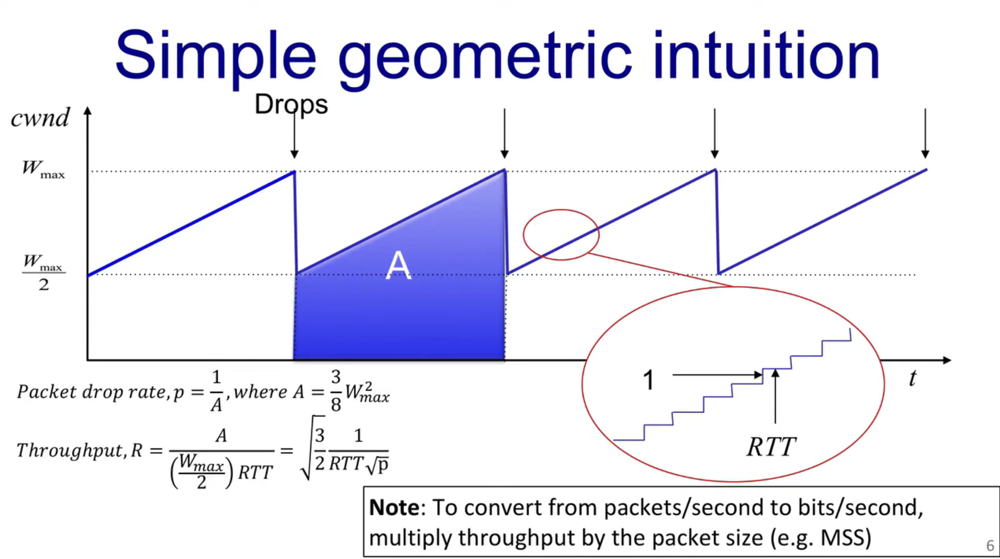
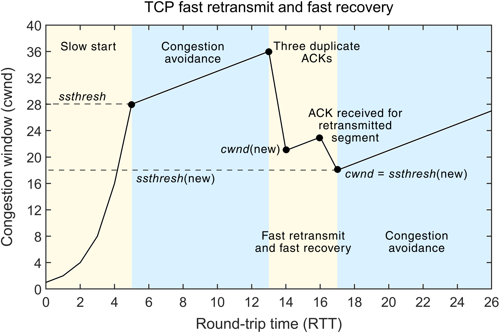
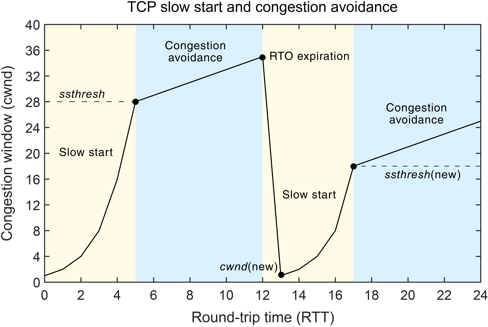

# TCP 拥塞控制

<!-- @import "[TOC]" {cmd="toc" depthFrom=2 depthTo=6 orderedList=false} -->

<!-- code_chunk_output -->

- [什么是拥塞控制？](#什么是拥塞控制)
- [拥塞的危害：从性能下降到网络崩溃](#拥塞的危害从性能下降到网络崩溃)
- [理想模型：带宽时延积 (BDP)](#理想模型带宽时延积-bdp)
- [AIMD：TCP 拥塞控制的基石](#aimdtcp-拥塞控制的基石)
  - [加性增窗 (Additive Increase, AI)](#加性增窗-additive-increase-ai)
  - [乘性减窗 (Multiplicative Decrease, MD)](#乘性减窗-multiplicative-decrease-md)
  - [“锯齿”形的 `cwnd` 变化](#锯齿形的-cwnd-变化)
- [AIMD 的公平性问题](#aimd-的公平性问题)
  - [原理与公式回顾](#原理与公式回顾)
  - [简单数值例子](#简单数值例子)
  - [其它不公平来源](#其它不公平来源)
  - [缓解方法与拓展](#缓解方法与拓展)
- [慢启动：快速启动，指数增长](#慢启动快速启动指数增长)
  - [MSS (Maximum Segment Size) 的确定](#mss-maximum-segment-size-的确定)
  - [ssthresh (Slow Start Threshold) 的确定](#ssthresh-slow-start-threshold-的确定)
- [TCP 拥塞控制实战：一个完整例子的剖析](#tcp-拥塞控制实战一个完整例子的剖析)
  - [第 1 阶段：慢启动 (Slow-Start)](#第-1-阶段慢启动-slow-start)
  - [第 2 阶段：拥塞避免 (Congestion Avoidance)](#第-2-阶段拥塞避免-congestion-avoidance)
  - [第 3 阶段：拥塞事件 - 三次重复确认 (Reno 模式)](#第-3-阶段拥塞事件---三次重复确认-reno-模式)
  - [第 4 阶段：新一轮的拥塞避免](#第-4-阶段新一轮的拥塞避免)
  - [第 5 阶段：严重拥塞事件 - 超时 (Timeout)](#第-5-阶段严重拥塞事件---超时-timeout)
  - [解惑：ACK 时钟：TCP 如何感知“一轮” RTT？](#解惑ack-时钟tcp-如何感知一轮-rtt)
    - [核心思想：事件驱动，而非时间驱动](#核心思想事件驱动而非时间驱动)
    - [如何实现“每轮 RTT”的规则？](#如何实现每轮-rtt的规则)
  - [解惑：详解快速重传与快速恢复](#解惑详解快速重传与快速恢复)
    - [快速重传 (Fast Retransmit)：拥塞的“哨声”](#快速重传-fast-retransmit拥塞的哨声)
    - [快速恢复 (Fast Recovery)：拥塞后的“手术刀”](#快速恢复-fast-recovery拥塞后的手术刀)
- [TCP 拥塞控制的演进史](#tcp-拥塞控制的演进史)
  - [TCP Tahoe (1988) - 开创者](#tcp-tahoe-1988---开创者)
  - [TCP Reno (1990) - 优化者](#tcp-reno-1990---优化者)
  - [TCP NewReno (1996) - 完善者](#tcp-newreno-1996---完善者)
- [总结与一些答疑](#总结与一些答疑)
  - [Bufferbloat： 路由器 buffer 大反而导致延迟久了，这是为什么？](#bufferbloat-路由器-buffer-大反而导致延迟久了这是为什么)
    - [原理（队列与时延）](#原理队列与时延)
    - [数字举例](#数字举例)
    - [发生原因： TCP 与大缓冲交互](#发生原因-tcp-与大缓冲交互)
    - [应对策略](#应对策略)
  - [传统模型的问题：在网络环境差时恢复时间非常慢](#传统模型的问题在网络环境差时恢复时间非常慢)
    - [原因细节：超时与指数回退](#原因细节超时与指数回退)
    - [数学例子（说明 200 ms 到数百秒如何出现）](#数学例子说明-200-ms-到数百秒如何出现)
    - [快速重传为何快](#快速重传为何快)
    - [缓解手段（实践中如何避免长时间停顿）](#缓解手段实践中如何避免长时间停顿)
  - [RFC 的阅读](#rfc-的阅读)
    - [`MUST` / `SHOULD` / `MAY`（源自 RFC 2119）](#must--should--may源自-rfc-2119)
    - [如何高效读 RFC（步骤与技巧）](#如何高效读-rfc步骤与技巧)
  - [初始窗口（Initial Window, IW）从 1 改为 10](#初始窗口initial-window-iw从-1-改为-10)
    - [为什么把 IW 调大有利于网页体验？](#为什么把-iw-调大有利于网页体验)
    - [潜在风险与为什么被接受](#潜在风险与为什么被接受)
    - [体现的工程思想](#体现的工程思想)
    - [实践提示](#实践提示)

<!-- /code_chunk_output -->

在计算机网络的世界里，数据包就像高速公路上飞驰的汽车。当车流量恰到好处时，一切井然有序；但如果车辆瞬间涌入，远超道路承载能力，就会发生严重的堵车。网络中的“堵车”就是我们今天要讨论的核心话题—— **拥塞（Congestion）** 。

本文将以 Stanford CS 144 课程的核心知识为基础，带你深入理解 TCP 拥塞控制的来龙去脉，从它是什么、为什么重要，到核心算法 AIMD，再到 TCP 各个版本的演进。

### 什么是拥塞控制？

首先，我们需要区分一个非常相似但本质不同的概念： **流量控制 (Flow Control)** 。流量控制是点对点的问题，它确保发送方不会因为发送速度过快而淹没接收方。这好比两个人对话，一方说得太快，另一方需要让他“慢一点”。

而 **拥塞控制 (Congestion Control)** 则是一个全局性的问题。它关注的是整个网络的承载能力，确保数据发送方不会向网络中注入过多的数据，导致路由器等网络设备不堪重负。它管理者是“所有发送者”与“网络”之间的关系。

简单来说，拥塞控制是一种资源管理机制，它的目标是：

* **防止网络过载** ：避免路由器缓冲区溢出和大规模的数据包丢失。
* **保证资源公平分配** ：让多个数据流（flow）可以相对公平地共享有限的网络带宽。

有趣的是，IP 协议本身并不提供拥塞反馈，因此，拥塞控制的重任落在了传输层，主要由 **终端主机 (end-hosts)** 上的 TCP 协议来完成。这正是著名的“端到端原则”的一个经典体现。但这又引申出另一个问题：端是不知道网络中各节点的状态的，因此想在端到端控制网络拥塞是一个充满挑战的任务。

### 拥塞的危害：从性能下降到网络崩溃

当发送方注入网络的数据量超过了某个瓶颈路由器的处理能力时，数据包就会开始在路由器的缓冲区中排队。适度的排队是正常的，它表明网络链路得到了充分利用。

然而，当数据注入速度持续高于处理速度时，路由器的缓冲区最终会被填满，后续到达的数据包将被无情地丢弃。这就是 **丢包 (Packet Loss)** 。

丢包会触发发送方的重传机制，但这会导致一个恶性循环：

1.  网络已经拥塞，发生丢包。
2.  发送方检测到丢包，认为数据未送达，于是重传数据。
3.  重传的数据包进一步加剧了网络的拥塞。

在极端情况下，这可能导致 **拥塞崩溃 (Congestion Collapse)** ——网络中充斥着大量重传的数据包，但几乎没有任何有效的数据能够成功传输到目的地，网络吞吐量急剧下降，甚至趋近于零。

### 理想模型：带宽时延积 (BDP)

那么，一个理想的发送方应该以多快的速度发送数据呢？TCP 引入了一个名为 **拥塞窗口 (Congestion Window)** ，通常写作 `cwnd` 的变量来控制。它表示在收到确认（ACK）之前，可以发送到网络中的最大数据量。

> 注意：实际的发送窗口大小是 `cwnd` 和接收方通告的接收窗口 `rwnd` 中的较小值，即 `EffectiveWindow = min(cwnd, rwnd)`。

在理想状态下，我们希望 `cwnd` 的大小恰好能“填满”从发送方到接收方的网络路径。这个理想值就是 **带宽时延积 (Bandwidth-Delay Product, BDP)** 。

BDP 的计算公式为：

$$BDP = \text{bottleneck bandwidth} \times \text{round trip time}$$

它代表了在网络路径中可以容纳的最大数据量。我们可以用一个简单的图来理解：

```txt

  Sender                                                     Receiver
    |                                                            |
    |------------------ The "Pipe" of the Network ---------------|
    |                                                            |
    v                                                            v

    <------------------ RTT (Round-Trip Time) ------------------->

    Data in flight to fill the pipe = Bandwidth * RTT

```

例如，如果一条链路的带宽是 5 Mbit/s，往返时延（RTT）是 100 ms，那么：

`BDP = 5,000,000 bits/s * 0.1 s = 500,000 bits = 62,500 bytes = 62.5 KB`

这意味着，为了让链路时刻保持繁忙而又不产生排队，发送方需要维持一个 62.5 KB 大小的拥塞窗口。

然而，现实是残酷的。TCP 发送方在运行时 **无法预知** 瓶颈链路的带宽、网络中是否存在其他竞争流量，以及没有排队时的最小 RTT。因此，TCP 需要一个动态的算法来探测并逼近这个理想的 `cwnd` 值。

### AIMD：TCP 拥塞控制的基石

为了动态调整 `cwnd`，TCP 采用了一种被称为 **加性增窗、乘性减窗 (Additive Increase, Multiplicative Decrease, AIMD)** 的经典算法。

这个算法的逻辑非常优雅，可以概括为“谨慎探测，快速避让”。

#### 加性增窗 (Additive Increase, AI)

当网络状态良好时（即数据包被成功确认），TCP 会认为网络仍有余力，于是缓慢地增加其拥塞窗口，以探测更多的可用带宽。

具体来说，在拥塞避免阶段，每经过一个 RTT，如果所有数据包都被成功确认，`cwnd` 就会增加一个 **最大段大小 (Maximum Segment Size, MSS)** 。

实现细节：为了在每个 RTT 内增加 1 个 MSS，TCP 的策略是每收到一个 ACK，`cwnd` 就增加 `MSS / cwnd`。这样，在一个窗口的数据被全部确认后，`cwnd` 大小正好增加了约 1 个 MSS。详细解释一下：

* **目标：** 在拥塞避免阶段，每经过一个 RTT，`cwnd` 增加 1 个 MSS。
* **挑战：** 发送方并不知道 RTT 的精确时长。它只能通过“收到一个窗口数据的 ACK”来近似一个 RTT 周期。
* **推导：**
    * 假设当前 `cwnd` 是 10 个 MSS。这意味着在一个 RTT 内，发送方会发出 10 个数据段，并期望收到 10 个对应的 ACK。
    * 我们的目标是在收到这 10 个 ACK 后，`cwnd` 的总增量为 1 个 MSS。
    * 那么，将这个总增量平均分配到每个到来的 ACK 上，就是最自然的方法。
    * 每个 ACK 应该带来的增量 = `总增量 / ACK 数量` = `1 MSS / 10`。
    * 这里的 `10` 正好是当前 `cwnd` 能容纳的段数，即 `cwnd / MSS`。
    * 所以，每个 ACK 带来的增量 = `1 MSS / (cwnd / MSS)` = `MSS * MSS / cwnd` (如果 `cwnd` 以字节为单位)，或者更通俗地写成 `MSS / cwnd`。
* **结论：** 这个公式 `cwnd += MSS / cwnd` 是一种平滑的、在 RTT 周期内实现 `+1 MSS` 目标的工程实现。

#### 乘性减窗 (Multiplicative Decrease, MD)

当网络发生拥塞（即检测到丢包）时，TCP 必须迅速降低其发送速率，以缓解网络压力。这个反应必须是剧烈的。

TCP 的策略是将 `cwnd` 直接 **减半** (`cwnd = cwnd / 2`)。这种大幅度的削减能够快速为网络“降温”，为恢复稳定创造条件。

#### “锯齿”形的 `cwnd` 变化

AIMD 算法导致 `cwnd` 的变化呈现出一种非常典型的“锯齿状”模式。



这种不断探测（增加）和快速后退（减半）的机制，使得 TCP 能够动态地适应网络负载的变化，并在多个 TCP 流之间实现相对的公平。

然而，AIMD 也有一个固有的问题：它的吞吐量与 `1/√p`（p 是丢包率）成正比，与 `1/RTT` 成正比。这意味着，RTT 越长的连接（例如跨国连接），其吞吐量会越低，因为它增加 `cwnd` 的速度更慢。这在一定程度上惩罚了距离较远的连接。

* **为什么与 `1/RTT` 成正比？** 这个比较好理解。吞吐量的基本定义是 `窗口大小 / 时间`。在这里，就是 `cwnd / RTT`。在一个 RTT 时间内，我们最多可以发送 `cwnd` 大小的数据。因此，RTT 越长，单位时间能发送的轮次就越少，吞吐量自然就越低。
* **为什么与 `1/√p` 成正比？** (p 是丢包率)
    * 想象一下 AIMD 的“锯齿”图。`cwnd` 从 `W/2` 增长到 `W` 时发生一次丢包。
    * 在一个丢包周期内，发送的数据包总数约等于这个锯齿下方的面积。这个面积大致和 `W²` 成正比。
    * 丢包率 `p` 的含义是“平均每发送 `1/p` 个包，就会发生一次丢包”。
    * 因此，一个丢包周期内发送的数据包总数也约等于 `1/p`。
    * 所以我们得出 `W²` ∝ `1/p`，进而 `W` ∝ `1/√p`。
    * 因为吞吐量正比于平均窗口大小，而平均窗口大小又正比于最大窗口 `W`，所以 **吞吐量 ∝ `1/√p`** 。
* **综合来看：** 这个公式揭示了标准 TCP 的一个内在特性：在有损网络中，丢包率对吞吐量的影响是平方根级别的；而在高延迟网络中，RTT 对吞吐量的影响是线性的。这也解释了为什么长距离（高 RTT）连接在有少量丢包时性能下降如此明显。

### AIMD 的公平性问题

AIMD 在 **相同 RTT、相同丢包概率** 的流之间能趋向公平（每个流分得相同带宽），但 **RTT 不同** 时存在系统性不公： **RTT 小的流会获得更高吞吐量** 。此外，短连接（短流）与长连接之间也存在不公平（初始窗口、慢启动效果不同）。

#### 原理与公式回顾

TCP 的经典稳态近似公式（Padhye 等人的模型）给出单个 TCP Reno-like 流的平均吞吐量约为：

$$
\text{Throughput} \approx \frac{MSS}{RTT} \cdot \frac{1}{\sqrt{p}} \cdot C
$$

其中 $p$ 是丢包率，$MSS$ 是段大小，$RTT$ 是往返时延，$C$ 是常数（与 ACK/聚合有关）。从这个关系可以看到：

* 吞吐量与 $1/RTT$ 成正比 → RTT 较短的流获得更多带宽。
* 吞吐量与 $1/\sqrt{p}$ 成正比 → 丢包率高的流受罚更重。

因此，当不同流共享同一瓶颈链路但 RTT 不同，AIMD 的加性增长速度（每 RTT 增 1 MSS）使得 RTT 短的流每秒钟能进行更多“增长轮次”，从而在竞争中获益。

#### 简单数值例子

假设两个流丢包率相同、MSS 相同，但 RTT 分别是 50 ms 与 100 ms，忽略常数 $C$：

* 吞吐比 ≈ $ \dfrac{1/0.05}{1/0.1} = 2$。

也就是说，RTT=50ms 的流吞吐约为 RTT=100ms 流的两倍。

#### 其它不公平来源

* **短流偏差** ：小文件/短连接在慢启动阶段就完成了，根本没机会按照长期公平分配，页面加载中短对象常占优或受损取决于时序。
* **初始窗口（IW）差异** ：如果一个实现把 IW 设大，对短流特别有利。
* **实现差异** ：不同主机的拥塞控制算法（Reno/CUBIC/BBR）对丢包/延迟的响应不同，造成“协议不公平”。
* **中间网络设备** ：队列管理或流量整形（例如优先队列/流量隔离）会改变公平性。

#### 缓解方法与拓展

* **改进的拥塞算法** ：CUBIC/BBR 等关注带宽推估或更快恢复，能在某些场景改善公平性或总体吞吐。
* **路由器端公平队列** （Fair Queuing, FQ、FQ-CoDel）：在路由器按 flow 做隔离，极大提升短流/长流及 RTT 不同流之间的公平性。
* **AQM + ECN** ：主动队列管理（如 CoDel/PIE）+ ECN 标记，减少队列膨胀，弱化 RTT 造成的优势。
* **应用层措施** ：在网页层并行化、优先级控制等，可缓解短流体验问题。

### 慢启动：快速启动，指数增长

如果一个新的 TCP 连接从一个很小的 `cwnd` (例如 1-3 个 MSS) 开始，使用 AIMD 的加性增长，那么它需要很多个 RTT 才能达到一个合理的窗口大小，这个过程太慢了。

为了解决这个问题，TCP 引入了 **慢启动 (Slow-Start)** 机制。虽然名字里有“慢”，但它的增长方式实际上是 **指数级 (exponential)** 的，非常快。

**为什么叫慢启动呢？** 这是一个历史遗留的命名问题，关键在于“和谁比”。在“慢启动”算法被发明之前，TCP 连接一旦建立，发送方会立即向网络中注入接收方窗口 (`rwnd`) 允许的全部数据。如果网络中间某个路由器处理不了这么大的瞬时流量，就会立即导致拥塞和大量丢包。

相比于那种“瞬间洪水”式的野蛮行为，从 `cwnd=1` 开始，然后以指数级增长的方式“慢慢地”将数据注入网络，已经是一种非常“温柔”和“缓慢”的启动方式了。所以，“慢启动”的“慢”是相对于过去那种简单粗暴的实现而言的。

* **初始阶段** ：连接建立后，`cwnd` 被初始化为一个较小的值，例如 `IW` (Initial Window)，通常为 2-4 个 MSS，在现代系统中甚至可以达到 10 个 MSS。
* **指数增长** ：在慢启动阶段，每收到一个 ACK，`cwnd` 就会增加 1 个 MSS。这意味着，每经过一个 RTT，`cwnd` 就会 **翻倍** （具体可以参考下面的例子）。
* **退出条件** ：慢启动阶段会在以下两种情况之一发生时结束：
    1.  当 `cwnd` 的值超过一个预设的 **慢启动阈值 (slow-start threshold, `ssthresh`)** 时，TCP 会从慢启动阶段切换到拥塞避免阶段（即 AIMD 的加性增长）。
    2.  当检测到丢包时。

慢启动的目的是在连接初期快速探测网络的可用容量，尽快将 `cwnd` 提升到一个合理的量级，然后再转入更为谨慎的 AIMD 阶段。

#### MSS (Maximum Segment Size) 的确定

`MSS` 并不是一个固定的常量，而是在 TCP 连接建立的“三次握手”阶段，由通信双方 **协商** 确定的。它的核心目标是尽可能地利用网络链路的承载能力，同时避免 IP 层的数据包分片。

`MSS` 的大小受到链路层最大传输单元 `MTU (Maximum Transmission Unit)` 的限制。其理想计算公式为：

`MSS = MTU - IP Header Size - TCP Header Size`

**协商过程：**
* 在三次握手时，客户端在第一个 `SYN` 包中，通过 TCP 选项字段宣告自己的 `MSS` 值。
* 服务器在返回的 `SYN-ACK` 包中，也会宣告自己的 `MSS` 值。
* 最终，双方会选择两者中 **较小** 的 `MSS` 值作为本次连接的最终 `MSS`。这确保了任何一方发送的数据段都不会超过对方的处理能力。

**生产中的典型值：**
* 在最常见的以太网（Ethernet）环境中，`MTU` 通常是 **1500 字节**。
* 标准的 IP 头部大小为 20 字节，TCP 头部大小也为 20 字节（不含选项）。
* 因此，最常见的 `MSS` 值为：`1500 - 20 - 20 = 1460 字节`。
* 如果你在使用拨号上网（PPPoE），它会额外占用 8 字节，导致 `MTU` 为 1492 字节，`MSS` 则为 1452 字节。VPN 或其他隧道技术也可能进一步减小 `MTU`，从而影响 `MSS` 的取值。

现代操作系统通常会自动处理这个协商过程。此外，还有一种更高级的机制叫 **路径 MTU 发现 (Path MTU Discovery, PMTUD)** ，它能动态地发现从源到目的地的整个路径上最小的 `MTU`，从而更精确地设置 `MSS`，但这已超出了基础讨论的范畴。

#### ssthresh (Slow Start Threshold) 的确定

与 `MSS` 不同，`ssthresh` 是 TCP 发送方 **内部维护** 的一个状态变量，它不对外宣告，也无需协商。它的作用是作为慢启动和拥塞避免两种模式的切换“警戒线”。

**初始值：** 在一个 TCP 连接刚刚建立时，发送方对网络路径的状况一无所知。因此，`ssthresh` 通常会被设置为一个 **非常大** 的值（实际上是系统允许的最大接收窗口大小）。这样做是为了让“慢启动”阶段可以尽可能地发挥作用，不受限制地进行指数增长，直到第一次拥塞事件发生。

**动态更新：** `ssthresh` 的值在连接的整个生命周期中是动态变化的，其更新遵循一个核心原则： **当拥塞发生时，将 `ssthresh` 设置为当前拥塞窗口 `cwnd` 的一半** 。
* 更精确地说，是 `ssthresh = max(FlightSize / 2, 2 * MSS)`。`FlightSize` 指的是已发送但未被确认的数据量，在大多数情况下约等于 `cwnd`。
* 与 `2 * MSS` 取较大值的目的是为了防止 `ssthresh` 变得过小，导致网络性能低下。

`ssthresh` 的本质是 TCP 的一种“记忆”： **它记录了上一次网络拥塞发生时窗口大小的一半，作为下一次探测网络容量时的“安全”起点** 。

### TCP 拥塞控制实战：一个完整例子的剖析

理论总是有些枯燥，让我们通过一个生动的例子，从头到尾观察一个 TCP 连接的 `cwnd` 是如何在各种算法的支配下动态变化的。

**场景设定：**

* 客户端 A 向服务器 B 发送一个大文件。
* 我们假设 MSS = 1 KB，方便计算。
* 连接刚建立，初始拥塞窗口 `cwnd` = 2 MSS (即 2 KB)。
* 初始慢启动阈值 `ssthresh` 非常大 (例如 64 KB)，在开始阶段不会限制 `cwnd` 的增长。

#### 第 1 阶段：慢启动 (Slow-Start)

连接开始，TCP 首要任务是快速探明网络容量。

* **RTT 0：** `cwnd = 2 KB`。A 发送 2 个数据包。
* **RTT 1：** A 收到 2 个 ACK。根据慢启动规则（每收到一个 ACK，`cwnd` 增加 1 MSS），`cwnd` 变为 `2 KB + 2 * 1 KB = 4 KB`。A 现在可以发送 4 个数据包。
* **RTT 2：** A 收到 4 个 ACK。`cwnd` 变为 `4 KB + 4 * 1 KB = 8 KB`。
* **RTT 3：** A 收到 8 个 ACK。`cwnd` 变为 `8 KB + 8 * 1 KB = 16 KB`。
* **RTT 4：** A 收到 16 个 ACK。`cwnd` 变为 `16 KB + 16 * 1 KB = 32 KB`。

`cwnd` 的增长轨迹是 `2 -> 4 -> 8 -> 16 -> 32`，这是典型的指数增长。假设我们的 `ssthresh` 初始值就是 32 KB。现在 `cwnd` 达到了 `ssthresh`，慢启动阶段结束。

#### 第 2 阶段：拥塞避免 (Congestion Avoidance)

`cwnd` 已经到达了一个相对合理的水平，不能再野蛮增长了，需要进入谨慎的线性探测阶段。

* **RTT 5：** `cwnd = 32 KB`。A 发送 32 个包并全部收到 ACK。根据拥塞避免规则（每轮 RTT 增加 1 MSS），`cwnd` 变为 `32 KB + 1 KB = 33 KB`。
* **RTT 6：** `cwnd = 33 KB`。一切顺利。`cwnd` 变为 `33 KB + 1 KB = 34 KB`。
* ... 这个过程持续进行，`cwnd` 缓慢增加。
* **RTT n：** 假设当 `cwnd` 增长到 `40 KB` 时，网络开始出现拥塞，A 发送的 40 个包中有一个不幸丢失了。

#### 第 3 阶段：拥塞事件 - 三次重复确认 (Reno 模式)

接收方 B 没有收到丢失的包，但收到了它后面的一些包。于是 B 不断地对最后一个收到的、有序的包发送重复 ACK。很快，A 收到了三次重复的 ACK。

* **拥塞信号：** 三次重复确认。这被认为是轻度拥塞的信号。
* **触发机制：** 快速重传 (Fast Retransmit) 与快速恢复 (Fast Recovery)。
* **变量变化：**
    1.  A 立即重传丢失的那个包，不等待超时。
    2.  `ssthresh` 被更新为当前 `cwnd` 的一半：`ssthresh = 40 KB / 2 = 20 KB`。这是新的“慢启动警戒线”。
    3.  `cwnd` 不再降为 1，而是直接设置为新的 `ssthresh` 值：`cwnd = 20 KB`。
    4.  TCP 直接进入 **拥塞避免** 阶段。

#### 第 4 阶段：新一轮的拥塞避免

A 从 `cwnd = 20 KB` 开始，继续进行线性的加性增窗。

* **RTT n+1：** `cwnd = 20 KB`。发送 20 个包，一切顺利。`cwnd` 变为 `20 KB + 1 KB = 21 KB`。
* **RTT n+2：** `cwnd = 21 KB`。`cwnd` 变为 `21 KB + 1 KB = 22 KB`。
* ... `cwnd` 再次缓慢爬升。

#### 第 5 阶段：严重拥塞事件 - 超时 (Timeout)

假设当 `cwnd` 增长到 26 KB 时，网络发生了严重的拥塞，A 发送的一个数据包及其重传包都丢失了，导致 A 在规定时间内没有收到任何 ACK，触发了 **超时 (Timeout)** 。

* **拥塞信号：** 超时。这被认为是严重拥塞的信号。
* **变量变化：**
    1.  `ssthresh` 更新为当前 `cwnd` 的一半：`ssthresh = 26 KB / 2 = 13 KB`。
    2.  `cwnd` 被无情地重置为初始值：`cwnd = 2 KB`。
    3.  TCP 重新进入 **慢启动** 阶段。

TCP Congestion Control 经典图例：





#### 解惑：ACK 时钟：TCP 如何感知“一轮” RTT？

TCP **没有** 一个精确的“RTT 时间窗”来框定“这一轮”的 ACK。它依赖于一个更为优雅和强大的机制—— **ACK 时钟 (ACK Clocking)** 。

##### 核心思想：事件驱动，而非时间驱动

首先要明确，TCP 的拥塞控制算法不是基于一个固定的计时器去判断“一轮 RTT 是否结束”。它是一个 **事件驱动** 的系统，这个核心事件就是 **收到 ACK** 。

这个机制被称为“自时钟 (Self-clocking)”。可以这样理解：

1.  发送方将一个窗口的数据包（例如 `cwnd` 个）发送到网络中。
2.  这些数据包在网络中传输，经过路由、排队，最终到达接收方。
3.  接收方在收到数据后，会返回 ACK。
4.  这些 ACK 同样需要经过网络传输才能回到发送方。
5.  **关键在于：** 发送方只有在收到一个“旧”数据包的 ACK 后，才被允许发送一个“新”的数据包。

ACK 返回的速率，从根本上决定了发送方发送新数据的速率。如果网络通畅，ACK 回来得快，发送方的“时钟”就走得快，数据发送也快。如果网络拥塞，ACK 回来得慢，发送方的“时钟”自然就慢下来了，数据发送也随之减速。

##### 如何实现“每轮 RTT”的规则？

既然没有精确的 RTT 时间窗，那“每轮 RTT 增加 1 MSS”这种规则是如何实现的呢？

TCP 将“ **成功接收到一个 `cwnd` 大小数据的 ACK** ”近似地看作“ **经过了一轮 RTT** ”。

让我们回到拥塞避免的例子：

* 假设 `cwnd = 32 KB`，`MSS = 1 KB`。这意味着发送方在一个“RTT 周期”内，期望收到 32 个数据包的 ACK。
* “每轮 RTT 增加 1 MSS”的目标，就被分解到了这 32 个 ACK 事件上。
* 每当收到一个 ACK，`cwnd` 就增加一小部分：`1 MSS / 32`。
* 当所有 32 个 ACK 都顺利返回时，`cwnd` 的总增量正好是 `32 * (1 MSS / 32) = 1 MSS`。
* 这正是 `cwnd += MSS * MSS / cwnd` 公式（当 `cwnd` 以字节为单位时）的直观体现。

**结论就是：** TCP 不去“判断”一轮的 ACK 是否全部收到了，而是通过一个 **平滑、累加** 的方式，将宏观的“每轮 RTT”的目标，分解到微观的“每一次 ACK 到达”的事件上。ACK 的到达自然地驱动着窗口的增长，构成了 TCP 拥塞控制算法的脉搏。

#### 解惑：详解快速重传与快速恢复

这两个机制是 TCP Reno 相对于 TCP Tahoe 的核心改进，它们紧密协作，旨在更智能地处理轻度网络拥塞。

##### 快速重传 (Fast Retransmit)：拥塞的“哨声”

快速重传是一种 **丢包检测** 机制。它的核心思想是，如果发送方连续收到了 **三个或以上** 的重复 ACK（例如，都要求确认同一个序列号），那么 TCP 就有充分的理由相信，这个序列号对应的数据包已经在网络中丢失了。

**为什么是三次？** 网络中的数据包有时会因为路由变化等原因发生 **乱序** 。收到一两个重复的 ACK 可能是由于乱序到达引起的，但收到三个就说明后续的数据包大概率已经到达，而中间的那个包丢失的可能性极高。

一旦触发快速重传，发送方会 **立即重传** 那个被认为丢失的数据包，而 **不必等待超时计时器 (RTO) 到期** 。这就是“快速”的含义。它大大缩短了因丢包而造成的传输中断时间。

##### 快速恢复 (Fast Recovery)：拥塞后的“手术刀”

快速恢复是一个 **拥塞控制** 策略。它在快速重传被触发后 **立即启动** 。

**它做什么？（Reno 的经典流程）**
1.  **进入状态：** 当快速重传触发时，TCP 进入快速恢复状态。
2.  **执行操作：**
    * 将 `ssthresh` 设置为当前 `cwnd` 的一半（`ssthresh = cwnd / 2`）。这步操作被称为“乘性减窗 (MD)”。
    * 将 `cwnd` 也直接设置为新的 `ssthresh` 值（`cwnd = ssthresh`）。
    * **注意：** 与 Tahoe 不同，`cwnd` 没有降为 1，并且跳过了慢启动。
3.  **维持与退出：** TCP 会一直 **保持** 在快速恢复状态，直到收到一个 **新的 ACK** （即确认了被重传数据的 ACK）。收到这个新 ACK 后，TCP 就会 **退出快速恢复** 状态，并进入标准的 **拥塞避免** 阶段。

**存在退出快速恢复的说法吗？** “快速恢复”是 TCP 的一个明确的 **状态** 。TCP 在进入这个状态后，会执行一系列特殊的操作，直到某个条件满足后才会 **退出** 该状态。

### TCP 拥塞控制的演进史

TCP 拥塞控制不是一蹴而就的，而是经历了几十年的发展和迭代。其中最重要的几个版本是 Tahoe、Reno 和 NewReno。

#### TCP Tahoe (1988) - 开创者

为了解决 1980 年代末期的“拥塞崩溃”问题，TCP Tahoe 首次引入了完整的拥塞控制机制：

* **核心机制** ：同时包含了慢启动和拥塞避免 (AIMD)。
* **丢包检测** ：通过两种方式推断丢包：
    1.  **超时 (Timeout)** ：发送数据后在规定时间内未收到 ACK。
    2.  **三次重复确认 (Triple Duplicate ACKs)** ：连续收到三个相同的 ACK，表明接收方收到了后续的数据包，但中间有一个包丢失了。
* **策略** ：无论是由超时还是由三次重复确认检测到丢包，Tahoe 的处理方式都非常“激进”：
    1.  将 `ssthresh` 设置为当前 `cwnd` 的一半。
    2.  将 `cwnd` 重置为 1 个 MSS。
    3.  重新进入 **慢启动** 阶段。

这种“一刀切”的方式虽然有效，但在网络只是轻微拥塞（例如只丢了一个包）时，将 `cwnd` 降至 1 会导致吞吐量的巨大抖动。

#### TCP Reno (1990) - 优化者

TCP Reno 在 Tahoe 的基础上进行了重要优化，它认为“三次重复确认”和“超时”是两种不同程度的拥塞信号。

* **快速重传 (Fast Retransmit)** ：当收到三次重复确认时，Reno 不再等待超时，而是立即重传丢失的那个数据段。
* **快速恢复 (Fast Recovery)** ：这是 Reno 的精髓。在执行快速重传后，Reno **不会** 将 `cwnd` 降至 1，而是：
    1.  将 `ssthresh` 设置为当前 `cwnd` 的一半。
    2.  将 `cwnd` 直接设置为新的 `ssthresh` 值（而不是 1）。
    3.  直接进入 **拥塞避免** 阶段（加性增长），跳过了慢启动。

这种机制使得在发生单个丢包时，TCP 的吞吐量下降得不那么剧烈，恢复得也更快。只有在发生更严重的“超时”事件时，Reno 才会像 Tahoe 一样将 `cwnd` 降至 1 并重新开始慢启动。

#### TCP NewReno (1996) - 完善者

TCP Reno 在处理单个窗口内发生 **多个丢包** 的情况时表现不佳。当第一个丢失的包被重传并确认后，Reno 就会退出快速恢复状态，但此时窗口内可能还有其他丢失的包，这会导致吞-吐量的多次剧烈下降。

TCP NewReno 优化了快速恢复算法，使其能够更好地处理单个窗口内的多个丢包事件，从而提高了网络传输的稳定性和效率。

Reno 的“快速恢复”有一个致命缺陷：它只能很好地处理单个窗口内的 **一次** 丢包。如果一个窗口内有多个包丢失了，Reno 就会“精神错乱”。

**Reno 的问题场景：**

1.  假设发送方在一个窗口内发送了 10 个包（\#1 到 \#10）。其中 \#3 和 \#5 都丢了。
2.  接收方收到 \#1, \#2, \#4。于是不断发送针对 \#2 的重复 ACK。
3.  发送方收到三次重复 ACK，触发快速重传，重传 \#3，并进入快速恢复（`cwnd` 减半）。
4.  假设重传的 \#3 成功到达。接收方现在可以确认到 \#4 了，于是发回一个对 \#4 的新 ACK。
5.  **问题来了：** Reno 收到这个新的 ACK (被称为部分 ACK，因为它没有确认所有已发送的数据) 时，会错误地认为网络拥塞已经解除，于是 **立即退出快速恢复** 状态，并将 `cwnd` 设置回 `ssthresh` 。
6.  但实际上 \#5 仍然是丢失的！很快，发送方又会收到针对 \#4 的重复 ACK，不得不再次触发快速重传和快速恢复，导致 `cwnd` 再一次减半。这使得吞吐量恢复得非常慢。

**NewReno 的优化：**

* NewReno 在收到部分 ACK 时， **不会立即退出快速恢复** 。
* 它会判断出“哦，我重传的包被确认了，但对方没有确认到最新的数据，这说明窗口里肯定还有别的包也丢了”。
* 于是，NewReno 会立即重传它推断出的下一个丢失的包（在这个例子里是 \#5），并 **保持在快速恢复状态** ，直到所有在进入该状态时“在途”的数据包都被确认为止。
* 这样，NewReno 用一次快速恢复过程，解决了单个窗口内的多次丢包问题，避免了 `cwnd` 的多次惩罚性下降。

下面是一个简单的对比表格：

| 事件                     | TCP Tahoe 的响应                                   | TCP Reno / NewReno 的响应                               |
| ------------------------ | -------------------------------------------------- | ------------------------------------------------------- |
| **超时 (Timeout)** | `ssthresh = cwnd/2`, `cwnd = 1`, 进入慢启动        | `ssthresh = cwnd/2`, `cwnd = 1`, 进入慢启动             |
| **三次重复确认** | `ssthresh = cwnd/2`, `cwnd = 1`, 进入慢启动        | `ssthresh = cwnd/2`, `cwnd = ssthresh`, 进入 **拥塞避免** |

### 总结与一些答疑

TCP 拥塞控制是互联网能够稳定运行的基石之一，它体现了分布式系统中简单而强大的设计哲学。其核心目标可以总结为：

* **高吞吐量 (High Throughput)** ：高效利用网络资源。
* **公平性 (Fairness)** ：确保不同数据流能公平共享带宽。
* **快速响应 (Responsiveness)** ：快速适应网络条件的变化。
* **分布式控制 (Distributed Control)** ：无需中央协调，易于扩展。

从 Tahoe 的诞生，到 Reno 和 NewReno 的不断完善，TCP 拥塞控制的核心思想——基于丢包信号的 AIMD——在很长一段时间内都主导着互联网。

然而，时代在进步。在当今高带宽、高延迟（长肥网络）和无线网络环境下，仅依赖丢包作为拥塞信号已显不足。因此，更新的拥塞控制算法，如基于延迟的 **TCP Vegas** 、Google 开发的 **BBR (Bottleneck Bandwidth and Round-trip propagation time)** 以及目前 Linux 系统默认的 **CUBIC**，正在不断涌现和部署，以适应更加复杂的网络环境。

但无论技术如何演进，理解 TCP Tahoe 和 Reno 所奠定的基础，依然是每一位网络学习者和工程师的必修课。

#### Bufferbloat： 路由器 buffer 大反而导致延迟久了，这是为什么？

过大的缓冲区会把队列填满，使排队延迟急剧上升 —— 即所谓 **bufferbloat** ：带宽被充分占用但延迟和抖动很高，用户体验变差（VoIP、游戏、交互式应用受害最大）。

##### 原理（队列与时延）

队列带来的额外时延（排队延迟）可以近似为：

$$
\text{QueueDelay} = \frac{\text{BufferOccupancy (bits)}}{\text{LinkRate (bits/s)}}
$$

如果路由器缓冲区能够容纳很多数据，并且 TCP 的拥塞窗口持续试图填满“管道”，缓冲区会被长期充满，从而造成长期高延迟。

##### 数字举例

* 链路：10 Mbps；路由器缓冲：1 MB（≈ 8,388,608 bits）。
* 最大排队延迟 ≈ $\dfrac{8{,}388{,}608}{10{,}000{,}000} \approx 0.8389$ 秒 ≈ **838 ms** 。

这就是为什么在家用路由器上看到页面卡顿或通话延迟高时，往往就是缓冲造成的。

另一个角度：当缓冲远大于 BDP（带宽-延迟积）时，额外缓冲造成的延迟成正比增加。

##### 发生原因： TCP 与大缓冲交互

* TCP 的目标是让“管道”满以提高吞吐量；只要丢包/ECN 没有显式处罚，发送端就会持续增长 cwnd，把包塞进缓冲区。
* 大缓冲在短时间内避免了丢包（看似“好事”），但把问题从丢包转成了 **隐藏的排队延迟** ，导致交互延迟变差。
* 结果：吞吐量看起来高，延迟和抖动却变糟——对实时流量来说是灾难。

##### 应对策略

* **Active Queue Management（AQM）** ：RED、CoDel、PIE 等，能在队列开始膨胀时主动丢包或标记（ECN），防止长时间填满。
* **ECN（Explicit Congestion Notification）** ：用标记代替丢包，让终端减少发送速率而不丢包。
* **减少缓冲大小的设计（合理的 buffer sizing）** ：以 BDP 为参考而非盲目放大。
* **终端端的速率控制/流量整形与包发送分散（pacing）** ：防止短时间内形成冲击性突发（burst）。
* **FQ-CoDel / FQ（Fair Queuing）** ：既避免 bufferbloat，又能保护短流/实时流。

#### 传统模型的问题：在网络环境差时恢复时间非常慢

在轻度丢包场景， **快速重传 / 快速恢复** 可在若干 RTT 内恢复（几十到几百毫秒）；但在严重丢包或检测不到重复 ACK（例如 ACK 丢失、路径长、包全部丢失）时，恢复依赖 **超时（RTO）与指数回退** ，可能导致 **几十秒甚至几百秒** 的停顿。

##### 原因细节：超时与指数回退

* TCP 的重传计时器（RTO）有一个初始最小值（常见默认 200 ms 或 1 s，取决实现）。
* 每次连续重传失败，TCP 按照指数回退（RTO \*= 2），以避免在极差环境下继续加重拥塞。
* 因此，如果连续多次 RTO 触发，等待时间会呈指数增长：$RTO, 2RTO, 4RTO, \dots$。

##### 数学例子（说明 200 ms 到数百秒如何出现）

假设初始 RTO = 200 ms，如果连续失败并做 11 次指数回退：

$$
\text{RTO after 11 backoffs} = 0.2 \times 2^{11} = 0.2 \times 2048 = 409.6\ \text{seconds}
$$

这就产生了 **数分钟级** 的恢复停顿。所以在极差链路或连续包丢场景下，恢复时间会非常长。

##### 快速重传为何快

* **快速重传** 由三次重复 ACK 触发，通常在丢包后 **1 RTT 内** 或几 RTT 内就能检测并重传，恢复时间通常是 $O(RTT)$。
* 只有在 **所有 ACK 都丢失** 或 **连续的拥塞导致没有三次重复 ACK** 的极端情况，才会退化到超时机制。

##### 缓解手段（实践中如何避免长时间停顿）

* **Selective Acknowledgment (SACK)** ：允许接收方告诉发送方哪些段已收到，发送端可以准确重传缺失段，避免超时。SACK 对 lossy 链路恢复显著加速。
* **Tail Loss Probe (TLP)、RTO 重传优化** ：短流/尾包丢失时主动探测，避免等完整 RTO。
* **拥塞算法改进** ：例如快速检测、FACK、SACK 支持的重传逻辑，减少依赖 RTO。
* **降低最小 RTO（谨慎使用）** ：在可控网络上可以把最小 RTO 减小，但要小心误判造成重传风暴。
* **链路层/应用层重传与 FEC** ：在无线或高丢包链路上，通过链路层纠错或应用层冗余减少 TCP 重传。

#### RFC 的阅读

**RFC（Request for Comments）** 是 IETF（及其他组织）发布标准、建议、规范或信息性说明的文档集合。RFC 编号唯一，性质可分为：标准轨道（Proposed/Internet Standard）、BCP（Best Current Practice）、Informational、Experimental 等。RFC 可以被后续 RFC 更新或废弃（查找 “Obsoletes” / “Updated by”）。

##### `MUST` / `SHOULD` / `MAY`（源自 RFC 2119）

RFC 中使用这些大写词汇有严格含义（即 RFC 2119）：

* **MUST / MUST NOT** — 绝对必须遵守（没有例外）。若违反，则实现非兼容/不合规。
* **SHOULD / SHOULD NOT** — 强烈建议遵守，但存在经过权衡的例外情形；若有充分理由可以不遵守，但需记录理由。
* **MAY** — 可选项，任意实现选择，不影响兼容性。

> 注意：许多实现/论文在讨论协议时会混用小写的 “should/shouldn't”，但在 RFC 中只有 **大写** 的 RFC 2119 术语才是规范性的。

##### 如何高效读 RFC（步骤与技巧）

1. **先读摘要（Abstract）和引言（Introduction）** ：把握目的和适用范围。
2. **看 Status 和 Applicability** ：了解这是标准、建议还是信息性文档。
3. **查找 Normative Language（MUST/SHOULD/MAY）** ：这些句子定义兼容性约束。
4. **关注范例/数据包/状态机图** ：很多 RFC 会给出状态图、字段布局、例子，帮助快速理解实现细节。
5. **认真看 Security Considerations & IANA Considerations** ：安全与注册事项非常关键。
6. **看 References 与互相关联的 RFC** ：协议往往不是孤立的，会引用别的 RFC（实现时需要同时阅读这些依赖）。
7. **搜索 Errata 与 Updated/Obsoleted 信息** ：确保你看的是最新的规范或知道它被替代了。
8. **实践驱动阅读** ：边读边试—用抓包工具（tcpdump/wireshark）、实现或阅读现有实现（Linux 源码、lib）来验证理解。
9. **结构化笔记** ：把字段、状态机、定时器等转成表格，便于实现与测试。

#### 初始窗口（Initial Window, IW）从 1 改为 10

把 IW 从保守的 1 MSS 增大到 **10 MSS** （实际被 RFC 6928 正式化）体现的是 **经验驱动的工程优化** ：在现代网络条件下，适当放宽保守默认能显著改善短流/网页加载延迟，而对整体网络稳定性的负面影响有限。

##### 为什么把 IW 调大有利于网页体验？

* 浏览网页时大量对象很小（CSS、JS、图片碎片等），短流占主导。更大的 IW 允许发送方在连接建立后 **在第一个 RTT 就发送更多数据** ，许多小对象可在 1 RTT 内完成，从而显著减少页面加载时间（特别是第一字节到最后字节的延迟）。
* 现代网络（更大带宽、更低丢包）使得一次性发送几个 MSS 导致丢包的概率比过去低很多。

##### 潜在风险与为什么被接受

* 风险：初期担心“突发洪峰”会引起中间路由器丢包或对拥塞造成冲击。
* 实测与逐步部署显示：在大部分 Internet 路径上，IW=10 并没有显著增加丢包或整体拥塞（部分原因是现代主机/OS 做了分组/速率控制、路由器更强、且许多路径支持较大 MTU）。
* 因此，IETF 在 RFC 中给出了受控的规范（例如 RFC 6928）来正式化较大的 IW。

##### 体现的工程思想

* **以数据为依据（Measurement-driven engineering）** ：不是盲目乐观，而是通过大量测量、试验部署和逐步调整来改变默认值。
* **优化典型路径/典型用例** ：网络不是只为最坏情况设计，适当针对“常见场景”调整默认能显著改善用户体验（短流网页加载）。
* **渐进/兼容性优先** ：通过标准化和限定（而不是激进变更）来平衡兼容性与性能。
* **端到端原则 + 实用折中** ：保持端的控制（通过 IW 控制初始注入），同时承认现实网络条件已变，允许较乐观的初始行为。

##### 实践提示

* 在实现或测试时仍需考虑：路径 MTU、SACK 支持、速率限制（pacing）和接收端 rwnd。大 IW 与 pacing 配合效果更好，能避免瞬时突发致使路由器丢包。
* 对于高丢包链路（例如某些移动/卫星链路），仍应谨慎保守对待 IW。
